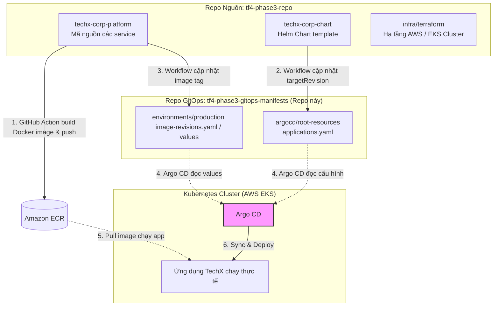
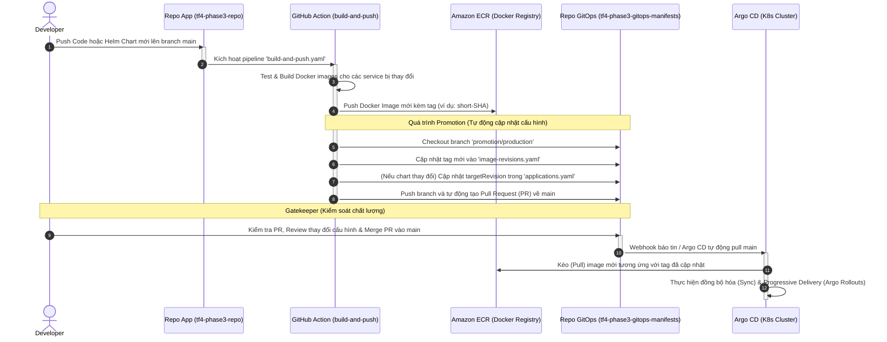

# Hướng Dẫn Kiến Trúc & Luồng Vận Hành GitOps (Production)

Tài liệu này giải thích chi tiết cấu trúc, vai trò của repository **GitOps Manifests** này (`tf4-phase3-gitops-manifests`), mối liên kết với repository mã nguồn ứng dụng (`tf4-phase3-repo`), và lý do tại sao hệ thống được chia làm hai khu vực độc lập.

---

## 1. Mối Quan Hệ Giữa Hai Repository

Hệ thống CI/CD và hạ tầng của chúng ta được chia làm hai phần tách biệt:
1.  **Application Repository** ([tf4-phase3-repo](file:///C:/DevOps/tf4-phase3-repo)): Chứa mã nguồn ứng dụng, Helm chart gốc và mã nguồn hạ tầng Terraform.
2.  **GitOps Manifests Repository** (Chính là Repo này - [tf4-phase3-gitops-manifests](file:///C:/DevOps/tf4-phase3-gitops-manifests)): Chứa cấu hình khai báo ứng dụng Argo CD và các file values (biến môi trường, image tags) cho môi trường Production.

> [!NOTE]
> Sơ đồ quan hệ đã được thiết kế bằng Draw.io chuyên nghiệp: [gitops-relationship.drawio](file:///c:/DevOps/tf4-phase3-repo/docs/gitops/gitops-relationship.drawio). Sơ đồ sử dụng các component giãn cách rộng rãi để dễ nhìn và theo dõi luồng đi.

Argo CD sử dụng tính năng **Multiple Sources** để đồng thời kết hợp dữ liệu từ cả hai repository này khi deploy ứng dụng [techx-corp](file:///c:/DevOps/tf4-phase3-gitops-manifests/argocd/root-resources/applications.yaml#L205):
*   **Template Source**: Lấy Helm Chart template từ thư mục [techx-corp-chart](file:///C:/DevOps/tf4-phase3-repo/techx-corp-chart) của `tf4-phase3-repo` (trỏ theo commit SHA cụ thể).
*   **Values Source**: Lấy các tệp cấu hình tham số, cấu hình cờ tính năng (flagd) và image tags từ chính repo GitOps này.

---

## 2. Vai Trò Của Thư Mục Trong Repo Này

*   **[argocd/bootstrap/root.yaml](file:///c:/DevOps/tf4-phase3-gitops-manifests/argocd/bootstrap/root.yaml)**: File bootstrap chính để khởi tạo ứng dụng Argo CD gốc (`root-bootstrap`), tự động kéo toàn bộ danh sách các ứng dụng con về cụm.
*   **[argocd/root-resources/applications.yaml](file:///c:/DevOps/tf4-phase3-gitops-manifests/argocd/root-resources/applications.yaml)**: Chứa danh sách các Argo CD `Application` tài nguyên của cluster (Kyverno, External Secrets, Kafka Operator, Argo Rollouts, và các thành phần của TechX).
*   **[platform/secrets/](file:///c:/DevOps/tf4-phase3-gitops-manifests/platform/secrets/)**: Chứa các khai báo `ExternalSecret` đồng bộ an toàn các thông số nhạy cảm (như mật khẩu Database, token liên kết Slack) từ **AWS Secrets Manager** vào cụm Kubernetes.
*   **[environments/production/](file:///c:/DevOps/tf4-phase3-gitops-manifests/environments/production/)**: Cấu hình chi tiết cho môi trường Production:
    *   [app-values.yaml](file:///c:/DevOps/tf4-phase3-gitops-manifests/environments/production/app-values.yaml): Cấu hình tài nguyên (CPU/Memory), replica, biến môi trường.
    *   [flagd-values.yaml](file:///c:/DevOps/tf4-phase3-gitops-manifests/environments/production/flagd-values.yaml): Cấu hình bật/tắt các tính năng (Feature Flags).
    *   [image-revisions.yaml](file:///c:/DevOps/tf4-phase3-gitops-manifests/environments/production/image-revisions.yaml): Quản lý phiên bản (tag và digest) Docker image của từng service cụ thể.

---

## 3. Phân Loại Thay Đổi: Thay Đổi Nào Sửa Repo Nào?

Để tránh xung đột cấu hình và bảo vệ an toàn hệ thống, hãy tuân thủ quy tắc phân bổ thay đổi dưới đây:

| Bạn muốn làm gì? | Repo cần sửa đổi | Thư mục đích |
| :--- | :--- | :--- |
| **Thay đổi code ứng dụng** *(ví dụ: Sửa logic backend, frontend)* | [tf4-phase3-repo](file:///C:/DevOps/tf4-phase3-repo) | `techx-corp-platform/src/...` |
| **Thay đổi template Kubernetes** *(ví dụ: Thêm ConfigMap mới, chỉnh sửa Service, Ingress)* | [tf4-phase3-repo](file:///C:/DevOps/tf4-phase3-repo) | [techx-corp-chart](file:///C:/DevOps/tf4-phase3-repo/techx-corp-chart) |
| **Tạo/xóa tài nguyên hạ tầng** *(ví dụ: Thêm S3 bucket, mở rộng database RDS, thay đổi phân quyền IAM)* | [tf4-phase3-repo](file:///C:/DevOps/tf4-phase3-repo) | [infra/terraform](file:///C:/DevOps/tf4-phase3-repo/infra/terraform) |
| **Cập nhật tham số ứng dụng** *(ví dụ: Thay đổi biến môi trường, điều chỉnh cấu hình CPU/Memory)* | [tf4-phase3-gitops-manifests](file:///C:/DevOps/tf4-phase3-gitops-manifests) | [app-values.yaml](file:///c:/DevOps/tf4-phase3-gitops-manifests/environments/production/app-values.yaml) |
| **Thay đổi cấu hình Alerting** *(ví dụ: Chỉnh sửa email nhận cảnh báo hoặc webhook Slack)* | [tf4-phase3-gitops-manifests](file:///C:/DevOps/tf4-phase3-gitops-manifests) | [alertmanager-routing-values.yaml](file:///c:/DevOps/tf4-phase3-gitops-manifests/environments/production/alertmanager-routing-values.yaml) |
| **Đồng bộ thông tin bảo mật** *(ví dụ: Thêm secret mới từ AWS Secrets Manager)* | [tf4-phase3-gitops-manifests](file:///C:/DevOps/tf4-phase3-gitops-manifests) | [all-secrets.yaml](file:///c:/DevOps/tf4-phase3-gitops-manifests/platform/secrets/all-secrets.yaml) |

---

## 4. Tại Sao Phải Tách Biệt Repo Hạ Tầng (Infra) Và Repo GitOps (Manifests)?

Việc phân tách này đem lại các lợi ích an toàn và tối ưu quy trình làm việc:

1.  **Vòng đời (Lifecycle) và Tốc độ thay đổi khác nhau**:
    *   *Infra (Terraform)*: Thay đổi rất ít, rủi ro cao (chỉ khi tạo/xóa cluster, VPC, database, IAM roles). Cần kiểm duyệt chặt chẽ để tránh downtime hạ tầng cốt lõi.
    *   *GitOps (Manifests/App)*: Thay đổi liên tục hàng ngày/hàng giờ (deploy code mới, đổi cấu hình app). Yêu cầu tốc độ nhanh, tự động hóa cao và ít rủi ro sập cả cụm máy chủ Cloud.
2.  **Nguyên tắc đặc quyền tối thiểu (Least Privilege)**:
    *   Argo CD và các CI pipeline deploy app không cần quyền truy cập admin vào AWS cloud (không thể vô tình xóa VPC hay RDS). Chúng chỉ cần quyền giao tiếp và quản lý tài nguyên trong nội bộ EKS. Điều này hạn chế tối đa lỗ hổng bảo mật.
3.  **Tránh xung đột trạng thái (State drift)**:
    *   Kubernetes có các cơ chế tự động scale (như HPA) hoặc tự sửa đổi trạng thái. Nếu quản lý K8s manifests chung với Terraform, mỗi lần chạy `terraform plan` sẽ phát hiện sự lệch pha trạng thái và đè dữ liệu lên nhau, gây mất ổn định cluster.

---

## 5. Luồng Vận Hành Chi Tiết Khi Có Thay Đổi Code Ứng Dụng

Quá trình đẩy một thay đổi từ mã nguồn lên Production được thực hiện hoàn toàn tự động qua các bước sau:

> [!NOTE]
> Sơ đồ luồng vận hành đã được thiết kế bằng Draw.io chuyên nghiệp: [gitops-operational-flow.drawio](file:///c:/DevOps/tf4-phase3-repo/docs/gitops/gitops-operational-flow.drawio). Sơ đồ sử dụng các component giãn cách rộng rãi để dễ nhìn và theo dõi luồng đi.

1.  **Bước 1**: Developer push code mới lên nhánh `main` của **tf4-phase3-repo**.
2.  **Bước 2**: GitHub Action [build-and-push.yaml](file:///C:/DevOps/tf4-phase3-repo/.github/workflows/build-and-push.yaml) tự động chạy:
    *   Tự động phát hiện các service bị thay đổi.
    *   Build Docker image mới và đẩy lên **Amazon ECR**.
3.  **Bước 3 (Promotion)**: Pipeline tự động clone repo GitOps này, tạo nhánh `promotion/production` và cập nhật các tệp [image-revisions.yaml](file:///c:/DevOps/tf4-phase3-gitops-manifests/environments/production/image-revisions.yaml), [applications.yaml](file:///c:/DevOps/tf4-phase3-gitops-manifests/argocd/root-resources/applications.yaml). Sau đó, nó tự động mở một **Pull Request (PR)** trên repo GitOps.
4.  **Bước 4**: Thành viên đội ngũ kiểm tra PR cấu hình và nhấn **Merge** để phê duyệt đưa lên Production.
5.  **Bước 5**: Argo CD phát hiện có commit mới trên nhánh `main` của repo GitOps, tự động thực hiện đồng bộ (Sync) tài nguyên, kéo image mới từ ECR về và cập nhật ứng dụng của bạn một cách an toàn mà không làm gián đoạn người dùng (Zero Downtime).
