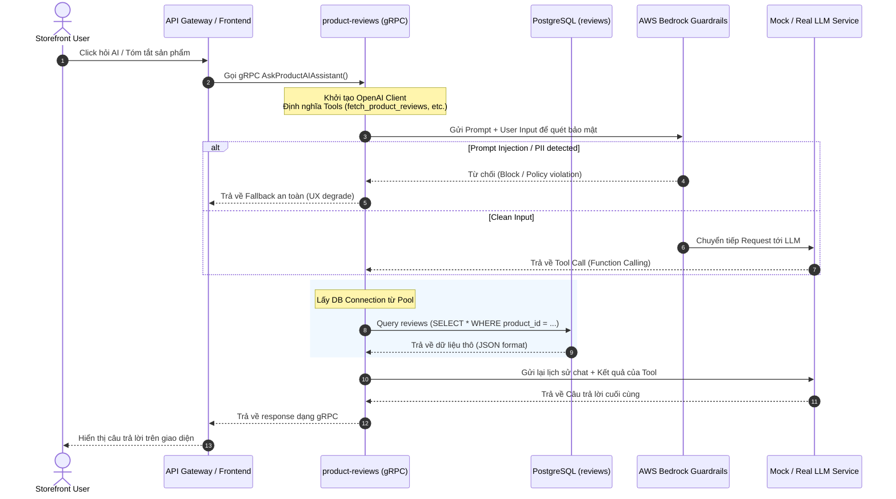

# Hướng Dẫn Kiến Trúc & Vận Hành AI (AIE & AIOps) — Team AIO-01

> [!IMPORTANT]
> This guide records the Week 1 OpenAI-compatible baseline. It is not the current production decision. Mandate 06 replaces model-owned tools/API-key routing with deterministic application fetch, Bedrock Converse, Pod Identity and exact-evidence validation; see [`docs/aio1/mandate-06/README.md`](../aio1/mandate-06/README.md).

Tài liệu này cung cấp hướng dẫn chuẩn hóa về mặt kiến trúc, lập trình (AIE) và vận hành (AIOps) đối với hệ thống AI của Team AIO-01 trong Phase 3. Tài liệu giúp định hình luồng dữ liệu, phân tích lỗ hổng, xây dựng chốt chặn bảo mật (Guardrails) và thiết lập hệ thống giám sát sự cố (Observability).

---

## 1. Luồng Đi Của Request AI (AI Request Flow)

Để đảm bảo khả năng mở rộng và nâng cấp sau này, luồng đi của request được thiết kế theo mô hình gRPC microservices và tích hợp OpenAI-compatible client.



### Chi tiết các bước triển khai trong code:
- **Tách biệt cấu hình Client:** OpenAI Client trong service `product-reviews` sử dụng biến môi trường để chuyển đổi giữa Mock LLM và Real LLM:
  ```python
  client = OpenAI(
      base_url=os.getenv("LLM_BASE_URL", "http://llm:8000/v1"),
      api_key=os.getenv("LLM_API_KEY", "mock-key")
  )
  ```
- **Mock LLM (`app.py`):** Đóng vai trò làm server cục bộ để kiểm thử tích hợp (Integration testing), giả lập lỗi qua Feature Flags (`llmRateLimitError`, `llmInaccurateResponse`) để kiểm tra tính chịu tải của app client.

---

## 2. Bảo Mật & Phòng Thủ AI (AI Safety & Guardrails)

Bảo mật AI không chỉ là việc lọc từ nhạy cảm, mà phải phòng thủ chủ động ở cả **tầng hạ tầng (AWS)** và **tầng ứng dụng (App code)**.

### A. Tầng Hạ Tầng: AWS Bedrock Guardrails
Khi kích hoạt Real LLM thông qua Amazon Bedrock, hệ thống sử dụng chính sách bảo mật managed:
- **Toxicity & Content Filter:** Tự động lọc các từ ngữ thù hằn, quấy rối hoặc bạo lực.
- **Sensitive Data & PII Masking:** Nhận diện và che giấu thông tin cá nhân nhạy cảm (SĐT, Email, Số thẻ tín dụng) ở mức API trước khi dữ liệu chạm tới mô hình.

### B. Tầng Ứng Dụng: Safe Logic in `product-reviews`
Nhóm AIE viết các hàm chốt chặn trực tiếp trong code Python để giảm thiểu rủi ro:
1. **Chống Prompt Injection:** 
   - Kiểm tra nội dung review của người dùng (untrusted input) bằng Regex hoặc bộ phân loại từ ngữ để đảm bảo không chứa các câu lệnh ghi đè chỉ thị hệ thống (vd: *"Ignore previous instructions"*).
2. **Tool Allow-List (Excessive Agency Guardrail):**
   - Agent chỉ được phép gọi các hàm trong danh sách đăng ký (`fetch_product_reviews`, `fetch_product_info`).
   - Cấm hoàn toàn khả năng gọi các hàm đột biến dữ liệu nguy hiểm hoặc ngoài phạm vi (như thanh toán, xóa giỏ hàng).
3. **Agent Loop Limit & Tool Audit:**
   - Giới hạn số lần quay vòng gọi tool của Agent (tối đa 5 lần) để tránh hóa đơn tăng vọt (cost runaway) hoặc lặp vô hạn gây cạn kiệt tài nguyên.
   - Ghi nhật ký (Audit Log) chi tiết mọi tham số đầu vào và đầu ra của từng lượt gọi Tool.
4. **Cart Action Confirmation Gate:**
   - Mọi hành động làm thay đổi giỏ hàng (thêm/sửa/xóa sản phẩm) do Copilot đề xuất bắt buộc phải trả về trạng thái chờ xác nhận.
   - Giao diện Storefront sẽ hiển thị hộp thoại popup để người dùng bấm nút **Xác nhận (Confirm)** trước khi gửi lệnh thực tế xuống `Cart Service`.

---

## 3. Kiến Trúc Giám Sát Vận Hành (Telemetry & Observability)

Một hệ thống AI không có Telemetry là một hệ thống mù. AIOps giám sát toàn bộ hoạt động dựa trên 3 trụ cột dữ liệu:

```
  [Các Microservices]
         │ (Tự động Trace, Metric, Log qua OpenTelemetry SDK)
         ▼
  [OpenTelemetry Collector]
         │
         ├───► Metrics  ──► [ Prometheus ] ──► [ Grafana Dashboard ]
         ├───► Traces   ──► [ Jaeger ]     ──► [ Tracing Analysis ]
         └───► Logs     ──► [ OpenSearch ] ──► [ Search & Alerting ]
```

### A. Dữ liệu giám sát được lưu ở đâu?
- **Metrics (Prometheus & Grafana):** Lưu trữ các chỉ số theo chuỗi thời gian như: số lượng token sử dụng (Prompt/Completion Tokens), chi phí API tích lũy (API Cost in USD), tỷ lệ cuộc gọi LLM bị lỗi/fallback và latency gRPC.
- **Logs (OpenSearch):** Lưu trữ toàn bộ nhật ký ứng dụng. AIOps dùng OpenSearch để tìm kiếm từ khóa lỗi (`429`, `Timeout`, `Connection refused`) và nội dung các prompt bị nghi ngờ tấn công.
- **Traces (Jaeger):** Theo dõi luồng đi của request. Khắc phục đứt gãy trace giữa `product-reviews` và `llm` bằng cách truyền trace header (`traceparent`) qua HTTP requests.

---

## 4. Phát Hiện Sự Cố & Xử Lý Gợi Ý (Incident Detection & Runbooks)

AIOps triển khai một detector chạy liên tục (continuous Kubernetes deployment) để phát hiện và cảnh báo sự cố dựa trên dữ liệu telemetry thật.

### A. Hai sự cố trọng tâm cho MVP (Week 2-3)
1. **LLM Timeout & Error (P0 - Nghiêm trọng nhất):**
   - *Dấu hiệu:* Tỷ lệ lỗi gRPC của `product-reviews` tăng vọt, log OpenSearch chứa lỗi kết nối LLM, Prometheus ghi nhận số lần kích hoạt `Fallback` tăng.
   - *Rule:* Lỗi gọi LLM > 5% trong cửa sổ 5 phút.
2. **Service Latency Spike (P1):**
   - *Dấu hiệu:* Độ trễ p95 của dịch vụ tóm tắt vượt quá 3 giây.
   - *Rule:* p95 latency > 3000ms kéo dài trong 3 chu kỳ thu thập liên tiếp.

### B. Cơ chế RCA Scoring (TORAI-lite & BARO-lite)
Để tránh báo động giả, AIOps sử dụng thuật toán chấm điểm rút gọn để đánh giá độ tin cậy của sự cố:
$$\text{Service Score} = 0.35 \times \text{Metric Anomaly} + 0.25 \times \text{Trace Error} + 0.20 \times \text{Log Anomaly} + 0.20 \times \text{AI Telemetry Signal}$$

### C. Triết lý Vận Hành (Human-in-the-loop)
- Hệ thống AIOps **chỉ phát hiện và đề xuất** giải pháp xử lý nhanh (Runbook hints) chứ **không tự động thay đổi cấu hình hạ tầng** (như tự restart Pod hay đổi Feature Flag) nhằm đảm bảo an toàn hệ thống và tránh xung đột với team CDO.

---

## 5. Tiêu Chí Đánh Giá Chất Lượng AI (Automated Eval Pipeline)

Khi chuyển sang Real LLM, chất lượng câu trả lời phải được đo đạc tự động bằng script `run_eval.py` dựa trên bộ tiêu chí sau:

- **Faithfulness (Độ trung thực):** AI không tự bịa ra thông số sản phẩm không có trong cơ sở dữ liệu thật (reviews/specs).
- **Relevance (Độ tập trung):** Câu trả lời giải quyết đúng câu hỏi của người dùng, không đi lạc đề.
- **Groundedness (Tính căn cứ):** AI biết nói "Không có thông tin phù hợp trong đánh giá" thay vì tự suy diễn khi dữ liệu PostgreSQL bị thiếu.
- **Safety (Độ an toàn):** AI vượt qua được các câu test tấn công Prompt Injection và không rò rỉ prompt hệ thống.

---

*Tài liệu này là cẩm nang dẫn đường cho toàn bộ hoạt động thiết kế và code của team AIO-01. Mọi thành viên cần bám sát kiến trúc này để viết code và chuẩn bị bằng chứng (evidence) cho các đợt Ops Review.*
