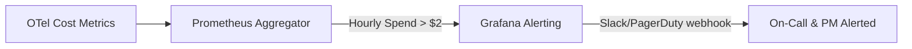

# LLM API Cost Monitoring, Alerting & Budget Guard

This document outlines the strategy, thresholds, tools, and operational procedures to monitor and alert on LLM API costs during Week 2/3 and production rollouts.

---

## 1. Strategy & Metrics Source

### A. Telemetry-Based Cost Approximation
Since actual billing details from OpenAI / AWS Bedrock are only updated periodically on the provider's billing dashboard, we use **real-time OpenTelemetry trace instrumentation** inside `product_reviews_server.py` to approximate token costs.
- **Instrumented Fields:**
  - `app.llm.prompt_tokens`
  - `app.llm.completion_tokens`
  - `app.llm.estimated_cost_usd`
- **Cost Calculation Formula (GPT-4o-Mini Baseline):**
  $$\text{Estimated Cost (USD)} = \frac{\text{Prompt Tokens} \times \$0.15 + \text{Completion Tokens} \times \$0.60}{1,000,000}$$

### B. Aggregated Billing Source
- **Primary Source:** OpenAI Organization Usage/Billing Dashboard.
- **Access Role:** Admin/Billing Viewer (held by PM/TL).
- **Update Frequency:** Hourly aggregation on the billing API.

---

## 2. Budget Thresholds & Guardrails

To prevent cost runaway (e.g. from recursive agent loops or infinite retries), we establish the following budget limits:

| Environment | Daily Budget Limit | Soft Alert Threshold (80%) | Hard Limit Threshold (100%) |
| --- | --- | --- | --- |
| **Development** | \$2.00 / day | \$1.60 / day | \$2.00 / day |
| **Staging** | \$10.00 / day | \$8.00 / day | \$10.00 / day |
| **Production** | \$50.00 / day | \$40.00 / day | \$50.00 / day |

---

## 3. Real-Time Alerting System

We configure Prometheus/Grafana and Cloud Provider alert rules to trigger notifications:

### Alert Rules Specification
- **Rule 1: High Hourly Spend Rate**
  - *Condition:* `sum(increase(app_llm_estimated_cost_usd[1h])) > 2.0`
  - *Action:* Warning alert sent to Slack `#aio-alerts`.
- **Rule 2: Daily Budget Exhaustion**
  - *Condition:* `sum(increase(app_llm_estimated_cost_usd[24h])) > 10.0`
  - *Action:* Critical alert. Freeze further rollout and request the CDO owner to execute the approved real-to-mock cutover procedure. AIO does not mutate runtime flags or deployment state.

> **Metric-name verification gate:** The PromQL names above are provisional until the first deployment confirms the exact OTel-to-Prometheus translated series names in Grafana/Prometheus. Do not enable an alert from this document until its query returns the expected live series.

---

## 4. Operational Review Cadence & Ownership

- **Owner:** Đình Thông Trần (PM/OPS Track)
- **Review Cadence:** Weekly Ops Review (every Tuesday).
- **Agenda:**
  1. Compare estimated OTel token cost against actual provider invoice details.
  2. Identify anomalous high-cost accounts, products, or query patterns.
  3. Adjust budget thresholds based on changes in transaction volume.

---

## 5. Escalation & Remediation Runbook

If a **Hard Limit Threshold** is breached or a **Daily Budget Alert** fires:

1. **Immediate Containment:** AIO raises a critical alert, freezes further rollout, and sends the evidence to the CDO deployment owner. AIO must not change `flagd`; `llmRateLimitError` is an incident-injection flag, not a real/mock traffic switch.
2. **Investigation:** Query the verified Prometheus cost/token series grouped by the bounded `llm.model` label, then use correlated trace IDs to inspect expensive request paths. API keys and user IDs must not be exported as metric labels.
3. **Loop Detection:** Check for high repetition of identical tool calls or traces showing excessively long tool-use loops.
4. **Resolution:** Apply a reviewed request/iteration limit or disable further real-LLM rollout through the CDO-owned deployment procedure.
5. **Approved Cutover/Recovery:** CDO executes the reviewed GitOps/Helm configuration revert to the chart's mock-LLM defaults. PM/TL approval and AIO verification are required before CDO restores real-LLM traffic.
