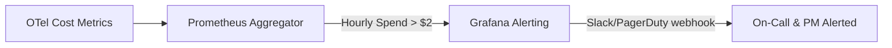

# LLM API Cost Monitoring, Alerting & Budget Guard

This document outlines the strategy, thresholds, tools, and operational procedures to monitor and alert on LLM API costs during Week 2/3 and production rollouts.

---

## 1. Strategy & Metrics Source

### A. Telemetry-Based Cost Approximation
Since AWS billing aggregation is not an online request-control signal, we use **real-time OpenTelemetry metrics** inside `product_reviews_server.py` to estimate Bedrock token cost.
- **Instrumented Fields:**
  - `app_llm_prompt_tokens_total`
  - `app_llm_completion_tokens_total`
  - SDK instrument: `app_llm_estimated_cost_usd_total`
  - Deployed Prometheus series: `app_llm_estimated_cost_usd_USD_total` (OTel appends the `USD` unit)
  - `app_llm_latency_seconds`
  - `app_llm_errors_total`
- **Cost Calculation Formula (Nova 2 Lite evaluated snapshot):**
  $$\text{Estimated Cost (USD)} = \frac{\text{Input Tokens} \times \$0.30 + \text{Output Tokens} \times \$2.50}{1,000,000}$$

The price variables are deployment configuration and must be re-snapshotted before canary. Guardrail charges are not included in this token-only estimate.

### B. Aggregated Billing Source
- **Primary Source:** AWS Bedrock pricing plus Cost Explorer/billing data.
- **Access Role:** approved AWS billing viewer held by PM/TL/CDO.
- **Update Frequency:** provider-dependent aggregation; reconcile daily during canary.

---

## 2. Budget Thresholds & Guardrails

To prevent cost runaway (e.g. from recursive agent loops or infinite retries), we establish the following budget limits:

| Environment | Daily Budget Limit | Soft Alert Threshold (80%) | Hard Limit Threshold (100%) |
| --- | --- | --- | --- |
| **Development** | \$2.00 / day | \$1.60 / day | \$2.00 / day |
| **Staging** | \$10.00 / day | \$8.00 / day | \$10.00 / day |
| **Production** | \$50.00 / day | \$40.00 / day | \$50.00 / day |

---

## 3. Real-Time Alerting System

We configure Prometheus/Grafana and Cloud Provider alert rules to trigger notifications:

### Alert Rules Specification
- **Rule 1: High Hourly Spend Rate**
  - *Condition:* `sum(increase(app_llm_estimated_cost_usd_USD_total[1h])) > 2.0`
  - *Action:* Warning alert sent to Slack `#aio-alerts`.
- **Rule 2: Daily Budget Exhaustion**
  - *Condition:* `sum(increase(app_llm_estimated_cost_usd_USD_total[24h])) > 10.0`
  - *Action:* Critical alert. Freeze further rollout and request the CDO owner to revert the previous reviewed image/configuration. AIO does not mutate runtime flags or deployment state.

> **Metric-name verification gate:** The exported cost series was verified on 2026-07-17 as `app_llm_estimated_cost_usd_USD_total`. Re-verify after any collector naming/view change before enabling or modifying an alert.

---

## 4. Operational Review Cadence & Ownership

- **Owner:** Đình Thông Trần (PM/OPS Track)
- **Review Cadence:** Weekly Ops Review (every Tuesday).
- **Agenda:**
  1. Compare estimated OTel token cost against actual provider invoice details.
  2. Identify anomalous high-cost accounts, products, or query patterns.
  3. Adjust budget thresholds based on changes in transaction volume.

---

## 5. Escalation & Remediation Runbook

If a **Hard Limit Threshold** is breached or a **Daily Budget Alert** fires:

1. **Immediate Containment:** AIO raises a critical alert, freezes further rollout, and sends the evidence to the CDO deployment owner. AIO must not change `flagd`; `llmRateLimitError` is an incident-injection flag, not a real/mock traffic switch.
2. **Investigation:** Query the verified Prometheus cost/token series grouped by the bounded `llm.model` label, then use correlated trace IDs to inspect expensive request paths. Credentials and user IDs must not be exported as metric labels.
3. **Loop Detection:** Check for high repetition of identical tool calls or traces showing excessively long tool-use loops.
4. **Resolution:** Apply a reviewed request/iteration limit or disable further real-LLM rollout through the CDO-owned deployment procedure.
5. **Approved Recovery:** CDO executes the reviewed GitOps/Helm revert to the previous image/configuration. PM/TL approval and AIO verification are required before another rollout.
