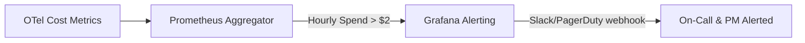

# LLM API Cost Monitoring, Alerting & Budget Guard

This document outlines the strategy, thresholds, tools, and operational procedures to monitor and alert on LLM API costs during Week 2/3 and production rollouts.

---

## 1. Strategy & Metrics Source

### A. Telemetry-Based Cost Approximation
Since actual billing details from OpenAI / AWS Bedrock are only updated periodically on the provider's billing dashboard, we use **real-time OpenTelemetry trace instrumentation** inside `product_reviews_server.py` to approximate token costs.
- **Instrumented Fields:**
  - `app.llm.prompt_tokens`
  - `app.llm.completion_tokens`
  - `app.llm.estimated_cost_usd`
- **Cost Calculation Formula (GPT-4o-Mini Baseline):**
  $$\text{Estimated Cost (USD)} = \frac{\text{Prompt Tokens} \times \$0.15 + \text{Completion Tokens} \times \$0.60}{1,000,000}$$

### B. Aggregated Billing Source
- **Primary Source:** OpenAI Organization Usage/Billing Dashboard.
- **Access Role:** Admin/Billing Viewer (held by PM/TL).
- **Update Frequency:** Hourly aggregation on the billing API.

---

## 2. Budget Thresholds & Guardrails

To prevent cost runaway (e.g. from recursive agent loops or infinite retries), we establish the following budget limits:

| Environment | Daily Budget Limit | Soft Alert Threshold (80%) | Hard Limit Threshold (100%) |
| --- | --- | --- | --- |
| **Development** | \$2.00 / day | \$1.60 / day | \$2.00 / day |
| **Staging** | \$10.00 / day | \$8.00 / day | \$10.00 / day |
| **Production** | \$50.00 / day | \$40.00 / day | \$50.00 / day |

---

## 3. Real-Time Alerting System

We configure Prometheus/Grafana and Cloud Provider alert rules to trigger notifications:

### Alert Rules Specification
- **Rule 1: High Hourly Spend Rate**
  - *Condition:* `sum(increase(app_llm_estimated_cost_usd[1h])) > 2.0`
  - *Action:* Warning alert sent to Slack `#aio-alerts`.
- **Rule 2: Daily Budget Exhaustion**
  - *Condition:* `sum(increase(app_llm_estimated_cost_usd[24h])) > 10.0`
  - *Action:* Critical alert. Automatic fallback to mock LLM behavior is triggered.

---

## 4. Operational Review Cadence & Ownership

- **Owner:** Đình Thông Trần (PM/OPS Track)
- **Review Cadence:** Weekly Ops Review (every Tuesday).
- **Agenda:**
  1. Compare estimated OTel token cost against actual provider invoice details.
  2. Identify anomalous high-cost accounts, products, or query patterns.
  3. Adjust budget thresholds based on changes in transaction volume.

---

## 5. Escalation & Remediation Runbook

If a **Hard Limit Threshold** is breached or a **Daily Budget Alert** fires:

1. **Immediate Mediation:** The on-call engineer sets the `llmRateLimitError` or disables the real LLM flag in OpenFeature (reverting all traffic to the mock LLM).
2. **Investigation:** Query OpenSearch logs to isolate the caller/API key causing high consumption:
   `GET /product-reviews/_search?q=app.llm.estimated_cost_usd:>0.05`
3. **Loop Detection:** Check for high repetition of identical tool calls or traces showing excessively long tool-use loops.
4. **Resolution:** Implement tighter loop limits (`max_iterations` cap) or blacklist offending user IDs.
5. **Approval for Recovery:** PM approval is required before toggling the real LLM flag back to `true`.
