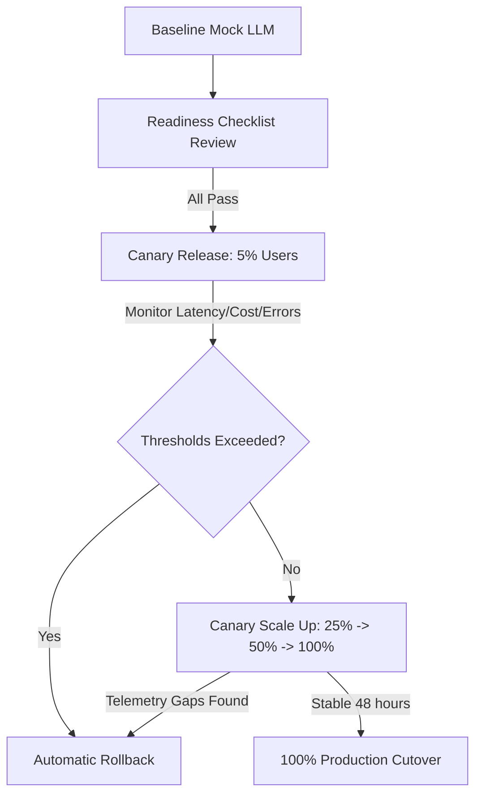

# Real LLM Readiness Checklist & Cutover Guide

This document defines the official readiness checklist, criteria, and rollback path for transitioning the `product-reviews` and Copilot services from mock LLM behavior to the real LLM endpoint (OpenAI API / AWS Bedrock).

---

## 1. Prerequisites Checklist

Before enabling the real LLM in production (or shifting canary traffic), all of the following gates must be marked as **PASS**:

### A. Secret & Configuration Management
- [ ] **Secret Provisioning:** The Kubernetes secret `llm-api-key` is securely created in the corresponding namespace (`techx-aio` or similar) with the actual API key.
  - *Verify Command:* `kubectl get secret llm-api-key -o jsonpath='{.data.key}' | base64 -d`
- [ ] **Configuration Isolation:** Dev/Staging environments use isolated, sandbox API keys to prevent production cost leakage.
- [ ] **Environment Overrides:** `LLM_BASE_URL` and `LLM_MODEL` (e.g., `gpt-4o-mini`) are correctly configured in `values-aio-llm.yaml`.

### B. Fallback & Timeout Settings
- [ ] **Client Timeouts:** A strict timeout (e.g., 5.0 seconds) is enforced on all LLM API calls to prevent hanging gRPC threads.
- [ ] **Safe Fallback Handlers:** If the upstream LLM returns a `429` (Rate Limit), `503` (Service Unavailable), or times out, the service must degrade gracefully to a pre-defined static mock response instead of throwing a generic server error.
- [ ] **Circuit Breaker:** A circuit breaker is in place to stop calling the LLM API if failure rate exceeds 50% in a 10-second window.

### C. Telemetry & Observability
- [ ] **Custom Span Attributes:** OTel spans record AI-specific metrics including:
  - `app.llm.latency_seconds`
  - `app.llm.prompt_tokens`
  - `app.llm.completion_tokens`
  - `app.llm.total_tokens`
  - `app.llm.estimated_cost_usd`
- [ ] **Logging Compliance:** Prompt content and system parameters are redacted in production logs to avoid leaking sensitive data or system prompts.

### D. Quality & Safety Evaluation
- [ ] **Eval Pipeline Run:** The evaluation runner (`eval_runner.py` or similar) has been executed against 5-10 baseline seed cases.
- [ ] **Min Quality Score:** Groundedness and Faithfulness metrics must exceed `0.85/1.0` on the test suite.
- [ ] **Prompt Injection Prevention:** System-level instruction guardrails are enabled to neutralize user inputs that attempt to bypass system rules.

---

## 2. Cutover & Rollout Plan

The rollout of the real LLM follows a **Controlled Canary Release** strategy:

1. **Phase 1: Shadow / Canary (5% Traffic)** - Deploy the configuration overrides only to a subset of pods or route a minimal percentage of traffic.
2. **Phase 2: Gradual Shifting (25% -> 50%)** - Monitor budget burn rate and API latency.
3. **Phase 3: Full Cutover (100% Traffic)** - Full migration to the real LLM endpoint.

---

## 3. Rollback & Emergency Escalation Criteria

A rollback to the mock LLM behavior must be triggered immediately if any of the following **Rollback Gates** fire:

| Symptom / Metric | Threshold | Action |
| --- | --- | --- |
| **LLM Latency Spike** | p95 latency > 3.5s for > 5 consecutive minutes | Revert to mock LLM |
| **API Error Rate** | OTel logs show LLM API HTTP `5xx` / `4xx` > 5% in a 5-minute window | Trigger fallback, temporarily disable real LLM |
| **Budget Burn Rate** | Combined daily spend exceeds the budgeted threshold ($10/day for staging) | Revoke API key / Revert to mock LLM |
| **Security Leakage** | System prompts or customer PII detected in output logs | Emergency rollback and regenerate API keys |

### Rollback Execution Steps
1. Revert the helm/k8s chart overrides by applying the default values file (which resets `LLM_BASE_URL` to the local mock service).
2. Apply changes via GitOps or manually using:
   `helm upgrade --install aio-reviews ./techx-corp-chart -f deploy/values-mock-llm.yaml`
3. Verify that requests route back to the mock LLM and latency returns to <50ms.
4. Notify the on-call engineer and PM.
