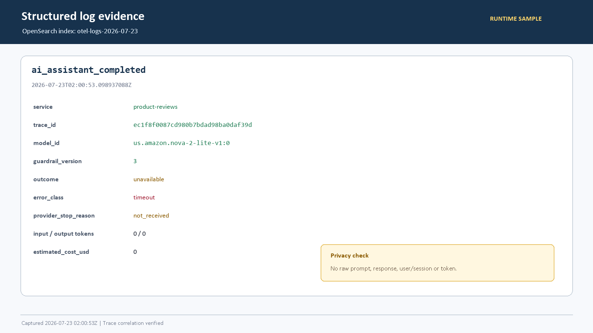
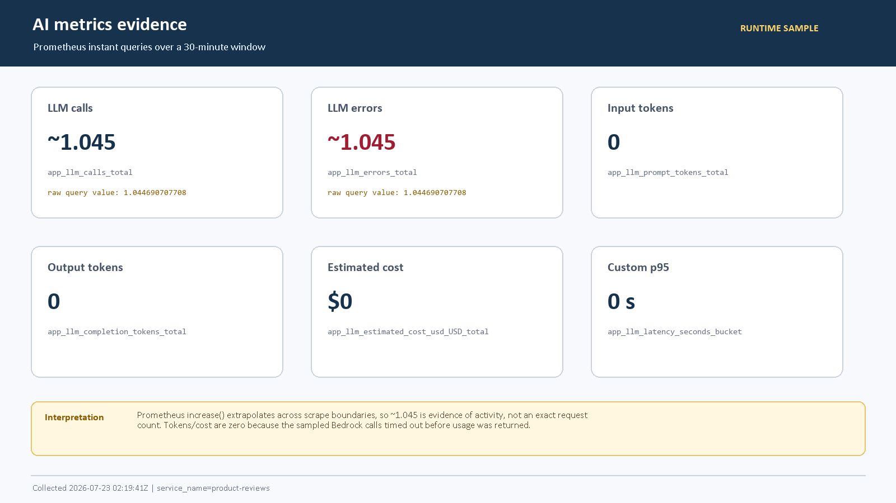
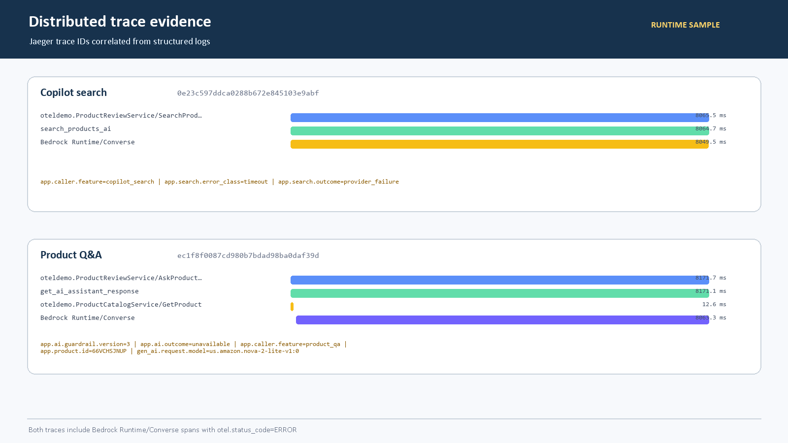

# AI / Tool Auditability — Mandate 14 Runtime Evidence

## Runtime evidence và canonical audit schema đề xuất

| Thuộc tính | Giá trị |
|---|---|
| Scope | Shopping Copilot và Product Q&A |
| Cluster | `techx-tf4-cluster` / namespace `techx-tf4` |
| Thời gian lấy mẫu | 2026-07-23 02:00–02:20 UTC (09:00–09:20 Asia/Saigon) |
| Nguồn | OpenSearch `otel-logs-*`, Prometheus, Jaeger |
| Kết quả request | Hai Bedrock `Converse` call timeout và fail-safe |

## Kết luận

Runtime hiện tại có structured logs, metrics và distributed traces cho AI call. Từ structured log có thể lấy `trace_id` và truy đúng Jaeger trace tương ứng.

Tuy nhiên, runtime **chưa emit đầy đủ tám field canonical trong một audit event duy nhất**. Một số field đang có nhưng khác tên hoặc chỉ xuất hiện trong span; `tool_input_redacted` và `confirmation_status` chưa có trong AI-call log. Evidence này chứng minh telemetry wiring và correlation, **không phải bằng chứng đóng Mandate 14**.

## 1. Structured log sample



Sample Q&A thực tế:

```text
timestamp:              2026-07-23T02:00:53.098937088Z
body:                   ai_assistant_completed
service:                product-reviews
trace_id:               ec1f8f0087cd980b7bdad98ba0daf39d
model_id:               us.amazon.nova-2-lite-v1:0
guardrail_version:      3
outcome:                unavailable
error_class:            timeout
provider_stop_reason:   not_received
input_tokens:           0
output_tokens:          0
estimated_cost_usd:     0
```

Privacy boundary đã kiểm tra:

- Không có raw prompt/query.
- Không có raw model response.
- Không có user ID hoặc session ID.
- Không có confirmation token.
- Log vẫn giữ model, guardrail, outcome, error và trace correlation.

Copilot search cũng sinh structured log:

```text
timestamp:   2026-07-23T02:00:25.607132160Z
body:        nl_search_provider_failure
trace_id:    0e23c597ddca0288b672e845103e9abf
error_class: timeout
```

## 2. Prometheus metrics sample



Các series đã query:

```promql
sum(increase(app_llm_calls_total{service_name="product-reviews"}[30m]))
sum(increase(app_llm_errors_total{service_name="product-reviews"}[30m]))
sum(increase(app_llm_prompt_tokens_total{service_name="product-reviews"}[30m]))
sum(increase(app_llm_completion_tokens_total{service_name="product-reviews"}[30m]))
sum(increase(app_llm_estimated_cost_usd_USD_total{service_name="product-reviews"}[30m]))
histogram_quantile(0.95, sum by (le) (rate(app_llm_latency_seconds_bucket{service_name="product-reviews"}[30m])))
```

`increase()` trả khoảng `1.04469` cho call/error do Prometheus extrapolate theo scrape boundary; đây là bằng chứng có activity, không được diễn giải thành request count chính xác. Token và cost bằng `0` vì provider timeout trước khi trả usage metadata. Thời lượng thực tế vẫn có trong Jaeger span.

## 3. Jaeger trace correlation



### Copilot search

```text
trace_id:                 0e23c597ddca0288b672e845103e9abf
surface:                  copilot_search
application operation:   search_products_ai
provider operation:      Bedrock Runtime/Converse
provider duration:       8049.5 ms
search outcome:           provider_failure
error class:              timeout
provider span status:     ERROR
```

### Product Q&A

```text
trace_id:                 ec1f8f0087cd980b7bdad98ba0daf39d
surface:                  product_qa
application operation:   get_ai_assistant_response
provider operation:      Bedrock Runtime/Converse
provider duration:       8063.3 ms
model:                    us.amazon.nova-2-lite-v1:0
guardrail version:        3
application outcome:      unavailable
provider span status:     ERROR
```

## 4. Coverage theo schema CDO-07 yêu cầu

| Field canonical | Runtime hiện tại | Trạng thái | Việc cần làm |
|---|---|---|---|
| `log_type` | Event body là `ai_assistant_completed` hoặc `nl_search_provider_failure`. | Khác tên | Emit cố định `ai_tool_audit`. |
| `trace_id` | Có tại `attributes.otelTraceID`, truy được đúng Jaeger trace. | Có | Normalize thành `trace_id`. |
| `surface` | Có tại span `app.caller.feature`, chưa có trong completion log. | Một phần | Copy vào audit log. |
| `model_id` | Có tại log `attributes.model_id` và span `gen_ai.request.model`. | Có | Giữ nguyên. |
| `tool_name` | `Bedrock Runtime/Converse` có dưới dạng span operation, chưa có canonical log field. | Một phần | Emit `bedrock.converse` hoặc tên tool trong allowlist. |
| `tool_input_redacted` | Raw input được loại bỏ đúng, nhưng chưa có marker chứng minh redaction. | Thiếu | Emit metadata redaction; không lưu content. |
| `safety_decision` | Hiện tách thành `outcome`, `error_class`, guardrail version. | Một phần | Normalize `allow/block/refuse/provider_unavailable`. |
| `confirmation_status` | Cart confirmation outcome chỉ có trên `confirm_cart_action` span. | Thiếu trong AI-call log | Emit `not_required/pending/confirmed/rejected/expired`. |

## 5. Canonical event đề xuất

```json
{
  "log_type": "ai_tool_audit",
  "trace_id": "ec1f8f0087cd980b7bdad98ba0daf39d",
  "surface": "product_qa",
  "model_id": "us.amazon.nova-2-lite-v1:0",
  "tool_name": "bedrock.converse",
  "tool_input_redacted": {
    "redacted": true,
    "content_logged": false
  },
  "safety_decision": "provider_unavailable",
  "confirmation_status": "not_required"
}
```

Đối với tool có business mutation, `confirmation_status` phải độc lập với model output. Model chỉ được đề xuất; application confirmation boundary mới được execute action.

## 6. Boundary và next actions

1. Sample này chứng minh provider-failure telemetry và log-to-trace correlation; chưa chứng minh successful model response hoặc successful tool execution.
2. Lấy thêm một successful Bedrock sample khi provider ổn định để có token, cost, stop reason và safety decision đầy đủ.
3. Emit một event `ai_tool_audit` canonical tại mọi AI/provider/tool boundary theo tám field phía trên.
4. Lấy thêm cart proposal → user confirmation sample để chứng minh `confirmation_status` transition mà không log confirmation token.
5. Chốt với CDO-07 về field semantics, nơi lưu, retention và access control trước khi đóng Mandate 14.

## 7. Runtime caveat tại thời điểm lấy mẫu

- Stable pod `product-reviews-6576656b6b-m9bl6` vẫn Ready và phục vụ request.
- Pod rollout mới `product-reviews-8cf7dd5c8-dtjth` không Ready do không kết nối được Valkey; đây là blocker riêng, không được che trong audit evidence.
- Các Job probe chỉ đọc đã được xóa sau khi thu evidence; không còn Job `tf4-ai-audit-*` trong namespace.

## 8. Raw evidence files

- [`runtime-probe-2026-07-23.json`](runtime-probe-2026-07-23.json)
- [`runtime-traces-2026-07-23.json`](runtime-traces-2026-07-23.json)
