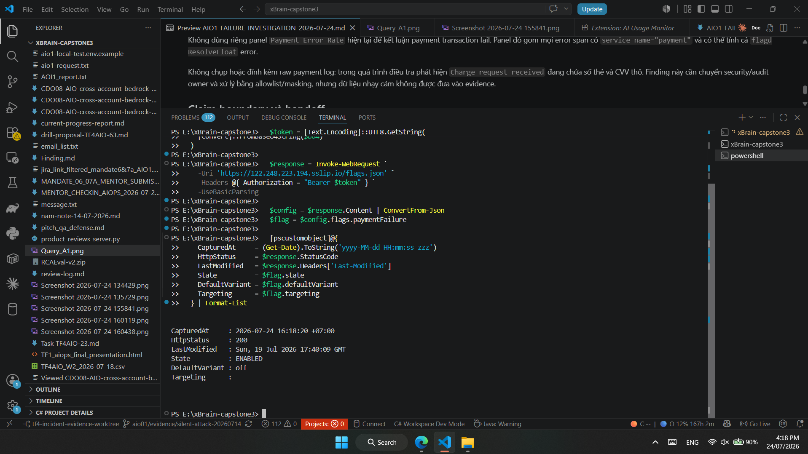
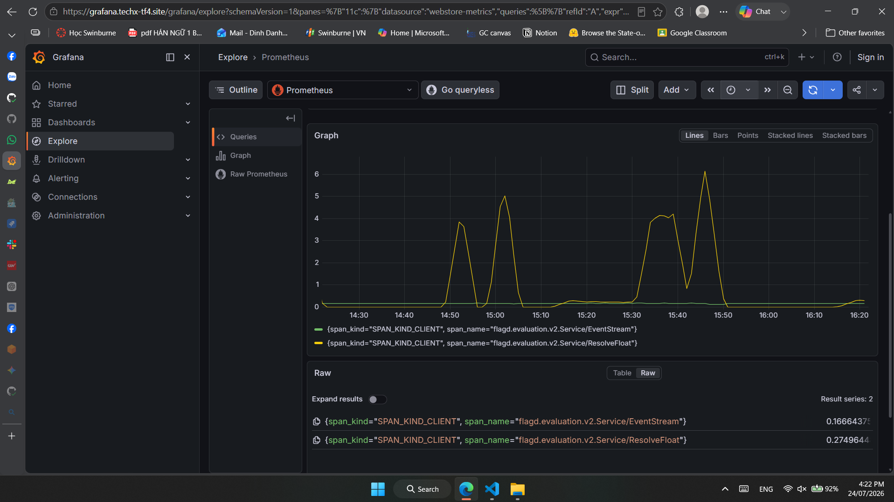
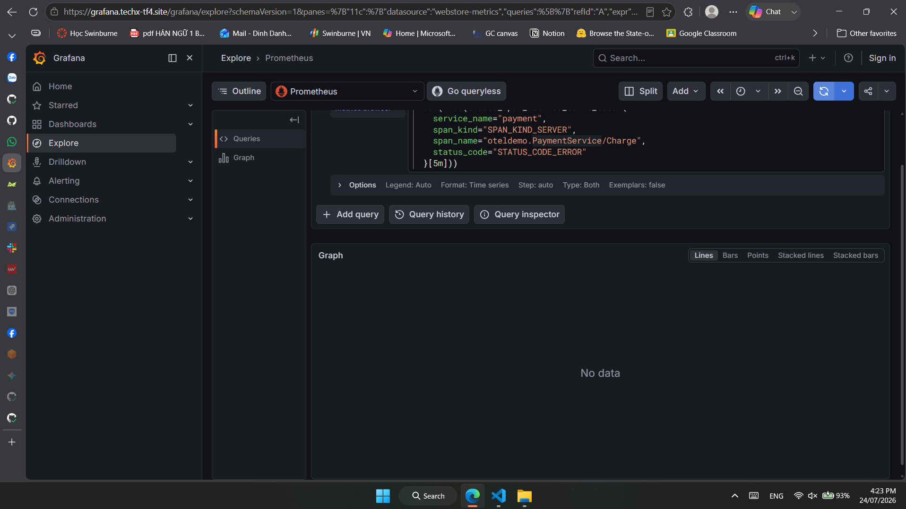
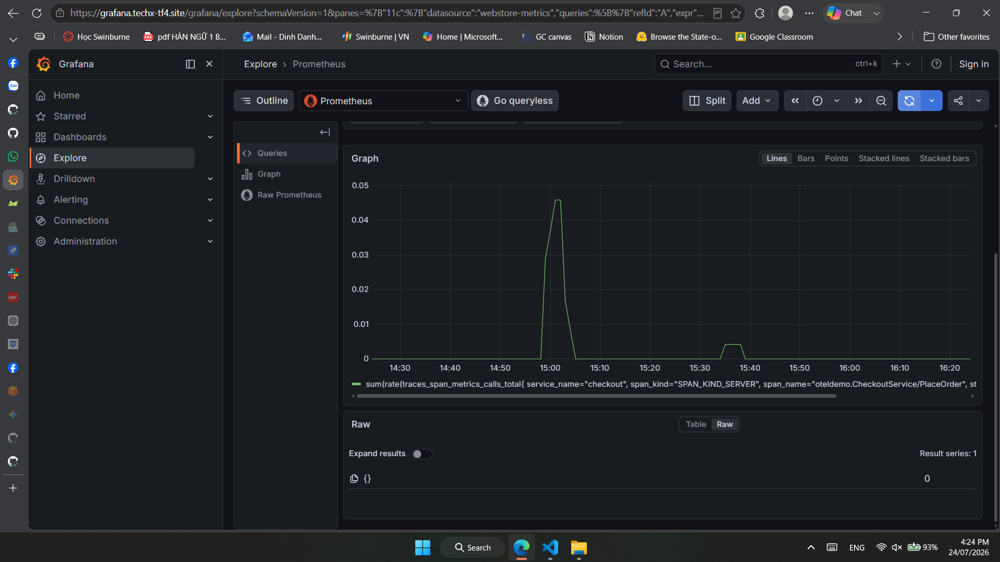
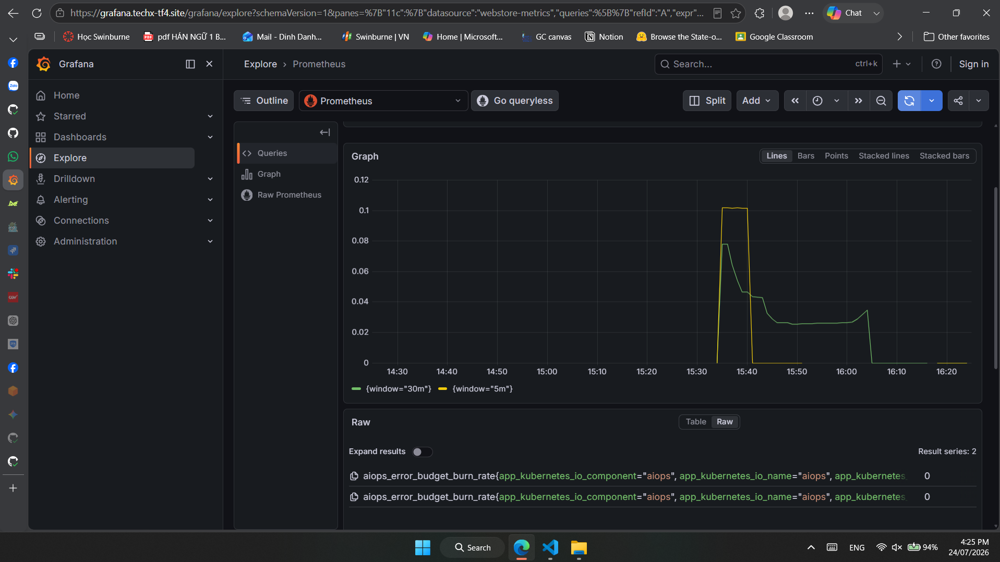
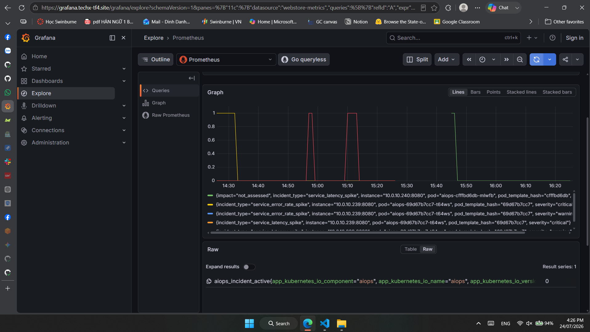
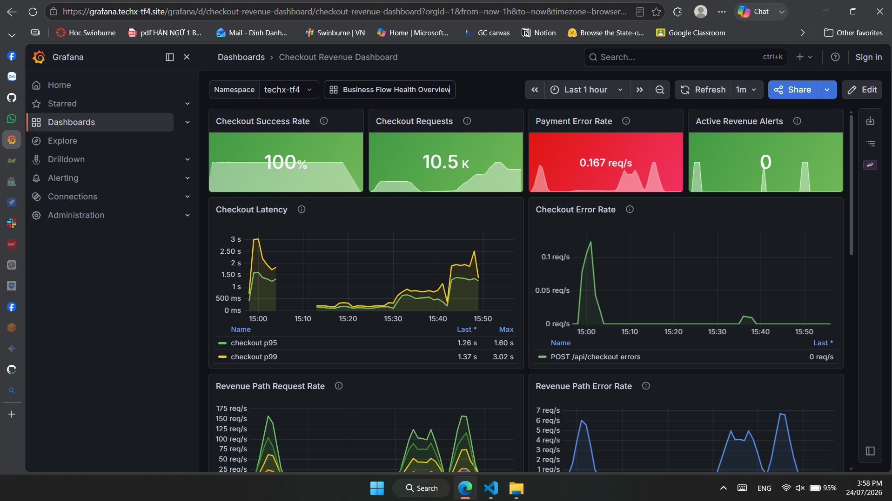
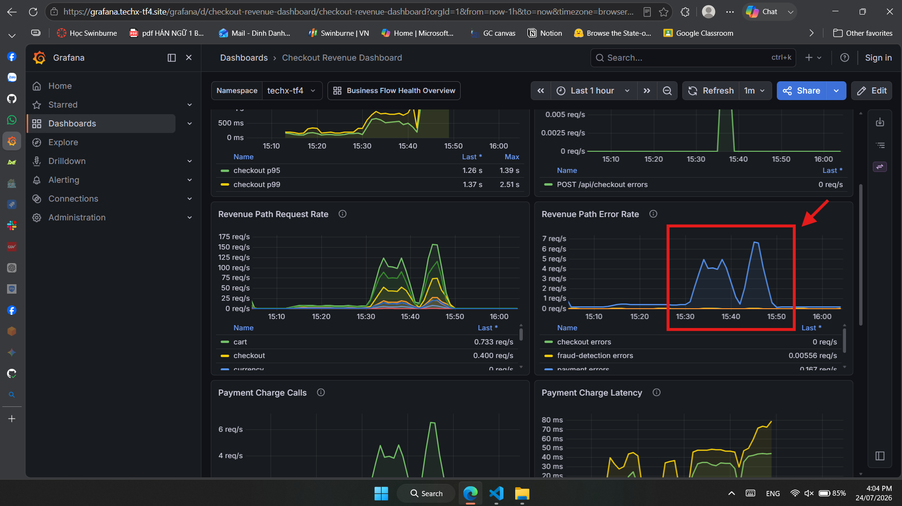

# Báo cáo Sự cố — AIO1 / TF4

**Sự cố được kiểm:** bật fault injection `paymentFailure=100%` nhưng lỗi không
đến application.

**Cửa sổ được kiểm:** khoảng 15:43-15:46 ngày 24/07/2026, giờ Việt Nam
(08:43-08:46 UTC).

**Owner có thể chạy lại evidence:** Đinh Danh Nam / AIO1.

## 1. Kết quả phát hiện

- Hệ có tự phát hiện sự cố `paymentFailure=100%` không?
  - ☐ Có
  - ☑ Không
- Không tính được MTTD cho payment incident vì canonical production source
  chưa từng chuyển sang `100%`; do đó chưa có thời điểm sự cố thực sự bắt đầu
  ở application.
- Hệ có phát hiện một incident khác:
  - Incident: `inc-8fb2fb411f70`
  - Loại: `service_latency_spike`
  - Service: `checkout`
  - Alert đầu tiên: khoảng 15:43:13 ngày 24/07/2026, giờ Việt Nam
  - Severity trong incident: `medium`
  - Severity label trên Prometheus alert: `warning`
- Kênh nhận đã xác nhận:
  - Prometheus `ALERTS`: firing.
  - AIOps `aiops_incident_active`: active.
  - Slack/Discord: chưa có bằng chứng receipt trong cửa sổ này.
  - Dashboard/Prometheus: có tín hiệu runtime.

> Latency alert không phải bằng chứng rằng `paymentFailure=100%` đã đến
> application. Đây là một incident riêng xảy ra trong cùng cửa sổ quan sát.

## 2. Dấu hiệu ghi nhận quanh cửa sổ đó

| Tín hiệu | Bình thường/kỳ vọng khi flag off | Giá trị trong cửa sổ | PromQL/query |
|---|---:|---:|---|
| Checkout `PlaceOrder` error count | Gần 0 | `0` lỗi trên khoảng `1,509.61` request/5m | Query A |
| Checkout burn rate 5m | `0x` hoặc dưới ngưỡng | `0x` | Query B |
| Checkout burn rate 30m | Dưới `2x` | Khoảng `0.0289x` | Query B |
| Payment flag evaluation error | Kỳ vọng 0 khi provider ổn định | Khoảng `1,490.99` `ResolveFloat` error/5m | Query C |
| Checkout p95 | SLO storefront `<1s`; baseline riêng cần đối chiếu | Khoảng `877.71 ms` | Query D |
| Checkout latency incident | Không active | Active, severity `warning` trên alert | Query E |

### Query A — Checkout request và error count

```promql
sum(increase(traces_span_metrics_calls_total{
  service_name="checkout",
  span_kind="SPAN_KIND_SERVER",
  k8s_namespace_name="techx-tf4",
  span_name="oteldemo.CheckoutService/PlaceOrder",
  status_code="STATUS_CODE_ERROR"
}[5m]))
```

```promql
sum(increase(traces_span_metrics_calls_total{
  service_name="checkout",
  span_kind="SPAN_KIND_SERVER",
  k8s_namespace_name="techx-tf4",
  span_name="oteldemo.CheckoutService/PlaceOrder"
}[5m]))
```

### Query B — Burn rate checkout

```promql
aiops_error_budget_burn_rate{service="checkout"}
```

### Query C — Flag evaluation error từ payment

```promql
sum(increase(traces_span_metrics_calls_total{
  service_name="payment",
  span_kind="SPAN_KIND_CLIENT",
  span_name="flagd.evaluation.v2.Service/ResolveFloat",
  status_code="STATUS_CODE_ERROR"
}[5m]))
```

### Query D — Checkout p95

```promql
histogram_quantile(
  0.95,
  sum by (le) (
    rate(traces_span_metrics_duration_milliseconds_bucket{
      service_name="checkout",
      span_kind="SPAN_KIND_SERVER",
      k8s_namespace_name="techx-tf4",
      span_name="oteldemo.CheckoutService/PlaceOrder"
    }[5m])
  )
)
```

### Query E — Active incident và alert

```promql
aiops_incident_active{service="checkout"}
```

```promql
ALERTS{
  alertname="AIOpsIncidentDetected",
  service="checkout",
  alertstate="firing"
}
```

## 3. Service và metric bị ảnh hưởng

### Service chain

```text
Flag UI
  -> canonical flags.json
  -> flagd
  -> OpenFeature provider trong payment
  -> PaymentService/Charge
  -> CheckoutService/PlaceOrder
  -> frontend checkout
  -> Prometheus/AIOps detector
```

| Service/layer | Ảnh hưởng quan sát được | Metric/evidence |
|---|---|---|
| Flag UI/publish layer | UI được báo là đã chọn `100%`, nhưng thay đổi không xuất hiện ở production source | Authenticated canonical readback |
| Canonical `flags.json` | Vẫn `defaultVariant="off"`, `targeting=null` | HTTP `200`; `Last-Modified: 19/07/2026 17:40:09 GMT` |
| flagd/payment OpenFeature | Evaluation path có error | Khoảng `1,490.99` `ResolveFloat` error/5m |
| Payment | Charge vẫn hoàn tất; chưa quan sát payment transaction error do flag | Payment Charge server-span error ratio không tăng |
| Checkout | Khoảng `1,509.61` request/5m, error count `0` | `PlaceOrder` server-span metrics |
| AIOps burn detector | Không tạo error-budget incident | Burn 5m `0x`, 30m khoảng `0.0289x` |
| AIOps latency detector | Tạo incident latency riêng | p95 khoảng `877.71 ms`, latency alert firing |

Workload trong cửa sổ:

- `payment`: 2 pod Ready, 0 restart.
- `checkout`: 2 pod Ready, 0 restart.
- `flagd`: 1 pod Ready, 0 restart.
- `aiops`: 1 pod Ready, 0 restart.

## 4. Vì sao BẮT được

Phần được bắt là **checkout latency spike**, không phải payment failure.

- Detector AIOps đang chạy và poll Prometheus liên tục.
- Query p95 của `CheckoutService/PlaceOrder` có dữ liệu.
- Detector ghi nhận p95 khoảng `862-878 ms` lệch đáng kể so với adaptive
  baseline:
  - ratio khoảng `4.49`;
  - z-score khoảng `5.35`;
  - confidence khoảng `0.842`.
- Điều kiện adaptive latency detector đủ để tạo
  `service_latency_spike`.
- Incident được export thành:

  ```text
  aiops_incident_active{
    incident_type="service_latency_spike",
    service="checkout",
    severity="warning"
  } = 1
  ```

- Prometheus rule `AIOpsIncidentDetected` nhìn thấy active incident nên chuyển
  sang firing.

### Root cause xác định được đến đâu?

- **Confirmed:** latency detector fire vì p95 lệch adaptive baseline.
- **Chưa confirmed:** nguyên nhân hạ tầng/application làm p95 tăng.
- Traffic checkout cao xuất hiện cùng thời điểm, nhưng hiện chỉ được ghi là
  `correlated`, không kết luận là causal root cause.

## 5. Vì sao KHÔNG bắt được payment failure

### Detector có đang chạy không?

Có.

- AIOps pod Ready `1/1`, restart `0`.
- Poll cycle và Prometheus query có timestamp trong đúng cửa sổ.
- Metric `aiops_error_budget_burn_rate` được scrape.
- Detector đã tạo được latency incident, chứng minh worker và alert path đang
  hoạt động.

### Tín hiệu payment failure có tới detector không?

Không có application error để detector bắt:

- Checkout `PlaceOrder` error count trong 5m: `0`.
- Checkout burn rate 5m: `0x`.
- Không có active `service_error_rate_spike`.

Nguyên nhân đã xác nhận ở control/config plane:

```json
{
  "paymentFailure": {
    "state": "ENABLED",
    "defaultVariant": "off",
    "targeting": null
  }
}
```

Production flagd đọc đúng remote source này bằng bearer token. Readback cho
thấy thay đổi `100%` chưa được publish vào canonical source, hoặc UI đang ghi
sang source/environment khác.

### Ngưỡng/model có đúng nhưng không kêu?

Có, detector xử lý đúng theo dữ liệu nó nhận:

- Checkout success SLO: `99.0%`.
- Error budget: `1.0%`.
- Warning: burn 5m và 30m đều `>=2x`.
- Critical: burn 5m và 30m đều `>=10x`.
- Minimum denominator: `20` requests mỗi cửa sổ.

Traffic vượt minimum denominator nhưng error rate là `0%`, nên burn 5m là
`0x`; detector không được phép tạo payment burn incident.

Nếu `paymentFailure=100%` thực sự đến application, error rate kỳ vọng tiến gần
`100%`, tương đương burn khoảng `100x` với checkout SLO `99%`. Critical vẫn chỉ
được phân loại khi cả cửa sổ 5m và 30m cùng đạt ngưỡng.

### Observability stack có bị quá tải không?

Có dấu hiệu degradation thật, nhưng đây là **yếu tố góp phần làm giảm
coverage**, không phải root cause chính của việc flag không reach application:

- Prometheus pod restart `9` lần.
- Lần kết thúc gần cửa sổ test:
  - reason: `OOMKilled`;
  - exit code: `137`;
  - finished at: `15:38:41` ngày 24/07/2026, giờ Việt Nam.
- Prometheus server chỉ có một replica và memory limit `1Gi`.
- Kubernetes ghi nhận readiness/liveness probe fail và container restart
  back-off.
- AIOps log ghi nhiều `signal_coverage_degraded`; Jaeger cũng có thời điểm
  `telemetry_degraded`.

Prometheus OOM có thể gây:

- mất hoặc gián đoạn sample;
- chậm MTTD;
- cửa sổ burn 5m/30m thiếu dữ liệu;
- baseline và drill evidence không liên tục.

Tuy nhiên Prometheus OOM không giải thích được canonical flag source vẫn
`defaultVariant="off"`, checkout success vẫn `100%` và checkout error bằng
`0`. Detector còn tạo được latency incident sau khi Prometheus phục hồi, nên
không được kết luận detector chưa deploy hoặc chưa bật.

### Finding phụ cần sửa

Payment hiện gọi:

```javascript
await OpenFeature.setProviderAndWait(flagProvider);
```

trong từng request `charge`. Đây là reliability risk đã được ghi ở
`CDO08-REL-10`. Runtime đồng thời ghi nhận nhiều `ResolveFloat` và
`EventStream` error.

Không gọi đây là root cause của lần miss này vì canonical source vẫn `off`.
Cần sửa provider lifecycle rồi test riêng để chứng minh quan hệ nhân quả.

### Bài học và hướng sửa

1. Không bắt đầu fault window chỉ dựa vào trạng thái hiển thị trên UI.
2. Sau Save/Publish phải readback canonical production source và xác nhận
   `defaultVariant="100%"` hoặc targeting rule tương đương.
3. Nếu UI hiện vẫn giữ desired state `100%`, chuyển về `off` để tránh fault
   được apply trễ khi publish path hồi phục.
4. Flag/platform owner kiểm tra UI đang ghi đúng environment/source.
5. Payment owner init OpenFeature provider một lần khi service startup, không
   re-init trong request path.
6. AIO1 rerun drill trong bounded window và theo dõi đồng thời flag readback,
   app errors, burn 5m/30m, incident và Slack receipt.

## 6. Bằng chứng ảnh kèm

Các ảnh được đánh số theo thứ tự capture/query. Tất cả ảnh trong thư mục này đã
được kiểm tra để không chứa bearer token hoặc raw payment card values.

### Evidence 01 — Canonical production flag readback



Readback lúc `16:18:20 ICT` trả HTTP `200` nhưng cho thấy:

- `State: ENABLED`;
- `DefaultVariant: off`;
- `Targeting`: rỗng;
- `LastModified: Sun, 19 Jul 2026 17:40:09 GMT`.

Đây là bằng chứng trực tiếp rằng effective production source vẫn ở variant
`off` tại thời điểm capture. Ảnh không chứa giá trị bearer token.

### Evidence 02 — Payment error breakdown theo span



Grafana Explore tách error series theo `span_name` và `span_kind`. Hai series
quan sát được đều là client span của flagd:

- `flagd.evaluation.v2.Service/ResolveFloat`;
- `flagd.evaluation.v2.Service/EventStream`.

Spike `ResolveFloat` lên khoảng `4-6 req/s`. Không có
`oteldemo.PaymentService/Charge` server error series trong kết quả này. Đây là
bằng chứng giúp giải thích vì sao service-level dashboard hiển thị
`payment errors` dù business payment path không cho thấy lỗi tương ứng.

### Evidence 03 — Payment Charge server error query



Query giới hạn đúng operation:

```promql
sum(rate(traces_span_metrics_calls_total{
  service_name="payment",
  span_kind="SPAN_KIND_SERVER",
  span_name="oteldemo.PaymentService/Charge",
  status_code="STATUS_CODE_ERROR"
}[5m]))
```

Grafana trả `No data`. Claim boundary: ảnh chứng minh không có error series
khớp selector trong query window; không dùng riêng ảnh này để khẳng định mọi
Payment Charge đều thành công. Kết luận cần đối chiếu thêm request volume,
checkout success và checkout server error.

### Evidence 04 — Checkout PlaceOrder server error rate



Query checkout server error cho thấy một số spike nhỏ trước đó, cao nhất khoảng
`0.046 req/s`, và current value tại lúc capture là `0`. Mức này không tương
ứng với fault `paymentFailure=100%`; nếu fault thực sự effective, lỗi checkout
phải tăng gần request rate thay vì chỉ xuất hiện các spike nhỏ, ngắt quãng.

### Evidence 05 — Checkout burn rate



Hai series burn 5m/30m đạt đỉnh khoảng `0.1x` rồi giảm về `0x`. Cả hai đều thấp
hơn nhiều so với:

- warning threshold `2x`;
- critical threshold `10x`.

Detector không được phép tạo `warning_budget_burn` hoặc
`critical_budget_burn` từ các giá trị này.

### Evidence 06 — AIOps active incidents



Ảnh cho thấy:

- các series incident từ pod AIOps cũ xuất hiện ở các cửa sổ trước;
- pod AIOps hiện tại tạo `service_latency_spike` cho checkout khoảng 15:45;
- không có bằng chứng current payment/checkout error-budget incident.

Điều này chứng minh detector được deploy và có khả năng tạo incident, nhưng
incident quan sát được trong cửa sổ là latency, không phải payment burn.

### Evidence 07 — Checkout Revenue Dashboard lúc 15:58 ICT



Dashboard chế độ `Last 1 hour` cho thấy:

- `Checkout Success Rate = 100%`;
- `Checkout Requests = 10.5K`;
- current `Checkout Error Rate = 0 req/s`;
- current `Payment Error Rate` khoảng `0.167 req/s`;
- checkout p95/p99 tăng trong một số đoạn.

Checkout success vẫn `100%` với volume lớn là bằng chứng trực quan rằng
`paymentFailure=100%` không tạo tác động 100% lên application.

`Active Revenue Alerts = 0` không phủ định AIOps latency alert: panel revenue
lọc `owner=~"tf4-.*"`, còn AIOps alert có `owner="aio01"`.

### Evidence 08 — Revenue Path Error Rate lúc 16:04 ICT



Vùng khoanh đỏ cho thấy service-level `payment errors` spike gần `7 req/s`
trong khoảng 15:30-15:50, trong khi `checkout errors` gần như nằm ở `0 req/s`
và Payment Charge Calls vẫn có traffic.

Panel này dùng aggregation:

```promql
sum by (service_name) (
  rate(traces_span_metrics_calls_total{
    service_name=~"checkout|cart|product-catalog|currency|shipping|quote|payment|email|kafka|accounting|fraud-detection",
    status_code="STATUS_CODE_ERROR"
  }[$__rate_interval])
)
```

Query không giới hạn server span hoặc `PaymentService/Charge`, nên client error
`ResolveFloat`/`EventStream` cũng được hiển thị thành `payment errors`.
Evidence 02 và 03 là phần drill-down bắt buộc để tránh kết luận nhầm đây là
payment transaction failure.

### Evidence còn thiếu

- Không có ảnh timestamp lúc Flag UI hiển thị `paymentFailure=100%`; trạng thái
  hiện tại đã được restore về `off`.
- Chưa có Slack firing/resolved receipt cho payment burn incident.
- Chưa có successful rerun sau khi flag publish path và Prometheus OOM được xử
  lý.

### Lưu ý bảo mật

Không đính kèm raw payment log. Trong quá trình điều tra phát hiện
`Charge request received` có thể chứa số thẻ và CVV thô. Finding này cần chuyển
security/audit owner và xử lý bằng allowlist/masking; dữ liệu nhạy cảm không
được đưa vào evidence.

## Claim boundary và handoff

```text
Task/purpose:
Điều tra vì sao paymentFailure=100% không tạo checkout payment incident.

Owner:
Đinh Danh Nam / AIO1 rerun evidence; flag/platform owner sửa publish path;
payment owner sửa provider lifecycle; security owner xử lý sensitive logs.

Changed:
Rewrite report theo incident-report format; chưa đổi production code/config.

Why this design:
Đối chiếu control-plane readback với app metric và detector output để phân biệt
flag không effective với detector bỏ sót.

Trade-off/failure mode:
Read-only investigation an toàn nhưng chưa chỉ ra lỗi nội bộ cụ thể của Flag UI
hoặc nguyên nhân chi tiết của gRPC ResolveFloat error.

Verification/evidence:
Kubernetes workload state, authenticated flag readback, Prometheus metrics,
AIOps incident và alert state.

Evidence level reached:
5 - observed in runtime cho canonical flag off, app không lỗi và detector
không tạo burn incident.

Not yet proven:
Flag UI publish RCA, ResolveFloat RCA, successful 100% drill, Slack
firing/resolved delivery và stakeholder acceptance.

Jira/PR status:
Evidence được đóng gói trên branch docs/aio1-payment-failure-investigation.
PR #616 đã merge/deploy; Mandate 15 live burn drill vẫn pending.

Next owner/action:
Đưa UI về off; flag owner sửa/publish đúng source; AIO1 readback rồi rerun;
payment/security owner nhận các finding phụ.
```
