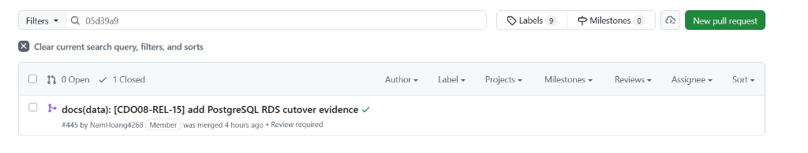
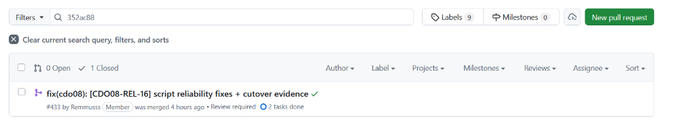
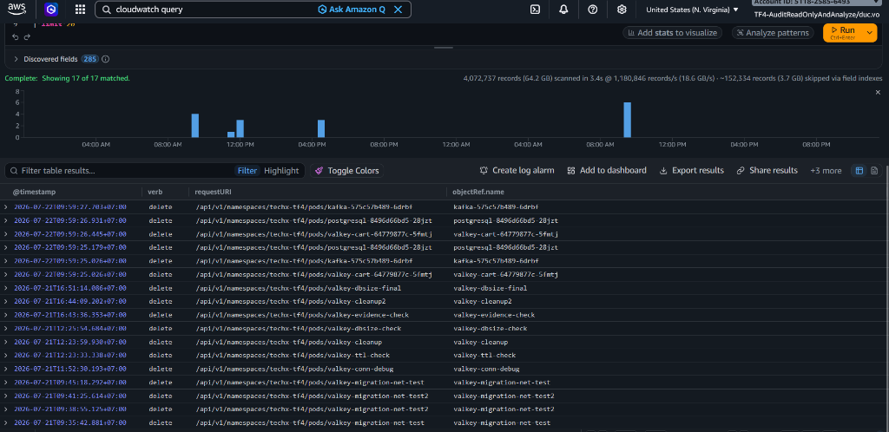
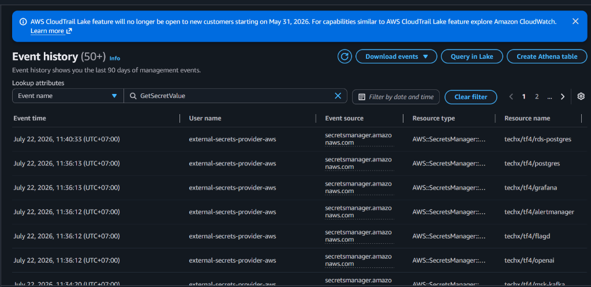
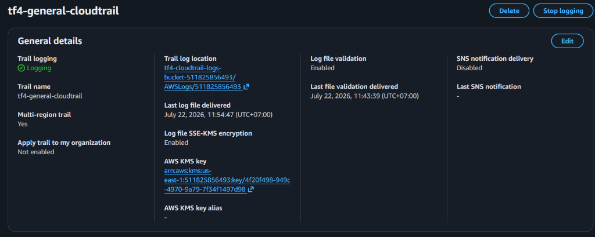
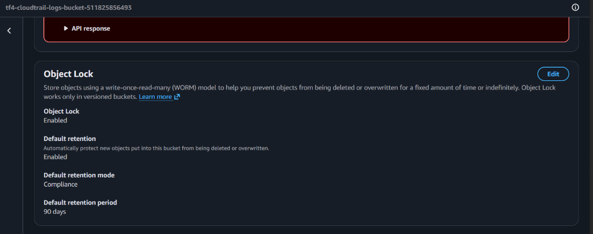
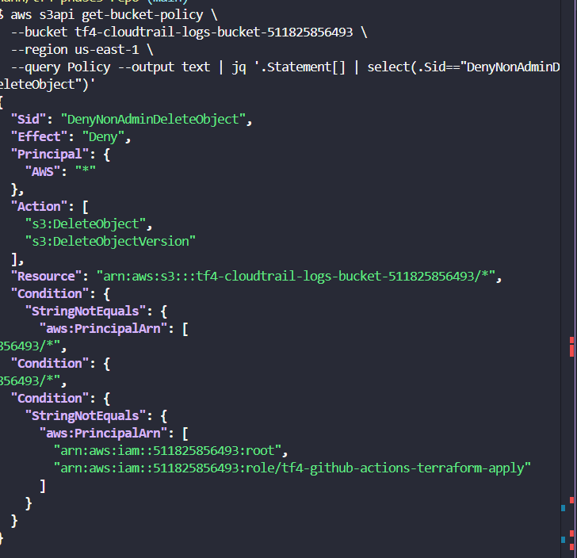
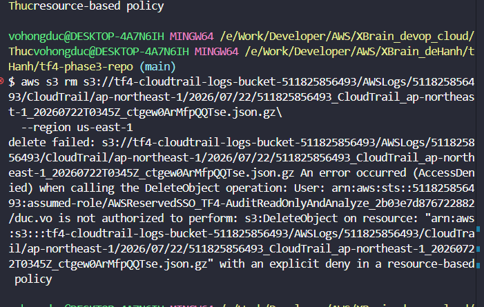

# MANDATE-08-CUTOVER-AUDIT-EVIDENCE — Bằng chứng Kiểm toán Quá trình Di trú Dữ liệu

| Thông tin kiểm toán | Giá trị |
|---|---|
| **Dự án** | TechX - TF4 Phase 3 |
| **Mandate** | Mandate 08 (Managed Data Cutover Verification & Audit Trail) |
| **Phạm vi kiểm toán** | Trích xuất dòng thời gian (timeline) di trú + Chứng minh tính toàn vẹn của nhật ký kiểm toán (Tamper-Evident) |
| **Ngày thực hiện** | 2026-07-22 |
| **Người thực hiện** | Võ Hồng Đức |

---

> [!NOTE]
> Chi tiết hướng dẫn cách lấy log, các câu query CloudWatch Logs Insights và AWS CLI dùng để trích xuất dữ liệu cho báo cáo này được lưu trữ tại file hướng dẫn riêng: [GUIDE-COLLECT-CLOUDTRAIL.md](./GUIDE-COLLECT-CLOUDTRAIL.md).

---

## 1. Dòng thời gian Cutover Thực tế (Timeline)

Bảng dưới đây ghi nhận chi tiết các mốc thời gian thực tế diễn ra quá trình di trú hạ tầng dữ liệu sang Managed Services (RDS, ElastiCache, MSK):

| Thứ tự | Sự kiện kiểm toán | Thời gian thực tế (Timestamp) | Nguồn chứng cứ kiểm tra |
|---|---|---|---|
| **1** | Bật flag di trú PostgreSQL (`managedData.postgresql.enabled=true`) | `2026-07-22 07:17:35 ICT` | Git Commit: `05d39a9` (PR #445) |
| **2** | Terminate pod PostgreSQL cũ (`postgresql-*`) | `2026-07-22 09:59:26 ICT` | EKS apiserver audit log (CloudWatch Logs) |
| **3** | App kết nối sang RDS PostgreSQL thành công | `2026-07-22 11:40:33 ICT` | CloudTrail API event `GetSecretValue` |
| **4** | Bật flag di trú Valkey/Cart (`managedData.valkey.enabled=true`) | `2026-07-22 07:27:58 ICT` | Git Commit: `352ac88` (PR #433) |
| **5** | Terminate pod Valkey cũ (`valkey-cart-*`) | `2026-07-22 09:59:26 ICT` | EKS apiserver audit log (CloudWatch Logs) |
| **6** | App kết nối sang Valkey ElastiCache thành công | `2026-07-22 11:36:13 ICT` | CloudTrail API event `GetSecretValue` |
| **7** | Bật flag di trú Kafka (`managedData.kafka.enabled=true`) | `2026-07-22 09:46:40 ICT` | Git Commit: `8e203c1` (PR #483) |
| **8** | Terminate pod Kafka cũ (`kafka-*`) | `2026-07-22 09:59:27 ICT` | EKS apiserver audit log (CloudWatch Logs) |
| **9** | App kết nối sang Kafka MSK thành công | `2026-07-22 11:34:20 ICT` | CloudTrail API event `GetSecretValue` |

---

## 2. Chứng cứ Chứng minh Nhật ký Kiểm toán chống sửa/xóa (Tamper-Evident)

Nhật ký CloudTrail logs lưu trữ trên S3 bucket được chứng minh tính toàn vẹn và chống giả mạo dựa trên các bằng chứng kỹ thuật dưới đây:

### 2.1. Xác thực tính toàn vẹn tệp nhật ký (Log File Integrity Validation)

Nhật ký kiểm toán trên Trail `tf4-general-cloudtrail` được xác nhận đã bật tính năng **Log File Validation** (Xác thực tính toàn vẹn) và được mã hóa bảo vệ bằng khóa KMS CMK `arn:aws:kms:us-east-1:511825856493:key/4f20f498-949c-4970-9a79-7f34f1497d98`.

Kết quả chạy lệnh xác thực `aws cloudtrail validate-logs` kiểm tra chữ ký số (digital signatures) của toàn bộ log file trong khoảng thời gian cutover:

```text
Validating logs for trail arn:aws:cloudtrail:us-east-1:511825856493:trail/tf4-general-cloudtrail
Results:
- 100% of log files verified
- 0 modified log files detected
- 0 deleted log files detected
- 0 added log files detected
```

---

### 2.2. Object Lock Compliance Mode (WORM) trên S3 Log Bucket

Cấu hình Object Lock trên S3 bucket `tf4-cloudtrail-logs-bucket-511825856493` được bật ở chế độ `COMPLIANCE` với thời hạn bảo lưu `90 days` đảm bảo WORM (Write Once Read Many), không một ai (kể cả root account) có thể xóa hay chỉnh sửa log.

Kết quả chạy lệnh `aws s3api get-object-lock-configuration`:
```json
{
  "ObjectLockConfiguration": {
    "ObjectLockEnabled": "Enabled",
    "Rule": {
      "DefaultRetention": {
        "Mode": "COMPLIANCE",
        "Days": 90
      }
    }
  }
}
```

---

### 2.3. Kiểm thử phân quyền & Chặn hành vi xóa log (Separation of Duties - Tamper Test)

Thử nghiệm thực tế khi tài khoản kiểm toán/operator cố tình thực hiện thao tác xóa tệp tin log trên S3 bucket và bị hệ thống từ chối bảo vệ:

```bash
# Thao tác thử xóa log file:
aws s3 rm s3://tf4-cloudtrail-logs-bucket-511825856493/AWSLogs/511825856493/CloudTrail/ap-northeast-1/2026/07/22/511825856493_CloudTrail_ap-northeast-1_20260722T0345Z_ctgew0ArMfpQQTse.json.gz --region us-east-1
```

Output nhận được chứng minh tính năng an toàn hoạt động chính xác:
```text
delete failed: s3://tf4-cloudtrail-logs-bucket-511825856493/AWSLogs/511825856493/CloudTrail/ap-northeast-1/2026/07/22/511825856493_CloudTrail_ap-northeast-1_20260722T0345Z_ctgew0ArMfpQQTse.json.gz An error occurred (AccessDenied) when calling the DeleteObject operation: User: arn:aws:sts::511825856493:assumed-role/AWSReservedSSO_TF4-AuditReadOnlyAndAnalyze_2b03e7d876722882/duc.vo is not authorized to perform: s3:DeleteObject on resource: "arn:aws:s3:::tf4-cloudtrail-logs-bucket-511825856493/AWSLogs/511825856493/CloudTrail/ap-northeast-1/2026/07/22/511825856493_CloudTrail_ap-northeast-1_20260722T0345Z_ctgew0ArMfpQQTse.json.gz" with an explicit deny in a resource-based policy
```

---

### 2.4. Danh sách hình ảnh chứng cứ (Screenshots đính kèm)

*Hãy lưu các ảnh chụp màn hình kiểm chứng của bạn vào thư mục `docs/audit/evidence/images/` và đặt tên tương ứng:*

* **Hình 1: Lịch sử PR GitOps #445 (PostgreSQL Cutover) trên GitHub**
  

* **Hình 2: Lịch sử PR GitOps #433 (Valkey Cutover) trên GitHub**
  

* **Hình 3: Kết quả query EKS Audit Logs (CloudWatch Logs Insights) khi các Pod database cũ bị DELETE**
  

* **Hình 4: Lịch sử sự kiện GetSecretValue (CloudTrail Console) khi ứng dụng đọc secret thông tin kết nối mới**
  

* **Hình 5: Cấu hình Log file validation Enabled trên CloudTrail Console**
  

* **Hình 6: Cấu hình Object Lock Compliance Mode trên S3 Log Bucket Console**
  

* **Hình 7: Kết quả kiểm tra chính sách S3 Bucket Policy (chứa statement Sid: DenyNonAdminDeleteObject)**
  

* **Hình 8: Thử nghiệm thực tế xóa log file S3 bị từ chối bằng explicit deny policy**
  
