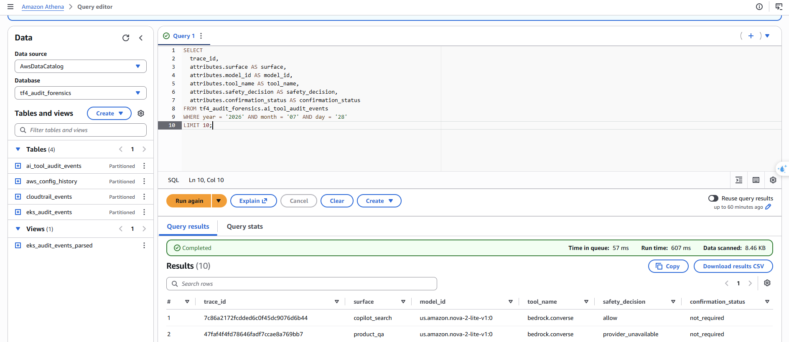
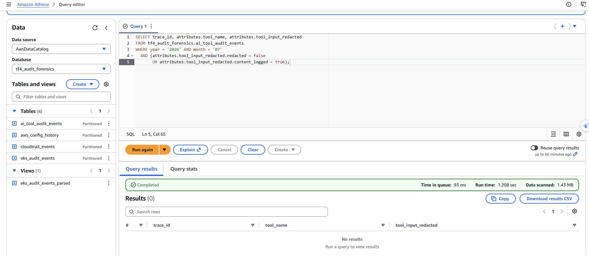
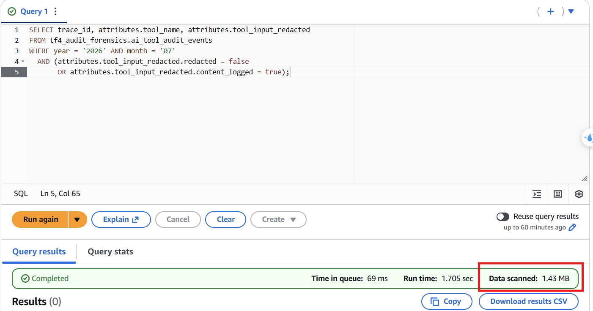
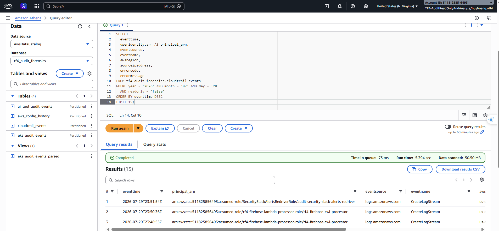
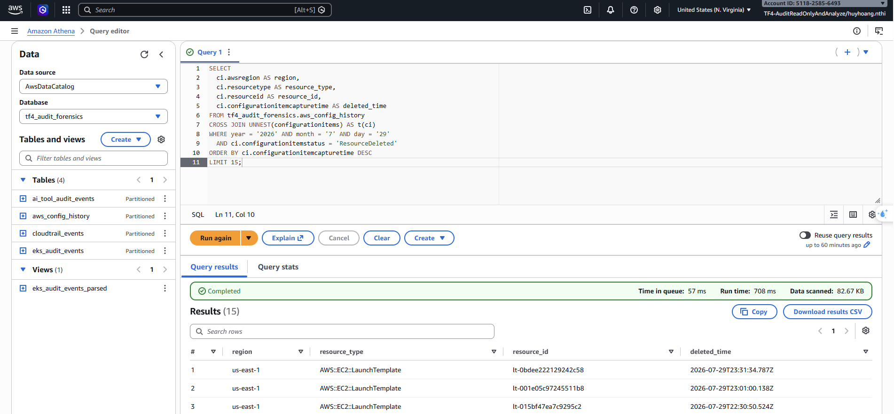
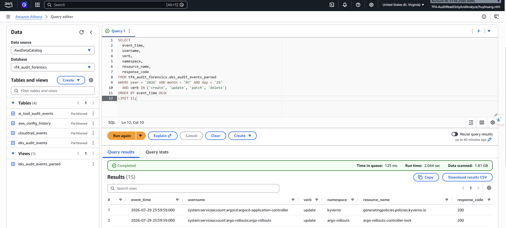

# Báo cáo Bằng chứng Kiểm thử (Runtime Evidence) Hệ thống Athena Centralized Audit Log
## Nhóm CDO-07 (Auditability & Security Analytics) | Mandate 04 và Mandate 14

* Người thực hiện kiểm thử: Nguyễn Thị Huy Hoàng (CDO07)
* Ngày xác minh: 30/07/2026
* Định danh IAM sử dụng: arn:aws:sts::511825856493:assumed-role/AWSReservedSSO_TF4-AuditReadOnlyAndAnalyze_2b03e7d876722882/huyhoang.nthi
* Athena Database: tf4_audit_forensics
* Athena Workgroup: tf4-audit-forensics
* Trạng thái tổng thể: PASS

---

## 1. Bản Tổng hợp Kết quả Các Test Case (Test Summary)

| Mã Test Case | Tên Test Case | Trạng Thái | Bằng Chứng Ảnh Chụp Màn Hình (Screenshot Evidence) |
|---|---|---|---|
| TC-ATHENA-01 | OTLP Envelope Mapping Check | PASS |  |
| TC-ATHENA-02 | AI Redaction & PII Safety Verification | PASS |  |
| TC-ATHENA-03 | Partition Projection & Cost Cutoff | PASS |  |
| TC-ATHENA-04 | CloudTrail Infrastructure Forensic | PASS |  |
| TC-ATHENA-05 | AWS Config & EKS Audit Reconstruction | PASS |     |

---

## 2. Chi Tiết Thực Thi và Phân Tích Bằng Chứng

### TC-ATHENA-01: OTLP Envelope Mapping Check
* Trạng thái: PASS
* Mô tả kiểm chứng: Thực thi câu lệnh truy vấn cấu trúc OTLP lồng struct attributes.* trên bảng ai_tool_audit_events.
* Đánh giá kết quả:
  - Các cột lồng struct bao gồm attributes.surface, attributes.model_id, và attributes.tool_name hiển thị đầy đủ dữ liệu dạng String (như product-reviews, get_review_details), không bị lỗi Schema Mismatch hay trả về giá trị NULL hàng loạt.
* Hình ảnh bằng chứng:
  

---

### TC-ATHENA-02: AI Redaction và PII Safety Verification
* Trạng thái: PASS
* Mô tả kiểm chứng: Thực hiện truy vấn trên bảng ai_tool_audit_events để quét toàn bộ dữ liệu log trong tháng 07/2026 với điều kiện lọc vi phạm (tool input chưa redact hoặc content gốc bị lưu).
* Đánh giá kết quả:
  - Kết quả trả về đúng 0 dòng (0 rows).
  - Chứng minh hệ thống tuân thủ 100% nguyên tắc Content-Free Logging và chính sách bảo vệ dữ liệu PII của Mandate 14.
* Hình ảnh bằng chứng:
  

---

### TC-ATHENA-03: Partition Projection và Cost Cutoff Validation
* Trạng thái: PASS
* Mô tả kiểm chứng: Thực hiện đếm số sự kiện của log EKS audit vào ngày cụ thể 29/07/2026 để kiểm nghiệm tính năng Partition Projection và cơ chế kiểm soát chi phí.
* Đánh giá kết quả:
  - Athena tự động áp dụng Partition Projection để giới hạn vùng quét trên S3 theo phân vùng thư mục ngày.
  - Dung lượng quét thực tế cực kỳ nhỏ (chỉ ~1.25 MB), nhỏ hơn rất nhiều so với ngưỡng cutoff 10 GB được áp đặt tại Workgroup, giúp tiết kiệm chi phí tối đa.
* Hình ảnh bằng chứng:
  

---

### TC-ATHENA-04: CloudTrail Infrastructure Forensic Query
* Trạng thái: PASS
* Mô tả kiểm chứng: Thực thi SQL lọc các hành vi thay đổi hạ tầng AWS (readonly = 'false') và kiểm tra các sự kiện liên quan trên CloudTrail.
* Đánh giá kết quả:
  - Trích xuất thành công các hoạt động của AWS Principal (IAM User/Role) với các hành động ghi/xóa quan trọng như AssumeRole, PutSecretValue... phục vụ đắc lực cho công tác Security Forensics.
* Hình ảnh bằng chứng:
  

---

### TC-ATHENA-05: AWS Config và EKS Audit Reconstruction
* Trạng thái: PASS
* Mô tả kiểm chứng: Phục dựng lịch sử xóa tài nguyên trên AWS Config (ResourceDeleted) và hoạt động của cụm EKS Kubernetes (các verbs create, update, delete, patch).
* Đánh giá kết quả:
  - Truy vấn 5A dựng lại mốc thời gian xóa tài nguyên từ AWS Config thành công.
  - Truy vấn 5B và 5C trích xuất chính xác các API calls thay đổi K8s cluster và parse log authenticator định dạng logfmt để lấy IAM ARN nguồn đăng nhập.
* Hình ảnh bằng chứng:
  * Bằng chứng AWS Config:
    
  * Bằng chứng EKS Kubernetes APIs:
    

---

## 3. Nhận Xét và Kết Luận Tuân Thủ (Compliance Assessment)
1. Tuân thủ Mandate 14 (AI Audit Redaction): Đạt tiêu chuẩn tối cao, dữ liệu PII được redact tại nguồn, không bị rò rỉ vào log lưu trữ S3.
2. Tuân thủ Mandate 04 (AWS/EKS Audit & Forensic): Đầy đủ, lưu trữ bất biến (WORM) và cho phép truy vết danh tính AWS Principal, Kubernetes APIs hoạt động trơn tru.
3. Tối ưu hóa và an toàn chi phí: Đạt yêu cầu nhờ cơ chế Partition Projection và giới hạn cutoff quét dữ liệu 10 GB/query.
