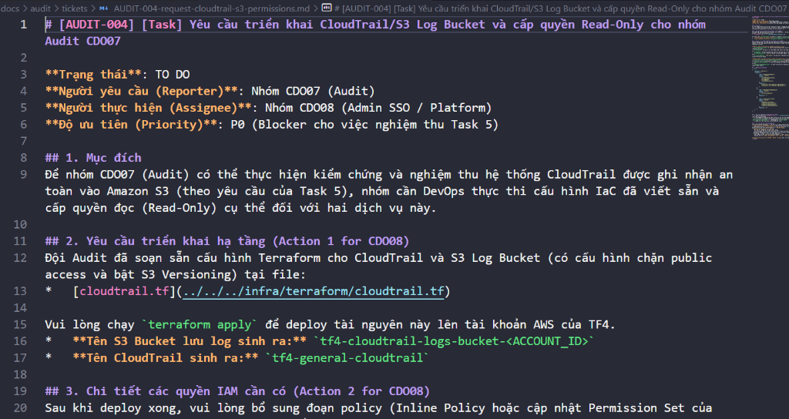
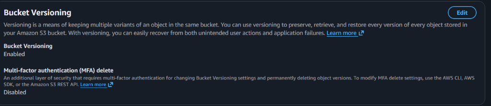
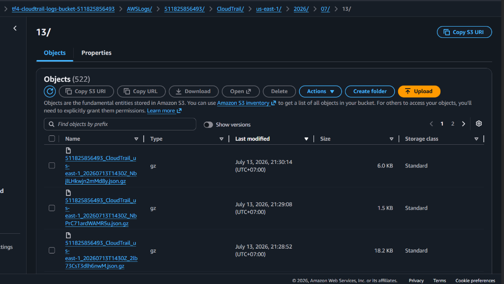
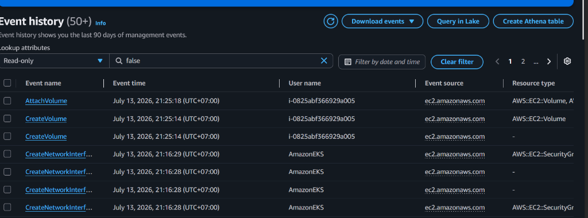

# Chứng cứ Xác minh CloudTrail và S3 Log Bucket

Tài liệu này lưu trữ các bằng chứng hình ảnh (screenshots) chứng minh việc hoàn thành các yêu cầu cấu hình CloudTrail, kiểm tra Versioning trên S3 và xác nhận log file được tạo mới thành công.

## Sub-tasks (Definition of Done):
- [x] Gửi yêu cầu cấu hình CloudTrail sang board DevOps.
- [x] Kiểm tra Versioning trên S3 bucket chứa log đã được Enable.
- [x] Truy cập S3 bucket và xác nhận có log file mới sinh ra.

---

### 1. Gửi yêu cầu cấu hình CloudTrail sang board DevOps.
Yêu cầu đã được khởi tạo và mô tả chi tiết tại ticket [AUDIT-004](../tickets/AUDIT-004-request-cloudtrail-s3-permissions.md) để đội DevOps thực thi và cấu hình quyền truy cập.

---

### 2. Kiểm tra Versioning trên S3 bucket chứa log đã được Enable.
Xác minh trên AWS Console cho thấy tính năng **Bucket Versioning** của S3 log bucket `tf4-cloudtrail-logs-bucket-511825856493` đã được bật ở trạng thái **Enabled**.

---

### 3. Truy cập S3 bucket và xác nhận có log file mới sinh ra.
Logs hoạt động hệ thống từ CloudTrail đang liên tục được lưu trữ vào S3 bucket dưới thư mục phân cấp theo ngày giờ thực tế. Đồng thời, lịch sử sự kiện trên CloudTrail Console cũng ghi nhận các hoạt động API mới nhất.

#### Danh sách các file log CloudTrail được ghi nhận mới nhất trong S3 log bucket:

#### Lịch sử sự kiện (Event History) trên CloudTrail Console:

