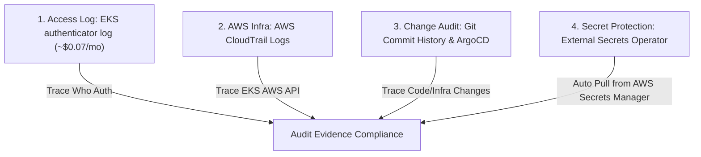

# CDO-07 - Kế Hoạch Tối Ưu Chi Phí AWS EKS CloudWatch Logs & Lộ Trình Triển Khai (Tối Giản / Pragmatic Plan)

- **Trạng thái:** Formal Proposal - Chờ CDO-04, CDO-07 và CDO-08 phê duyệt
- **Ngày cập nhật:** 2026-07-29
- **Phạm vi:** Cụm EKS `techx-tf4-cluster`, Log Group `/aws/eks/techx-tf4-cluster/cluster`
- **Tác giả:** Hoàng Kim Hùng (Nhóm CDO-07 Audit), Bùi Thành Nghĩa (Nhóm CDO-07 Audit - Reviewer & Editor)
- **Owners:** CDO-04 (Cost/Performance), CDO-07 (Audit/Compliance), CDO-08 (Security/Reliability)
- **Bối cảnh vận hành:** Hệ thống vận hành theo mô hình Prod-like, tuân thủ 100% quy trình GitOps (ArgoCD) và External Secrets Operator.

---

## 0. Kết luận & Khuyến nghị Tổng quan (Ponytail Approach: Minimalist & High ROI)

Sau khi rà soát toàn bộ hạ tầng Terraform (`infra/terraform/eks.tf`, `infra/terraform/eks-audit-firehose.tf`), tài liệu ADR-005, và ma trận bảo mật Admission Policies trên cụm (`techx-corp-chart/templates/admission-hardening.yaml`), **Nhóm CDO-07 (Audit Team)** đề xuất **phương án tối giản hóa toàn diện**:

1. **Khẳng định Cost Driver**: Chi phí CloudWatch Logs Ingestion cho EKS hiện ngốn >98% chi phí CloudWatch. Log type **`audit` chiếm 99.99% dung lượng** (~2.1 GB/giờ, **~$756 USD/tháng**), trong khi log type **`authenticator` chỉ chiếm ~0.01%** (~0.19 MB/giờ, **~$0.07 USD/tháng**).
2. **Loại bỏ giải pháp Falco eBPF phức tạp**: 
   - Triển khai Falco eBPF DaemonSet gây ra xung đột nghiêm trọng (Blocker) với 4 Admission Hardening Policies đang cấm `runAsRoot`, cấm `capabilities`, cấm `privileged/hostPID` trên cluster.
   - Thêm DaemonSet làm tăng 50-100m CPU request trên từng node, gây áp lực lên Karpenter NodePool vốn đã đạt 90-98% CPU requests.
   - Yêu cầu cấu hình lại OTel Collector, IRSA S3 policy và ArgoCD manifests không cần thiết (vi phạm nguyên tắc YAGNI).
3. **Khuyến nghị Tối ưu Đơn giản (Chỉ bật `authenticator`)**:
   - Thay đổi đúng 1 dòng Terraform trong `infra/terraform/eks.tf`: `cluster_enabled_log_types = ["authenticator"]`.
   - Cắt giảm ngay lập tức **>99.9% chi phí CloudWatch Ingestion** (rớt từ ~$756/tháng xuống **~$0.07/tháng**, tiết kiệm ~18.5 triệu VNĐ/tháng).
   - Zero rủi ro hạ tầng, không sửa code app/chart, không cần bảo trì thêm DaemonSet hay OTel Collector mới.
4. **Bảo đảm Chuỗi Chứng Cứ Audit bằng Hạ Tầng Sẵn Có**:
   - **Identity Authentication**: Giữ log `authenticator` trên CloudWatch (~$0.07/tháng) để biết ai đăng nhập vào cluster.
   - **Infrastructure API Audit**: AWS CloudTrail đã ghi vết toàn bộ AWS API & EKS Cluster management operations.
   - **Application & Infra Changes**: 100% thay đổi cấu hình/workload được quản lý qua Git Commits & ArgoCD Sync History. Secrets được tự động đồng bộ qua External Secrets Operator (không thao tác `kubectl get secret` thủ công).

---

## 1. Phân Tích Chi Phí Thực Tế & Nguyên Nhân

### 1.1 Số liệu đo đạc thực tế từ AWS EKS (Tháng 7/2026)

| Nguồn Log | Volume / Giờ | Events / Giờ | Tỷ trọng | Chi phí Ingestion ($0.50/GB) |
| :--- | :--- | :--- | :--- | :--- |
| **`authenticator`** | ~0.19 MB/giờ | ~539 events/giờ | ~0.01% | **~$0.07 USD / tháng** (Cực nhỏ) |
| **`audit`** | ~2.10 GB/giờ | ~124,878 events/giờ | **99.99%** | **~$756 USD / tháng** (Run-rate 24x7) |
| **Tổng Log Group MTD** | **448.1 GB** | - | **>98% CW Logs** | **$224.05 USD** (Thực tế MTD) |

> **Ghi chú CDO-04:**  
> - **$224.05 USD** là chi phí ghi nhận thực tế Month-To-Date (MTD).  
> - **~$756 USD/tháng** là chi phí dự báo (Run-rate 24x7) nếu duy trì nạp 2.1 GB/giờ trong 30 ngày.

### 1.2 Nguồn gốc log rác trong EKS Audit Log
>95% dung lượng EKS audit log thô là log rác tự động từ hệ thống:
- Kubelet & Load Balancer probe liên tục vào `/readyz`, `/healthz`.
- `kube-node-lease` cập nhật lease status mỗi vài giây.
- AWS EBS-CSI Driver và Kubelet polling status 404 lặp đi lặp lại.

---

## 2. Vì Sao Không Nên Dùng Falco eBPF Hay K8s Audit Webhook?

```
┌──────────────────────────────────────────────────────────────────────────────────────────────┐
│                                LÝ DO LOẠI BỎ PHƯƠNG ÁN PHỨC TẠP                              │
├──────────────────────────────────────────────┬───────────────────────────────────────────────┤
│ ❌ K8s Audit Webhook                         │ ❌ Falco eBPF DaemonSet                       │
├──────────────────────────────────────────────┼───────────────────────────────────────────────┤
│ • EKS là Managed Cluster, Master Node bị khóa │ • Vi phạm 4 Kyverno Admission Policies        │
│ • AWS cấm sửa cờ --audit-webhook-config-file │ • Cần root/privileged capabilities            │
│ • KHÔNG THỂ THỰC HIỆN BỞI AWS DESIGN         │ • Ngốn Thêm CPU trên Karpenter NodePool       │
│                                              │ • Phát sinh OTel/IRSA/ArgoCD overhead phức tạp │
└──────────────────────────────────────────────┴───────────────────────────────────────────────┘
```

1. **K8s Audit Webhook**: AWS EKS không cho phép truy cập Master Node để chỉnh cờ API Server. Phương án này bị loại trừ hoàn toàn bởi thiết kế của EKS.
2. **Falco eBPF DaemonSet**: Xung đột trực tiếp với chính sách bảo mật Kyverno/Admission Hardening hiện tại (`require-run-as-nonroot`, `require-drop-all-capabilities`, `disallow-privileged-and-host-access`). Đồng thời gây lãng phí tài nguyên CPU/RAM trên Karpenter worker nodes vốn đang ở ngưỡng 90-98% requests.

---

## 3. Mô Hình Bằng Chứng Audit Đơn Giản & Đủ Đầy (Multi-Layer Audit Evidence)

Khi tắt log type `audit` thô trên EKS, **Nhóm CDO-07 Audit** bảo đảm tính minh bạch và tuân thủ audit thông qua 4 lớp sẵn có:



1. **Xác thực Đăng nhập (IAM Access)**: Giữ log `authenticator` trên CloudWatch (**~$0.07/tháng**) để truy vết ai (IAM Role/User) đã đăng nhập vào cụm EKS.
2. **Thao tác Cấp AWS Infrastructure**: AWS CloudTrail lưu vết toàn bộ thao tác tác động tới EKS Cluster level, VPC, Security Group, IAM Roles.
3. **Thao tác Thay đổi Cấu hình & Deploy**: 100% ứng dụng và tài nguyên K8s được triển khai qua **GitOps (ArgoCD)**. Lịch sử Git Commits và ArgoCD Sync Logs là chứng cứ audit chuẩn mực nhất cho câu hỏi "Ai đã thay đổi Pod/Deployment/Service gì và vào lúc nào".
4. **Bảo mật Secret**: Hệ thống đã triển khai `external-secrets` operator. Secrets được sync tự động từ AWS Secrets Manager, không có thao tác con người `kubectl get secret` trực tiếp trên Production.

---

## 4. Bảng So Sánh Chi Phí & Rủi Ro

| Tiêu chí | Phương án Cũ (Audit + Auth) | Phương án Falco eBPF | Phương án Đề xuất CDO-07 (Chỉ Authenticator) |
| :--- | :--- | :--- | :--- |
| **Phí CW Ingestion** | ~$756.00 USD / tháng | $0 USD | **~$0.07 USD / tháng (Giảm 99.9%)** |
| **Độ Phức Tạp Hạ Tầng** | Thấp | Rất cao (Falco, OTel, IRSA, ArgoCD) | **Cực kỳ thấp (Sửa 1 dòng Terraform)** |
| **Tác động Tài nguyên Node** | Không | Tốn thêm CPU/RAM trên 100% nodes | **Zero impact (Không tốn CPU/RAM)** |
| **Phù hợp Admission Policy** | Tương thích | Vi phạm 4 Admission Hardening Rules | **Hoàn toàn tương thích** |
| **Rủi ro Vận hành** | Không | Cao (Cần duy trì DaemonSet & Kernel eBPF) | **Bằng 0** |
| **Khuyến nghị** | ❌ Chi phí quá đắt | ❌ Quá phức tạp (Over-engineered) | ✅ **CDO-07 KÍ PHÊ DUYỆT (Recommended)** |

---

## 5. Lộ Trình Triển Khai (Implementation Steps)

### Bước 1: Thống nhất & Phê duyệt Kế hoạch (Planning & Alignment)
- CDO-07 làm việc với CDO-04 (Cost) và CDO-08 (Security) để thống nhất mô hình bằng chứng Audit dựa trên GitOps + CloudTrail + Authenticator Log.

### Bước 2: Triển khai Terraform (Technical Implementation)
- Cập nhật file `infra/terraform/eks.tf`:
  ```hcl
  cluster_enabled_log_types = ["authenticator"]
  ```
- Giữ nguyên Subscription Filter (`eks-audit-firehose.tf`) để stream log `authenticator` sang S3 bucket cũ `tf4-eks-audit-logs-${account_id}` (vẫn bảo vệ bởi S3 Object Lock COMPLIANCE 90 ngày).
- Mở rộng hàm `is_noise()` trong Lambda Processor làm guardrail dự phòng.

### Bước 3: Nghiệm thu & Cập nhật Tài liệu (Verification & Docs)
- Xác minh chỉ số CloudWatch Metric `IncomingBytes` trên `/aws/eks/techx-tf4-cluster/cluster` giảm ngay >99%.
- Cập nhật `docs/audit/adr/005-eks-control-plane-logging-enabled.md` và AUDIT-001 DoD.

---

## 6. Dự Báo Tiết Kiệm Chi Phí (Cost Model)

| Hạng mục | Trước Tối Ưu | Sau Khi Triển Khai (Chỉ Authenticator) | Tiết kiệm Ước tính |
| :--- | :--- | :--- | :--- |
| **Phí CW Ingestion Log EKS** | ~$756.00 USD / tháng | **~$0.07 USD / tháng** | **~$755.93 USD / tháng (~99.9%)** |
| **Phí CW Retention Storage** | ~$9.00 USD / tháng | **~$0.01 USD / tháng** | **~$8.99 USD / tháng** |
| **Phí S3 Storage & WORM** | ~$5.00 USD / tháng | **~$0.10 USD / tháng** | **~$4.90 USD / tháng** |
| **Tổng Chi Phí Hàng Tháng** | **~$770.00 USD / tháng** | **~$0.18 USD / tháng** | **~$769.82 USD / tháng (Tiết kiệm ~18.5 triệu VNĐ/tháng)** |

---

## 7. Approval Matrix

| Owner | Vai trò | Trạng thái Phê duyệt | Nội dung Phê duyệt |
| :--- | :--- | :--- | :--- |
| **CDO-04** | Cost & Performance | ⏳ Pending Review | Phê duyệt phương án cắt giảm chi phí >99% |
| **CDO-07** | Audit & Compliance | ✅ **Approved (Chủ trì)** | Phê duyệt mô hình bằng chứng Audit thay thế (GitOps + CloudTrail + Authenticator) |
| **CDO-08** | Security & Reliability | ⏳ Pending Review | Xác nhận không phát sinh rủi ro hạ tầng / DaemonSet trên Worker Node |

---

## 8. Tài Liệu Tham Chiếu (References)

- `infra/terraform/eks.tf`
- `infra/terraform/eks-audit-firehose.tf`
- `infra/terraform/athena-forensics.tf`
- `docs/audit/adr/005-eks-control-plane-logging-enabled.md`
- `docs/audit/tickets/AUDIT-001-enable-eks-logs.md`
- AWS EKS Control Plane Logs Documentation: `https://docs.aws.amazon.com/eks/latest/userguide/control-plane-logs.html`
