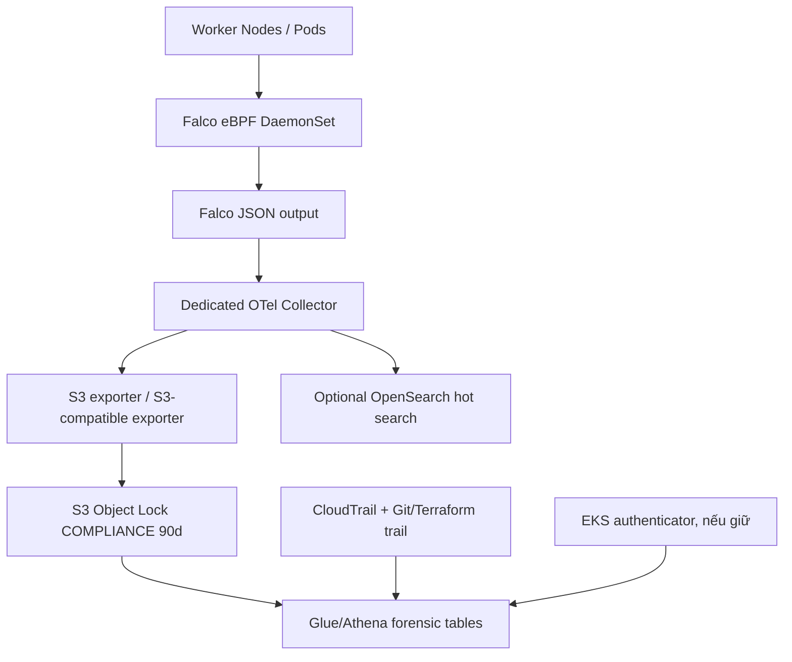

# CDO-07 - Kế hoạch tối ưu chi phí EKS CloudWatch Logs theo hướng PA3

- **Trạng thái:** Draft - chờ CDO-04, CDO-07 và CDO-08 phê duyệt
- **Ngày lập:** 2026-07-29
- **Phạm vi:** `techx-tf4-cluster`, log group `/aws/eks/techx-tf4-cluster/cluster`
- **Người lập:** Hoàng Kim Hùng
- **Owners:** CDO-04 (Cost/Performance), CDO-07 (Audit), CDO-08 (Security/Reliability)
- **Bối cảnh cập nhật:** hệ thống đang vận hành theo kiểu prod/prod-like, không phải dev/staging tách riêng

## 0. Kết luận cập nhật

Sau khi rà soát lại giả định vận hành, hướng **PA1 + PA2** không còn là phương án chính. Lý do: hệ thống hiện tại được xem là prod-like, nên không có nhiều giá trị khi nói "dev/staging chỉ bật authenticator". Nếu vẫn bật `audit` trên cluster prod-like, chi phí CloudWatch Logs ingestion vẫn giữ nguyên driver lớn nhất.

Khuyến nghị mới là **PA3-first, triển khai theo migration gate**:

1. Dựng pipeline **Falco eBPF DaemonSet -> dedicated OTel Collector -> S3 Object Lock** để ghi nhận runtime/security events trực tiếp về S3, không đi qua CloudWatch Logs.
2. Chạy song song pipeline PA3 với EKS `audit` + `authenticator` hiện tại trong một giai đoạn shadow để đo coverage, cost và tài nguyên.
3. Sau khi CDO-07 chấp nhận forensic equivalence bằng test, đề xuất tắt EKS `audit` để cắt phần CloudWatch ingestion lớn nhất.
4. Khuyến nghị **giữ `authenticator`** trong EKS control-plane logging vì chi phí gần như bằng 0 (~0.14 GB/tháng theo mẫu đo) và vẫn giữ được chuỗi IAM -> Kubernetes identity. Nếu bắt buộc "CloudWatch ingestion = 0", việc tắt cả `authenticator` phải được CDO-07 phê duyệt riêng.
5. PA2 chỉ giữ vai trò hỗ trợ trong giai đoạn chuyển tiếp: retention ngắn và filter noise giúp giảm storage/downstream, nhưng không giải quyết cost driver.

> **Cảnh báo compliance:** PA3 không thay thế EKS control-plane audit theo nghĩa 1:1. Falco eBPF mạnh ở runtime detection trên worker node, còn EKS `audit` là log từ Kubernetes API server. Việc tắt EKS `audit` là một thay đổi ADR/compliance, chỉ được thực hiện khi CDO-07 chấp nhận rõ các khoảng trống và phạm vi forensic mới.

## 1. Hiện trạng và cost driver

Nguồn trong repo đã rà soát:

- `docs/audit/adr/005-eks-control-plane-logging-enabled.md`
- `docs/audit/tickets/AUDIT-001-enable-eks-logs.md`
- `docs/requirements/mandates/MANDATE-04-auditability-tf4.md`
- `infra/terraform/eks.tf`
- `infra/terraform/eks-audit-firehose.tf`
- `infra/terraform/ai-audit-logs.tf`
- `infra/terraform/athena-forensics.tf`
- `deploy/values-observability.yaml`

### Evidence vận hành

| Nguồn | Events/giờ | Dung lượng/giờ | Tỷ trọng | Chi phí ingestion ước tính |
| ----- | ---------: | -------------: | -------: | -------------------------: |
| `authenticator` | 539 | 0.19 MB | gần như không đáng kể | khoảng $0.07/tháng |
| `audit` | 124,878 | 2.10 GB | ~99.99% dung lượng | khoảng `$756/tháng` nếu duy trì 24x7 |
| Tổng log group MTD | - | 448.1 GB | >98% CloudWatch Logs | `$224.05` theo evidence hiện tại |

Điểm cần chốt với CDO-04: `$224.05` là chi phí month-to-date theo ảnh; `$756/tháng` là run-rate nếu tốc độ 2.1 GB/giờ duy trì 24x7. Đây là hai số liệu khác nhau và phải tách khi trình duyệt ngân sách.

### Cấu hình hiện tại

- `infra/terraform/eks.tf` đang bật `cluster_enabled_log_types = ["audit", "authenticator"]`.
- CloudWatch retention hiện là 7 ngày.
- `infra/terraform/eks-audit-firehose.tf` đang stream toàn bộ log group sang Firehose/S3 với `filter_pattern = ""`.
- Lambda `is_noise` hiện chỉ bỏ `/healthz`, `/livez`, và user `system:node:*`; nhiều nguồn noise lớn như `/readyz`, lease polling, EBS CSI 404 vẫn có thể đi qua.
- S3 archive cho EKS audit đã có Object Lock COMPLIANCE 90 ngày, versioning, SSE-S3, lifecycle sang `GLACIER_IR` sau ngày 91 và expire sau 365 ngày.
- Repo đã có OTel Collector cho observability (`deploy/values-observability.yaml`) và pipeline AI audit OTel -> CloudWatch -> Firehose -> S3 (`infra/terraform/ai-audit-logs.tf`). Tuy nhiên pipeline AI audit hiện vẫn đi qua CloudWatch; PA3 của Task 79 phải dùng nhánh S3 trực tiếp nếu mục tiêu là bypass CloudWatch ingestion.

## 2. Vì sao đổi hướng sang PA3

### PA1 không còn phù hợp làm hướng chính

PA1 giả định có dev/staging để tắt `audit` và chỉ giữ `authenticator`. Với bối cảnh mới, cluster đang chạy theo kiểu prod/prod-like. Nếu không có cụm dev/staging riêng, PA1 không tạo ra saving đáng kể trên cost driver hiện tại.

PA1 vẫn có thể ghi vào backlog dài hạn nếu sau này tách account/cluster theo môi trường, nhưng không nên là quyết định chính cho Task 79.

### PA2 không giải quyết CloudWatch ingestion

Retention 1 ngày và filter noise tại Lambda chỉ xảy ra sau khi EKS đã gửi log vào CloudWatch. Do đó PA2 giúp giảm:

- CloudWatch hot storage;
- Firehose processed bytes;
- S3 storage/query downstream;
- Athena scan cost.

PA2 **không giảm** khoản CloudWatch Logs ingestion đang gây cost lớn. Với run-rate 2.1 GB/giờ, saving storage từ 7 ngày xuống 1 ngày chỉ khoảng $9/tháng, không đủ xử lý vấn đề chính.

### PA3 là hướng duy nhất có thể cắt mạnh ingestion trên prod-like

PA3 có thể cắt phần cost lớn nếu sau khi validation, CDO-07 cho phép tắt EKS `audit` và thay bằng một evidence pipeline mới:

```text
Falco eBPF DaemonSet
  -> dedicated OTel Collector
  -> AWS S3 exporter / S3-compatible exporter
  -> S3 Object Lock WORM
  -> Athena/Glue forensic tables
```

Mục tiêu là chỉ ghi các security-relevant events, không đẩy raw 2.1 GB/giờ audit noise vào CloudWatch.

## 3. Ranh giới compliance khi dùng PA3

### Điều PA3 làm tốt

PA3 phù hợp để phát hiện và lưu bằng chứng cho runtime/security events trên worker nodes:

- exec shell trong container;
- privilege escalation;
- container chạy privileged hoặc mount host path nhạy cảm;
- truy cập file nhạy cảm;
- thay đổi binary/config bất thường;
- network connection đáng ngờ;
- hành vi ghi/đọc secret từ process trong workload nếu rule nhìn thấy ở runtime;
- correlation với namespace, pod, container, image, node.

### Điều PA3 không thay thế 1:1

Falco eBPF không phải EKS control-plane audit log. Nếu tắt EKS `audit`, các khoảng trống cần CDO-07 chấp nhận gồm:

- không còn raw record đầy đủ cho mọi Kubernetes API request `get/list/watch/create/update/patch/delete`;
- khó chứng minh đầy đủ "ai gọi `kubectl get secret`" nếu hành vi chỉ diễn ra ở API server và không tạo dấu vết runtime quan sát được trên worker;
- `authenticator` là nguồn rẻ nhất để map IAM -> Kubernetes identity; nếu tắt luôn thì mất một breadcrumb rất hữu ích;
- CloudTrail chỉ ghi AWS API/EKS service operations, không thay thế toàn bộ Kubernetes API audit bên trong cluster.

Vì vậy, approval đúng phải là: **CDO-07 chấp nhận evidence model mới**, không phải tuyên bố PA3 tương đương tuyệt đối với EKS audit.

### Deviation cần owner approve

| Hạng mục | ADR/AUDIT hiện tại | Đề xuất PA3 | Điều kiện phê duyệt |
| -------- | ------------------ | ----------- | ------------------- |
| EKS `audit` | Bật để truy vết Kubernetes API action | Tắt sau shadow period nếu PA3 đạt forensic canary | CDO-07 ký chấp nhận coverage mới và khoảng trống |
| EKS `authenticator` | Bật để map IAM -> K8s identity | Khuyến nghị giữ vì chi phí rất thấp | Chỉ tắt nếu CDO-07 chấp nhận mất IAM auth breadcrumb |
| Hot query CloudWatch | Query nhanh trên CloudWatch Logs Insights | Chuyển runtime/security query sang Athena/S3 hoặc OpenSearch nếu có | CDO-07 xác nhận playbook query mới |
| S3 WORM | EKS audit archive hiện có Object Lock 90 ngày | Tạo bucket/prefix PA3 với Object Lock 90 ngày và lifecycle 365 ngày | CDO-08 xác nhận bucket/policy/retention |
| DoD forensic | Dựa vào audit log thô | Dựa vào Falco security events + CloudTrail + Git/Terraform change trail + authenticator nếu giữ | Canary test phải pass 100% cho case đã định nghĩa |

## 4. So sánh lại 3 phương án

| Tiêu chí | PA1 - tách môi trường | PA2 - retention + filter | PA3 - Falco eBPF + OTel -> S3 |
| -------- | --------------------- | ------------------------ | ----------------------------- |
| Phù hợp với prod-like hiện tại | Thấp | Trung bình, chỉ hỗ trợ | Cao nhất nếu CDO-07 chấp nhận evidence model mới |
| Giảm CloudWatch ingestion | Thấp nếu không có dev/staging riêng | Không giảm | Cao nếu tắt EKS `audit`; gần 100% nếu tắt cả `authenticator` |
| Giữ full EKS API audit | Không nếu tắt audit ở môi trường nào đó | Có | Không, trừ khi tiếp tục bật EKS `audit` song song |
| Chi phí vận hành | Thấp | Thấp | Trung bình: thêm Falco/OTel/S3/Athena và vận hành rule |
| Rủi ro tài nguyên | Thấp | Thấp | Trung bình-cao, cần canary và giới hạn CPU/RAM |
| Rủi ro compliance | Trung bình | Thấp | Cao nếu tắt EKS `audit` không có sign-off |
| Kết luận | Không chọn làm main plan | Là guardrail chuyển tiếp | **Chọn làm target plan có migration gate** |

## 5. Kiến trúc mục tiêu PA3

### Luồng dữ liệu



### Nguyên tắc thiết kế

- Không dùng OTel Collector observability chung để gánh audit/security pipeline. Dùng collector riêng hoặc pipeline riêng có queue/memory limiter tách biệt.
- Không đẩy raw audit noise 2.1 GB/giờ vào OTel.
- Falco chỉ emit các event đã match rule. Mục tiêu là giảm từ 124,878 raw audit events/giờ xuống một lượng nhỏ security-relevant events.
- S3 là evidence authority, bật Object Lock COMPLIANCE 90 ngày, versioning, block public access, SSE-S3 hoặc KMS nếu CDO-08 yêu cầu.
- Athena/Glue là lớp forensic query chính sau cutover.
- OpenSearch, nếu dùng, chỉ là hot search convenience, không phải evidence authority.

### Lưu ý về OTel S3 exporter

OpenTelemetry Collector có AWS S3 exporter trong `contrib`, nhưng trạng thái stability hiện là alpha. Vì vậy PA3 production phải có một trong hai hướng:

- chấp nhận `awss3exporter` sau canary/load test và pin image/version rõ ràng;
- hoặc dùng OTel -> Firehose/Kinesis/S3-compatible path không đi qua CloudWatch Logs nếu CDO-08 muốn giảm rủi ro exporter alpha.

Không dùng lại pattern `OTel -> CloudWatch -> Firehose -> S3` của AI audit cho Task 79, vì pattern đó vẫn phát sinh CloudWatch ingestion.

## 6. Đánh giá tải tài nguyên

Số liệu 124,878 events/giờ là tải của EKS audit log thô, không phải số event Falco cần export. PA3 chỉ hợp lý nếu lọc ở nguồn:

- Falco/eBPF quan sát syscall ở worker node, nhưng chỉ emit event khi rule match.
- OTel Collector chỉ nhận output đã lọc từ Falco, không nhận raw EKS audit 2.1 GB/giờ.
- Nếu cấu hình sai và forward quá nhiều event, OTel có thể gặp queue pressure, tăng heap, tăng CPU, mất event khi exporter retry.

### Guardrail tài nguyên đề xuất

| Thành phần | Guardrail ban đầu | Metric cần theo dõi |
| ---------- | ----------------- | ------------------- |
| Falco DaemonSet | requests/limits riêng, rollout 1 node trước | CPU, memory, dropped events, rule match rate |
| OTel Collector dedicated | memory_limiter, batch, sending_queue, file_storage nếu dùng persistent queue | queue length, send_failed_log_records, dropped log records |
| Worker node | không chạy PA3 full cluster trước canary | node CPU allocatable, eviction, pod restart |
| S3 exporter | retry/backoff có giới hạn | export latency, failed exports, object count/size |
| Athena | partition theo year/month/day/hour | bytes scanned/query, query failure |

### Ngưỡng acceptance tài nguyên

- Không có OOMKilled ở Falco hoặc OTel trong shadow period.
- Không tăng đáng kể CPU steal/pressure trên worker node.
- Không có sustained queue >80% trong 5 phút.
- Không có dropped security event trong canary.
- S3 object xuất hiện trong vòng 5 phút với partition đúng.

## 7. Implementation Plan

### Phase 0 - Re-baseline và quyết định compliance

1. CDO-04 xác nhận lại Cost Explorer theo log group, region, UsageType và time window.
2. CDO-07 xác nhận hệ thống là prod-like và PA1 không còn là main path.
3. CDO-07 định nghĩa forensic canary tối thiểu:
   - `kubectl exec` vào pod;
   - tạo privileged pod hoặc pod mount hostPath;
   - đọc/ghi file nhạy cảm trong container;
   - thay đổi RBAC/ClusterRoleBinding;
   - đọc Secret qua Kubernetes API;
   - delete/patch Deployment;
   - IAM authentication vào cluster.
4. Với từng case, phân loại expected source: Falco, CloudTrail, Git/Terraform trail, EKS authenticator, hoặc EKS audit only.
5. CDO-07 ký trước danh sách case nào PA3 phải bắt được và case nào chấp nhận mất nếu tắt EKS `audit`.

### Phase 1 - PA3 shadow pipeline

1. Tạo S3 bucket/prefix riêng cho runtime security audit, bật Object Lock COMPLIANCE 90 ngày, versioning, SSE-S3, block public access và lifecycle 365 ngày.
2. Triển khai Falco DaemonSet ở chế độ canary 1 node với rule tối thiểu, ưu tiên security-relevant rules.
3. Triển khai dedicated OTel Collector nhận Falco JSON output và export trực tiếp S3.
4. Bật metric/alert cho Falco dropped events, OTel queue pressure, export failure và S3 delivery gap.
5. Giữ nguyên EKS `audit` + `authenticator` trong giai đoạn shadow để đối chiếu.

### Phase 2 - Coverage và load validation

1. Chạy forensic canary, đối chiếu PA3 event với EKS audit gốc.
2. Đo event volume thực tế của Falco/OTel trong tối thiểu 72 giờ vận hành bình thường.
3. Chạy chaos test:
   - OTel restart;
   - S3 deny tạm thời;
   - network failure;
   - node pressure;
   - exporter retry storm.
4. Nếu thiếu event bắt buộc, bổ sung Falco rule hoặc bổ sung nguồn evidence khác trước khi cutover.
5. Nếu OTel/S3 exporter không ổn định, không tắt EKS `audit`.

### Phase 3 - Cost cutover

Chỉ thực hiện sau khi Phase 2 pass và có approval:

1. CDO-04 phê duyệt cost model mới.
2. CDO-07 phê duyệt thay đổi forensic model.
3. CDO-08 phê duyệt security/IAM/resource isolation.
4. Terraform thay đổi EKS log types:
   - khuyến nghị: `cluster_enabled_log_types = ["authenticator"]`;
   - chỉ dùng `[]` nếu CDO-07 chấp nhận mất luôn authenticator.
5. Giữ CloudWatch log group/S3 archive cũ đến hết retention/lifecycle, không xóa evidence.
6. Theo dõi 7 ngày sau cutover: CloudWatch ingestion, Falco event volume, OTel failure, S3 object delivery, Athena queryability.

### Phase 4 - Chuẩn hóa tài liệu và runbook

1. Cập nhật ADR-005 hoặc tạo ADR mới cho PA3.
2. Cập nhật AUDIT-001 DoD theo evidence model mới.
3. Cập nhật Athena Glue table/view cho runtime security events.
4. Viết runbook "cách dựng timeline forensic sau PA3".
5. Đánh dấu `docs/audit/reports/cloudwatch-cost-optimization-report.md` là stale hoặc viết lại để tránh nhầm filter subscription giảm CloudWatch ingestion.

## 8. Cost Model mới

### Baseline hiện tại

| Khoản | Ước tính |
| ----- | -------: |
| EKS audit ingestion MTD | `$224.05` cho 448.1 GB |
| EKS audit run-rate | khoảng `$756/tháng` nếu 2.1 GB/giờ duy trì 24x7 |
| Authenticator | khoảng `$0.07/tháng` |
| Storage saving PA2 7 ngày -> 1 ngày | khoảng `$9/tháng` |

### Sau PA3 cutover

| Kịch bản | CloudWatch ingestion | Ghi chú |
| -------- | -------------------: | ------- |
| Tắt `audit`, giữ `authenticator` | gần như chỉ còn ~$0.07/tháng | Khuyến nghị vì vẫn giữ IAM identity breadcrumb |
| Tắt cả `audit` và `authenticator` | gần `$0/tháng` cho EKS control-plane logs | Compliance risk cao hơn |
| PA3 S3 direct | phụ thuộc event Falco thực tế | S3 storage/request rất nhỏ nếu chỉ lưu security-relevant events |

Business case mới không được ghi "PA3 tiết kiệm 100%" nếu vẫn giữ `authenticator`. Cách ghi đúng là: PA3 có thể cắt gần như toàn bộ cost driver vì phần tốn tiền là `audit`, còn `authenticator` quá nhỏ.

## 9. KPI nghiệm thu

| KPI | Mục tiêu |
| --- | -------- |
| Cost reduction | CloudWatch Logs ingestion của `/aws/eks/techx-tf4-cluster/cluster` giảm >95% sau cutover nếu giữ `authenticator` |
| Forensic canary | 100% case đã được CDO-07 đánh dấu "must capture" có evidence trong S3/Athena |
| Identity breadcrumb | Nếu giữ `authenticator`, 100% IAM auth events cần thiết vẫn query được |
| S3 WORM | Object Lock COMPLIANCE 90 ngày, versioning enabled, operator không delete được |
| Falco stability | Không sustained dropped events, không OOMKilled |
| OTel stability | Queue không vượt 80% kéo dài, không export failure chưa xử lý |
| Queryability | Athena đọc được event theo partition year/month/day/hour |
| Rollback readiness | Có Terraform rollback để bật lại `audit` trong cùng ngày nếu forensic gap |

## 10. Rollback và kiểm soát sự cố

- Nếu PA3 thiếu forensic event bắt buộc: bật lại `audit` qua Terraform ngay, giữ Falco như detection bổ sung.
- Nếu Falco gây node pressure: rollback DaemonSet hoặc giới hạn rule set, không tắt CloudWatch audit.
- Nếu OTel/S3 exporter lỗi: dừng cutover, giữ EKS `audit`, sửa queue/retry/IAM trước.
- Nếu CDO-07 không chấp nhận gap của `kubectl get/list/watch`: không tắt EKS `audit`; chỉ triển khai PA3 như security detection bổ sung.
- Không xóa log group, S3 archive, Glue table hoặc Athena view cũ trong quá trình rollback.

## 11. Approval Record

| Owner | Quyết định cần phê duyệt | Trạng thái |
| ----- | ------------------------ | ---------- |
| CDO-04 | Cost baseline, expected saving, guardrail ngân sách PA3 | Pending |
| CDO-07 | Chấp nhận evidence model PA3, forensic canary, gap khi tắt EKS `audit` | Pending |
| CDO-08 | Falco/OTel security, IAM, resource isolation, S3 WORM, rollback | Pending |
| Tech Lead | Xác nhận định hướng PA3-first cho prod-like cluster | Pending |

**Acceptance của Task 79:** tài liệu này hoàn thành phần đánh giá và kế hoạch đề xuất. Task chỉ được đóng khi CDO-04 phê duyệt cost plan, CDO-07/CDO-08 review và có quyết định rõ về việc tắt `audit` hay chỉ triển khai PA3 song song.

## 12. References

- `docs/audit/adr/005-eks-control-plane-logging-enabled.md`
- `docs/audit/tickets/AUDIT-001-enable-eks-logs.md`
- `docs/requirements/mandates/MANDATE-04-auditability-tf4.md`
- `infra/terraform/eks.tf`
- `infra/terraform/eks-audit-firehose.tf`
- `infra/terraform/ai-audit-logs.tf`
- `infra/terraform/athena-forensics.tf`
- `deploy/values-observability.yaml`
- AWS EKS control plane logs: `https://docs.aws.amazon.com/eks/latest/userguide/control-plane-logs.html`
- AWS EKS auditing best practices: `https://docs.aws.amazon.com/eks/latest/best-practices/auditing-and-logging.html`
- Falco Kubernetes audit events: `https://falco.org/docs/concepts/event-sources/plugins/kubernetes-audit/`
- OpenTelemetry Collector exporters: `https://opentelemetry.io/docs/collector/components/exporter/`
- OpenTelemetry `awss3exporter`: `https://github.com/open-telemetry/opentelemetry-collector-contrib/tree/main/exporter/awss3exporter`
