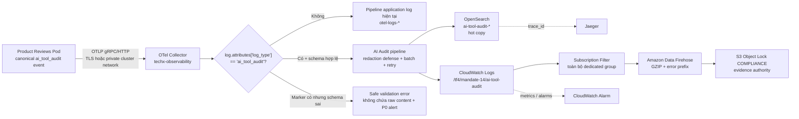

# Mandate 14 — Kế hoạch pipeline AI Audit Log tập trung

| Thuộc tính | Giá trị |
|---|---|
| Trạng thái | `Proposed` — tài liệu thiết kế, chưa phải runtime evidence |
| Source task | Task 68 — docs plan cấu hình pipeline gom log AI Audit |
| Mandate | Directive #14 — AI Eval Standard |
| Control | CDO-07 Auditability — AI/tool-call logging |
| Reporter / Verifier | CDO-07 (Audit) |
| Implementer | CDO-08 / Platform, qua Terraform và Helm |
| Data producer | AIO — `product-reviews` |
| Evidence location | `docs/audit/evidence/mandate-14-ai-audit/` |
| Ngày lập | 2026-07-23 |
| Ticket triển khai | [AUDIT-018](../tickets/AUDIT-018-MANDATE14-AI-AUDIT-LOG-PIPELINE.md) |

## 1. Quyết định thiết kế

Pipeline chuẩn được đề xuất:

```text
Product Reviews Pod
  -> OTLP logs
  -> OpenTelemetry Collector
  -> nhánh riêng khi log.attributes["log_type"] == "ai_tool_audit"
     -> OpenSearch: tra cứu nóng
     -> CloudWatch Logs: query, metric filter và cảnh báo
        -> CloudWatch Logs subscription
        -> Amazon Data Firehose
        -> S3 Object Lock COMPLIANCE: bằng chứng dài hạn
```

Chọn **OpenTelemetry Collector** làm collector chính vì ứng dụng đang phát Python
structured logs qua OTLP và collector hiện đã nhận log của `product-reviews`.
Không triển khai thêm Fluent Bit song song trong phạm vi này vì sẽ tạo hai đường
ingest và nguy cơ đếm trùng. Fluent Bit chỉ là phương án dự phòng nếu một task
khác chuyển nguồn log sang JSON stdout; khi đó vẫn phải áp dụng cùng contract
filter, retention và access control trong tài liệu này.

Ba storage có vai trò khác nhau:

1. **S3 Object Lock là evidence authority**: bản lưu WORM phục vụ kiểm toán.
2. **CloudWatch Logs là operational audit copy**: truy vấn gần thời gian thực,
   metric filter, alarm và nguồn stream sang S3.
3. **OpenSearch là hot searchable copy**: dashboard và điều tra nhanh. OpenSearch
   không phải evidence authority, đặc biệt khi security plugin chưa được bật.

Không lưu raw prompt, raw response, review content, user/session ID, confirmation
token hoặc tool payload trong bất kỳ storage nào.

## 2. Hiện trạng và khoảng trống

### 2.1. Phần đã có

- `product-reviews` đã có helper phát event `ai_tool_audit` với đúng tám trường.
- Helper không nhận raw prompt, response, user/session identity, confirmation
  token hoặc tool payload.
- Log của ứng dụng đang đi qua OTLP đến OTel Collector.
- OTel Collector hiện export toàn bộ application log vào index
  `otel-logs-yyyy-MM-dd` trên OpenSearch.
- Repo đã có mẫu Terraform CloudWatch Logs -> Firehose -> S3 Object Lock cho EKS
  control-plane audit log; có thể tái sử dụng pattern, không trộn schema dữ liệu.

Canonical payload:

| Trường | Quy tắc |
|---|---|
| `log_type` | Cố định `ai_tool_audit` |
| `trace_id` | W3C trace ID 32 ký tự hex để correlation với Jaeger |
| `surface` | `product_qa`, `copilot_search` hoặc `shopping_copilot` |
| `model_id` | Model ID; tool không dùng model ghi `not_applicable` |
| `tool_name` | Ví dụ `bedrock.converse`, `modify_cart` |
| `tool_input_redacted` | Cố định `{"redacted": true, "content_logged": false}` |
| `safety_decision` | `allow`, `block`, `refuse`, `provider_unavailable` |
| `confirmation_status` | `not_required`, `confirmed`, `rejected` |

OTel được phép bổ sung **transport envelope** như timestamp, severity,
`service.name`, pod UID và observed timestamp. Các field đó không làm thay đổi
canonical payload tám trường do ứng dụng sở hữu.

### 2.2. Khoảng trống phải xử lý

- Chưa có pipeline riêng nhận diện `log_type=ai_tool_audit`.
- Chưa có CloudWatch Log Group và S3 archive dành riêng cho AI audit.
- OpenSearch hiện dùng index application log chung và lifecycle 3 ngày.
- `otelLogsLifecycle` chỉ quản lý `otel-logs-*`, chưa có ISM policy cho
  `ai-tool-audit-*`.
- OpenSearch baseline đang có `DISABLE_SECURITY_PLUGIN=true`; vì vậy chưa thể
  chứng minh index-level least privilege.
- Chưa có audit evidence pack sau khi canonical logger và dedicated pipeline
  được deploy; đây là đầu ra bắt buộc trước khi sign-off.
- Collector exporter queue hiện là memory queue; chưa có bằng chứng phục hồi log
  audit sau collector restart.
- Permission set Audit hiện có một số quyền log/KMS scope rộng. Task này phải
  thêm policy resource-scoped cho AI audit, không mở rộng wildcard hiện hữu.

## 3. Phạm vi

### Trong phạm vi

- Log AI/tool-call do `product-reviews` phát trong `techx-tf4`.
- Routing tại OTel Collector trong `techx-observability`.
- Dedicated OpenSearch index, CloudWatch Log Group, Firehose và S3 bucket/prefix.
- Retention, encryption, IAM/SSO, OpenSearch access control và NetworkPolicy.
- Monitoring, failure handling, rollout, rollback và evidence nghiệm thu.

### Ngoài phạm vi

- Thay đổi tám trường canonical ở code ứng dụng.
- Lưu raw nội dung AI để debug hoặc tái huấn luyện.
- Thay thế Jaeger, Prometheus hoặc pipeline application log chung.
- Cho CDO-07 quyền apply Terraform/Helm hoặc quyền sửa/xóa log.
- Backfill snapshot trước ngày canonical logger được deploy.
- Dùng OpenSearch làm bản lưu bất biến.

## 4. Luồng dữ liệu mục tiêu



### Trình tự xử lý

1. Ứng dụng emit canonical event bằng `LoggingHandler`; OTel SDK giữ trace
   context.
2. Receiver `otlp` của collector nhận log.
3. `memory_limiter`, resource detection và Kubernetes attributes bổ sung
   transport metadata.
4. Filter kiểm tra thuộc tính log record
   `log.attributes["log_type"] == "ai_tool_audit"`.
5. Defense-in-depth loại bỏ các key bị cấm nếu một producer khác gửi nhầm.
6. Validator kiểm tra tám field, enum và redaction marker.
7. Event hợp lệ fan-out sang dedicated OpenSearch exporter và
   `awscloudwatchlogs` exporter.
8. Dedicated CloudWatch Log Group stream toàn bộ event sang Firehose. Không cần
   parse lại `log_type` tại đây vì Log Group chỉ nhận event đã được OTel route.
9. Firehose ghi GZIP object vào S3 prefix phân vùng theo UTC.

## 5. Filter và routing logic

### 5.1. Điều kiện chuẩn

Routing phải dựa trên **log record attribute**, không dựa duy nhất vào body text:

```text
is_ai_audit := log.attributes["log_type"] == "ai_tool_audit"
```

Body `ai_tool_audit` chỉ là consistency check. Không dùng regex chứa từ `audit`
hoặc tên logger vì dễ false-positive.

| Input | Kết quả |
|---|---|
| `log_type=ai_tool_audit`, đủ tám field và enum hợp lệ | Đi dedicated AI audit pipeline |
| `log_type=ai_tool_audit`, thiếu field/enum sai/redaction marker sai | Không đi general-only; sinh safe validation error và P0 alert |
| Body là `ai_tool_audit` nhưng thiếu/sai `log_type` | Coi là malformed audit candidate; alert |
| Không có `log_type=ai_tool_audit` | Đi application log pipeline hiện tại |
| Có forbidden content key | Xóa key trước exporter, đánh dấu validation failure, alert privacy |

Forbidden keys tối thiểu:

```text
prompt, query, response, review, reviews, messages, tool_input,
tool_payload, user_id, session_id, confirmation_token, system_prompt
```

Không ghi giá trị của forbidden key vào error log. Validation error chỉ được giữ
`trace_id`, `service.name`, tên rule vi phạm và timestamp.

### 5.2. Cấu hình OTel minh họa

Snippet dưới đây là design skeleton. Implementer phải pin image
`opentelemetry-collector-contrib` theo version/digest, chạy config validation và
`helm template` trước khi deploy. Filter Processor hiện dùng `log_conditions`;
mỗi condition khớp sẽ **drop** log khỏi pipeline tương ứng.

Skeleton chỉ minh họa hai nhánh exact-match. Nó chưa thay thế pipeline xử lý
malformed candidate và defense-in-depth redaction đã định nghĩa ở mục 5.1; hai
control đó phải được thêm vào cấu hình thật trước khi AC-01/AC-03 được ký.

```yaml
processors:
  filter/keep_ai_tool_audit:
    error_mode: propagate
    log_conditions:
      - 'log.attributes["log_type"] != "ai_tool_audit"'

  filter/drop_ai_tool_audit:
    error_mode: propagate
    log_conditions:
      - 'log.attributes["log_type"] == "ai_tool_audit"'

exporters:
  opensearch/ai_tool_audit:
    logs_index: ai-tool-audit
    logs_index_time_format: "yyyy-MM-dd"
    http:
      endpoint: https://opensearch:9200
    sending_queue:
      enabled: true
      queue_size: 2000
      storage: file_storage/ai_audit
    retry_on_failure:
      enabled: true
      initial_interval: 5s
      max_interval: 30s
      max_elapsed_time: 0

  awscloudwatchlogs/ai_tool_audit:
    region: us-east-1
    log_group_name: /tf4/mandate-14/ai-tool-audit
    log_stream_name: "otel-{ServiceName}-{InstanceId}"
    raw_log: false
    sending_queue:
      enabled: true
      queue_size: 2000
      storage: file_storage/ai_audit

service:
  pipelines:
    logs/general:
      receivers: [otlp]
      processors:
        [memory_limiter, resourcedetection, resource,
         filter/drop_ai_tool_audit, batch]
      exporters: [opensearch]

    logs/ai_tool_audit:
      receivers: [otlp]
      processors:
        [memory_limiter, resourcedetection, resource,
         filter/keep_ai_tool_audit, batch]
      exporters:
        [opensearch/ai_tool_audit, awscloudwatchlogs/ai_tool_audit]
```

Yêu cầu khi chuyển skeleton thành cấu hình thật:

- Pre-create Log Group bằng Terraform; collector không có
  `logs:CreateLogGroup`.
- `raw_log: false` để không làm mất attributes.
- `awscloudwatchlogs` exporter hiện có stability level alpha; bắt buộc pin/test
  version và giữ CloudWatch/S3 branch sau feature flag để rollback độc lập.
- File-backed queue phải dùng volume ghi được, có giới hạn dung lượng và alarm.
- Không đặt hai exporter dùng cùng một file queue ID nếu bản collector yêu cầu
  storage namespace riêng.
- Không đặt `error_mode: ignore` cho audit filter trong production. Với
  `propagate`, lỗi đánh giá condition phải tăng failure metric và P0 alert; config
  syntax phải bị chặn từ preflight, không để tới runtime.
- Trong 24 giờ shadow đầu tiên, giữ event audit trong cả index general và
  dedicated để đối soát. Chỉ bật `filter/drop_ai_tool_audit` ở general pipeline
  sau khi parity đạt 100%.

### 5.3. CloudWatch -> Firehose -> S3

Vì CloudWatch Log Group là dedicated, subscription dùng `filter_pattern = ""`
để lấy toàn bộ event trong group. Filter `log_type` chỉ tồn tại ở OTel; không
parse lần hai một envelope có thể thay đổi theo collector version.

Prefix S3:

```text
s3://tf4-ai-audit-logs-<account-id>/
  mandate-14/ai-tool-audit/
    year=YYYY/month=MM/day=DD/hour=HH/
```

Firehose:

- Buffer 1–5 MiB hoặc 60 giây, chọn theo kết quả cost/load test.
- Bật CloudWatch Logs decompression và message extraction, sau đó GZIP output;
  không double-compress subscription payload. Stream này chỉ nhận CloudWatch
  Logs subscription, không trộn Vended Logs/direct PUT.
- Error output riêng:
  `mandate-14/errors/year=.../error-type=.../`.
- Bật delivery error logging và alarm.
- Không dùng Lambda transform nếu chưa cần; giảm quyền, failure mode và chi phí.

CloudWatch Logs subscription payload được gzip/base64 khi giao sang Firehose.
Implementer phải bật CloudWatch Logs decompression và message extraction để
object S3 chứa các actual log messages ở định dạng query được, rồi lưu một sample
đã giải nén làm evidence.

## 6. Storage và retention policy

Baseline dưới đây áp dụng khi không có legal/regulatory policy dài hơn. Việc giảm
retention phải có ADR mới, Cost review, CDO-08 approval và CDO-07 sign-off.

| Storage | Resource đề xuất | Mục đích | Retention |
|---|---|---|---|
| OpenSearch | `ai-tool-audit-yyyy-MM-dd`, read alias `ai-tool-audit-read` | Hot search, dashboard, correlation | 14 ngày, ISM delete sau ngày 14 |
| CloudWatch Logs | `/tf4/mandate-14/ai-tool-audit` | Logs Insights, metric filter, alarm, nguồn Firehose | 30 ngày |
| S3 | `tf4-ai-audit-logs-<account-id>` / prefix `mandate-14/ai-tool-audit/` | Evidence authority | Tổng 365 ngày; Object Lock `COMPLIANCE` tối thiểu 90 ngày |
| Firehose error logs | `/aws/firehose/tf4-ai-audit-errors` | Điều tra lỗi delivery | 14 ngày |
| Safe validation errors | `/tf4/mandate-14/ai-tool-audit-validation` | Schema/privacy alert, không chứa content | 30 ngày |

S3 controls:

- Versioning bật.
- Object Lock bật ngay khi tạo bucket.
- Default retention `COMPLIANCE` 90 ngày.
- Block Public Access bật đủ bốn control.
- Encryption at rest bằng dedicated KMS CMK; bucket policy bắt buộc TLS và
  server-side encryption.
- Lifecycle đề xuất: Standard -> Standard-IA ngày 30 -> Glacier Flexible
  Retrieval ngày 90 -> expire ngày 365. Implementer phải kiểm tra minimum storage
  duration và cost trước khi apply.
- Lifecycle không được xóa object version khi Object Lock hoặc legal hold còn
  hiệu lực.
- CDO-07 không có `PutObjectRetention`, `PutObjectLegalHold`,
  `BypassGovernanceRetention`, `DeleteObject` hoặc `DeleteObjectVersion`.
- Legal hold, nếu có, do một break-glass compliance role riêng thực hiện qua
  change ticket; không cấp vào permission set Audit hằng ngày.

OpenSearch controls:

- Dedicated index template với `dynamic: strict` cho canonical attributes cần
  query; transport metadata được map có kiểm soát.
- ISM policy riêng, không dùng policy `otel-logs-retention` 3 ngày.
- Bật security plugin/FGAC hoặc chuyển sang managed OpenSearch có FGAC trước khi
  gọi đây là audit-readable store.
- Audit role chỉ `read`, `search`, `view_index_metadata` trên
  `ai-tool-audit-*`; không `index`, `write`, `delete`, `manage` hoặc `cluster_all`.
- NetworkPolicy chỉ cho OTel Collector ghi và Grafana/Audit access path đọc.
- Nếu security plugin vẫn tắt, giữ OpenSearch là convenience copy và đánh dấu
  acceptance cho OpenSearch access control là `BLOCKED`; CloudWatch/S3 vẫn là
  nguồn nghiệm thu.

## 7. IAM và access control

### 7.1. Ma trận least privilege

| Principal | Cho phép | Cấm rõ ràng / không cấp |
|---|---|---|
| `product-reviews` Pod Identity | Bedrock hiện hữu; gửi OTLP nội bộ | Không có quyền CloudWatch, Firehose, S3 AI audit |
| OTel Collector service account role | `logs:CreateLogStream`, `logs:DescribeLogStreams`, `logs:PutLogEvents` trên đúng Log Group/streams | Không `CreateLogGroup`, không đọc/query log, không S3/Firehose/KMS data access |
| CloudWatch Logs -> Firehose role | `firehose:PutRecord`, `firehose:PutRecordBatch` trên đúng delivery stream | Không stream khác; trust policy có `aws:SourceArn` và `aws:SourceAccount` |
| Firehose delivery role | `s3:PutObject`, multipart actions tối thiểu, bucket location trên đúng bucket/prefix; KMS encrypt trên đúng key | Không đọc/query log; không delete; không đổi retention/versioning/policy |
| CDO-07 SSO Audit role | CloudWatch read/query đúng Log Group; S3 `ListBucket` có prefix condition + `GetObject`/retention metadata đúng prefix; KMS decrypt đúng key; OpenSearch read/search đúng index | Không Put/Delete, không lifecycle/retention write, không Firehose write, không OpenSearch write |
| CDO-08 / Platform runtime role | Health/config metadata cần thiết | Không đọc raw AI audit object/log nếu không có incident approval |
| Terraform apply role | Tạo/cập nhật control-plane config qua reviewed IaC | Không `s3:GetObject`; không `DeleteObjectVersion`; không `BypassGovernanceRetention` |
| Break-glass compliance role | Chỉ legal hold/retention extension qua approved incident/change | Không nằm trong permission set hằng ngày; mọi assume-role được CloudTrail alert |

### 7.2. Resource scoping bắt buộc

- CloudWatch ARN:
  `arn:aws:logs:us-east-1:<account-id>:log-group:/tf4/mandate-14/ai-tool-audit:*`
- Firehose ARN:
  `arn:aws:firehose:us-east-1:<account-id>:deliverystream/tf4-ai-audit-logs`
- S3 bucket ARN và object prefix phải tách thành hai statement.
- `s3:ListBucket` phải có `s3:prefix` giới hạn
  `mandate-14/ai-tool-audit/*`.
- KMS policy giới hạn đúng role, `kms:ViaService` và encryption context khi
  service hỗ trợ.
- CMK của CloudWatch cho phép CloudWatch Logs service principal sử dụng key trên
  đúng Log Group; không cấp quyền KMS này cho collector.
- Các action buộc phải dùng `Resource: "*"` để hiển thị console phải nằm trong
  statement riêng và chỉ gồm action list/describe tối thiểu.

Không tạo IAM User hoặc access key dài hạn. CDO-07 truy cập qua SSO permission
set. Mọi policy change phải được IAM Access Analyzer validate và có negative
permission test.

## 8. Network và platform security

- `product-reviews` chỉ được egress đến OTel Collector port OTLP được dùng.
- OTel Collector chỉ egress đến OpenSearch và AWS Logs endpoint; ưu tiên VPC
  endpoint nếu đã có, nếu không dùng NAT hiện hữu và ghi nhận cost.
- CloudWatch, Firehose và S3 bucket policy phải chặn insecure transport.
- Không expose OpenSearch service trực tiếp ra Internet.
- Audit truy cập OpenSearch/Grafana qua private access path hiện hữu và identity
  authentication; không anonymous admin.
- Collector service account không cần Kubernetes API token nếu Kubernetes
  attributes được cung cấp bằng cơ chế khác; nếu bắt buộc cần token thì RBAC chỉ
  `get/list/watch` đúng resource metadata.

## 9. Reliability, delivery semantics và monitoring

Pipeline được thiết kế **at-least-once**. Retry có thể tạo duplicate; S3 giữ
nguyên bản giao, query layer phải chịu được duplicate. Không thêm `event_id` vào
canonical payload trong task này. Khi đếm, dùng CloudWatch log event ID hoặc
transport timestamp + trace/surface/tool làm correlation key và ghi rõ giới hạn
dedupe.

Controls:

- Persistent sending queue cho hai dedicated exporters.
- Retry không giới hạn thời gian tại collector nhưng bị giới hạn bởi dung lượng
  queue; queue đầy phải alarm trước khi drop.
- Collector config/rollout phải có readiness probe và PodDisruptionBudget phù
  hợp với mode chạy.
- Theo dõi receiver accepted/refused/failed, exporter sent/send_failed, queue
  size/capacity và Firehose delivery success/failure.
- Reconcile số event theo cửa sổ 5 phút giữa application audit counter,
  CloudWatch và S3 sau thời gian buffer.

Alarm tối thiểu:

| Alarm | Điều kiện đề xuất | Severity |
|---|---|---|
| Collector audit exporter failures | `send_failed_log_records > 0` trong 5 phút | P0 |
| Persistent queue pressure | queue >= 80% trong 5 phút | P1 |
| Silent pipeline | Có AI/tool activity nhưng 15 phút không có audit event | P0 |
| Schema/privacy validation | Bất kỳ event malformed hoặc forbidden key | P0 |
| Firehose delivery failure | DeliveryToS3 failure/throttle > 0 | P0 |
| S3 delivery lag | Event CloudWatch chưa xuất hiện ở S3 sau 10 phút | P1 |
| OpenSearch rejected write | Bất kỳ 4xx/5xx/rejected document | P1 |

Delivery objectives để nghiệm thu:

- 100% event trong controlled test xuất hiện ở CloudWatch và S3.
- 100% event hợp lệ xuất hiện ở dedicated OpenSearch khi OpenSearch branch bật.
- p95 đến CloudWatch/OpenSearch <= 2 phút.
- p95 đến S3 <= 10 phút.
- Không có forbidden content trong ba sink.

Các mục tiêu trên là acceptance cho controlled test, không tự động được diễn giải
thành production SLO dài hạn cho tới khi có ít nhất 7 ngày metric.

## 10. Kế hoạch triển khai

### Giai đoạn 0 — Review và preflight

1. CDO-07 duyệt schema, retention và negative access tests.
2. CDO-08 duyệt IAM, KMS, NetworkPolicy và OpenSearch security.
3. CDO-04 review cost dựa trên event rate/size thực tế, không dùng ước lượng EKS
   control-plane log.
4. Pin OTel Collector image version/digest và xác nhận distribution chứa
   `filter`, `opensearch`, `awscloudwatchlogs` và `file_storage`.
5. Chạy config validation, Helm schema validation và render manifests.

### Giai đoạn 1 — Storage và IAM trước

1. Tạo KMS key, S3 Object Lock bucket, lifecycle và bucket policy.
2. Tạo Firehose, error log group và service roles.
3. Tạo dedicated CloudWatch Log Group 30 ngày và subscription.
4. Tạo OpenSearch index template, ISM policy, role và NetworkPolicy.
5. Tạo OTel Collector Pod Identity/IRSA role resource-scoped.
6. Tạo/attach Audit read-only policy nhưng chưa nghiệm thu trước khi data tồn tại.

### Giai đoạn 2 — Shadow routing

1. Thêm audit pipeline vào collector.
2. Trong 24 giờ đầu, giữ AI audit ở cả `otel-logs-*` và
   `ai-tool-audit-*`; đồng thời gửi CloudWatch/S3.
3. Phát test matrix gồm allow, block/refuse, provider unavailable, confirmation
   rejected và confirmation confirmed trong môi trường kiểm soát.
4. Đối soát event count và exact fields ở ba sink.

### Giai đoạn 3 — Cutover

1. Khi parity 100%, bật filter bỏ AI audit khỏi general OpenSearch pipeline.
2. Giữ dedicated pipeline.
3. Chụp retention, IAM, negative access và S3 Object Lock evidence.
4. Tạo evidence pack tại `docs/audit/evidence/mandate-14-ai-audit/` và cập nhật
   ticket.

### Giai đoạn 4 — Theo dõi sau cutover

- Theo dõi ít nhất 24 giờ: queue, exporter failure, Firehose error, S3 lag.
- CDO-07 query độc lập bằng SSO read-only.
- Chỉ chuyển ticket sang Done sau khi evidence đầy đủ và không có P0/P1 mở.

## 11. Rollback

Rollback không được xóa log đã ghi:

1. Nếu dedicated exporter lỗi, revert collector về commit trước nhưng tạm giữ AI
   audit trong general OpenSearch pipeline.
2. Không xóa CloudWatch Log Group, Firehose hoặc S3 bucket.
3. Dừng subscription/export mới nếu cần, giữ object theo retention.
4. Không chạy `terraform destroy` với S3 Object Lock bucket.
5. Nếu OpenSearch mapping lỗi, tạo index generation mới và đổi alias; không sửa
   hoặc xóa evidence trên S3.
6. Mở incident nếu mất event, queue overflow hoặc có content leak; lưu exact
   impact window và trace IDs, không copy raw content vào ticket.

## 12. Kế hoạch nghiệm thu và evidence

### 12.1. Functional routing

- Event có `log_type=ai_tool_audit` xuất hiện trong dedicated OpenSearch,
  CloudWatch và S3.
- Event application thường không xuất hiện trong AI audit storage.
- Malformed audit candidate tạo safe alert.
- Exact eight-field payload và bounded enum được kiểm tra.
- `trace_id` query được trace tương ứng trong Jaeger.

### 12.2. Privacy

Tìm trên cả ba sink và chứng minh không có:

```text
prompt, response, review text, system prompt, user_id, session_id,
confirmation_token, raw tool input
```

Evidence không được chụp raw customer data. Chỉ dùng synthetic test IDs.

### 12.3. Retention và integrity

Lưu output:

```bash
aws logs describe-log-groups \
  --log-group-name-prefix /tf4/mandate-14/ai-tool-audit

aws s3api get-bucket-versioning \
  --bucket tf4-ai-audit-logs-<account-id>

aws s3api get-object-lock-configuration \
  --bucket tf4-ai-audit-logs-<account-id>

aws s3api get-bucket-encryption \
  --bucket tf4-ai-audit-logs-<account-id>

aws s3api get-public-access-block \
  --bucket tf4-ai-audit-logs-<account-id>

aws s3api head-object \
  --bucket tf4-ai-audit-logs-<account-id> \
  --key <synthetic-test-object-key>
```

`head-object` phải trả `ObjectLockMode=COMPLIANCE` và `ObjectLockRetainUntilDate`
phù hợp. Test delete version bằng role không được phép phải trả `AccessDenied`.

### 12.4. Least privilege

Negative tests bắt buộc:

- Audit role query/read được đúng AI audit resources.
- Audit role không ghi/xóa CloudWatch, S3 hoặc OpenSearch.
- Collector role không đọc CloudWatch/S3 và không ghi log group khác.
- Firehose role không đọc object và không ghi prefix khác.
- Platform runtime role không đọc audit data.
- Permission set không chứa `s3:*`, `logs:*`, `es:*`, `kms:*` hoặc
  `Resource: "*"` ngoài action list/describe bắt buộc, có justification.

### 12.5. Failure recovery

Trong staging:

1. Tạm làm một exporter không reachable.
2. Phát synthetic audit events.
3. Xác nhận event nằm trong persistent queue và alarm fire.
4. Khôi phục exporter.
5. Xác nhận đủ event được giao; ghi duplicate nếu có.
6. Restart collector khi queue có dữ liệu và chứng minh queue phục hồi.

## 13. Definition of Done

- [ ] OTel config được pin version/digest, validate và deploy qua Helm.
- [ ] Filter route bằng `log.attributes["log_type"] == "ai_tool_audit"`.
- [ ] OpenSearch index/ISM riêng hoạt động; security gap được đóng hoặc ghi rõ
      OpenSearch không phải evidence authority.
- [ ] CloudWatch Log Group retention 30 ngày.
- [ ] Firehose giao thành công vào S3 prefix đúng.
- [ ] S3 versioning, encryption, Public Access Block và Object Lock
      `COMPLIANCE` 90 ngày được chứng minh.
- [ ] S3 lifecycle giữ tổng 365 ngày.
- [ ] Least-privilege policy và sáu negative tests đạt.
- [ ] Controlled test đạt 100% delivery, không có forbidden content.
- [ ] Delivery lag đạt mục tiêu nghiệm thu.
- [ ] Runtime evidence có sample canonical sau deploy và trace correlation.
- [ ] CDO-08 xác nhận triển khai; CDO-07 ký nghiệm thu độc lập.
- [ ] Jira Mandate 14 liên kết PR/commit, plan, ticket và evidence.

## 14. Rủi ro và quyết định còn cần duyệt

| Rủi ro / quyết định | Mặc định trong plan | Owner duyệt |
|---|---|---|
| OpenSearch security plugin đang tắt | Không coi OpenSearch là evidence authority | CDO-08 + CDO-07 |
| OTel component/version compatibility | Pin digest và config validate trước deploy | CDO-08 |
| Persistent queue volume | Bắt buộc có storage và capacity alarm | CDO-08 |
| Retention 14/30/365 ngày | Dùng baseline trong tài liệu | CDO-07 + CDO-04 |
| KMS request/storage cost | Đo event rate/size và review trước apply | CDO-04 |
| Duplicate at-least-once | Chấp nhận, document query/dedupe semantics | AIO + CDO-07 |
| Legal hold owner | Break-glass compliance role, không phải daily Audit role | Lead + CDO-08 |

## 15. Tham chiếu

Repo:

- [Canonical audit logger](../../../techx-corp-platform/src/product-reviews/audit_logging.py)
- [OTel Collector values](../../../techx-corp-chart/values.yaml)
- [Observability deployment values](../../../deploy/values-observability.yaml)
- [EKS audit Firehose pattern](../../../infra/terraform/eks-audit-firehose.tf)
- [ADR-001 Separation of Duties](../adr/001-audit-platform-separation.md)
- [ADR-009 OpenSearch security gap](../adr/009-grafana-anonymous-admin-opensearch-security-disabled.md)

Primary documentation:

- [OpenTelemetry Filter Processor](https://github.com/open-telemetry/opentelemetry-collector-contrib/blob/main/processor/filterprocessor/README.md)
- [OpenTelemetry AWS CloudWatch Logs Exporter](https://github.com/open-telemetry/opentelemetry-collector-contrib/blob/main/exporter/awscloudwatchlogsexporter/README.md)
- [CloudWatch Logs subscription filters](https://docs.aws.amazon.com/AmazonCloudWatch/latest/logs/SubscriptionFilters.html)
- [Firehose CloudWatch Logs decompression](https://docs.aws.amazon.com/firehose/latest/dev/writing-with-cloudwatch-logs-decompression.html)
- [Firehose message extraction](https://docs.aws.amazon.com/firehose/latest/dev/Message_extraction.html)
- [S3 Object Lock](https://docs.aws.amazon.com/AmazonS3/latest/userguide/object-lock.html)
