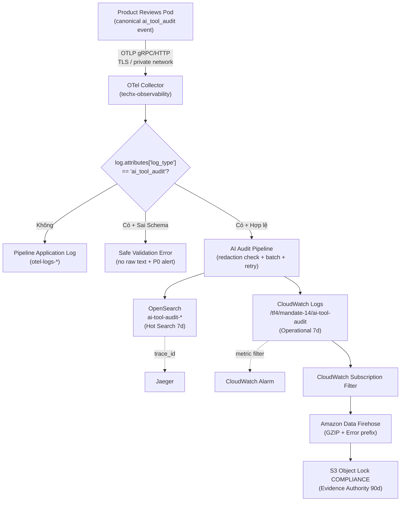

# Mandate 14 — Kế hoạch pipeline AI Audit Log tập trung

| Thuộc tính | Giá trị |
|---|---|
| Trạng thái | `Proposed` — tài liệu thiết kế, chưa phải runtime evidence |
| Source task | Task 68 — docs plan cấu hình pipeline gom log AI Audit |
| Mandate | Directive #14 — AI Eval Standard |
| Control | CDO-07 Auditability — AI/tool-call logging |
| Reporter / Verifier | CDO-07 (Audit) - Nguyễn Phú Triệu / Bùi Thành Nghĩa |
| Reviewer | CDO-04 / Cost and infra |
| Data producer | AIO — `product-reviews` |
| Evidence location | `docs/audit/evidence/mandate-14-ai-audit/` |
| Ngày lập | 2026-07-23 |
| Ngày cập nhật | 2026-07-25 (Đã tinh gọn theo /ponytail) |
| Ticket triển khai | [AUDIT-018](../tickets/AUDIT-018-MANDATE14-AI-AUDIT-LOG-PIPELINE.md) |

---

## 1. Tổng quan & Giá trị mang lại (Executive Summary & Business Value)

### 1.1. Mục tiêu
Pipeline AI Audit Log tập trung được thiết kế nhằm đáp ứng yêu cầu tuân thủ **Mandate 14 (AI Eval Standard)** và **CDO-07 (Auditability)**. Hệ thống đảm bảo ghi nhận minh bạch mọi hoạt động gọi AI/Tool trong ứng dụng (`product-reviews`), cung cấp bằng chứng bất biến (WORM compliance) phục vụ kiểm toán mà **không gây rủi ro rò rỉ dữ liệu (PII)** hay **bùng nổ chi phí CloudWatch**.

> [!IMPORTANT]
> **Vì sao cần Strict 8-Field Canonical Schema (Redacted)?**
> Thay vì lưu toàn bộ raw prompt, response hay tool payload (vốn chứa thông tin nhạy cảm của khách hàng và dung lượng cực lớn), ứng dụng phát duy nhất **8 trường metadata chuẩn hóa**. Điều này mang lại 2 lợi ích cốt lõi:
> 1. **Bảo mật tuyệt đối**: Không bao giờ ghi nhận raw text, user/session ID, confirmation token hay tool input.
> 2. **Tối ưu dữ liệu**: Dung lượng trung bình 1 log record giảm từ ~50 KB xuống chỉ còn **~0.5 KB (giảm ~99%)**.

---

## 2. Ước tính Chi phí & Lý do Cấu hình (Cost Model & Optimization)

Tài liệu đưa phần **Tối ưu Chi phí** lên trước để các team (CDO-04, CDO-07, CDO-08) đánh giá ngay hiệu quả đầu tư (ROI) của kiến trúc.

### 2.1. Bảng dự toán chi phí chi tiết (AWS us-east-1 — T7/2026)

| Thành phần AWS | Đơn giá AWS | Kịch bản A (10k calls/ngày) | Kịch bản B (100k calls/ngày) | Kịch bản C (1M calls/ngày - Peak) |
|---|---|---|---|---|
| **CloudWatch Logs Ingestion** | $0.50 / GB ingested | $0.08 / tháng | $0.75 / tháng | $7.50 / tháng |
| **CloudWatch Logs Storage** | $0.03 / GB / tháng (retention 7d) | < $0.01 / tháng | $0.01 / tháng | $0.10 / tháng |
| **Amazon Data Firehose Ingestion** | $0.029 / GB ingested | < $0.01 / tháng | $0.04 / tháng | $0.44 / tháng |
| **S3 Storage (COMPLIANCE 90d)** | $0.023 / GB / tháng (GZIP nén 4x) | $0.01 / tháng | $0.03 / tháng | $0.26 / tháng |
| **S3 PUT Requests** | $0.005 / 1k requests (buffer 60s) | $0.22 / tháng | $0.22 / tháng | $0.22 / tháng |
| **OpenSearch Storage (gp3)** | $0.08 / GB / tháng (retention 7d) | $0.02 / tháng | $0.16 / tháng | $1.60 / tháng |
| **KMS CMK Fee** | **$0.00** (Dùng SSE-S3 & AWS Key) | **$0.00** | **$0.00** | **$0.00** |
| **TỔNG CHI PHÍ HẰNG THÁNG** | | **~ $0.34 / tháng** | **~ $1.21 / tháng** | **~ $10.12 / tháng** |

---

### 2.2. Vì sao kiến trúc này triệt tiêu rủi ro bùng nổ chi phí CloudWatch Logs?

> [!TIP]
> **Giải mã 4 lý do giúp pipeline vận hành với chi phí siêu rẻ (~$1.21/tháng ở tải 100k events/ngày):**
> 
> 1. **Loại bỏ Raw Content ở ứng dụng**: Một lượt gọi LLM chứa history có thể tốn 50 KB. Nhờ schema 8 trường (~0.5 KB), kích thước Log Ingestion giảm **100 lần**, tránh bẫy chi phí CloudWatch Ingestion hàng trăm USD/tháng.
> 2. **Chỉ giữ 7 ngày tại CloudWatch Logs**: Thay vì để `Never Expire` (tốn $0.03/GB-tháng tích lũy), CloudWatch chỉ lưu 7 ngày để query/alarm. Toàn bộ log cũ hơn được Firehose nén GZIP và chuyển sang S3 Standard ($0.023/GB-tháng, nén 4x $\rightarrow$ tổng rẻ hơn ~70%).
> 3. **OTel Memory Filtering tại Pod**: Collector lọc log ngay ở bộ nhớ DaemonSet (`log.attributes["log_type"] == "ai_tool_audit"`). 100% General application logs chỉ đi OpenSearch, **không đi CloudWatch Logs**.
> 4. **Dùng SSE-S3 (`AES256`) thay vì KMS CMK**: Tránh phí cố định $1.00/tháng/key và phí KMS API call ($0.03/10k calls) mà vẫn đảm bảo mã hóa dữ liệu tĩnh theo tiêu chuẩn AWS.

---

## 3. Kiến trúc & Luồng Dữ liệu (Target Architecture & Storage Roles)

### 3.1. Sơ đồ Luồng Dữ liệu


```mermaid
flowchart TD
    A["Product Reviews Pod<br/>(canonical ai_tool_audit event)"] -->|"OTLP gRPC/HTTP<br/>TLS / private network"| B["OTel Collector<br/>(techx-observability)"]
    
    B --> C{"log.attributes['log_type']<br/>== 'ai_tool_audit'?"}
    
    C -->|"Không"| D["Pipeline Application Log<br/>(otel-logs-*)"]
    C -->|"Có + Sai Schema"| Q["Safe Validation Error<br/>(no raw text + P0 alert)"]
    C -->|"Có + Hợp lệ"| E["AI Audit Pipeline<br/>(redaction check + batch + retry)"]
    
    E --> F["OpenSearch<br/>ai-tool-audit-*<br/>(Hot Search 7d)"]
    E --> G["CloudWatch Logs<br/>/tf4/mandate-14/ai-tool-audit<br/>(Operational 7d)"]
    
    F -. "trace_id" .-> K["Jaeger"]
    G -. "metric filter" .-> L["CloudWatch Alarm"]
    
    G --> H["CloudWatch Subscription Filter"]
    H --> I["Amazon Data Firehose<br/>(GZIP + Error prefix)"]
    I --> J["S3 Object Lock COMPLIANCE<br/>(Evidence Authority 90d)"]
```

---

### 3.2. Vì sao cần 3 tầng lưu trữ (Storage Roles)?

> [!NOTE]
> **Giải thích vai trò 3 tầng lưu trữ:**
> 
> 1. **S3 Object Lock (Evidence Authority)**: Lưu dạng WORM (Write Once, Read Many) với thời hạn **90 ngày (`COMPLIANCE` mode)**. Đây là bản lưu pháp lý chống sửa/xóa phục vụ kiểm toán độc lập.
> 2. **CloudWatch Logs (Operational Audit Copy)**: Lưu trữ **7 ngày** để hỗ trợ truy vấn nhanh qua Logs Insights, tạo Metric Filter và bắn Cảnh báo (Alarm) khi có bất thường. Đồng thời đóng vai trò nguồn stream sang Firehose.
> 3. **OpenSearch (Hot Searchable Copy)**: Lưu trữ **7 ngày** để trực quan hóa trên Grafana/OpenSearch Dashboards và điều tra sự cố theo `trace_id`. OpenSearch là bản convenience, không dùng làm bằng chứng kiểm toán pháp lý.

---

## 4. Cấu hình Kĩ thuật & Processing Logic (Technical Specification)

### 4.1. Canonical Payload 8 Trường

Mọi event AI Audit bắt buộc tuân theo đúng 8 trường chuẩn:

| Trường | Quy tắc | Giá trị hợp lệ / Ví dụ |
|---|---|---|
| `log_type` | Cố định | `ai_tool_audit` |
| `trace_id` | W3C Hex 32 ký tự | Correlation với Jaeger trace |
| `surface` | Bounded enum | `product_qa`, `copilot_search`, `shopping_copilot` |
| `model_id` | Model ID | Ví dụ `anthropic.claude-3-5-sonnet` hoặc `not_applicable` |
| `tool_name` | Tên tool gọi | Ví dụ `bedrock.converse`, `modify_cart` |
| `tool_input_redacted` | Cố định | `{"redacted": true, "content_logged": false}` |
| `safety_decision` | Bounded enum | `allow`, `block`, `refuse`, `provider_unavailable` |
| `confirmation_status` | Bounded enum | `not_required`, `confirmed`, `rejected` |

---

### 4.2. Routing tại OpenTelemetry Collector

> [!NOTE]
> **Vì sao dùng OpenTelemetry Collector mà không dùng FluentBit?**
> Uống ứng dụng `product-reviews` hiện đã tích hợp OTel SDK phát OTLP logs trực tiếp sang OTel Collector DaemonSet sẵn có. Sử dụng OTel Collector giúp tái sử dụng hạ tầng hiện tại, tránh cài đặt thêm Agent (FluentBit) gây tốn tài nguyên Node và nguy cơ đếm trùng log.

**OTel Config Skeleton (Rút gọn & Chú thích):**

```yaml
processors:
  # Tách luồng: Chỉ cho giữ lại log ai_tool_audit
  filter/keep_ai_tool_audit:
    error_mode: propagate
    log_conditions:
      - 'log.attributes["log_type"] != "ai_tool_audit"'

  # Tách luồng: Loại bỏ ai_tool_audit khỏi general logs
  filter/drop_ai_tool_audit:
    error_mode: propagate
    log_conditions:
      - 'log.attributes["log_type"] == "ai_tool_audit"'

exporters:
  opensearch/ai_tool_audit:
    logs_index: ai-tool-audit
    logs_index_time_format: "yyyy-MM-dd"
    http:
      endpoint: https://opensearch:9200
    sending_queue:
      enabled: true
      queue_size: 2000

  awscloudwatchlogs/ai_tool_audit:
    region: us-east-1
    log_group_name: /tf4/mandate-14/ai-tool-audit
    log_stream_name: "otel-{ServiceName}-{InstanceId}"
    raw_log: false # Giữ nguyên thuộc tính metadata
    sending_queue:
      enabled: true
      queue_size: 2000

service:
  pipelines:
    logs/general:
      receivers: [otlp]
      processors: [memory_limiter, resourcedetection, filter/drop_ai_tool_audit, batch]
      exporters: [opensearch]

    logs/ai_tool_audit:
      receivers: [otlp]
      processors: [memory_limiter, resourcedetection, filter/keep_ai_tool_audit, batch]
      exporters: [opensearch/ai_tool_audit, awscloudwatchlogs/ai_tool_audit]
```

---

### 4.3. Pipeline CloudWatch -> Firehose -> S3

1. **CloudWatch Log Group**: `/tf4/mandate-14/ai-tool-audit` (Retention: 7 ngày).
2. **Subscription Filter**: Dùng `filter_pattern = ""` (gửi 100% log của group sang Firehose vì group này chỉ chứa log AI audit đã qua OTel filter).
3. **Data Firehose**:
   - Buffer: 1–5 MB hoặc 60 giây.
   - Bật CloudWatch Logs decompression và GZIP output.
   - S3 Prefix: `mandate-14/ai-tool-audit/year=YYYY/month=MM/day=DD/hour=HH/`.
   - Error Prefix: `mandate-14/errors/year=YYYY/error-type=!{firehose:error-output-type}/`.

---

## 5. Phân quyền & Bảo mật IAM (Security & IAM Least Privilege)

### 5.1. Ma trận Phân quyền Least Privilege

| Vai trò (Principal) | Quyền được cấp (Allow) | Quyền bị CẤM (Explicit Deny / No Access) |
|---|---|---|
| **Product Reviews Pod** | Gửi OTLP logs nội bộ sang OTel Collector | Không truy cập CloudWatch, Firehose, S3 Audit |
| **OTel Collector IAM Role** | `logs:CreateLogStream`, `logs:DescribeLogStreams`, `logs:PutLogEvents` trên đúng Log Group | Không `CreateLogGroup`, không đọc log, không S3/Firehose access |
| **CWL to Firehose Role** | `firehose:PutRecord`, `firehose:PutRecordBatch` trên đúng Firehose Stream | Không stream khác; trust policy bắt buộc `aws:SourceArn` |
| **Firehose to S3 Role** | `s3:PutObject`, multipart upload trên đúng S3 Bucket/Prefix | Không đọc/xóa log; không KMS; không sửa retention/versioning |
| **CDO-07 SSO Audit Role** | CloudWatch Logs Read/Query (`/tf4/mandate-14/ai-tool-audit`); S3 Read (`mandate-14/ai-tool-audit/*`); OpenSearch Read | Không ghi/xóa log; không KMS; không đổi retention/lifecycle |

---

### 5.2. Nguyên tắc Scoping & Mã hóa

> [!IMPORTANT]
> **Vì sao chọn SSE-S3 (`AES256`) thay vì KMS Customer Managed Key (CMK)?**
> - **Chi phí**: KMS CMK tốn $1.00/tháng/key cố định + phí API requests. SSE-S3 là hoàn toàn **miễn phí ($0.00)**.
> - **Bảo mật**: SSE-S3 đáp ứng 100% tiêu chuẩn mã hóa dữ liệu tĩnh (Encryption at Rest) bằng thuật toán AES-256. Do log AI audit đã được redact 100% thông tin nhạy cảm ở ứng dụng, việc dùng KMS CMK riêng là **thừa chi phí và phức tạp hóa phân quyền (over-engineering)**.

---

## 6. Retention & Quản lý Lưu trữ (Storage & Retention Policy)

| Storage Sink | Target Resource | Retention Policy | Ghi chú & Controls |
|---|---|---|---|
| **S3 Bucket** | `tf4-ai-audit-logs-<account-id>` | **90 ngày** | S3 Object Lock `COMPLIANCE` 90d, SSE-S3 `AES256`, Versioning `Enabled`, Block Public Access `All` |
| **CloudWatch Logs** | `/tf4/mandate-14/ai-tool-audit` | **7 ngày** | Retention tự động xóa sau 7d, AWS-managed key encryption |
| **OpenSearch** | `ai-tool-audit-yyyy-MM-dd` | **7 ngày** | OpenSearch ISM xóa index sau 7d, Read-only access alias |
| **Firehose Errors** | `/aws/firehose/tf4-ai-audit-errors` | **7 ngày** | Phục vụ điều tra lỗi delivery |

---

## 7. Độ tin cậy & Giám sát (Reliability, Alarms & Semantics)

### 7.1. Cơ chế Vận hành
- **Semantics**: At-least-once delivery. S3 chấp nhận trùng lặp log trong trường hợp OTel retry; layer query tự chịu trách nhiệm deduplicate.
- **Memory Queue**: Collector trang bị memory queue `queue_size: 2000` cho từng exporter. Ngưỡng cảnh báo đặt ở **80% capacity** để kịp thời xử lý trước khi drop event.

### 7.2. Bảng Cảnh báo Quan trọng (Alarms)

| Tên Alarm | Điều kiện kích hoạt | Mức độ | Hành động |
|---|---|---|---|
| `CollectorAuditExportFailure` | `send_failed_log_records > 0` trong 5 phút | **P0** | Kiểm tra kết nối CloudWatch/OpenSearch |
| `MemoryQueuePressure` | Queue capacity >= 80% trong 5 phút | **P1** | Kiểm tra bottleneck downstream |
| `SilentAuditPipeline` | Có AI activity nhưng 15 phút không có audit log | **P0** | Kiểm tra OTel filter / application logging |
| `ValidationOrPrivacyFailure` | Phát hiện malformed log hoặc forbidden key | **P0** | Ngăn chặn lọt PII & kiểm tra code app |
| `FirehoseDeliveryFailure` | DeliveryToS3 failure > 0 | **P0** | Kiểm tra IAM Role / S3 bucket policy |

---

## 8. Lộ trình Triển khai & Nghiệm thu (Rollout, Evidence & DoD)

### 8.1. Các Giai đoạn Triển khai (Phases)

1. **Giai đoạn 0 (Preflight & Review)**: CDO-07/08/04 duyệt schema, IAM, cost model. Pin digest OTel Collector image.
2. **Giai đoạn 1 (Infra & Storage First)**: Tạo S3 Object Lock bucket, Firehose, IAM Roles, CloudWatch Log Group và OpenSearch Index Template bằng Terraform.
3. **Giai đoạn 2 (Shadow Routing)**: Bật OTel Collector routing. Gửi log song song vào cả application index và dedicated pipeline trong 24h để kiểm tra đối soát.
4. **Giai đoạn 3 (Cutover & Sign-off)**: Bật filter loại bỏ AI Audit khỏi general log pipeline. Chạy lệnh kiểm tra evidence và chuyển ticket sang Done.

---

### 8.2. Lệnh AWS CLI Kiểm chứng Evidence

Để hoàn tất nghiệm thu, chạy các lệnh sau và lưu output vào `docs/audit/evidence/mandate-14-ai-audit/`:

```bash
# 1. Kiểm tra CloudWatch Log Group Retention (Phải = 7 ngày)
aws logs describe-log-groups --log-group-name-prefix /tf4/mandate-14/ai-tool-audit

# 2. Kiểm tra S3 Object Lock Configuration (Phải = COMPLIANCE, 90 days)
aws s3api get-object-lock-configuration --bucket tf4-ai-audit-logs-<account-id>

# 3. Kiểm tra S3 Bucket Encryption (Phải = AES256)
aws s3api get-bucket-encryption --bucket tf4-ai-audit-logs-<account-id>

# 4. Kiểm tra S3 Public Access Block (Phải Block All = true)
aws s3api get-public-access-block --bucket tf4-ai-audit-logs-<account-id>

# 5. Kiểm tra chi tiết Object Compliance Status
aws s3api head-object --bucket tf4-ai-audit-logs-<account-id> --key mandate-14/ai-tool-audit/<sample-key>
```

---

### 8.3. Definition of Done (DoD Checklist)

- [ ] OTel Collector routing thành công log `log_type == "ai_tool_audit"`.
- [ ] Log tại S3 có S3 Object Lock `COMPLIANCE` **90 ngày**.
- [ ] CloudWatch Log Group và OpenSearch Index có retention **7 ngày**.
- [ ] Dùng mã hóa mặc định SSE-S3 (`AES256`), không phát sinh chi phí KMS CMK.
- [ ] Bật Cảnh báo (Alarm) P0/P1 cho Queue 80% và Delivery Failure.
- [ ] Thử nghiệm Negative IAM Access Tests (Audit Role không thể xóa/sửa log).
- [ ] Đạt 100% Delivery Test trong môi trường Staging, không chứa forbidden keys (PII/raw prompt).
- [ ] Chạy lệnh AWS CLI lấy bằng chứng (Evidence) lưu vào repo.
- [ ] CDO-07 ký nghiệm thu chính thức.

---

## 9. Ma trận Rủi ro & Quyết định (Risk Matrix)

| Rủi ro / Phụ thuộc | Phương án xử lý mặc định | Quyền duyệt |
|---|---|---|
| OpenSearch security plugin bị tắt | Giữ OpenSearch là convenience search copy; S3 mới là Evidence Authority | CDO-08 + CDO-07 |
| Pod Identity/IRSA mới cho OTel Collector | Canary rollout và xác nhận không ảnh hưởng telemetry hiện hữu | CDO-08 |
| Mất log trong queue khi Collector restart | Chấp nhận rủi ro ở giai đoạn 1 với memory queue 2000; theo dõi metric trước khi cân nhắc Persistent Queue | CDO-08 + CDO-07 |
| Chi phí / Retention 7d & 90d | Áp dụng đúng mốc 7d CloudWatch / 90d S3 COMPLIANCE | CDO-04 + CDO-07 |

---

## 10. Tài liệu Tham chiếu (References)

- [Canonical Audit Logger Helper](../../../techx-corp-platform/src/product-reviews/audit_logging.py)
- [EKS Audit Firehose Terraform Pattern](../../../infra/terraform/eks-audit-firehose.tf)
- [ADR-001 Separation of Duties](../adr/001-audit-platform-separation.md)
- [ADR-009 OpenSearch Security Gap](../adr/009-grafana-anonymous-admin-opensearch-security-disabled.md)
- [AWS S3 Object Lock Guide](https://docs.aws.amazon.com/AmazonS3/latest/userguide/object-lock.html)
