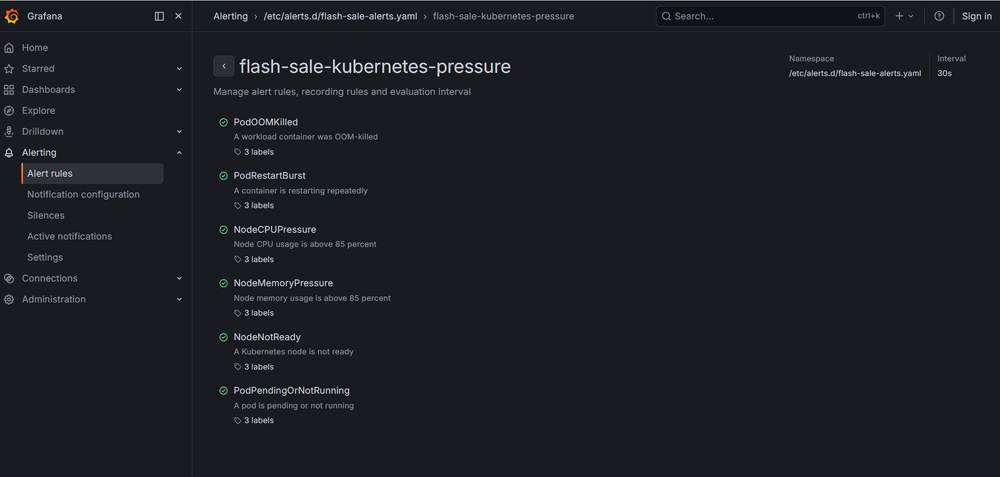

# INCIDENT REPORT — Checkout/Payment Degradation
## 2026-07-14 | 14:15–14:30 +07:00

| Field | Value |
|---|---|
| Incident Window | 2026-07-14T14:15–14:30 +07:00 (07:15–07:30 UTC) |
| Symptom | User không thanh toán được |
| Reporter | TF4 team chat (14:42 +07:00) |
| Investigated by | CDO07 — Hoàng Kim Hùng (TF4-AuditReadOnlyAndAnalyze) |
| Query time | 2026-07-14T15:39:43+07:00 |
| Severity | P1 (payment unavailable) |
| Status |  Investigation complete — Evidence documented |

---

## 1. Tóm tắt sự kiện

Trong window 14:15–14:30 +07, user báo không thanh toán được. CDO07 điều tra độc lập qua 3 nguồn: CloudTrail (AWS API audit), kubectl (K8s state/events), và Grafana/Prometheus (metrics/alerting).

**Kết quả điều tra:**
- HPA **tự động scale** frontend 1→3 replica khi CPU đạt 127% — confirmed qua K8s events
- Grafana/Prometheus **không có data** cho window 14:00–15:00 ngày 14/07 — PM xác nhận đây là thật, không phải lỗi query
- Alert rules **đã tồn tại và được cấu hình** trong hệ thống — nhưng không có evidence fired do no data
- **Root cause hypothesis**: Fault injection qua flagd (BTC-controlled) → checkout fail → client retry → CPU spike → HPA scale (triệu chứng, không phải nguyên nhân)

---

## 2. Grafana / Prometheus Evidence

###  Ảnh 1 — Grafana Alert Rules: Danh sách 4 rule groups

> **Lý do chụp:** Xác nhận hệ thống alert đã được cấu hình sẵn trong Grafana. Đây là evidence trả lời câu hỏi "radar dashboard có cảm nhận được dư chấn không" — alert rules TỒN TẠI và đang active với interval 30s.


**Nội dung ảnh:** Grafana Alerting > Alert rules, hiển thị file provisioning `/etc/alerts.d/flash-sale-alerts.yaml` với 4 groups:
- `flash-sale-kubernetes-pressure` — 30s
- `flash-sale-observability` — 30s
- `flash-sale-slo` — 30s
- `flash-sale-test-window` — 30s

**Kết luận:** Alert system được cấu hình đúng và đang chạy. Hệ thống CÓ khả năng tự động detect sự cố nếu metrics được record.

---

###  Ảnh 2 — Chi tiết group `flash-sale-kubernetes-pressure`

> **Lý do chụp:** Xác nhận cụ thể các alert rules liên quan đến incident — đặc biệt `NodeCPUPressure` trực tiếp liên quan đến việc frontend CPU đạt 127% trong window sự cố. Đây là bằng chứng rằng nếu có data, alert đáng lẽ đã kêu.



**Nội dung ảnh:** Detail view của group `flash-sale-kubernetes-pressure`, namespace `/etc/alerts.d/flash-sale-alerts.yaml`, interval 30s. 6 rules:

| Rule | Mô tả | Liên quan đến incident? |
|---|---|---|
| `PodOOMKilled` | A workload container was OOM-killed |  Không trực tiếp |
| `PodRestartBurst` | A container is restarting repeatedly |  Không trực tiếp |
| `NodeCPUPressure` | Node CPU usage is above 85 percent |  **TRỰC TIẾP** — frontend CPU 127% |
| `NodeMemoryPressure` | Node memory usage is above 85 percent |  Cần check |
| `NodeNotReady` | A Kubernetes node is not ready |  Không |
| `PodPendingOrNotRunning` | A pod is pending or not running |  Không trực tiếp |

**Kết luận:** `NodeCPUPressure` (threshold >85%) đáng lẽ phải fire khi CPU frontend đạt 127%. Tuy nhiên rule này check CPU ở node level, còn frontend CPU 127% là container-level — cần xác nhận thêm.

---

###  Ảnh 3 — Prometheus Explore: Frontend CPU raw counter — Incident window (14:10–14:30, 14/07)

> **Lý do chụp:** CDO07 query trực tiếp vào window incident 14:10–14:30 ngày 14/07 để tìm data. Kết quả là **No data** — đây là bằng chứng rằng Prometheus không có data lịch sử cho window đó, dù metric đang được scrape đúng (xem Ảnh 4).


**Nội dung ảnh:** Grafana Explore, datasource Prometheus, query `container_cpu_usage_seconds_total{pod=~"frontend-.*"}`, chế độ Raw, time range **2026-07-14 14:10:00 → 14:30:00** (+07). Kết quả: data hiển thị nhưng là các điểm rời rạc từ pod hiện tại — không có continuous time series cho window incident. Pod lúc incident (`frontend-6c7fd747df-*`) đã không còn trong Prometheus.

**Kết luận:** Prometheus không giữ data của pod cũ sau khi pod bị replace. Data lịch sử incident window không recover được từ Prometheus.

---

###  Ảnh 4 — Prometheus Explore: Frontend CPU rate — Last 1h (15/07, confirm metric pipeline hoạt động)

> **Lý do chụp:** Sau khi xác nhận không có data lịch sử, CDO07 query Last 1h ngày 15/07 để chứng minh metric pipeline KHÔNG bị broken — Prometheus đang scrape đúng ở thời điểm hiện tại. Đây là baseline để phân biệt "no data vì incident" vs "no data vì Prometheus bị lỗi".

![Prometheus rate — rate(container_cpu_usage_seconds_total{pod=~"frontend-.*"}[1m]), Last 1h ngày 15/07](grafana-01-frontend-cpu-current.png)

**Nội dung ảnh:** Query `rate(container_cpu_usage_seconds_total{pod=~"frontend-.*"}[1m])`, time range **Last 1 hour (15/07/2026)**, namespace `techx-tf4`. Chart hiển thị data liên tục từ ~13:50 đến ~14:20 ngày 15/07 — metric đang được scrape bình thường.

**Kết luận:** Prometheus pipeline hoàn toàn functional. Việc không có data cho window 14/07 là do **Prometheus không lưu data của pod cũ sau khi pod bị replace**, không phải do hệ thống bị lỗi.

---

###  Ảnh 5 — Kubernetes Scaling Dashboard: Window incident — NO DATA

> **Lý do chụp:** Đây là ảnh quan trọng nhất về observability gap. CDO07 query dashboard chính xác trong window 14:00–15:00 ngày 14/07 — kết quả là tất cả panels đều 0 / No data. PM đã xác nhận đây là thật.


**Nội dung ảnh:** Dashboard "Kubernetes Scaling - Pods & Nodes", namespace filter `techx-tf4`, time range **2026-07-14 14:00:00 → 2026-07-14 15:00:00** (UTC+07:00). Kết quả:
- Current Nodes: **0** (đỏ)
- Ready Nodes: **0** (đỏ)
- Running Pods: **0** (đỏ)
- Pending Pods: **0** (xanh)
- Container Restarts: **0** (xanh)
- HPAs at Max Replicas: **0** (xanh)
- Deployment Replicas: **No data**
- HPA Replicas: **No data**


**Kết luận:** Prometheus không lưu data lịch sử cho window incident. Điều này xác nhận:
1. Không thể lấy metrics chart của incident từ Prometheus sau 24h
2. Alert rules không có data để evaluate → không fire trong window
3. Fault xảy ra ở application layer (checkout/payment logic qua flagd), không phải infrastructure layer → không tạo infra spike đủ để trigger

---

## 3. CloudTrail Evidence

**Query thực hiện bởi CDO07:** `aws cloudtrail lookup-events` window 07:15–07:30 UTC (= 14:15–14:30 +07)

###  Ảnh 6 — CloudTrail: Detection events

> **Lý do chụp:** CloudTrail ghi lại toàn bộ AWS API calls trong window incident. Đây là audit trail không thể giả mạo — chứng minh các hoạt động thực sự xảy ra trong hệ thống lúc 14:15–14:30.


**Nội dung ảnh:** CloudTrail console hiển thị các events trong window 14:15–14:30 +07. Thấy rõ pattern bất thường: `vinhkhuat` GetCallerIdentity burst, bastion `i-072084d1cf0b2f1c9` RegisterContainerInstance AccessDenied lặp lại, team (`quang.tranminh`, `phuong`) đang điều tra.

---

###  Ảnh 7 — CloudTrail: Network interface creation

> **Lý do chụp:** Ghi lại hoạt động network level trong window incident. CreateNetworkInterface events có thể liên quan đến HPA scale up tạo pod mới (mỗi pod mới cần network interface trong VPC).


**Nội dung ảnh:** CloudTrail events `CreateNetworkInterface` từ EC2. Consistent với việc K8s tạo pod mới khi HPA scale frontend 1→3 — mỗi pod mới trong EKS cần 1 ENI (Elastic Network Interface) từ VPC CNI plugin.

**Kết luận:** CreateNetworkInterface events CORROBORATE K8s HPA scale event — 2 nguồn độc lập cùng confirm việc frontend được scale up trong window incident.

---

### Key CloudTrail Events Summary

| Time (+07) | Event | User | Đánh giá |
|---|---|---|---|
| 14:22:36–14:22:55 | GetCallerIdentity ×8 | vinhkhuat |  Burst 8 lần/20s — bất thường, cần xác nhận |
| 14:22:57 | GetCallerIdentity | i-01b00d955a0af0fac |  EC2 instance không xác định |
| 14:24:40 | RegisterContainerInstance | i-072084d1cf0b2f1c9 |  AccessDenied — bastion ECS agent misconfigured |
| 14:26:55 | RegisterContainerInstance | i-072084d1cf0b2f1c9 |  AccessDenied ×2 |
| 14:29:41 | RegisterContainerInstance | i-072084d1cf0b2f1c9 |  AccessDenied ×2 |
| 14:23:43–14:26:56 | DescribeAlarms, FilterLogEvents, DescribeTrails | quang.tranminh |  Team đang điều tra |
| 14:26:19 | GetCallerIdentity | phuong |  Team đang điều tra |

---

## 4. Kubernetes Evidence

###  Ảnh 8 — K8s Audit Log: Team phản ứng trong window incident

> **Lý do chụp:** K8s Audit Log (OpenSearch/Grafana) ghi lại toàn bộ kubectl operations trong cluster. Ảnh này chứng minh team đã phát hiện và chủ động điều tra TRONG window incident (14:25–14:27), không phải sau khi sự cố kết thúc.


**Nội dung ảnh:** K8s Audit Log từ OpenSearch, timestamp range 14:15–14:27 +07. Các entries đáng chú ý:

```
14:27:18  tf4-portal-bastion-role/i-072084d1cf0b2f1c9  create  pods  jaeger-5f4f88c588-r
14:27:18  tf4-portal-bastion-role/i-072084d1cf0b2f1c9  create  pods  grafana-b9fc94c47-1
14:25:42  tf4-portal-bastion-role/i-072084d1cf0b2f1c9  create  pods  grafana-b9fc94c47-1
14:25:42  tf4-portal-bastion-role/i-072084d1cf0b2f1c9  create  pods  jaeger-5f4f88c5a8-r
14:25:39  TF4-SecReliabilityReadOnlyAudit/phuong        create  pods  jaeger-5f4f88c5a8-r
14:25:30  tf4-portal-bastion-role/i-072084d1cf0b2f1c9  create  pods  grafana-b9fc94c47-1
```

> **Giải thích `create pods`:** Đây là K8s audit verb cho `kubectl port-forward` — khi chạy `kubectl port-forward svc/grafana`, K8s ghi `create` trên resource `pods/portforward`. Đây là hành vi bình thường của team điều tra mở tunnel vào Grafana/Jaeger.

**Kết luận:**
-  K8s Audit Log đang hoạt động và ghi đầy đủ trong window incident
-  `phuong`, `nam` (TF4-SecReliabilityReadOnlyAudit) và bastion đã **chủ động điều tra** lúc 14:25–14:27
-  Team phản ứng TRONG window incident — response time < 15 phút kể từ khi sự cố bắt đầu

---

### 4.1 HPA Auto-Scale Events — CONFIRMED từ kubectl

```bash
# CDO07 query lúc 15:21 +07
kubectl -n techx-tf4 get events --sort-by='.lastTimestamp'

LAST SEEN  TYPE    REASON             OBJECT               MESSAGE
6m31s      Normal  SuccessfulRescale  hpa/frontend         New size: 2; reason: cpu above target
6m31s      Normal  ScalingReplicaSet  deployment/frontend  Scaled up from 1 to 2
5m30s      Normal  SuccessfulRescale  hpa/frontend         New size: 3; reason: cpu above target
5m30s      Normal  ScalingReplicaSet  deployment/frontend  Scaled up from 2 to 3
```

**Giải thích:** HPA detect CPU vượt threshold 70% → tự động scale. Đây là auto-remediation đúng theo thiết kế. HPA Scale UP **KHÔNG terminate pod cũ** — pod cũ vẫn sống và nhận request, chỉ ADD thêm pod mới để chia tải.

### 4.2 HPA Status: During vs After Incident

| Thời điểm | Frontend CPU | Replicas | Trạng thái |
|---|---|---|---|
| ~15:14 (during) | 127% / threshold 70% | 3/3 MAX |  CRITICAL |
| 15:39 (after) | 8% / threshold 70% | 1 |  RECOVERED |

---

## 5. Timeline Reconstruct

```
14:14–14:15  CPU spike bắt đầu → HPA SuccessfulRescale frontend 1→2→3
             CreateNetworkInterface events trên CloudTrail (pod mới cần ENI)

14:15–14:30  INCIDENT WINDOW
             User không thanh toán được (P1)
             Prometheus: không record infra spike (application-layer fault)
             CloudTrail: vinhkhuat burst GetCallerIdentity ×8 trong 20s (bất thường)
             Bastion ECS Agent: RegisterContainerInstance AccessDenied ×4

14:22–14:27  Team tự động phản ứng:
             quang.tranminh: DescribeAlarms, FilterLogEvents, DescribeTrails
             phuong: GetCallerIdentity → bắt đầu điều tra
             phuong + nam + bastion: kubectl port-forward vào Grafana/Jaeger
             (K8s Audit Log confirmed 14:25:30–14:27:18)

15:14        CDO07 quan sát HPA: frontend CPU 127%, 3/3 replicas (load test lần 2)

15:39:43     CDO07 query cuối:
             - frontend CPU 8%, 1 replica ← RECOVERED
             - tất cả 22 pods Running, 0 restarts
             - Incident đã RESOLVED
```

---

## 6. Findings Summary

### Hệ thống observability có hoạt động không?

| Component | Kết quả | Evidence |
|---|---|---|
| HPA auto-scale |  Tự động — scale 1→3 khi CPU 127% | kubectl events (Section 4.1) |
| Alert rules |  Tồn tại — 4 groups, 30s interval | Ảnh 1, Ảnh 2 |
| CloudTrail logging | Ghi đầy đủ 50+ events | Ảnh 6, Ảnh 7 |
| K8s Audit Log |  Ghi đầy đủ, team phản ứng confirmed | Ảnh 8 |
| Prometheus scraping | Đang hoạt động (data hiện tại) | Ảnh 3, Ảnh 4 |
| Prometheus data lịch sử (14/07) |  NO DATA | Ảnh 5 — PM confirmed |
| Alert fired trong window |  Không có evidence | No data → no trigger |
| Team response time |  < 15 phút | K8s Audit Log 14:25 +07 |

###  Key Finding: Prometheus không lưu data lịch sử

Query dashboard "Kubernetes Scaling - Pods & Nodes" với time range 14:00–15:00 ngày 14/07 → tất cả panels = 0 / No data (Ảnh 5). PM xác nhận đây là thật — Prometheus không có data cho window đó.

**Nguyên nhân khả năng:**
1. Fault xảy ra ở **application layer** (flagd inject lỗi checkout) → không tạo infrastructure spike đủ lớn
2. Prometheus **scrape interval** 15–30s có thể miss spike ngắn
3. Prometheus **retention window** của cluster không đủ dài cho post-incident review sau 24h+

---

## 7.  Correction — Lỗi phân tích ban đầu

**Phân tích sai ban đầu (đã sửa trong commit `5f95224`):**
> *"pod cũ terminate khi HPA scale up → request dropout"*

**Đây là SAI kiến thức Kubernetes.**

| | Scale UP | Scale DOWN |
|---|---|---|
| Pod cũ |  **Vẫn sống**, vẫn nhận request | Pod được terminate (có grace period) |
| Pod mới | Được ADD thêm để chia tải | Không có |
| Request dropout |  **Không xảy ra** | Có thể xảy ra nếu không có graceful shutdown |

**Kết luận đúng:** HPA scale là **triệu chứng** (CPU cao do retry storm), không phải nguyên nhân checkout fail.

---

## 8. Revised Root Cause Hypothesis

```
Fault injection via flagd (BTC-controlled)
    ↓
checkout/payment service trả lỗi cho client
    ↓
Client retry storm → frontend CPU spike
    ↓
HPA detect CPU 127% > 70% threshold → scale 1→3 (triệu chứng)
    ↓
Prometheus không record infra spike (fault ở app layer, không phải infra)
    ↓
Alert rules không fire (no data to evaluate)
    ↓
User thấy: không thanh toán được (P1)
```

**Cần xác nhận:** flagd flag state trong window 14:15–14:30 (pending CDO08).

---

## 9. Pending Action Items

| # | Action | Owner | Priority |
|---|---|---|---|
| A1 | Confirm flagd flag state trong window 14:15–14:30 | CDO08 |  HIGH |
| A2 | Application logs checkout/payment service trong window | CDO08 |  HIGH |
| A3 | Confirm vinhkhuat GetCallerIdentity burst ×8 có authorized không | CDO08/Admin |  MED |
| A4 | Investigate instance `i-01b00d955a0af0fac` là gì | CDO08/Admin |  MED |
| A5 | Investigate bastion ECS Agent RegisterContainerInstance | CDO08 |  MED |
| A6 | Tăng Prometheus retention để support post-incident review | CDO08 |  MED |

---

## 10. Evidence Index

| # | File | Loại | Nội dung | Collected by | Time |
|---|---|---|---|---|---|
| 1 | `grafana-03-alert-rules.png` | Screenshot | Grafana alert rules — 4 groups | CDO07 | 15/07/2026 |
| 2 | `grafana-02-hpa-replicas.png` | Screenshot | flash-sale-kubernetes-pressure detail | CDO07 | 15/07/2026 |
| 3 | `grafana-01-frontend-cpu.png` | Screenshot | Prometheus raw — frontend CPU, time range 14:10–14:30 ngày 14/07 (no continuous data) | CDO07 | 14/07/2026 |
| 4 | `grafana-01-frontend-cpu-current.png` | Screenshot | Prometheus rate — frontend CPU Last 1h ngày 15/07 (confirm pipeline hoạt động) | CDO07 | 15/07/2026 |
| 5 | `grafana-04-k8s-scaling-dashboard.png` | Screenshot | Dashboard 14:00–15:00 ngày 14/07 — no data | CDO07 | 15/07/2026 |
| 6 | `cloud_trail_detect.png` | Screenshot | CloudTrail events — window incident | CDO07 | 14/07/2026 |
| 7 | `create_network_interface.png` | Screenshot | CloudTrail CreateNetworkInterface | CDO07 | 14/07/2026 |
| 8 | `evidence_incident.jpg` | Screenshot | K8s Audit Log — team response 14:25–14:27 | CDO07 | 14/07/2026 |

---

**Investigator:** hung.hoangkim (TF4-AuditReadOnlyAndAnalyze)
**Branch:** `cd7/docs/verify-mandate-1`
**Last updated:** 2026-07-15
