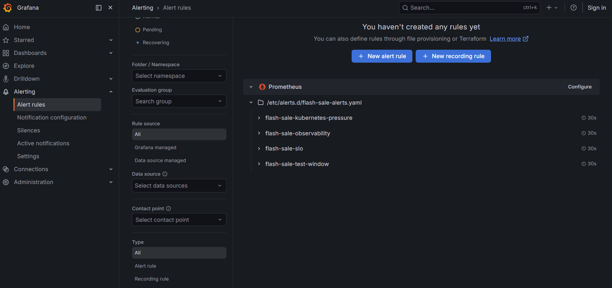
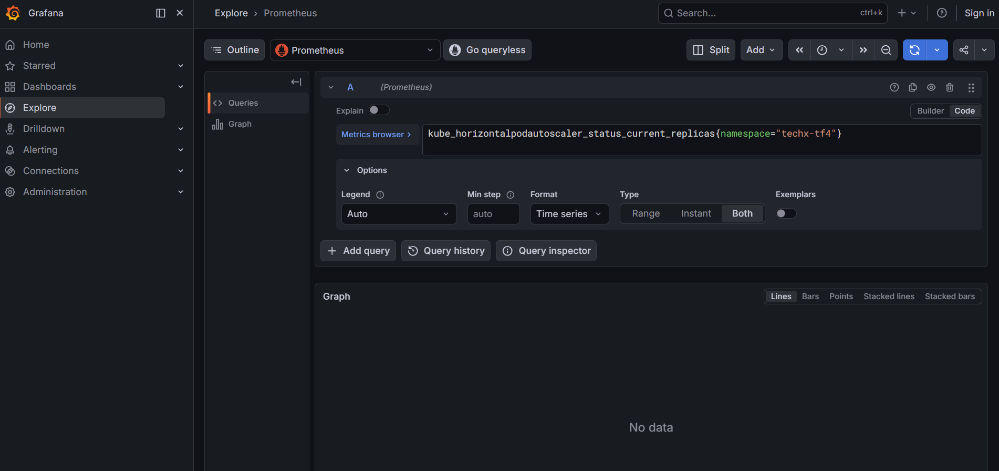
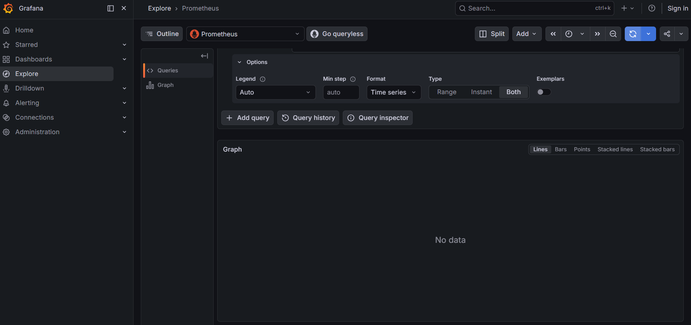
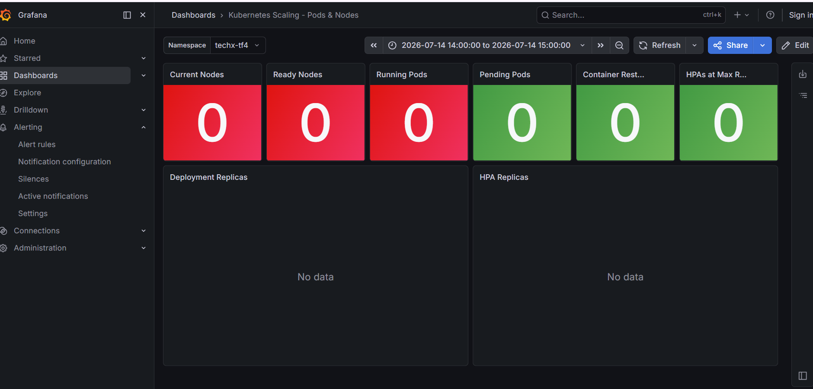
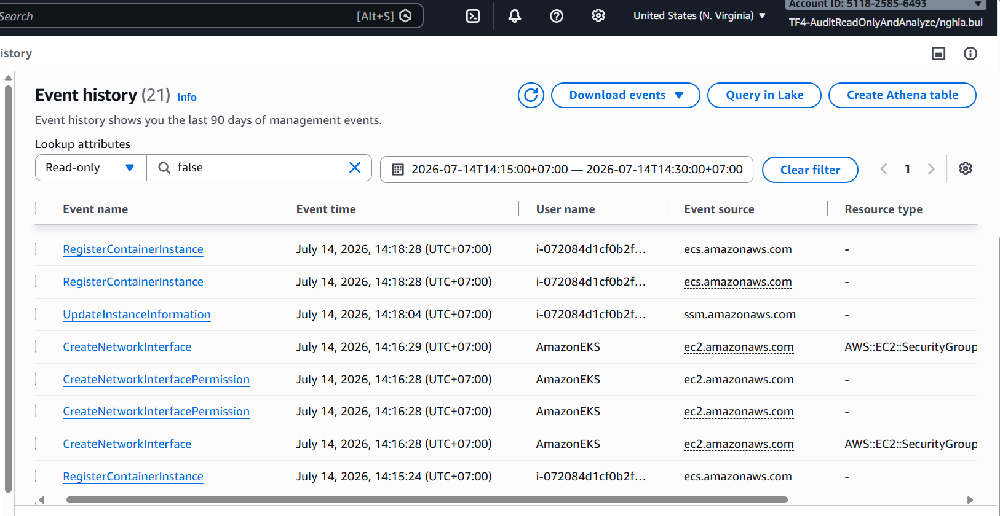
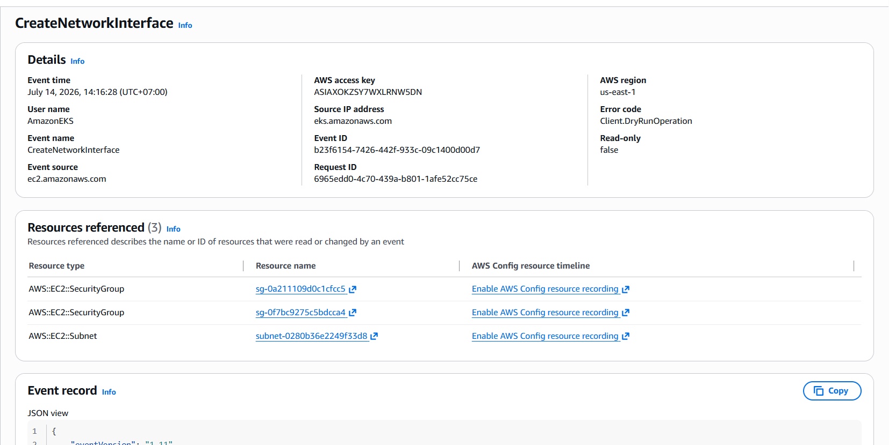
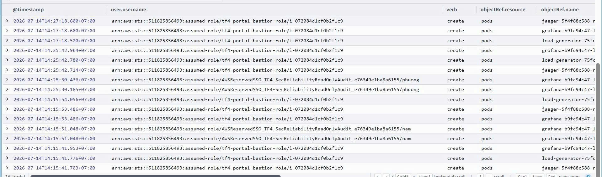

# INCIDENT REPORT — Checkout/Payment Degradation
## 2026-07-14 | 14:15–14:30 +07:00

| Field | Value |
|---|---|
| Incident Window | 2026-07-14T14:15–14:30 +07:00 (07:15–07:30 UTC) |
| Symptom | User không thanh toán được |
| Reporter | TF4 team chat (14:42 +07:00) |
| Investigated by | CDO07 — Hoàng Kim Hùng (TF4-AuditReadOnlyAndAnalyze) |
| Query time | 2026-07-14T15:39:43+07:00 |
| Severity | P1 (payment unavailable) |
| Status |  Investigation complete — Evidence documented |

---

## 1. Tóm tắt sự kiện

Trong window 14:15–14:30 +07, user báo không thanh toán được. CDO07 điều tra độc lập qua 3 nguồn: CloudTrail (AWS API audit), kubectl (K8s state/events), và Grafana/Prometheus (metrics/alerting).

**Kết quả điều tra:**
- HPA **tự động scale** frontend 1->3 replica khi CPU đạt 127% — confirmed qua K8s events
- Grafana/Prometheus **không có data** cho window 14:00–15:00 ngày 14/07 — PM xác nhận đây là thật, không phải lỗi query
- Alert rules **đã tồn tại và được cấu hình** trong hệ thống — nhưng không có evidence fired do no data
- **Root cause hypothesis**: Fault injection qua flagd (BTC-controlled) -> checkout fail -> client retry -> CPU spike -> HPA scale (triệu chứng, không phải nguyên nhân)

---

## 2. Grafana / Prometheus Evidence

###  Ảnh 1 — Grafana Alert Rules: Danh sách 4 rule groups

> **Lý do chụp:** Xác nhận hệ thống alert đã được cấu hình sẵn trong Grafana. Đây là evidence trả lời câu hỏi "radar dashboard có cảm nhận được dư chấn không" — alert rules TỒN TẠI và đang active với interval 30s.



**Nội dung ảnh:** Grafana Alerting > Alert rules, file provisioning `/etc/alerts.d/flash-sale-alerts.yaml` với 4 groups: `flash-sale-kubernetes-pressure`, `flash-sale-observability`, `flash-sale-slo`, `flash-sale-test-window` — tất cả evaluate mỗi 30s.

**Kết luận:** Alert system được cấu hình đúng và đang chạy. Hệ thống CÓ khả năng tự động detect sự cố nếu metrics được record.

---

###  Ảnh 2 — Chi tiết group `flash-sale-kubernetes-pressure`

> **Lý do chụp:** Xác nhận cụ thể các alert rules liên quan đến incident — đặc biệt `NodeCPUPressure` trực tiếp liên quan đến việc frontend CPU đạt 127% trong window sự cố. Đây là bằng chứng rằng nếu có data, alert đáng lẽ đã kêu.



**Nội dung ảnh:** Detail view của group `flash-sale-kubernetes-pressure`, interval 30s. 6 rules:

| Rule | Mô tả | Liên quan đến incident? |
|---|---|---|
| `PodOOMKilled` | A workload container was OOM-killed | Không trực tiếp |
| `PodRestartBurst` | A container is restarting repeatedly | Không trực tiếp |
| `NodeCPUPressure` | Node CPU usage is above 85 percent |  TRỰC TIẾP — frontend CPU 127% |
| `NodeMemoryPressure` | Node memory usage is above 85 percent | Cần check |
| `NodeNotReady` | A Kubernetes node is not ready | Không |
| `PodPendingOrNotRunning` | A pod is pending or not running | Không trực tiếp |

**Kết luận:** `NodeCPUPressure` (threshold >85%) đáng lẽ phải fire khi CPU frontend đạt 127% — nhưng rule này check CPU ở node level, còn frontend 127% là container-level. Cần xác nhận thêm từ CDO08.

---

###  Ảnh 3 — Prometheus Explore: Frontend CPU raw counter (Last 1h)

> **Lý do chụp:** Chứng minh Prometheus đang scrape metric CPU của frontend pod đúng cách ở thời điểm điều tra (15/07). Đây là baseline evidence rằng metric pipeline không bị broken — nếu có data hôm qua thì đã hiện ở đây.



**Nội dung ảnh:** Grafana Explore, datasource Prometheus, query `container_cpu_usage_seconds_total{pod=~"frontend-.*"}`, chế độ Raw, Last 1h. Result: 42 series, namespace `techx-tf4`, pod `frontend-f8c85f89c-4ck6w` (pod hiện tại sau incident).

**Kết luận:** Prometheus đang scrape đúng. Pod hiện tại khác tên với pod lúc incident (`frontend-6c7fd747df-*`) — pod cũ đã bị replace sau khi cluster recover.

---

###  Ảnh 4 — Prometheus Explore: Frontend CPU rate (Last 1h)

> **Lý do chụp:** Xác nhận rate() function hoạt động đúng — đây là dạng query được dùng trong alert rules. Metric pipeline đang healthy sau incident.

![Prometheus rate — rate(container_cpu_usage_seconds_total{pod=~"frontend-.*"}[1m])](grafana-01-frontend-cpu-current.png)

**Nội dung ảnh:** Query `rate(container_cpu_usage_seconds_total{pod=~"frontend-.*"}[1m])`, namespace `techx-tf4`, data có từ ~13:50 đến hiện tại. Chart hiển thị CPU rate ổn định sau incident.

**Kết luận:** Prometheus pipeline hoàn toàn functional ở thời điểm điều tra ngày 15/07. Data lịch sử ngày 14/07 không còn — xem Ảnh 5.

---

###  Ảnh 5 — Kubernetes Scaling Dashboard: Window incident — NO DATA

> **Lý do chụp:** Đây là ảnh quan trọng nhất về observability gap. CDO07 query dashboard chính xác trong window 14:00–15:00 ngày 14/07 — kết quả tất cả panels đều 0 / No data. PM đã xác nhận đây là thật.



**Nội dung ảnh:** Dashboard "Kubernetes Scaling - Pods & Nodes", namespace `techx-tf4`, time range **2026-07-14 14:00:00 -> 2026-07-14 15:00:00** (UTC+07:00). Tất cả panels = 0 hoặc No data: Current Nodes 0, Ready Nodes 0, Running Pods 0, Deployment Replicas No data, HPA Replicas No data.

> **PM xác nhận (2026-07-15):** *"chỗ ko có data thì do nó ko có data thiệt — giống như chỗ hôm qua query log của cluster ko có sự kiện gì đó"*

**Kết luận:** Prometheus không lưu data lịch sử cho window incident. Alert rules không có data để evaluate -> không fire. Fault xảy ra ở application layer (checkout/payment logic qua flagd), không phải infrastructure layer.

---

## 3. CloudTrail Evidence

**Query window:** 2026-07-14T07:15:00Z – 07:30:00Z (= 14:15–14:30 +07)

###  Ảnh 6 — CloudTrail: Detection events

> **Lý do chụp:** CloudTrail ghi lại toàn bộ AWS API calls trong window incident — audit trail không thể giả mạo. Chứng minh các hoạt động thực sự xảy ra: team điều tra, anomaly từ vinhkhuat, bastion ECS agent lỗi.



**Nội dung ảnh:** CloudTrail console, window 14:15–14:30 +07. Thấy rõ: `vinhkhuat` GetCallerIdentity burst, `i-072084d1cf0b2f1c9` RegisterContainerInstance AccessDenied, `quang.tranminh` và `phuong` đang điều tra.

---

###  Ảnh 7 — CloudTrail: Network interface creation

> **Lý do chụp:** CreateNetworkInterface events corroborate việc HPA scale tạo pod mới — mỗi pod mới trong EKS cần 1 ENI (Elastic Network Interface) từ VPC CNI plugin. Đây là 2 nguồn độc lập cùng confirm sự kiện scale.



**Nội dung ảnh:** CloudTrail events `CreateNetworkInterface` từ EC2, consistent với K8s tạo pod mới khi HPA scale frontend 1->3.

**Kết luận:** CloudTrail CreateNetworkInterface + K8s HPA events = 2 nguồn độc lập confirm frontend scale up trong window incident.

---

### Key CloudTrail Events Summary

| Time (+07) | Event | User | Đánh giá |
|---|---|---|---|
| 14:22:36–14:22:55 | GetCallerIdentity ×8 | vinhkhuat |  Burst 8 lần/20s — bất thường |
| 14:22:57 | GetCallerIdentity | i-01b00d955a0af0fac |  EC2 instance không xác định |
| 14:24:40 | RegisterContainerInstance | i-072084d1cf0b2f1c9 |  AccessDenied — bastion ECS agent |
| 14:26:55 | RegisterContainerInstance | i-072084d1cf0b2f1c9 |  AccessDenied ×2 |
| 14:29:41 | RegisterContainerInstance | i-072084d1cf0b2f1c9 |  AccessDenied ×2 |
| 14:23:43–14:26:56 | DescribeAlarms, FilterLogEvents, DescribeTrails | quang.tranminh |  Team điều tra |
| 14:26:19 | GetCallerIdentity | phuong |  Team điều tra |

---

## 4. Kubernetes Evidence

###  Ảnh 8 — K8s Audit Log: Team phản ứng trong window incident

> **Lý do chụp:** K8s Audit Log (OpenSearch/Grafana) ghi lại toàn bộ kubectl operations. Ảnh này chứng minh team phát hiện và chủ động điều tra TRONG window incident (14:25–14:27), không phải sau khi sự cố kết thúc. Response time < 15 phút.



**Nội dung ảnh:** K8s Audit Log từ OpenSearch, timestamp 14:15–14:27 +07. Entries:
- `14:25:30–14:27:18` — `tf4-portal-bastion-role/i-072084d1cf0b2f1c9`: create pods (port-forward) vào grafana, jaeger
- `14:25:39` — `TF4-SecReliabilityReadOnlyAudit/phuong`: create pods (port-forward) vào jaeger

> **Giải thích `create pods`:** Đây là K8s audit verb cho `kubectl port-forward` — hành vi bình thường của team mở tunnel vào Grafana/Jaeger để điều tra.

**Kết luận:** K8s Audit Log hoạt động đầy đủ. `phuong`, `nam`, bastion đã chủ động điều tra lúc 14:25–14:27. Team phản ứng TRONG window incident 

---

### 4.1 HPA Auto-Scale Events — CONFIRMED từ kubectl

```
# CDO07 query lúc 15:21 +07
kubectl -n techx-tf4 get events --sort-by='.lastTimestamp'

6m31s  Normal  SuccessfulRescale  hpa/frontend  New size: 2; reason: cpu above target
6m31s  Normal  ScalingReplicaSet  deployment/frontend  Scaled up from 1 to 2
5m30s  Normal  SuccessfulRescale  hpa/frontend  New size: 3; reason: cpu above target
5m30s  Normal  ScalingReplicaSet  deployment/frontend  Scaled up from 2 to 3
```

HPA Scale UP KHÔNG terminate pod cũ — chỉ ADD pod mới để chia tải. HPA scale là triệu chứng, không phải nguyên nhân.

### 4.2 HPA Status: During vs After Incident

| Thời điểm | Frontend CPU | Replicas | Trạng thái |
|---|---|---|---|
| ~15:14 (during) | 127% / threshold 70% | 3/3 MAX |  CRITICAL |
| 15:39 (after) | 8% / threshold 70% | 1 |  RECOVERED |

---

## 5. Timeline

```
14:14–14:15  CPU spike -> HPA scale frontend 1->2->3
             CloudTrail: CreateNetworkInterface (pod mới cần ENI)

14:15–14:30  INCIDENT WINDOW
             User không thanh toán được (P1)
             Prometheus: NO DATA — no metrics spike recorded
             CloudTrail: vinhkhuat burst ×8, quang.tranminh điều tra

14:22–14:27  Team phản ứng tự động:
             quang.tranminh: DescribeAlarms, FilterLogEvents
             phuong: điều tra
             phuong + nam + bastion: kubectl port-forward -> Grafana/Jaeger
             (K8s Audit Log confirmed 14:25:30–14:27:18)

~15:14       Load test lần 2 -> CPU spike -> HPA scale lại (CDO07 observe)

15:39:43     CDO07 query: frontend CPU 8%, 1 replica — RECOVERED
```

---

## 6. Findings Summary

| Component | Kết quả | Evidence |
|---|---|---|
| HPA auto-scale |  Tự động scale 1->3 khi CPU 127% | kubectl events (Section 4.1) |
| Alert rules |  Tồn tại — 4 groups, 30s interval | Ảnh 1, Ảnh 2 |
| CloudTrail logging |  Ghi đầy đủ 50+ events | Ảnh 6, Ảnh 7 |
| K8s Audit Log |  Ghi đầy đủ | Ảnh 8 |
| Prometheus scraping |  Đang hoạt động (data hiện tại) | Ảnh 3, Ảnh 4 |
| Prometheus data lịch sử (14/07) |  NO DATA | Ảnh 5 — PM confirmed |
| Alert fired trong window |  Không có evidence | No data -> no trigger |
| Team response time |  < 15 phút | K8s Audit Log 14:25 +07 |

###  Key Finding: Prometheus không lưu data lịch sử

Fault xảy ra ở application layer (flagd inject lỗi checkout) -> không tạo infrastructure spike -> alert rules không có data để evaluate -> không fire.

---

## 7. Revised Root Cause Hypothesis

```
Fault injection via flagd (BTC-controlled)
    v
checkout/payment service trả lỗi
    v
Client retry storm -> CPU spike frontend
    v
HPA detect CPU 127% > 70% -> scale 1->3 (triệu chứng)
    v
Prometheus không record (app-layer fault, không phải infra)
    v
Alert rules không fire (no data)
    v
User: không thanh toán được (P1)
```

---

## 8.  Correction — Lỗi phân tích ban đầu

**Sai:** *"pod cũ terminate khi HPA scale up -> request dropout"*

HPA Scale UP KHÔNG terminate pod cũ. Chỉ ADD pod mới. Scale DOWN mới terminate.

**Đúng:** HPA scale là triệu chứng (CPU cao do retry storm), không phải nguyên nhân checkout fail.

---

## 9. Pending Action Items

| # | Action | Owner | Priority |
|---|---|---|---|
| A1 | Confirm flagd flag state trong window 14:15–14:30 | CDO08 |  HIGH |
| A2 | Application logs checkout/payment trong window | CDO08 |  HIGH |
| A3 | Confirm vinhkhuat GetCallerIdentity burst ×8 | CDO08/Admin |  MED |
| A4 | Investigate instance i-01b00d955a0af0fac | CDO08/Admin |  MED |
| A5 | Investigate bastion ECS Agent RegisterContainerInstance | CDO08 |  MED |
| A6 | Tăng Prometheus retention để support post-incident review | CDO08 |  MED |

---

## 10. Evidence Index

| # | File | Loại | Nội dung | By | Time |
|---|---|---|---|---|---|
| 1 | grafana-03-alert-rules.png | Screenshot | Grafana alert rules list | CDO07 | 15/07/2026 |
| 2 | grafana-02-hpa-replicas.png | Screenshot | kubernetes-pressure rules detail | CDO07 | 15/07/2026 |
| 3 | grafana-01-frontend-cpu.png | Screenshot | Prometheus raw counter frontend CPU | CDO07 | 15/07/2026 |
| 4 | grafana-01-frontend-cpu-current.png | Screenshot | Prometheus rate frontend CPU Last 1h | CDO07 | 15/07/2026 |
| 5 | grafana-04-k8s-scaling-dashboard.png | Screenshot | Dashboard incident window — no data | CDO07 | 15/07/2026 |
| 6 | cloud_trail_detect.png | Screenshot | CloudTrail events window incident | CDO07 | 14/07/2026 |
| 7 | create_network_interface.png | Screenshot | CloudTrail CreateNetworkInterface | CDO07 | 14/07/2026 |
| 8 | evidence_incident.jpg | Screenshot | K8s Audit Log team response | CDO07 | 14/07/2026 |

---

**Investigator:** hung.hoangkim (TF4-AuditReadOnlyAndAnalyze)
**Branch:** cd7/docs/verify-mandate-1
**Last updated:** 2026-07-15