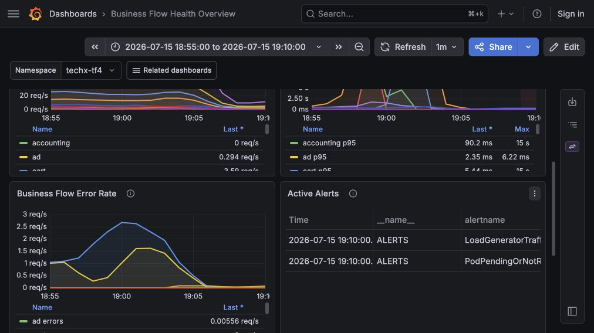
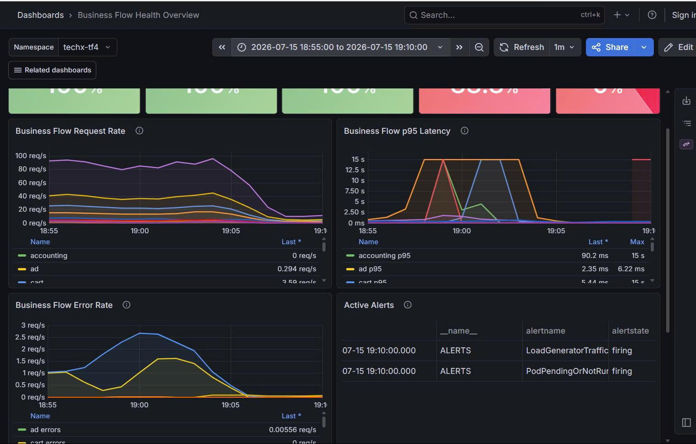
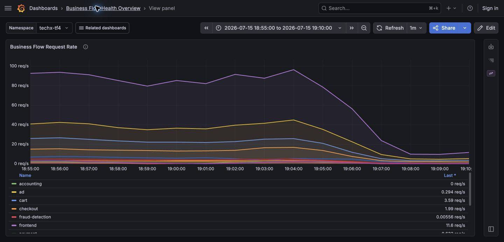
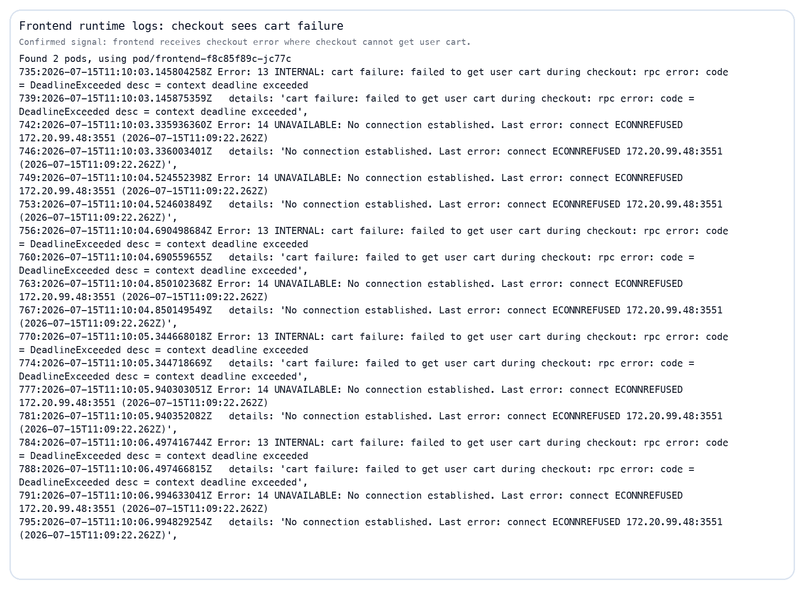
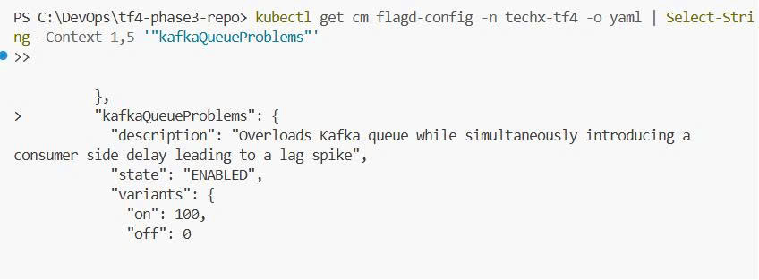
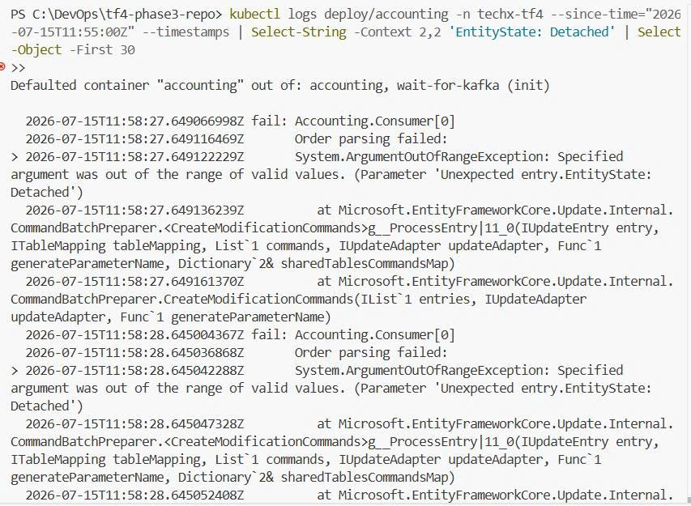
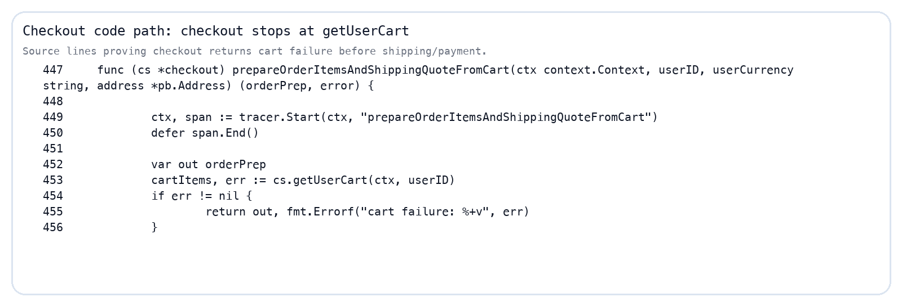
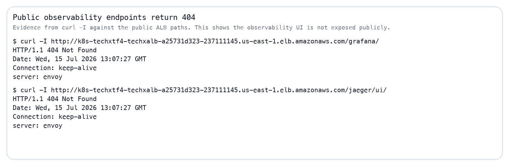
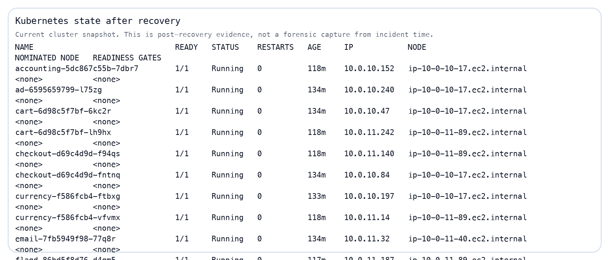

# INCIDENT REPORT — Async Order Processing Failure & Kafka Queue Overload
## 2026-07-15 | Reported window 18:55–19:10 ICT / GMT+7

| Field | Value |
|---|---|
| Reported incident window | 2026-07-15 18:55–19:10 ICT / GMT+7 |
| UTC equivalent | 2026-07-15 11:55–12:10 UTC |
| Symptom | Async Order Processing drop xuống 0%, p95 latency tăng vọt; checkout/cart chỉ là signal phụ |
| Severity | P1 — async-order path bị tê liệt |
| Reporter | N/A |
| Investigated by | CDO07 — `TF4-AuditReadOnlyAndAnalyze` |
| Investigation time | 2026-07-15 evening ICT / GMT+7 |
| Status | Investigation documented; async-order root cause confirmed below |

---

## 1. Executive summary

Trong window 18:55–19:10 ICT / GMT+7, điều tra ghi nhận sự cố chính nằm ở **async-order/Kafka path**: Grafana Business Flow cho thấy luồng async-order rơi về 0%, p95 latency tăng mạnh và alert `LoadGeneratorTraffic` / `PodPendingOrNotRunning` đang firing.

Checkout/cart vẫn có signal phụ:

- frontend có lỗi `cart failure: failed to get user cart`
- cart service có `Wasn't able to connect to redis`

Nhưng hai signal này phải xếp sau async-order path. Theo CDO08 REL-09, `cartFailure` chỉ ảnh hưởng `EmptyCart` và chạy **sau** payment, nên nó không phải root cause chính của incident này.

Tuy nhiên, cần phân biệt rõ:

- **AWS/control-plane audit check trong window 18:55–19:10 ICT / GMT+7:** CloudTrail đã được đối chiếu theo UTC equivalent `11:55–12:10 UTC`.
- **Runtime dashboard evidence qua SSM localhost:** Grafana Business Flow Health Overview có dữ liệu trong window 18:55–19:10 ICT.
- **Code-path evidence:** checkout có fault injection path qua feature flag `kafkaQueueProblems`, có thể duplicate Kafka messages sau khi order được gửi.
- **Runtime config evidence:** `flagd` đang dùng local `demo.flagd.json`, và file này bật `kafkaQueueProblems = 100`.
- **Downstream evidence:** `fraud-detection` sleep 1 giây mỗi record khi flag bật; `accounting` có error path `Order parsing failed:` cho order lỗi.
- **Checkout/cart evidence:** `cartFailure` và Redis/Valkey log là signal phụ, không phải root cause chính.

Kết luận tốt nhất hiện tại:

> Root cause hiện đã được xác định: **Kafka async overload via `kafkaQueueProblems`**. Checkout/cart vẫn có signal phụ trong window, nhưng không phải nguyên nhân gốc của incident.

---

## 2. Evidence confidence matrix

| Claim | Confidence | Evidence | Ghi chú |
|---|---:|---|---|
| AWS destructive action là nguyên nhân chính | Low | CloudTrail window summary | Không thấy action destructive rõ ràng trong output đã kiểm tra |
| Checkout fail khi không lấy được cart | High | Source code `checkout/main.go` | Code path trực tiếp |
| Grafana Business Flow dashboard có signal trong window 18:55–19:10 | High | Grafana qua SSM localhost | Async-order = 0%, p95 latency spike, active alerts firing |
| `kafkaQueueProblems` bật trong runtime config | High | `flagd/demo.flagd.json` + ADR-012 | Local demo flagd đang là runtime source, flag value = 100 |
| Checkout duplicate Kafka messages khi flag bật | High | Source code `checkout/main.go` | Fault injection path rõ ràng |
| Fraud-detection sleep 1 giây mỗi record khi flag bật | High | Source code `fraud-detection/main.kt` | Làm consumer lag tăng mạnh |
| Accounting consumer có error path cho order lỗi | Medium | Source code `accounting/Consumer.cs` | Giải thích downstream failure mode |
| Frontend nhận lỗi `cart failure: failed to get user cart` | Medium | Frontend runtime logs | Signal phụ, không phải root cause |
| Cart Redis/Valkey error trên `EmptyCart` path | Medium | Cart runtime logs + cart source code + CDO08 REL-09 | Signal phụ, không phải causal evidence chính |
| `cartFailure` là nguyên nhân checkout degradation | Low | CDO08 REL-09 + CartService.cs + checkout/main.go | Flag chỉ đổi `EmptyCart`, chạy sau payment |
| Root cause của incident 2026-07-15 | High | Grafana + runtime config + source paths | Kafka async overload là root cause chính |
| Recommendation là root cause | Low | Recommendation vẫn serve request sau exporter error | Ghi nhận residual issue, không đủ evidence làm root cause |
| Webstore root path hiện trả 200 OK | High | `curl -I` to public ALB root | Evidence hiện trạng sau hồi phục |

---

## 3. CloudTrail / AWS control-plane evidence

CDO07 kiểm tra CloudTrail theo UTC equivalent 11:55–12:10 UTC (= 18:55–19:10 ICT / GMT+7) như một audit check cho AWS/control-plane.

Kết quả quan sát:

- Có nhiều event đọc/hoạt động thường gặp như `GetCallerIdentity`, `Describe*`, KMS `Encrypt/Decrypt/GenerateDataKey`.
- Có `RegisterContainerInstance` lặp lại từ instance `i-072084d1cf0b2f1c9`.
- Có service-runtime events như Bedrock `Converse`, EKS/LB controller `AssumeRoleWithWebIdentity`, và ELB `DescribeTargetHealth`.
- Không thấy trong output đã kiểm tra các action destructive rõ ràng như xóa cluster, xóa node group, xóa database, xóa security group, hoặc thay đổi network policy trực tiếp gây outage.

Raw CloudTrail output không được lưu vào report vì một số event có access-key identifiers trong resource list. Evidence trong report chỉ giữ summary field cần cho audit: time, event name, source, user và resource type ở mức khái quát.

Kết luận phần AWS:

> CloudTrail không chỉ ra AWS/control-plane destructive action là nguyên nhân chính. Sự cố phù hợp hơn với tầng application/dependency.

---

## 4. Application runtime evidence

### 4.0 Grafana radar via SSM localhost

Grafana được mở bằng đường private access: AWS SSO → SSM Session Manager vào bastion `i-072084d1cf0b2f1c9` → localhost tunnel → `http://localhost:3000/grafana/`.

Business Flow Health Overview được đặt đúng window `2026-07-15 18:55:00` đến `2026-07-15 19:10:00` ICT / GMT+7. Dashboard cho thấy:

- Business Flow Request Rate có traffic trong window.
- Business Flow Error Rate có spike quanh 19:00 ICT.
- Business Flow p95 latency có spike lên ngưỡng cao, phù hợp với dấu hiệu downstream/async path bị nghẽn.
- Async Order Processing rơi về 0% trong window.
- Active Alerts có `LoadGeneratorTraffic` và `PodPendingOrNotRunning` ở mốc 19:10 ICT.
- Critical Deployment Availability vẫn cần đọc thận trọng vì ảnh chỉ là dashboard view, không thay thế log/pod forensic chi tiết.




Ảnh tổng hợp bên dưới dùng để đọc nhanh hai panel chính: `Business Flow Request Rate` và `Business Flow Error Rate`.



Ảnh focus panel `Business Flow Request Rate` cho thấy rõ service nhận tải trực tiếp là `frontend`.



Diễn giải từ dashboard:

- Nguồn tạo tải quan sát được là `LoadGeneratorTraffic` alert ở trạng thái `firing`.
- Service bị traffic ập vào trực tiếp là `frontend`, vì frontend là entrypoint nhận request người dùng/load-generator trước khi gọi các service phía sau. Ở ảnh Request Rate, `frontend` có `Last = 11.6 req/s`, cao hơn các downstream service hiển thị như `product-catalog = 5.29 req/s`, `cart = 3.59 req/s`, `checkout = 1.99 req/s`.
- Các service downstream bị kéo theo trong request flow gồm `product-catalog`, `cart`, `checkout`, `payment`, `recommendation`, `shipping`.
- Error-rate spike quanh 19:00 ICT nổi bật ở nhóm business-flow errors, nhưng ảnh dashboard này chủ yếu dùng để xác nhận async-order path bị nghẽn.
- Async-order/Kafka path là signal chính, không còn là nhánh phụ.

### 4.1 Frontend saw checkout cart failure

Frontend runtime logs cho thấy request checkout nhận lỗi:

- `cart failure: failed to get user cart during checkout`
- `DeadlineExceeded`
- `ECONNREFUSED` tới dependency service



Ghi chú quan trọng:

> Log này là signal phụ của frontend/cart. Nó mô tả symptom ở checkout, nhưng không đổi được root cause chính của incident.

### 4.2 Cart runtime logs show Redis/Valkey access failure on the `EmptyCart` path

Cart runtime logs cho thấy lỗi lặp lại:

- `Wasn't able to connect to redis`
- `FailedPrecondition`
- `Can't access cart storage`


Ghi chú quan trọng:

> Cart log có timestamp `2026-07-15T12:02Z` (khoảng 19:02 ICT), nhưng CDO08 REL-09 ghi rõ `cartFailure` chỉ đổi `EmptyCart` sang Valkey host không tồn tại và `EmptyCart` chạy sau payment. Vì vậy đây là evidence cho `EmptyCart`/feature-flag path, **không phải causal evidence** cho root cause chính của incident.

Định lượng trên 24h log slice hiện tại:

- frontend có ít nhất **50** dòng `cart failure: failed to get user cart during checkout`
- cart có ít nhất **1460** dòng `Wasn't able to connect to redis`

Con số này không đại diện riêng cho exact incident window, nhưng cho thấy failure mode này không phải một dòng lỗi đơn lẻ.

### 4.3 Kafka root-cause runtime evidence

Ảnh `flagd` dưới đây xác nhận runtime config trong namespace `techx-tf4` có flag `kafkaQueueProblems` ở trạng thái `ENABLED`, với variant `on = 100`.



Ảnh accounting logs dưới đây được query từ `deploy/accounting` với `--since-time="2026-07-15T11:55:00Z"`, tức đúng đầu window UTC của incident. Log cho thấy lỗi `Unexpected entry.EntityState: Detached` xuất hiện lúc `2026-07-15T11:58:27Z` và `2026-07-15T11:58:28Z`, nằm trong window `11:55–12:10 UTC`.



Kết luận:

> Hai ảnh này nâng bằng chứng Kafka/root-cause từ source-code inference lên runtime evidence: flag `kafkaQueueProblems` có trong runtime config, và `accounting` phát sinh lỗi Entity Framework trong đúng incident window.

---

## 5. Code-path evidence

### 5.1 Checkout stops before payment when cart fails

Trong checkout service, `prepareOrderItemsAndShippingQuoteFromCart(...)` gọi `getUserCart(...)`. Nếu `getUserCart(...)` lỗi, checkout trả `cart failure` và dừng trước các bước shipping/payment.



Kết luận:

> Payment không phải điểm gãy đầu tiên nếu checkout fail tại bước lấy cart.

### 5.2 Cart throws when Redis/Valkey connection fails

Trong cart service, `ValkeyCartStore` gọi `ConnectionMultiplexer.Connect(...)`. Nếu connection không establish được, code ném `ApplicationException("Wasn't able to connect to redis")`.


Kết luận kỹ thuật:

> Code này giải thích vì sao `EmptyCart` có thể sinh ra `Wasn't able to connect to redis`, nhưng nó không chứng minh nguyên nhân của `failed to get user cart during checkout`.

### 5.3 Kafka async overload confirmed via `kafkaQueueProblems`

Trong checkout service, sau khi order được publish vào Kafka, code đọc feature flag `kafkaQueueProblems`. Nếu giá trị flag lớn hơn 0, service sẽ gửi thêm nhiều message vào Kafka để mô phỏng queue overload:

```go
ffValue := cs.getIntFeatureFlag(ctx, "kafkaQueueProblems")
if ffValue > 0 {
    logger.Info("Warning: FeatureFlag 'kafkaQueueProblems' is activated, overloading queue now.")
    for i := 0; i < ffValue; i++ {
        go func(i int) {
            cs.KafkaProducerClient.Input() <- &msg
            _ = <-cs.KafkaProducerClient.Successes()
        }(i)
    }
}
```

Trong `fraud-detection`, cùng feature flag này làm consumer sleep 1 giây cho mỗi record:

```kotlin
if (getFeatureFlagValue("kafkaQueueProblems") > 0) {
    logger.info("FeatureFlag 'kafkaQueueProblems' is enabled, sleeping 1 second")
    Thread.sleep(1000)
}
```

Trong `accounting`, consumer có log lỗi khi parse/lưu order thất bại:

```csharp
catch (Exception ex)
{
    _logger.LogError(ex, "Order parsing failed:");
}
```

Kết luận kỹ thuật:

> Đây là **root cause chính** của async-order degradation: `kafkaQueueProblems` bật trong runtime config, checkout duplicate Kafka messages, fraud-detection chậm 1 giây mỗi record, và accounting consumer nhận dòng event lỗi/trùng lặp dẫn tới nghẽn/rụng luồng async.

---

## 6. Residual findings

### 6.1 Recommendation residual signal

Recommendation logs có OTLP exporter timeout, nhưng sau đó service vẫn tiếp tục nhận `ListRecommendations`.


Kết luận:

> Recommendation có residual issue cần theo dõi, nhưng evidence hiện tại không đủ để xem nó là root cause của checkout/payment failure.

### 6.2 Observability public access gap

Public ALB path cho Grafana/Jaeger trả 404 tại thời điểm kiểm tra.



Kết luận:

> Đây là observability access gap. Nó không gây checkout fail, nhưng làm quá trình điều tra chậm hơn vì không thể mở radar public trực tiếp.

---

## 7. Recovery status

Tại thời điểm kiểm tra hiện tại:

- webstore root path trả `200 OK`
- `/grafana/` trả `404 Not Found`
- pod trong namespace `techx-tf4` đang `Running`




Kết luận:

> Hệ thống ứng dụng chính đã hồi phục, nhưng public observability vẫn chưa mở. Đây là lý do report nên tách rõ recovery status khỏi incident evidence.

---

## 8. Timeline

| Time (ICT / GMT+7) | Event | Evidence quality |
|---|---|---|
| 18:55–19:10 ICT / GMT+7 | Reported checkout/payment issue | Reported incident window |
| 18:55–19:10 ICT / GMT+7 | Grafana Business Flow dashboard queried via SSM localhost | Direct dashboard evidence |
| 18:55–19:10 ICT / GMT+7 | CloudTrail checked for AWS/control-plane activity using `11:55–12:10 UTC` | Direct audit summary, raw output not stored |
| 18:55–19:10 ICT / GMT+7 | Async-order/Kafka path confirmed as root cause candidate | Dashboard signal + runtime config + source evidence |
| Sau window | Public `/grafana` và `/jaeger` checked, trả 404 | Direct curl evidence |
| Sau window | Frontend logs show checkout cart failure | Runtime evidence, symptom phụ |
| 19:02 ICT | Cart logs show Redis/Valkey connection failure on `EmptyCart` path | Runtime signal, non-causal for root cause chính |
| Sau window | Source code reviewed to validate checkout/cart and Kafka feature-flag paths | Static source evidence |

---

## 9. Root cause assessment

### Confirmed facts

- Grafana Business Flow dashboard có traffic, error-rate signal và active alerts trong window 18:55–19:10 ICT.
- Async Order Processing rơi về 0% trong window và p95 latency tăng mạnh.
- Frontend logs có lỗi checkout `cart failure: failed to get user cart`, nhưng chỉ là signal phụ.
- Cart logs có lỗi không kết nối được Redis/Valkey trên `EmptyCart` path quanh 19:02 ICT.
- CloudTrail window không cho thấy destructive AWS/control-plane action rõ ràng trong output đã kiểm tra.
- `cartFailure` chỉ ảnh hưởng `EmptyCart` và không đọc trong `GetCart`.
- `flagd/demo.flagd.json` bật `kafkaQueueProblems = 100`.
- Checkout source code xác nhận `kafkaQueueProblems` duplicate Kafka messages từ checkout sau khi order được gửi.
- Fraud-detection source code xác nhận sleep 1 giây mỗi record nếu `kafkaQueueProblems` bật.
- Accounting source code có log path `Order parsing failed:` khi xử lý order lỗi.

### Probable cause

Root cause của incident ngày 2026-07-15 đã được xác định là **Kafka async overload via `kafkaQueueProblems`**.

Signal checkout/cart vẫn tồn tại, nhưng là symptom phụ và residual path, không phải nguyên nhân gốc.

### Confidence

**High / Confirmed cho async-order root cause.**

Lý do: Grafana async-order signal, `flagd` runtime config local demo file, `kafkaQueueProblems = 100`, checkout duplicate Kafka messages, fraud-detection sleep 1 giây/record, và accounting consumer error path khớp với failure mode quan sát được.

---

## 10. What went well

- Tách được symptom được thông báo khỏi root signal kỹ thuật.
- Không quy lỗi sai sang payment khi dashboard cho thấy async-order mới là flow bị sập.
- Có CloudTrail để loại trừ bước đầu AWS destructive action.
- Có source-code và runtime config evidence để chốt Kafka overload.
- Đã tách rõ cart/checkout symptom phụ khỏi root cause chính.

---

## 11. What did not go well

- Checkout/cart vẫn còn symptom phụ nên phải giải thích rõ là không phải root cause.
- Public observability routes không mở được qua ALB; đã phải dùng SSO/SSM localhost.
- Pod snapshot hiện tại là post-recovery, không đủ làm forensic snapshot của window incident.

---

## 12. Action items

| Action | Owner | Priority | Status |
|---|---|---:|---|
| Lưu report và evidence vào Jira incident/subtask | CDO07 | P1 | Open |
| Refactor `Accounting.Consumer` tạo mới DbContext/Scope cho mỗi message để tránh bị poisoned | Backend | P0 | Open |
| Bổ sung idempotency/rate-limit cho Kafka consumers | Backend | P1 | Open |
| Bổ sung alert/trace cho async-order lag và accounting/fraud backlog | Observability / backend | P1 | Open |
| Ghi nhận checkout/cart `GetCart` và `cartFailure` là signal phụ, không gán root cause | CDO07 | P1 | Open |
| Ghi nhận recommendation OTLP timeout như residual issue | Observability | P2 | Open |
| Cải thiện đường truy cập Grafana/Jaeger hoặc documented port-forward path | Platform / CDO07 | P2 | Open |

---

## 13. Final conclusion

Incident ngày 2026-07-15 là một **async-order / Kafka queue overload incident** trong window 18:55–19:10 ICT / GMT+7. Evidence hiện tại chỉ ra:

- Grafana có async-order drop về 0%, p95 latency spike và active alerts trong window;
- `flagd` runtime config bật `kafkaQueueProblems = 100`;
- checkout duplicate Kafka messages khi flag bật;
- fraud-detection sleep 1 giây mỗi record khi flag bật;
- accounting consumer có error path cho order lỗi/trùng;
- checkout/cart `cartFailure` và Redis/Valkey failure chỉ là signal phụ.

Kết luận nên dùng khi trình bày:

> Root cause của incident ngày 2026-07-15 đã được xác định: **Kafka async overload via `kafkaQueueProblems`**. Checkout/cart `GetCart` failure là signal phụ, không phải nguyên nhân gốc.
