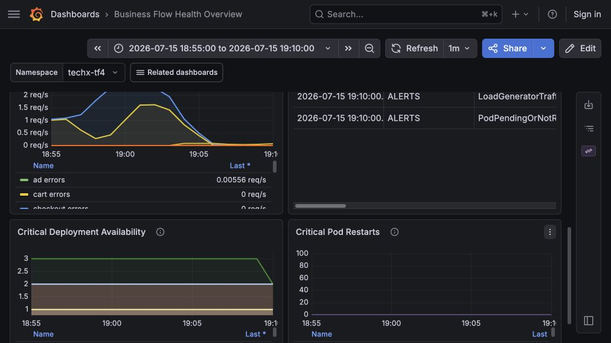

# INCIDENT REPORT — Checkout degradation with async-order failure signals
## 2026-07-15 | Reported window 18:55–19:10 ICT / GMT+7

| Field | Value |
|---|---|
| Reported incident window | 2026-07-15 18:55–19:10 ICT / GMT+7 |
| UTC equivalent | 2026-07-15 11:55–12:10 UTC |
| Symptom | Checkout/payment path affected; Grafana also shows async-order failure signals |
| Severity | P1 — checkout/payment and async-order signals observed |
| Reporter | N/A |
| Investigated by | CDO07 — `TF4-AuditReadOnlyAndAnalyze` |
| Investigation time | 2026-07-15 evening ICT / GMT+7 |
| Status | Investigation documented; root cause confidence marked below |

---

## 1. Executive summary

Trong window 18:55–19:10 ICT / GMT+7, điều tra ghi nhận hai nhóm signal cần tách riêng:

- **Checkout/payment path:** frontend có signal checkout `cart failure: failed to get user cart`.
- **Async order path:** Grafana Business Flow có signal bất thường ở luồng async-order/Kafka consumer path, kèm p95 latency spike và active alerts.

Có thêm một signal cart service báo `Wasn't able to connect to redis`, nhưng signal này cần được đọc rất thận trọng: theo CDO08 REL-09, `cartFailure` chỉ ảnh hưởng `EmptyCart` và `EmptyCart` chạy **sau** payment. Vì vậy, log Redis này **không đủ** để kết luận nó gây ra lỗi `GetCart` trong checkout.

Tuy nhiên, cần phân biệt rõ:

- **AWS/control-plane audit check trong window 18:55–19:10 ICT / GMT+7:** CloudTrail đã được đối chiếu theo UTC equivalent `11:55–12:10 UTC`.
- **Runtime dashboard evidence qua SSM localhost:** Grafana Business Flow Health Overview có dữ liệu trong window 18:55–19:10 ICT.
- **Evidence còn yếu:** frontend/cart runtime logs chưa chứng minh trực tiếp nguyên nhân gốc của lỗi `GetCart` trong đúng window.
- **Code-path evidence:** checkout sẽ dừng trước payment nếu không lấy được cart.
- **Kafka hypothesis:** source code xác nhận feature flag `kafkaQueueProblems` có thể duplicate Kafka messages từ checkout và làm `fraud-detection` sleep 1 giây mỗi record, nhưng report hiện chưa có artifact runtime chứng minh flag này thật sự bật trong exact window.

Kết luận tốt nhất hiện tại:

> Root cause hiện **chưa được xác định chắc chắn**. Evidence tốt nhất hiện tại cho thấy có traffic/error/alert signal trong window, checkout có signal lỗi ở bước lấy cart, và có một hypothesis hợp lý về Kafka async overload qua `kafkaQueueProblems`. Tuy nhiên, chưa đủ runtime proof để chốt root cause là cart-storage hoặc Kafka.

---

## 2. Evidence confidence matrix

| Claim | Confidence | Evidence | Ghi chú |
|---|---:|---|---|
| AWS destructive action là nguyên nhân chính | Low | CloudTrail window summary | Không thấy action destructive rõ ràng trong output đã kiểm tra |
| Checkout fail khi không lấy được cart | High | Source code `checkout/main.go` | Code path trực tiếp |
| Grafana Business Flow dashboard có signal trong window 18:55–19:10 | High | Grafana qua SSM localhost | Có request/error/alert signal trong đúng dashboard window |
| Frontend nhận lỗi `cart failure: failed to get user cart` | Medium | Frontend runtime logs | Cần đối chiếu lại exact timestamp với window 18:55–19:10 |
| Cart Redis/Valkey error trên `EmptyCart` path | Medium | Cart runtime logs + cart source code + CDO08 REL-09 | Có signal khoảng 19:02 ICT, nhưng không phải causal evidence cho `GetCart` |
| `cartFailure` là nguyên nhân checkout degradation | Low | CDO08 REL-09 + CartService.cs + checkout/main.go | Flag chỉ đổi `EmptyCart`, chạy sau payment, không tác động `GetCart` |
| Kafka async overload qua `kafkaQueueProblems` | Medium | Source code checkout + fraud-detection + Grafana async signal | Hypothesis hợp lý, nhưng cần exact-window flagd state và accounting/fraud logs để nâng lên High |
| Accounting/Fraud consumer là điểm nghẽn async-order | Medium / Unconfirmed | Static code path + dashboard async signal | Chưa có artifact log exact-window được lưu trong report |
| Root cause của incident 2026-07-15 | Low / Unconfirmed | Hiện chưa có exact-window app log cho `GetCart` | Chưa đủ evidence để chốt nguyên nhân gốc |
| Recommendation là root cause | Low | Recommendation vẫn serve request sau exporter error | Ghi nhận residual issue, không đủ evidence làm root cause |
| Webstore root path hiện trả 200 OK | High | `curl -I` to public ALB root | Evidence hiện trạng sau hồi phục |

---

## 3. CloudTrail / AWS control-plane evidence

CDO07 kiểm tra CloudTrail theo UTC equivalent 11:55–12:10 UTC (= 18:55–19:10 ICT / GMT+7) như một audit check cho AWS/control-plane.

Kết quả quan sát:

- Có nhiều event đọc/hoạt động thường gặp như `GetCallerIdentity`, `Describe*`, KMS `Encrypt/Decrypt/GenerateDataKey`.
- Có `RegisterContainerInstance` lặp lại từ instance `i-072084d1cf0b2f1c9`.
- Có service-runtime events như Bedrock `Converse`, EKS/LB controller `AssumeRoleWithWebIdentity`, và ELB `DescribeTargetHealth`.
- Không thấy trong output đã kiểm tra các action destructive rõ ràng như xóa cluster, xóa node group, xóa database, xóa security group, hoặc thay đổi network policy trực tiếp gây outage.

Raw CloudTrail output không được lưu vào report vì một số event có access-key identifiers trong resource list. Evidence trong report chỉ giữ summary field cần cho audit: time, event name, source, user và resource type ở mức khái quát.

Kết luận phần AWS:

> CloudTrail không chỉ ra AWS/control-plane destructive action là nguyên nhân chính. Sự cố phù hợp hơn với tầng application/dependency.

---

## 4. Application runtime evidence

### 4.0 Grafana radar via SSM localhost

Grafana được mở bằng đường private access: AWS SSO → SSM Session Manager vào bastion `i-072084d1cf0b2f1c9` → localhost tunnel → `http://localhost:3000/grafana/`.

Business Flow Health Overview được đặt đúng window `2026-07-15 18:55:00` đến `2026-07-15 19:10:00` ICT / GMT+7. Dashboard cho thấy:

- Business Flow Request Rate có traffic trong window.
- Business Flow Error Rate có spike quanh 19:00 ICT.
- Business Flow p95 latency có spike lên ngưỡng cao, phù hợp với dấu hiệu downstream/async path bị nghẽn.
- Active Alerts có `LoadGeneratorTraffic` và `PodPendingOrNotRunning` ở mốc 19:10 ICT.
- Critical Deployment Availability vẫn cần đọc thận trọng vì ảnh chỉ là dashboard view, không thay thế log/pod forensic chi tiết.




Ảnh tổng hợp bên dưới dùng để đọc nhanh hai panel chính: `Business Flow Request Rate` và `Business Flow Error Rate`.


Ảnh focus panel `Business Flow Request Rate` cho thấy rõ service nhận tải trực tiếp là `frontend`.


Diễn giải từ dashboard:

- Nguồn tạo tải quan sát được là `LoadGeneratorTraffic` alert ở trạng thái `firing`.
- Service bị traffic ập vào trực tiếp là `frontend`, vì frontend là entrypoint nhận request người dùng/load-generator trước khi gọi các service phía sau. Ở ảnh Request Rate, `frontend` có `Last = 11.6 req/s`, cao hơn các downstream service hiển thị như `product-catalog = 5.29 req/s`, `cart = 3.59 req/s`, `checkout = 1.99 req/s`.
- Các service downstream bị kéo theo trong request flow gồm `product-catalog`, `cart`, `checkout`, `payment`, `recommendation`, `shipping`.
- Error-rate spike quanh 19:00 ICT nổi bật ở nhóm business-flow errors, nhưng ảnh dashboard này chỉ chứng minh có traffic/error signal trong window; không tự nó chứng minh root cause.
- Async-order/Kafka path là một hướng điều tra đáng chú ý vì dashboard có latency/error signal trong đúng window. Tuy nhiên, dashboard không đủ để tự kết luận feature flag nào đã bật.

### 4.1 Frontend saw checkout cart failure

Frontend runtime logs cho thấy request checkout nhận lỗi:

- `cart failure: failed to get user cart during checkout`
- `DeadlineExceeded`
- `ECONNREFUSED` tới dependency service


Ghi chú quan trọng:

> Log này cần được đối chiếu lại timestamp chính xác với window 18:55–19:10 ICT / GMT+7. Nếu timestamp không nằm trong window này, chỉ dùng nó như residual/runtime signal, không dùng làm proof trực tiếp cho incident.

### 4.2 Cart runtime logs show Redis/Valkey access failure on the `EmptyCart` path

Cart runtime logs cho thấy lỗi lặp lại:

- `Wasn't able to connect to redis`
- `FailedPrecondition`
- `Can't access cart storage`


Ghi chú quan trọng:

> Cart log có timestamp `2026-07-15T12:02Z` (khoảng 19:02 ICT), nằm trong window 18:55–19:10 ICT. Tuy nhiên, CDO08 REL-09 ghi rõ `cartFailure` chỉ đổi `EmptyCart` sang Valkey host không tồn tại và `EmptyCart` chạy sau payment. Vì vậy đây là evidence cho `EmptyCart`/feature-flag path, **không phải causal evidence** cho lỗi `GetCart` trong checkout.

Định lượng trên 24h log slice hiện tại:

- frontend có ít nhất **50** dòng `cart failure: failed to get user cart during checkout`
- cart có ít nhất **1460** dòng `Wasn't able to connect to redis`

Con số này không đại diện riêng cho exact incident window, nhưng cho thấy failure mode này không phải một dòng lỗi đơn lẻ.

---

## 5. Code-path evidence

### 5.1 Checkout stops before payment when cart fails

Trong checkout service, `prepareOrderItemsAndShippingQuoteFromCart(...)` gọi `getUserCart(...)`. Nếu `getUserCart(...)` lỗi, checkout trả `cart failure` và dừng trước các bước shipping/payment.


Kết luận:

> Payment không phải điểm gãy đầu tiên nếu checkout fail tại bước lấy cart.

### 5.2 Cart throws when Redis/Valkey connection fails

Trong cart service, `ValkeyCartStore` gọi `ConnectionMultiplexer.Connect(...)`. Nếu connection không establish được, code ném `ApplicationException("Wasn't able to connect to redis")`.


Kết luận kỹ thuật:

> Code này giải thích vì sao `EmptyCart` có thể sinh ra `Wasn't able to connect to redis`, nhưng nó không chứng minh nguyên nhân của `failed to get user cart during checkout`.

### 5.3 Kafka async overload hypothesis via `kafkaQueueProblems`

Trong checkout service, sau khi order được publish vào Kafka, code đọc feature flag `kafkaQueueProblems`. Nếu giá trị flag lớn hơn 0, service sẽ gửi thêm nhiều message vào Kafka để mô phỏng queue overload:

```go
ffValue := cs.getIntFeatureFlag(ctx, "kafkaQueueProblems")
if ffValue > 0 {
    logger.Info("Warning: FeatureFlag 'kafkaQueueProblems' is activated, overloading queue now.")
    for i := 0; i < ffValue; i++ {
        go func(i int) {
            cs.KafkaProducerClient.Input() <- &msg
            _ = <-cs.KafkaProducerClient.Successes()
        }(i)
    }
}
```

Trong `fraud-detection`, cùng feature flag này làm consumer sleep 1 giây cho mỗi record:

```kotlin
if (getFeatureFlagValue("kafkaQueueProblems") > 0) {
    logger.info("FeatureFlag 'kafkaQueueProblems' is enabled, sleeping 1 second")
    Thread.sleep(1000)
}
```

Trong `accounting`, consumer có log lỗi khi parse/lưu order thất bại:

```csharp
catch (Exception ex)
{
    _logger.LogError(ex, "Order parsing failed:");
}
```

Kết luận kỹ thuật:

> Đây là một **probable cause candidate** cho async-order degradation: nếu `kafkaQueueProblems` thật sự bật trong window 18:55–19:10 ICT, checkout có thể duplicate Kafka messages và làm các consumer downstream bị nghẽn. Tuy nhiên, source code chỉ chứng minh khả năng xảy ra; để chốt root cause cần thêm exact-window evidence gồm flagd runtime state, accounting logs và fraud-detection logs.

---

## 6. Residual findings

### 6.1 Recommendation residual signal

Recommendation logs có OTLP exporter timeout, nhưng sau đó service vẫn tiếp tục nhận `ListRecommendations`.


Kết luận:

> Recommendation có residual issue cần theo dõi, nhưng evidence hiện tại không đủ để xem nó là root cause của checkout/payment failure.

### 6.2 Observability public access gap

Public ALB path cho Grafana/Jaeger trả 404 tại thời điểm kiểm tra.


Kết luận:

> Đây là observability access gap. Nó không gây checkout fail, nhưng làm quá trình điều tra chậm hơn vì không thể mở radar public trực tiếp.

---

## 7. Recovery status

Tại thời điểm kiểm tra hiện tại:

- webstore root path trả `200 OK`
- `/grafana/` trả `404 Not Found`
- pod trong namespace `techx-tf4` đang `Running`


Kết luận:

> Hệ thống ứng dụng chính đã hồi phục, nhưng public observability vẫn chưa mở. Đây là lý do report nên tách rõ recovery status khỏi incident evidence.

---

## 8. Timeline

| Time (ICT / GMT+7) | Event | Evidence quality |
|---|---|---|
| 18:55–19:10 ICT / GMT+7 | Reported checkout/payment issue | Reported incident window |
| 18:55–19:10 ICT / GMT+7 | Grafana Business Flow dashboard queried via SSM localhost | Direct dashboard evidence |
| 18:55–19:10 ICT / GMT+7 | CloudTrail checked for AWS/control-plane activity using `11:55–12:10 UTC` | Direct audit summary, raw output not stored |
| 18:55–19:10 ICT / GMT+7 | Async-order/Kafka path identified as investigation candidate | Dashboard signal + static source evidence |
| Sau window | Public `/grafana` và `/jaeger` checked, trả 404 | Direct curl evidence |
| Cần đối chiếu timestamp | Frontend logs show checkout cart failure | Runtime evidence, timestamp must be verified |
| 19:02 ICT | Cart logs show Redis/Valkey connection failure on `EmptyCart` path | Runtime signal, non-causal for `GetCart` |
| Sau window | Source code reviewed to validate checkout/cart and Kafka feature-flag paths | Static source evidence |

---

## 9. Root cause assessment

### Confirmed facts

- Grafana Business Flow dashboard có traffic, error-rate signal và active alerts trong window 18:55–19:10 ICT.
- Frontend logs có lỗi checkout `cart failure: failed to get user cart`, nhưng cần đối chiếu exact timestamp với window.
- Cart logs có lỗi không kết nối được Redis/Valkey trên `EmptyCart` path quanh 19:02 ICT.
- Checkout source code xác nhận checkout dừng trước payment nếu không lấy được cart.
- CloudTrail window không cho thấy destructive AWS/control-plane action rõ ràng trong output đã kiểm tra.
- `cartFailure` chỉ ảnh hưởng `EmptyCart` và không đọc trong `GetCart`.
- Source code xác nhận `kafkaQueueProblems` có thể duplicate Kafka messages từ checkout sau khi order được gửi.
- Source code xác nhận `fraud-detection` sleep 1 giây mỗi record nếu `kafkaQueueProblems` bật.
- Source code xác nhận `accounting` có log path `Order parsing failed:` khi xử lý order lỗi.

### Probable cause

Probable cause **chưa được xác định chắc chắn** từ evidence hiện tại.

Điều có thể khẳng định là checkout bị chặn ở bước `getUserCart(...)`, còn nguyên nhân gốc khiến `GetCart` lỗi trong window incident hiện vẫn chưa có proof trực tiếp.

Với async-order path, hypothesis mạnh nhất hiện tại là:

> `kafkaQueueProblems` có thể đã tạo Kafka overload, kéo theo consumer lag/error ở `accounting` và `fraud-detection`.

Nhưng hypothesis này chỉ ở mức **Medium confidence** vì report chưa lưu được exact-window proof rằng flag `kafkaQueueProblems` đang bật và chưa có artifact log runtime của `accounting`/`fraud-detection` trong đúng window.

### Confidence

**Low / Unconfirmed cho root cause tổng thể. Medium cho Kafka async-overload hypothesis.**

Lý do không đánh `High` tuyệt đối: Grafana xác nhận có signal trong window, nhưng root cause cần log/trace exact-window cho `GetCart`, flagd runtime state, và logs của consumer liên quan. Signal Redis/Valkey log hiện có khớp với `EmptyCart` path sau payment, không phải `GetCart` path trong checkout. Kafka source code rất đáng chú ý, nhưng source code một mình không chứng minh flag đã bật lúc incident.

---

## 10. What went well

- Tách được symptom được thông báo khỏi root signal kỹ thuật.
- Không quy lỗi sai sang payment khi code path cho thấy checkout có thể dừng trước payment.
- Có CloudTrail để loại trừ bước đầu AWS destructive action.
- Có source-code evidence để giải thích vì sao cart failure chặn checkout.
- Đã nhận diện được rằng `cartFailure`/`EmptyCart` log không thể dùng làm causal evidence cho `GetCart`.
- Đã bổ sung hướng điều tra Kafka/Async Order mà không nâng quá mức thành root cause confirmed.

---

## 11. What did not go well

- Thiếu exact-window app logs/trace đủ rõ cho `GetCart`.
- Thiếu exact-window flagd state để biết `kafkaQueueProblems` có bật trong window hay không.
- Thiếu artifact log exact-window của `accounting` và `fraud-detection` để xác nhận Kafka consumer overload.
- Public observability routes không mở được qua ALB; đã phải dùng SSO/SSM localhost.
- Dễ bị nhầm lẫn giữa `EmptyCart` residual/test logs và incident window `GetCart` failure nếu không tách rõ feature-flag path.
- Pod snapshot hiện tại là post-recovery, không đủ làm forensic snapshot của window incident.

---

## 12. Action items

| Action | Owner | Priority | Status |
|---|---|---:|---|
| Lưu report và evidence vào Jira incident/subtask | CDO07 | P1 | Open |
| Bổ sung alert cho cart storage connection failure | Observability / backend | P1 | Open |
| Bổ sung runbook lấy logs đúng incident window trước khi pod bị thay | CDO07 / platform | P1 | Open |
| Kiểm tra lại Valkey/cart service health, endpoint, DNS, connection timeout | Backend / platform | P1 | Open |
| Lưu exact-window flagd state cho `kafkaQueueProblems` khi có incident tương tự | CDO07 / platform | P1 | Open |
| Lấy logs đúng window của `accounting` và `fraud-detection` để xác nhận hoặc loại trừ Kafka overload | CDO07 / backend | P1 | Open |
| Bổ sung idempotency/rate-limit cho Kafka consumers nếu Kafka overload được xác nhận | Backend | P1 | Open |
| Ghi nhận recommendation OTLP timeout như residual issue | Observability | P2 | Open |
| Cải thiện đường truy cập Grafana/Jaeger hoặc documented port-forward path | Platform / CDO07 | P2 | Open |

---

## 13. Final conclusion

Incident ngày 2026-07-15 là một checkout/payment degradation trong window 18:55–19:10 ICT / GMT+7. Evidence hiện tại chỉ chứng minh được rằng:

- Grafana có traffic, error-rate, latency và active alerts trong window;
- frontend có signal checkout fail vì không lấy được cart, nhưng cần xác minh exact timestamp;
- checkout code xác nhận cart failure chặn luồng trước payment;
- cart logs có Redis/Valkey failure trên `EmptyCart` path, nhưng đó **không phải** proof cho root cause của incident.
- source code xác nhận `kafkaQueueProblems` có thể gây Kafka async overload, nhưng chưa có exact-window runtime evidence để chốt.

Kết luận nên dùng khi trình bày:

> Root cause của incident ngày 2026-07-15 hiện **chưa được xác định chắc chắn**. Evidence cho thấy có checkout/cart signal và async-order/Kafka signal trong window. `cartFailure`/Redis log chỉ là residual/test signal trên `EmptyCart` path, không đủ để gán làm root cause. `kafkaQueueProblems` là hypothesis đáng theo đuổi cho async-order degradation, nhưng cần thêm flagd state và logs exact-window trước khi kết luận.
