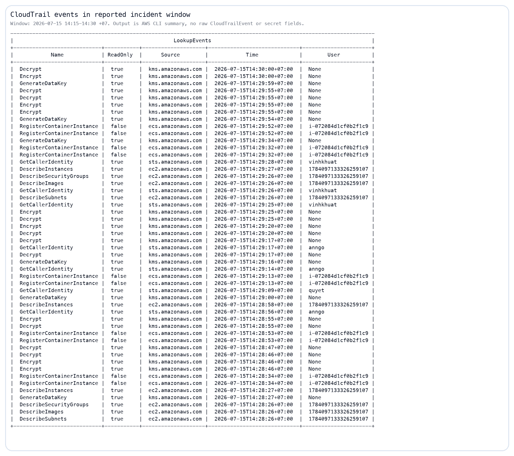
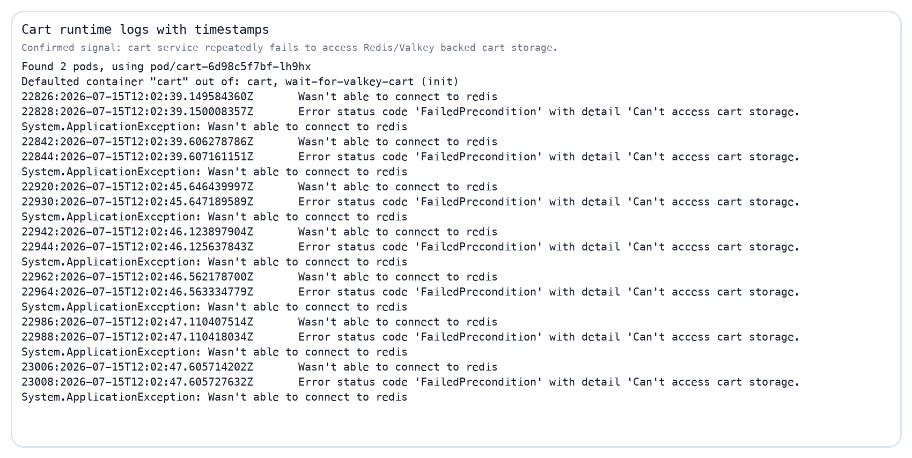
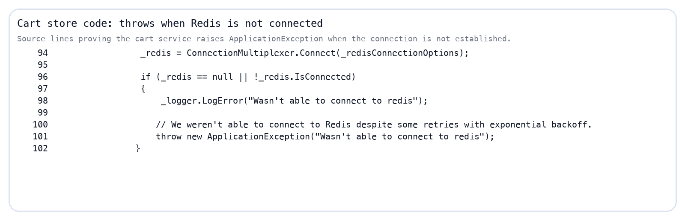
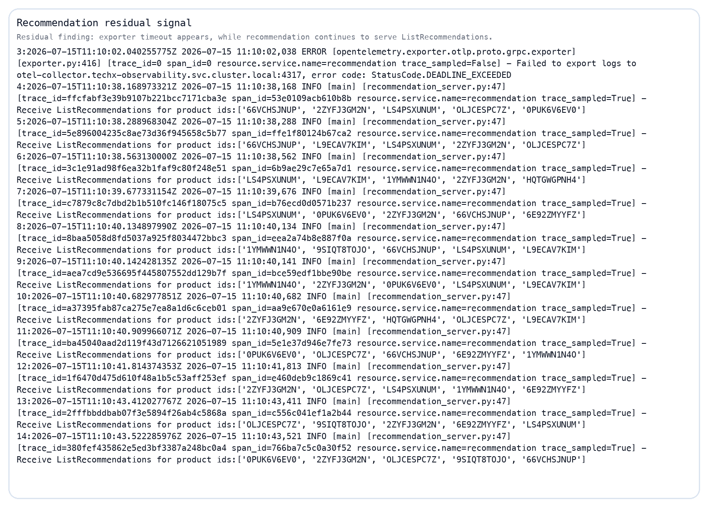
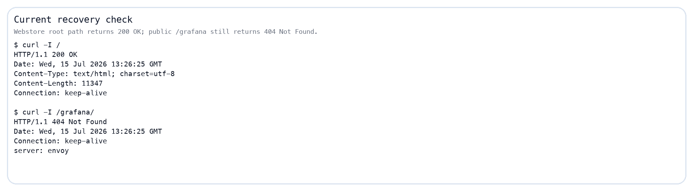

# INCIDENT REPORT — Checkout degradation with cart-storage failure signals
## 2026-07-15 | Reported window 14:15–14:30 ICT / GMT+7

| Field | Value |
|---|---|
| Reported incident window | 2026-07-15 14:15–14:30 ICT / GMT+7 |
| UTC equivalent | 2026-07-15 07:15–07:30 UTC |
| Symptom | Checkout/payment path affected |
| Severity | P1 — checkout/payment path affected |
| Reporter | N/A |
| Investigated by | CDO07 — `TF4-AuditReadOnlyAndAnalyze` |
| Investigation time | 2026-07-15 evening ICT / GMT+7 |
| Status | Investigation documented; root cause confidence marked below |

---

## 1. Executive summary

Trong window 14:15–14:30 ICT / GMT+7, điều tra tập trung vào một failure mode rất phù hợp với triệu chứng checkout/payment path bị ảnh hưởng: **frontend nhận lỗi checkout `cart failure: failed to get user cart`, và cart service có lỗi không truy cập được Redis/Valkey cart storage**.

Tuy nhiên, cần phân biệt rõ:

- **AWS/control-plane audit check trong window 14:15–14:30 ICT / GMT+7:** CloudTrail summary cho thấy không có destructive action rõ ràng.
- **Evidence sau window / post-recovery:** frontend/cart runtime logs và pod snapshot hiện tại.
- **Code-path evidence:** checkout sẽ dừng trước payment nếu không lấy được cart.

Kết luận tốt nhất hiện tại:

> Probable cause là checkout bị chặn bởi lỗi dependency cart/cart-storage. Đây là kết luận có độ tin cậy cao về mặt kỹ thuật, nhưng không phải full forensic proof trong đúng window 14:15–14:30 ICT / GMT+7 vì pod/log hiện tại đã là post-recovery evidence.

---

## 2. Evidence confidence matrix

| Claim | Confidence | Evidence | Ghi chú |
|---|---:|---|---|
| AWS destructive action là nguyên nhân chính | Low | CloudTrail window summary | Không thấy action destructive rõ ràng trong output đã kiểm tra |
| Checkout fail khi không lấy được cart | High | Source code `checkout/main.go` | Code path trực tiếp |
| Frontend nhận lỗi `cart failure: failed to get user cart` | High | Frontend runtime logs | Log này là post-window/post-recovery, không phải exact incident window |
| Cart có lỗi Redis/Valkey connection | High | Cart runtime logs + cart source code | Log này là post-window/post-recovery |
| Cart-storage failure là probable cause of checkout degradation | Medium-High | Ghép checkout symptom + frontend log + cart log + code path | Hợp lý nhưng thiếu log đúng window |
| Recommendation là root cause | Low | Recommendation vẫn serve request sau exporter error | Ghi nhận residual issue, không đủ evidence làm root cause |
| Webstore root path hiện trả 200 OK | High | `curl -I` to public ALB root | Evidence hiện trạng sau hồi phục |

---

## 3. CloudTrail / AWS control-plane evidence

CDO07 kiểm tra CloudTrail theo UTC equivalent 07:15–07:30 UTC (= 14:15–14:30 ICT / GMT+7) như một audit check cho AWS/control-plane.

Kết quả quan sát:

- Có nhiều event đọc/hoạt động thường gặp như `GetCallerIdentity`, `Describe*`, KMS `Encrypt/Decrypt/GenerateDataKey`.
- Có `RegisterContainerInstance` lặp lại từ instance `i-072084d1cf0b2f1c9`.
- Không thấy trong output đã kiểm tra các action destructive rõ ràng như xóa cluster, xóa node group, xóa database, xóa security group, hoặc thay đổi network policy trực tiếp gây outage.

Kết luận phần AWS:

> CloudTrail không chỉ ra AWS/control-plane destructive action là nguyên nhân chính. Sự cố phù hợp hơn với tầng application/dependency.

---

## 4. Application runtime evidence

### 4.1 Frontend saw checkout cart failure

Frontend runtime logs cho thấy request checkout nhận lỗi:

- `cart failure: failed to get user cart during checkout`
- `DeadlineExceeded`
- `ECONNREFUSED` tới dependency service

Ghi chú quan trọng:

> Log này được lấy sau window incident, từ pod hiện tại. Nó là evidence cho failure mode đang tồn tại / tái xuất hiện, không phải bằng chứng tuyệt đối rằng cùng dòng log này xảy ra lúc 14:15–14:30 ICT / GMT+7.

### 4.2 Cart runtime logs show Redis/Valkey access failure

Cart runtime logs cho thấy lỗi lặp lại:

- `Wasn't able to connect to redis`
- `FailedPrecondition`
- `Can't access cart storage`

Ghi chú quan trọng:

> Cart log có timestamp sau reported incident window. Vì vậy đây là post-incident evidence cho cùng failure mode, không phải exact-window forensic log.

Định lượng trên 24h log slice hiện tại:

- frontend có ít nhất **50** dòng `cart failure: failed to get user cart during checkout`
- cart có ít nhất **1460** dòng `Wasn't able to connect to redis`

Con số này không đại diện cho exact incident window, nhưng cho thấy failure mode này không phải một dòng lỗi đơn lẻ.

---

## 5. Code-path evidence

### 5.1 Checkout stops before payment when cart fails

Trong checkout service, `prepareOrderItemsAndShippingQuoteFromCart(...)` gọi `getUserCart(...)`. Nếu `getUserCart(...)` lỗi, checkout trả `cart failure` và dừng trước các bước shipping/payment.

Kết luận:

> Payment không phải điểm gãy đầu tiên nếu checkout fail tại bước lấy cart.

### 5.2 Cart throws when Redis/Valkey connection fails

Trong cart service, `ValkeyCartStore` gọi `ConnectionMultiplexer.Connect(...)`. Nếu connection không establish được, code ném `ApplicationException("Wasn't able to connect to redis")`.

---

## 6. Residual findings

### 6.1 Recommendation residual signal

Recommendation logs có OTLP exporter timeout, nhưng sau đó service vẫn tiếp tục nhận `ListRecommendations`.

Kết luận:

> Recommendation có residual issue cần theo dõi, nhưng evidence hiện tại không đủ để xem nó là root cause của checkout/payment failure.

### 6.2 Observability public access gap

Public ALB path cho Grafana/Jaeger trả 404 tại thời điểm kiểm tra.

Kết luận:

> Đây là observability access gap. Nó không gây checkout fail, nhưng làm quá trình điều tra chậm hơn vì không thể mở radar public trực tiếp.

---

## 7. Recovery status

Tại thời điểm kiểm tra hiện tại:

- webstore root path trả `200 OK`
- `/grafana/` trả `404 Not Found`
- pod trong namespace `techx-tf4` đang `Running`

Kết luận:

> Hệ thống ứng dụng chính đã hồi phục, nhưng public observability vẫn chưa mở. Đây là lý do report nên tách rõ recovery status khỏi incident evidence.

---

## 8. Timeline

| Time (ICT / GMT+7) | Event | Evidence quality |
|---|---|---|
| 14:15–14:30 ICT / GMT+7 | Reported checkout/payment issue | Reported incident window |
| 14:15–14:30 ICT / GMT+7 | CloudTrail checked for AWS/control-plane activity | Direct AWS audit summary |
| Sau window | Public `/grafana` và `/jaeger` checked, trả 404 | Direct curl evidence |
| Sau window | Frontend logs show checkout cart failure | Post-window runtime evidence |
| Sau window | Cart logs show Redis/Valkey connection failure | Post-window runtime evidence |
| Sau window | Source code reviewed to validate dependency path | Static source evidence |

---

## 9. Root cause assessment

### Confirmed facts

- Frontend logs sau window có lỗi checkout `cart failure: failed to get user cart`.
- Cart logs sau window có lỗi không kết nối được Redis/Valkey.
- Checkout source code xác nhận checkout dừng trước payment nếu không lấy được cart.
- CloudTrail window không cho thấy destructive AWS/control-plane action rõ ràng.

### Probable cause

Probable cause là **checkout bị chặn bởi cart/cart-storage dependency failure**.

### Confidence

**Medium-High.**

Lý do không đánh `High` tuyệt đối: runtime logs mạnh nhất hiện là post-window/post-recovery, chưa phải log được trích đúng từ 14:15–14:30 ICT / GMT+7.

---

## 10. What went well

- Tách được symptom được thông báo khỏi root signal kỹ thuật.
- Không quy lỗi sai sang payment khi code path cho thấy checkout có thể dừng trước payment.
- Có CloudTrail để loại trừ bước đầu AWS destructive action.
- Có source-code evidence để giải thích vì sao cart failure chặn checkout.

---

## 11. What did not go well

- Thiếu exact-window app logs cho frontend/checkout/cart.
- Public observability routes không mở được qua ALB.
- Cart-storage failure chưa có alert riêng trong report evidence hiện tại.
- Pod snapshot hiện tại là post-recovery, không đủ làm forensic snapshot của window incident.

---

## 12. Action items

| Action | Owner | Priority | Status |
|---|---|---:|---|
| Lưu report và evidence vào Jira incident/subtask | CDO07 | P1 | Open |
| Bổ sung alert cho cart storage connection failure | Observability / backend | P1 | Open |
| Bổ sung runbook lấy logs đúng incident window trước khi pod bị thay | CDO07 / platform | P1 | Open |
| Kiểm tra lại Valkey/cart service health, endpoint, DNS, connection timeout | Backend / platform | P1 | Open |
| Ghi nhận recommendation OTLP timeout như residual issue | Observability | P2 | Open |
| Cải thiện đường truy cập Grafana/Jaeger hoặc documented port-forward path | Platform / CDO07 | P2 | Open |

---

## 13. Final conclusion

Incident ngày 2026-07-15 là một checkout/payment degradation trong window 14:15–14:30 ICT / GMT+7. Evidence mạnh nhất sau điều tra cho thấy failure mode liên quan đến cart/cart-storage:

- frontend thấy checkout fail vì không lấy được cart;
- cart có lỗi không connect được Redis/Valkey;
- checkout code xác nhận cart failure chặn luồng trước payment.

Kết luận nên dùng khi trình bày:

> Probable cause: checkout bị chặn bởi cart-storage dependency failure. Payment là luồng bị ảnh hưởng, không phải điểm gãy đầu tiên. Do thiếu exact-window app logs, kết luận được ghi ở mức Medium-High confidence thay vì khẳng định tuyệt đối.
