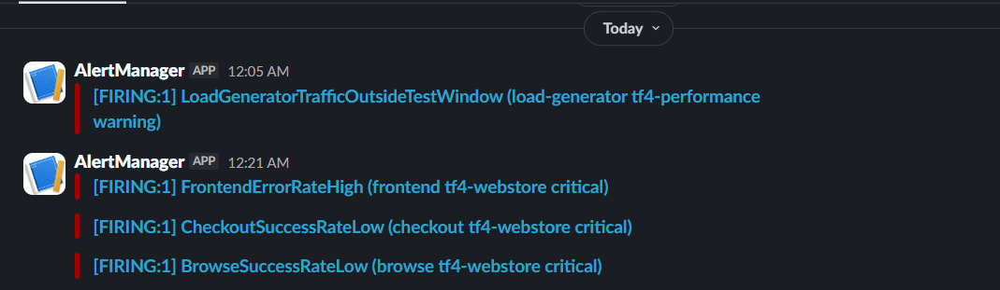
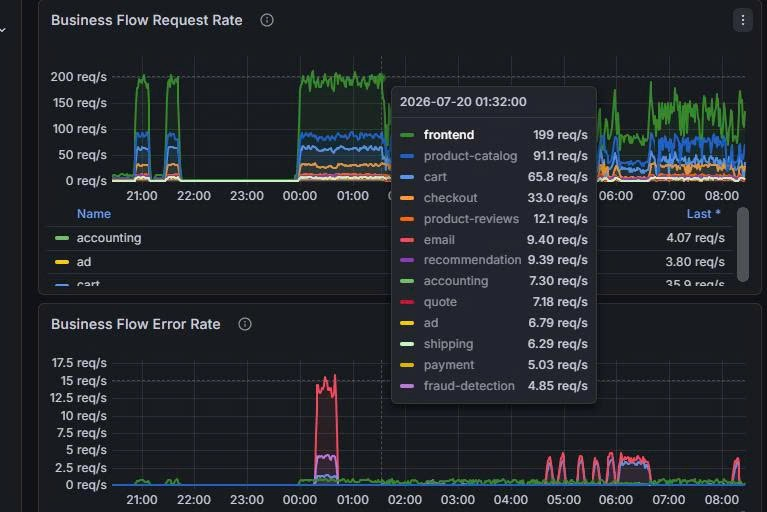
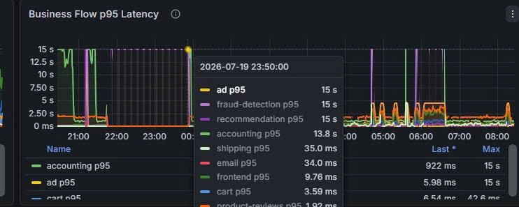
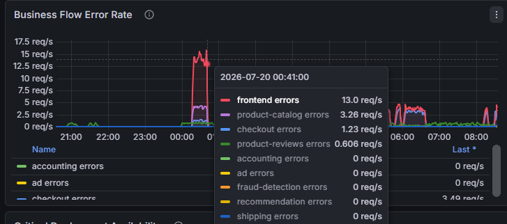

# Báo cáo sự cố: Lỗi browse/checkout và suy giảm telemetry ngày 2026-07-20

**Trạng thái:** Bản báo cáo sự cố  
**Ngày ghi nhận:** 2026-07-20  
**Các giai đoạn ảnh hưởng ghi nhận:** 00:10-00:40, 04:30-06:30, 08:10-09:40 ICT  
**Giai đoạn telemetry bất thường:** 01:30-09:40 ICT  
**Phạm vi:** `tf4-webstore`, namespace `techx-tf4`  
**Người phụ trách báo cáo:** Trần Minh Quang - CDO07 Auditability Team  
**Người review và đánh giá lại báo cáo:** Bùi Thành Nghĩa - CDO07 Auditability Team 

## Tóm tắt

Trong ngày 2026-07-20, hệ thống `tf4-webstore` ghi nhận nhiều cảnh báo quan trọng liên quan đến lỗi frontend, giảm tỷ lệ thành công của luồng checkout và giảm tỷ lệ thành công của luồng browse. Cảnh báo được gửi qua kênh Slack `#alert-k8s`; dashboard business flow đồng thời ghi nhận error rate tăng cao, p95 latency chạm ngưỡng 15 giây ở một số service và request rate tăng mạnh trong nhiều giai đoạn.

Log runtime cho thấy frontend có ba đợt lỗi lớn khi chuẩn bị đơn hàng: 00:10-00:40, 04:30-06:30 và 08:10-09:40 ICT. Product Catalog ghi nhận lỗi timeout và exporter timeout liên tục từ 01:30 ICT, tăng rõ trong các vùng dashboard có spike. Currency và pipeline telemetry ghi nhận lỗi exporter bị từ chối vì mức sử dụng bộ nhớ cao, đặc biệt dày trong khoảng 09:10-09:40 ICT. Tại thời điểm kiểm tra, HPA của Currency đang ở mức `134% / 70% CPU`, đã đạt `3/3` replicas và bị giới hạn scale out do `maxReplicas = 3`.

Kết luận ghi nhận: sự cố ảnh hưởng trực tiếp đến các luồng browse và checkout. Nguyên nhân kỹ thuật cần xử lý nằm ở nhóm phụ thuộc Product Catalog/Currency, năng lực scale của Currency, và tình trạng telemetry bị nghẽn trong lúc hệ thống phát sinh lỗi.

## Bằng chứng hình ảnh

### Alert Slack



Kênh `#alert-k8s` ghi nhận các cảnh báo quan trọng:

- `FrontendErrorRateHigh` cho service `frontend`.
- `CheckoutSuccessRateLow` cho luồng `checkout`.
- `BrowseSuccessRateLow` cho luồng `browse`.

### Dashboard business flow







Các điểm đáng chú ý trên dashboard:

- Tại khoảng 00:41 ICT, `frontend errors` đạt khoảng `13.0 req/s`.
- Cùng thời điểm, `product-catalog errors` đạt khoảng `3.26 req/s`, `checkout errors` khoảng `1.23 req/s`.
- Request rate của `frontend` đạt khoảng `199 req/s` tại 01:32 ICT.
- p95 latency của một số service chạm ngưỡng `15s`, cho thấy hệ thống có độ trễ cao trong giai đoạn ảnh hưởng.
- Dashboard thể hiện lỗi không chỉ xuất hiện tại một thời điểm đơn lẻ, mà lặp lại theo nhiều giai đoạn: đầu sự cố quanh 00:10-00:40, tăng lại từ 04:30-06:30 và tiếp tục cao từ 08:10-09:40 ICT.

## Ảnh hưởng

Sự cố ảnh hưởng đến trải nghiệm người dùng ở hai luồng chính:

- Browse: người dùng có thể gặp lỗi hoặc phản hồi chậm khi xem sản phẩm.
- Checkout: người dùng có thể không hoàn tất được đơn hàng do lỗi khi chuẩn bị đơn hoặc chuyển đổi giá.

Các pod ứng dụng chính vẫn ở trạng thái `Running`, vì vậy đây không phải là sự cố sập toàn bộ hệ thống. Tuy nhiên, lỗi xảy ra trên các luồng nghiệp vụ quan trọng nên cần ưu tiên xử lý và theo dõi sát sau khi khắc phục.

## Diễn biến chính

| Thời điểm ICT | Ghi nhận |
| --- | --- |
| 00:10-00:40 | Frontend bắt đầu đợt lỗi lớn đầu tiên. Log ghi nhận khoảng `1,196` bản ghi lỗi `failed to prepare order` trong giai đoạn này. |
| 00:21 | Slack phát cảnh báo `FrontendErrorRateHigh`. |
| 00:23 | Slack phát cảnh báo `CheckoutSuccessRateLow` và `BrowseSuccessRateLow`. |
| 00:41 | Dashboard ghi nhận error rate tăng mạnh: frontend khoảng `13.0 req/s`, product-catalog khoảng `3.26 req/s`, checkout khoảng `1.23 req/s`. |
| 01:30-04:20 | Product Catalog ghi nhận lỗi telemetry/timeout liên tục, khoảng `31-51` bản ghi log lỗi mỗi 10 phút. |
| 01:32 | Dashboard ghi nhận request rate frontend khoảng `199 req/s`. |
| 04:30-06:30 | Đợt lỗi thứ hai xuất hiện. Frontend ghi nhận khoảng `8,414` bản ghi lỗi `failed to prepare order`; riêng 06:00-06:30 có khoảng `4,282` bản ghi lỗi. Product Catalog cũng tăng lên khoảng `59-118` bản ghi lỗi mỗi 10 phút. |
| 08:10-09:40 | Đợt lỗi thứ ba kéo dài. Frontend ghi nhận lỗi dày từ 08:10, tăng mạnh sau 08:40 và còn tiếp diễn đến 09:40. |
| 09:10-09:40 | Currency ghi nhận telemetry exporter lỗi tăng đột biến. Số bản ghi log lỗi theo từng khoảng 10 phút lần lượt là `174` tại 09:10, `2,558` tại 09:20, `2,823` tại 09:30 và `420` tại 09:40. |

## Bằng chứng log và runtime

### Frontend

Log frontend ghi nhận nhiều lỗi khi chuẩn bị đơn hàng:

```text
Error: 13 INTERNAL: failed to prepare order: failed to convert price of "2ZYFJ3GM2N" to USD
Error: 13 INTERNAL: failed to prepare order: failed to convert price of "0PUK6V6EV0" to USD
Error: 13 INTERNAL: failed to prepare order: failed to convert price of "OLJCESPC7Z" to USD
Error: 13 INTERNAL: failed to prepare order: failed to convert price of "L9ECAV7KIM" to CAD
```

Ý nghĩa: lỗi phát sinh trực tiếp ở luồng chuẩn bị đơn hàng, làm giảm khả năng hoàn tất checkout.

Thống kê theo log frontend cho thấy lỗi xuất hiện theo nhiều đợt:

| Giai đoạn ICT | Số bản ghi log lỗi |
| --- | ---: |
| 00:10-00:40 | 1,196 |
| 04:30-06:30 | 8,414 |
| 08:10-09:40 | 8,980 |

Các bản ghi này được thống kê từ `kubectl logs` theo mẫu `failed to prepare order` và `failed to convert price`. Đây là số bản ghi log lỗi, không phải số request lỗi hay số người dùng bị ảnh hưởng.

### Product Catalog

Log Product Catalog ghi nhận timeout lặp lại:

```text
context deadline exceeded: rpc error: code = DeadlineExceeded desc = context deadline exceeded
stream terminated by RST_STREAM with error code: CANCEL
```

Ý nghĩa: Product Catalog không phản hồi ổn định trong thời gian ảnh hưởng, góp phần làm tăng lỗi browse và làm lan truyền lỗi sang các service phía trên.

Thống kê theo log Product Catalog:

| Giai đoạn ICT | Ghi nhận |
| --- | --- |
| 01:30-04:20 | Lỗi xuất hiện liên tục, khoảng `31-51` bản ghi log lỗi mỗi 10 phút. |
| 04:30-06:30 | Lỗi tăng rõ hơn, khoảng `59-118` bản ghi log lỗi mỗi 10 phút. |
| 08:40-09:40 | Lỗi tiếp tục cao, khoảng `98-125` bản ghi log lỗi mỗi 10 phút. |

### Currency và telemetry

Log Currency và Product Catalog ghi nhận exporter bị từ chối vì bộ nhớ cao:

```text
[OTLP TRACE GRPC Exporter] Export() failed with status_code: "UNAVAILABLE" error_message: "data refused due to high memory usage"
[OTLP LOG GRPC Exporter] Export() failed: data refused due to high memory usage
failed to upload metrics: exporter export timeout: rpc error: code = Unavailable desc = data refused due to high memory usage
```

Ý nghĩa: ngoài lỗi nghiệp vụ, pipeline telemetry cũng bị ảnh hưởng. Điều này làm giảm độ tin cậy của dữ liệu quan sát trong lúc hệ thống đang phát sinh lỗi.

Thống kê theo log Currency cho thấy telemetry exporter tăng lỗi mạnh ở giai đoạn cuối:

| Giai đoạn ICT | Số bản ghi log lỗi trong khoảng 10 phút |
| --- | ---: |
| 09:10 | 174 |
| 09:20 | 2,558 |
| 09:30 | 2,823 |
| 09:40 | 420 |

### HPA Currency

Trạng thái HPA của Currency tại thời điểm kiểm tra:

```text
resource cpu on pods: 134% / 70%
Max replicas: 3
Deployment pods: 3 current / 3 desired
ScalingLimited=True, reason=TooManyReplicas
```

Ý nghĩa: Currency đã vượt ngưỡng CPU mục tiêu, đã scale tới giới hạn tối đa và không thể tăng thêm replica. Đây là một điểm nghẽn rõ ràng cần xử lý.

### Alert và dashboard

Hệ thống đã có đủ ba lớp bằng chứng cho sự cố:

- Alert: Slack `#alert-k8s` ghi nhận các cảnh báo `FrontendErrorRateHigh`, `CheckoutSuccessRateLow`, `BrowseSuccessRateLow`.
- Dashboard: business flow dashboard thể hiện request rate, error rate và p95 latency theo từng service.
- Logs: log frontend, Product Catalog, Currency và telemetry exporter xác nhận lỗi phát sinh ở runtime.

## Nguyên nhân ghi nhận

Dựa trên alert, dashboard và log runtime, sự cố được ghi nhận theo chuỗi sau:

1. Frontend phát sinh lỗi khi chuẩn bị đơn hàng, nổi bật là lỗi không chuyển đổi được giá sản phẩm sang tiền tệ đích.
2. Product Catalog đồng thời ghi nhận nhiều timeout `DeadlineExceeded`, làm tăng lỗi browse và tạo tác động dây chuyền lên các service phụ thuộc.
3. Currency có dấu hiệu quá tải CPU và đã chạm giới hạn scale hiện tại của HPA.
4. Telemetry exporter bị từ chối do mức sử dụng bộ nhớ cao, làm suy giảm khả năng ghi nhận trace, metric và log trong giai đoạn xảy ra sự cố.

Nguyên nhân kỹ thuật cần xử lý ngay là sự kết hợp giữa lỗi phụ thuộc Product Catalog/Currency, giới hạn scale của Currency và nghẽn telemetry khi hệ thống có lỗi tăng cao.

## Giới hạn khi thu thập bằng chứng

Một số dữ liệu Prometheus raw và thao tác truy cập sâu vào pod chưa thu thập được do quyền hiện tại chưa cho phép gọi `services/proxy`, `pods/exec` và Metrics API. Báo cáo này sử dụng các bằng chứng đã xác nhận được từ Slack alert, dashboard ảnh chụp và log trực tiếp bằng `kubectl logs`.

Các quyền cần bổ sung cho lần điều tra sau:

- Quyền đọc Prometheus API để trích xuất truy vấn metric theo khung giờ.
- Quyền `pods/exec` có kiểm soát cho namespace liên quan khi cần kiểm tra runtime.
- Quyền đọc Metrics API để lấy CPU/memory theo pod tại thời điểm sự cố.

## Hành động khắc phục đề xuất

| Mức ưu tiên | Hạng mục | Mục tiêu |
| --- | --- | --- |
| Cao | Tăng `maxReplicas` và kiểm tra resource request/limit của Currency | Loại bỏ điểm nghẽn scale khi CPU vượt ngưỡng. |
| Cao | Kiểm tra luồng gọi từ frontend/checkout sang Currency và Product Catalog | Xác định điểm phát sinh lỗi chuyển đổi giá và timeout. |
| Cao | Tách năng lực telemetry collector khỏi tải ứng dụng chính | Tránh tình trạng exporter bị từ chối khi hệ thống đang lỗi. |
| Trung bình | Bổ sung alert cho HPA `ScalingLimited=True` | Phát hiện sớm service đã chạm giới hạn scale. |
| Trung bình | Bổ sung alert cho OTLP exporter failure và collector high memory | Phát hiện sớm suy giảm telemetry. |
| Trung bình | Bổ sung dashboard riêng cho Currency, Product Catalog và telemetry collector | Theo dõi latency, error rate, CPU, memory và saturation theo service. |
| Thấp | Chuẩn hóa runbook điều tra sự cố browse/checkout | Rút ngắn thời gian xác định nguyên nhân trong các sự cố tương tự. |

## Trạng thái sau điều tra

- Alert Slack hoạt động và đã phát hiện đúng các luồng bị ảnh hưởng.
- Dashboard có đủ tín hiệu request rate, error rate và latency để xác định khung giờ ảnh hưởng.
- Log runtime xác nhận lỗi ở frontend, Product Catalog, Currency và telemetry.
- Cần xử lý giới hạn scale của Currency và năng lực telemetry để giảm rủi ro lặp lại.
