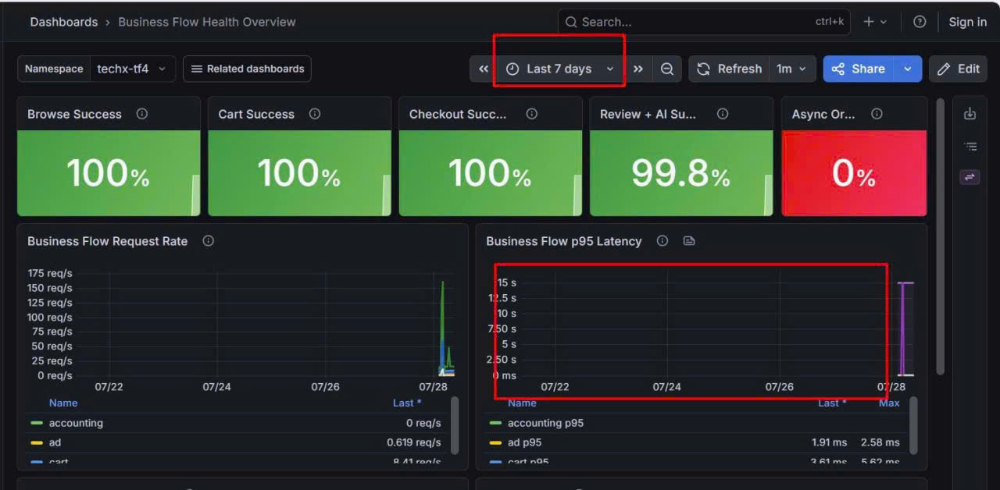

# Báo cáo sự cố: Prometheus mất metrics lịch sử sau storage lifecycle migration

**Issue:** [#723](https://github.com/TF4-Phase3-TechX/tf4-phase3-repo/issues/723)

**Ngày ghi nhận:** 2026-07-28

**Namespace:** `techx-observability`

**Thành phần:** Grafana, Prometheus, Kubernetes PVC/PV, AWS EBS

**Mức độ:** Medium — không làm gián đoạn customer-facing traffic nhưng làm mất khả năng quan sát lịch sử

**Trạng thái:** Đã xác định candidate former Prometheus volume; chưa xác minh nội dung TSDB hoặc thực hiện recovery live

---

## 1. Executive summary

Grafana không hiển thị metrics trong phần lớn cửa sổ **Last 7 days**; các time series chỉ bắt đầu xuất hiện lại gần ngày 2026-07-28. Kiểm tra live cho thấy Prometheus đang dùng một PVC/EBS volume mới được tạo ngày 2026-07-27, trong khi EBS volume cũ tạo ngày 2026-07-16 đã bị detach nhưng vẫn còn ở trạng thái `available`.

Prometheus vẫn cấu hình retention `7d`; việc dữ liệu biến mất tại một ranh giới đột ngột không phù hợp với expiration dần theo retention. Runtime evidence cho thấy PVC `prometheus` đã được recreate và bind sang một EBS volume mới được provision. Đây là điều kiện trực tiếp khiến Prometheus hiện tại không còn đọc các blocks trên former volume. Historical TSDB data có thể vẫn còn trên former volume, nhưng cần mount snapshot/clone read-only để xác minh.

Không xóa volume cũ `vol-051c0352bdfaceb5d`. Recovery phải được thực hiện trong change window, sau khi snapshot và có phê duyệt của platform owner.

## 2. User-visible impact

- Dashboard **Business Flow Health Overview** trống dữ liệu từ khoảng 2026-07-22 đến trước thời điểm volume mới bắt đầu nhận samples.
- Các phép tính SLO, latency, request rate và điều tra incident dựa trên historical range bị thiếu dữ liệu.
- Stat panels vẫn có thể hiển thị giá trị gần nhất, nên không phản ánh rõ khoảng trống lịch sử nếu chỉ nhìn trạng thái hiện tại.
- Không có bằng chứng cho thấy application traffic hoặc dữ liệu giao dịch bị mất.

### Grafana evidence



_Hình 1 — Dashboard `Business Flow Health Overview`, namespace `techx-tf4`, chọn `Last 7 days`; request-rate và p95-latency series chỉ xuất hiện sát ngày 28/07. Ảnh do người báo cáo sự cố cung cấp trong phiên điều tra ngày 2026-07-28; timestamp capture gốc không có trong metadata. Các khung đỏ đã có trong ảnh được cung cấp để nhấn mạnh time range và khoảng trống, không làm thay đổi dữ liệu panel. Biểu hiện đồng thời trên nhiều series phù hợp với storage/TSDB discontinuity, nhưng riêng ảnh này không loại trừ mọi lỗi query hoặc datasource._

## 3. Timeline

| Thời gian (UTC) | Sự kiện |
|---|---|
| 2026-07-16 16:33:38 | EBS volume cũ `vol-051c0352bdfaceb5d` được tạo cho PVC `techx-observability/prometheus`. |
| 2026-07-24 19:33:30 | Commit `628b66e1` bổ sung vòng đời gp3, `gp3-retain` và cấu hình Prometheus dùng `existingClaim: prometheus` (author timestamp `2026-07-25T02:33:30+07:00`). |
| 2026-07-27 19:11:19 | PVC `prometheus` hiện tại được tạo với UID `ea652ab7-02d5-40eb-be05-8f922df2f6c9`. |
| 2026-07-27 19:11:21 | EBS volume mới `vol-03364cc7d0cb2fd35` được provision cho PVC mới. |
| 2026-07-27 19:33 | Prometheus khởi động, replay WAL trên volume mới và bắt đầu tạo TSDB blocks mới. |
| 2026-07-28 | Grafana được ghi nhận chỉ còn metrics từ thời điểm volume mới hoạt động. |

## 4. Runtime evidence

### 4.1 PVC và mount hiện tại

```text
NAME         STATUS   VOLUME                                     CAPACITY   STORAGECLASS
prometheus   Bound    pvc-ea652ab7-02d5-40eb-be05-8f922df2f6c9   20Gi       gp3-retain
```

PVC live có:

```yaml
creationTimestamp: "2026-07-27T19:11:19Z"
spec:
  storageClassName: gp3-retain
  volumeName: pvc-ea652ab7-02d5-40eb-be05-8f922df2f6c9
```

Deployment hiện mount đúng PVC mới vào `/data`:

```text
storage-volume pvc=prometheus
container=prometheus-server mount=storage-volume:/data
```

### 4.2 EBS volume inventory

| Vai trò | Volume ID | Trạng thái | Created (UTC) | Kubernetes PV identity |
|---|---|---|---|---|
| Candidate former Prometheus volume | `vol-051c0352bdfaceb5d` | `available` | 2026-07-16 16:33:38 | `pvc-efca0cc7-6cb1-4793-8864-d4c6e46a2fe7` |
| Current TSDB | `vol-03364cc7d0cb2fd35` | `in-use` | 2026-07-27 19:11:21 | `pvc-ea652ab7-02d5-40eb-be05-8f922df2f6c9` |

Cả hai volume đều có tag:

```text
kubernetes.io/created-for/pvc/name=prometheus
kubernetes.io/created-for/pvc/namespace=techx-observability
```

Former volume ở trạng thái `available`, thay vì bị xóa. Trạng thái này phù hợp với retention behavior của StorageClass có `reclaimPolicy: Retain`, nhưng chưa đủ để xác nhận nội dung filesystem hoặc TSDB blocks còn recoverable. Role audit không đọc được cluster-scoped PV nên chưa kiểm tra được reclaim state và claim history ở Kubernetes.

### 4.3 Prometheus startup evidence

Prometheus bắt đầu TSDB trên volume hiện tại vào khoảng `2026-07-27T19:33Z`:

```text
time=2026-07-27T19:33:32.250Z level=INFO msg="WAL replay completed"
time=2026-07-27T19:33:32.338Z level=INFO msg="TSDB started"
time=2026-07-27T19:33:32.340Z level=INFO msg="TSDB retention updated" duration=1w
```

`duration=1w` xác nhận retention đang là bảy ngày. Expiration theo retention không phù hợp với ranh giới dữ liệu đột ngột quan sát trên nhiều series; volume replacement là lời giải thích nhất quán hơn với runtime evidence hiện có.

## 5. Root cause analysis

### Direct cause

PVC `techx-observability/prometheus` đã bị recreate và dynamic provision sang một EBS volume mới. Prometheus hiện chỉ đọc dữ liệu trên volume mới; dashboard cho thấy dữ liệu khả dụng bắt đầu sát thời điểm replacement. Evidence chưa chứng minh volume hoàn toàn rỗng tại thời điểm tạo, nhưng không ghi nhận historical blocks trước cutover trên datasource hiện tại.

### Relevant configuration context

Commit `628b66e196c4f575c2b0be091ba3adf1047522e5` (`feat(observability): add gp3 storage lifecycle`) giới thiệu `gp3-retain` và đặt cấu hình tương lai của Prometheus thành:

```yaml
persistentVolume:
  enabled: true
  existingClaim: prometheus
  storageClass: gp3-retain
```

Mục tiêu được ghi trong commit là reuse claim hiện hữu, không phải recreate PVC. Khi `existingClaim` được dùng, cấu hình `storageClass` không tự chứng minh rằng Helm/ArgoCD đã mutate hoặc thay thế claim. `storageClassName` của một PVC đã tạo là immutable, nhưng evidence hiện có chưa xác định controller, user hoặc quy trình nào đã thực hiện replacement ngày 27/07. Vì vậy commit này chỉ là configuration context gần sự cố, chưa được xác nhận là causal mechanism.

### Root-cause boundary

Evidence hiện có xác nhận **PVC recreation và volume replacement** là điều kiện trực tiếp khiến Prometheus hiện tại không còn truy cập former volume. Kết hợp với ranh giới dữ liệu trên Grafana, đây là nguyên nhân có bằng chứng mạnh nhất của historical-metrics gap. Role audit không có quyền đọc ArgoCD Application hoặc cluster-scoped PV/audit events, vì vậy báo cáo chưa quy kết thao tác delete/recreate cho một user, controller hay lệnh cụ thể. Cần EKS audit log/CloudTrail correlation để hoàn tất attribution và loại trừ hoàn toàn các yếu tố query/datasource đồng thời.

## 6. Recovery plan

> Không thực hiện trực tiếp từ tài liệu này. Mọi bước write/delete/rebind cần change approval, backup và platform owner.

1. Đặt protection tag và tuyệt đối không xóa hoặc attach trực tiếp `vol-051c0352bdfaceb5d` vào production workload.
2. Tạo EBS snapshot của cả former volume và current volume. Ghi lại snapshot ID, AZ, filesystem, volume size, encryption/KMS và rollback owner.
3. Tạo clone từ hai snapshots trong AZ phù hợp; mọi forensic inspection và recovery thử nghiệm chỉ dùng clones, giữ nguyên hai source volumes.
4. Mount clones read-only vào isolated helper workload để xác minh filesystem, ownership, Prometheus TSDB version, `wal`, `chunks_head`, ULID block directories, block min/max time và overlap. Nếu former clone không có blocks trước 27/07, dừng recovery.
5. Chọn chiến lược sau khi platform/reliability owner review kết quả:
   - **Forensic access:** sau bước inspection read-only, tạo thêm một disposable working clone từ snapshot và chạy Prometheus cô lập trên clone đó với quyền ghi cần thiết cho lock/runtime files. Không thay production PVC; metrics trước và sau cutover được truy vấn từ hai datasource riêng. Không dùng source volume hoặc inspection clone làm writable target.
   - **Merged recovery:** dùng clone của current volume làm recovery target; khi Prometheus đã scale về `0`, chỉ nhập các immutable, non-overlapping block directories đã được kiểm tra từ former clone. Không copy active WAL hoặc `chunks_head`. Validate block ranges và TSDB compatibility bằng tooling/procedure được owner phê duyệt trước khi cutover.
6. Chỉ sau khi merged target pass offline validation, tạo static PV/PVC trỏ đến recovered clone. Xác minh CSI driver, AZ/PV node affinity, access mode, filesystem permissions và `reclaimPolicy: Retain` trước khi start Prometheus.
7. Scale Prometheus lên `1`; kiểm tra `/-/ready`, startup/repair/corruption logs, historical queries và ingestion mới. Nếu validation fail, scale xuống và rebind current-volume clone theo rollback plan.
8. Xác minh Grafana, alert evaluation và recording rules. Giữ cả source snapshots và rollback clone cho đến khi owner ký xác nhận recovery.

## 7. Verification checklist

- [ ] Snapshot của former volume và current volume hoàn tất; source volumes không bị attach hoặc mutate.
- [ ] Former-volume clone được mount read-only và xác nhận có TSDB blocks trước 27/07.
- [ ] Đã ghi nhận TSDB version, block min/max time, overlap, AZ, node affinity, filesystem và permissions.
- [ ] Prometheus `Running 2/2`, không có mount, corruption hoặc repair error.
- [ ] Với merged recovery, query `up` và business-flow metrics trả về samples xuyên qua thời điểm 27/07 mà không trùng blocks.
- [ ] Với forensic access, cả historical datasource và current datasource đều query được đúng time range tương ứng.
- [ ] Grafana hiển thị dữ liệu 16/07–27/07 qua recovery mode đã được phê duyệt.
- [ ] Ingestion mới tiếp tục sau recovery, không tạo khoảng trống mới.
- [ ] Alert rules và recording rules evaluate bình thường.

## 8. Preventive actions

| Priority | Action | Acceptance criteria |
|---|---|---|
| P0 | Cấm tự động delete/recreate PVC Prometheus trong storage migration. | Pipeline fail nếu rendered PVC đổi immutable `storageClassName` hoặc claim identity. |
| P0 | Snapshot trước mọi PVC/PV migration. | Change ticket chứa snapshot ID và restore test/check. |
| P1 | Alert khi PVC UID hoặc Prometheus storage identity thay đổi. | Alert chứa namespace, claim, old/new UID. |
| P1 | Thêm post-sync historical query canary. | Query range trước rollout vẫn có samples sau rollout. |
| P1 | Thu thập EKS audit events cho PVC delete/create và PV release. | Xác định được actor/controller cùng timestamp. |
| P2 | Ghi rõ runbook static rebind và TSDB block recovery. | Runbook được platform/reliability owner review. |

## 9. Reproduction commands (read-only)

```bash
export AWS_PROFILE=TF4-AuditReadOnlyAndAnalyze

kubectl -n techx-observability get pods,pvc -o wide
kubectl -n techx-observability get pvc prometheus -o yaml
kubectl -n techx-observability get deploy prometheus -o yaml

aws ec2 describe-volumes \
  --region us-east-1 \
  --volume-ids vol-051c0352bdfaceb5d vol-03364cc7d0cb2fd35

kubectl -n techx-observability logs deploy/prometheus \
  -c prometheus-server --since=24h \
  | grep -Ei 'WAL replay|TSDB started|retention|corrupt|repair'
```

## 10. Current limitations

Role `TF4-AuditReadOnlyAndAnalyze` cho phép đọc namespaced pod/PVC và AWS EBS inventory nhưng không cho phép:

- list cluster-scoped PersistentVolumes;
- đọc ArgoCD `Application` trong namespace `argocd`;
- `pods/exec`, `pods/portforward` hoặc `services/proxy` để truy cập Grafana nội bộ.

Do đó recovery chưa được thực hiện. Ảnh Grafana là artifact do người báo cáo cung cấp trong phiên điều tra, không phải ảnh được role audit thu trực tiếp qua Grafana. Các thao tác live tiếp theo phải dùng role được phê duyệt trong change window.
