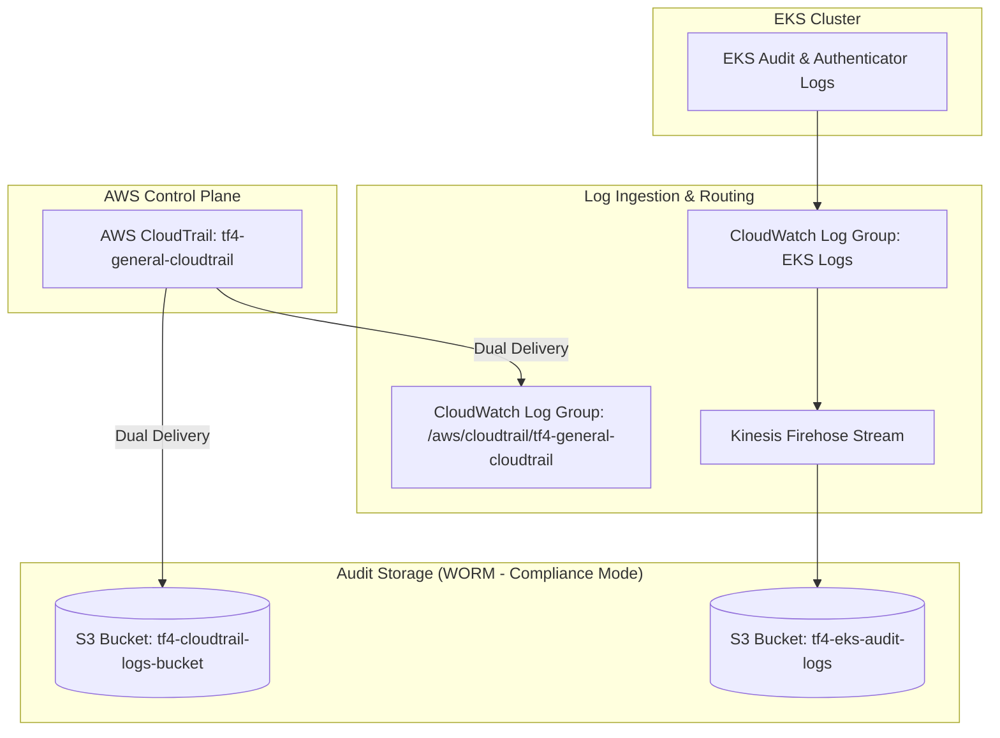
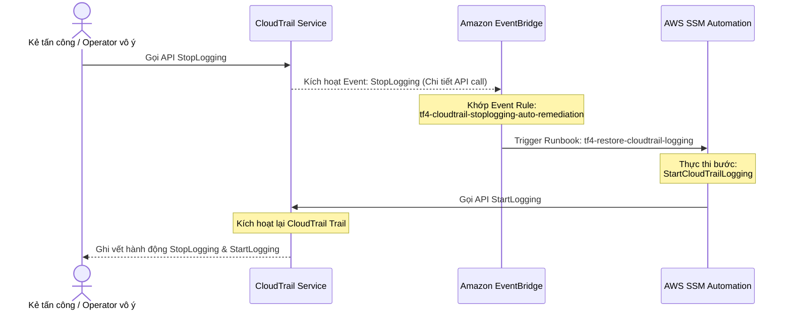

# Auditability Architecture & Capabilities Report

**Đơn vị chủ trì:** Nhóm CDO-07 (Audit)  
**Đơn vị tiếp nhận:** Nhóm CDO-04 & Nhóm CDO-08  
**Ngày lập:** 28/07/2026  
**Trạng thái:** Bản thảo hiện trạng hạ tầng (Draft)

---

## Giới thiệu chung
Tài liệu này tổng hợp cấu trúc hạ tầng kiểm toán (Auditability) hiện tại do nhóm CDO-07 quản lý, nhằm minh bạch hóa khả năng giám sát, ghi log và cơ chế tự khôi phục (Self-healing) bảo vệ luồng bằng chứng (evidence) cho các nhóm CDO-04 và CDO-08.

---

## 1. Kiến trúc & Hạ tầng đã triển khai (Auditability Architecture)

### 1.1. Sơ đồ luồng log (Log Flow Architecture)

Hạ tầng ghi vết bảo vệ luồng bằng chứng kiểm toán cho toàn bộ TF4 được cấu trúc như sơ đồ dưới đây:

#### Chi tiết kỹ thuật của từng thành phần:

1. **AWS CloudTrail (`tf4-general-cloudtrail`)**:
   - **Ghi log đa vùng (Multi-region trail)**: Bật ghi log trên toàn bộ các vùng AWS hoạt động của TF4.
   - **Mã hóa chuyên dụng**: Sử dụng khóa KMS CMK riêng (`aws_kms_key.cloudtrail`, alias `alias/tf4-cloudtrail-key`) hỗ trợ rotation tự động, tách biệt hoàn toàn với khóa mã hóa của EKS.
   - **Kiểm tra tính toàn vẹn (Tamper-evident)**: Bật tính năng xác thực file log (`enable_log_file_validation = true`). AWS CloudTrail sẽ tự động tạo các digest file có chữ ký số (SHA-256 và chữ ký RSA) mỗi giờ, cho phép chạy lệnh `aws cloudtrail validate-logs` để phát hiện bất kỳ hành vi sửa đổi log nào.
   - **Lưu trữ đồng thời (Dual Destination)**: 
     - Gửi về **S3 Bucket** để lưu trữ lâu dài phục vụ audit.
     - Đẩy về **CloudWatch Logs** phục vụ điều tra nhanh (Forensics) qua CloudWatch Log Insights UI trong vòng dưới 10 phút.

2. **S3 Audit Buckets (CloudTrail Logs & EKS Audit Logs)**:
   - **S3 Object Lock (Compliance Mode)**: Cả hai bucket logs đều được bật Object Lock ở chế độ **COMPLIANCE với thời gian lưu trữ (Retention) là 90 ngày**. 
     > [!IMPORTANT]
     > Trong chế độ **COMPLIANCE (strict WORM)**, không một ai kể cả root account hay các operator có quyền thu hồi, giảm thời gian retention, hay xóa các logs đã được ghi trong vòng 90 ngày.
   - **Versioning**: Bắt buộc kích hoạt để duy trì lịch sử phiên bản của các file log.
   - **Chặn truy cập công khai (Public Access Block)**: Chặn hoàn toàn truy cập public.
   - **Chính sách bảo vệ nghiêm ngặt (Bucket Policy)**: 
     - `DenyNonAdminDeleteObject`: Cấm hoàn toàn mọi hành vi xóa logs (`s3:DeleteObject`, `s3:DeleteObjectVersion`) đối với bất kỳ ai (trừ root account và Terraform deployment role).
     - `DenyDisableVersioning`: Cấm tắt tính năng versioning của bucket.
     - `DenyHTTPInsecureTransport`: Bắt buộc kết nối qua HTTPS.

3. **EKS Audit Logs Flow**:
   - Stream log điều khiển EKS (Audit & Authenticator logs) từ CloudWatch Logs đi qua **Kinesis Data Firehose** để nạp trực tiếp vào S3 Bucket (`tf4-eks-audit-logs-<account-id>`) nhằm giảm tải cho hệ thống lưu trữ Kubernetes cục bộ và đảm bảo tính bất biến của log ứng dụng/hạ tầng Kubernetes.

---

### 1.2. Cơ chế tự phục hồi chống mù log (Anti-Blinding Self-Healing)

Nhằm chống lại các cuộc tấn công vô hiệu hóa hệ thống kiểm toán (Anti-Blinding), CDO-07 triển khai cơ chế tự động phát hiện và khôi phục hoạt động của CloudTrail bằng cách kết hợp **EventBridge Rule** và **SSM Automation**.

- **Quy trình hoạt động**:
  1. **Phát hiện**: EventBridge Rule (`tf4-cloudtrail-stoplogging-auto-remediation`) liên tục giám sát API event `StopLogging` từ nguồn `cloudtrail.amazonaws.com`.
  2. **Kích hoạt tự động**: Khi sự kiện `StopLogging` xảy ra, EventBridge sẽ lập tức trigger SSM Automation document (`tf4-restore-cloudtrail-logging`).
  3. **Tự phục hồi**: SSM Runbook sử dụng IAM Role chuyên biệt (`tf4-cloudtrail-auto-remediation-automation-role`) thực thi lệnh khôi phục `cloudtrail:StartLogging`.
- **Hiệu quả thực tế**: Quá trình tự động khôi phục hoàn tất trong vòng **1 đến 3 giây**, hạn chế tối đa cửa sổ mù log (log blinding window) của hệ thống.

---

## 2. Ma trận khả năng kiểm toán (Audit Capability Matrix)

Dưới đây là bảng ma trận kiểm toán chi tiết của hạ tầng CDO-07:

| Đối tượng ghi vết | Loại dữ liệu ghi vết | Cơ chế ghi log | Thời gian lưu trữ (Retention) | Trạng thái / Ghi chú |
| :--- | :--- | :--- | :--- | :--- |
| **Management Events** | Các sự kiện quản trị (Create, Update, Delete, Describe, List) trên tài khoản AWS. | AWS CloudTrail (`advanced_event_selector` dạng `Management`) | 90 ngày (S3 Object Lock COMPLIANCE) 7 ngày (CloudWatch Logs để query nhanh) | **ĐÃ HOẠT ĐỘNG** (Log tất cả các Management events cả read-only và write-only) |
| **S3 Data Events (Read/Write)** | Các thao tác truy cập dữ liệu (`GetObject`, `PutObject`, `DeleteObject`) trên các bucket nhạy cảm. | AWS CloudTrail (`advanced_event_selector` dạng `Data`) | 90 ngày (S3 Object Lock COMPLIANCE) | **ĐÃ HOẠT ĐỘNG** (Ghi vết cho các bucket: AWS Config, CloudTrail Logs, PostgreSQL Backups, MSK Orders, EKS Audit Logs, và Terraform State bucket) |
| **Secrets Manager Data Events** | Các truy vấn đọc secrets nhạy cảm (`GetSecretValue`). | AWS CloudTrail (ghi nhận qua Management events) kết hợp EventBridge Alerts | 90 ngày (S3 Object Lock COMPLIANCE) | **ĐÃ HOẠT ĐỘNG** (Có tích hợp cảnh báo bất thường tần suất gọi `GetSecretValue` qua CloudWatch Alarm/Slack Alerts - MANDATE-11 H2) |
| **EKS Control Plane Audit Logs** | Lịch sử truy cập API Server của Kubernetes Cluster (Audit, Authenticator). | K8s control plane logs -> CloudWatch -> Firehose -> S3 | 90 ngày (S3 Object Lock COMPLIANCE) | **ĐÃ HOẠT ĐỘNG** (Đảm bảo an toàn luồng log của cluster Kubernetes) |

---

## 3. Khuyến nghị & Phối hợp

Để đảm bảo khả năng phối hợp hiệu quả nhất giữa CDO-07, CDO-04 và CDO-08:
- **Nhóm CDO-04 & CDO-08** cần đảm bảo mọi ứng dụng nghiệp vụ khi lưu trữ tài liệu mật hoặc cấu hình ứng dụng trên AWS S3 và AWS Secrets Manager đều tuân thủ việc phân quyền IAM theo nguyên tắc đặc quyền tối thiểu (Least Privilege).
- Mọi cảnh báo về việc gọi API bất thường đối với Secrets Manager hoặc các hành vi tắt log sẽ được gửi tự động qua kênh Slack cảnh báo chung của dự án để các nhóm cùng phối hợp ứng cứu sự cố.
