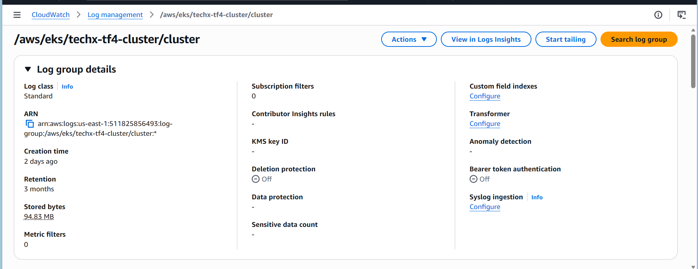

# 📑 ARCHITECTURAL & IMPLEMENTATION SPECIFICATION: AUDIT-001

## 1. Thông tin chung (Metadata)

| Thuộc tính | Giá trị |
|------------|---------|
| **Mã Task** | `AUDIT-001` |
| **Tiêu đề** | Kích hoạt EKS Control Plane Logging và cấu hình luồng lưu trữ dài hạn sang S3 |
| **Đội ngũ bàn giao** | Team CDO-07 (Auditability) |
| **Đội ngũ tiếp nhận** | Team CDO-08 (Infrastructure / DevOps) |
| **Mức độ ưu tiên** | 🔴 High (Yêu cầu nền tảng phục vụ kiểm toán và vận hành Phase 3) |

---

## 2. Bối cảnh & Rủi ro hệ thống (Context & Risk)

Hiện tại, cụm EKS **`techx-tf4`** chưa được kích hoạt tính năng ghi nhật ký của phân hệ **Control Plane**. Nếu duy trì trạng thái này, hệ thống sẽ đối mặt với các rủi ro nghiêm trọng thuộc trụ cột **Auditability**:

- Toàn bộ các hành vi can thiệp sâu vào cluster như:
  - Chỉnh sửa phân quyền RBAC
  - Truy cập đọc Secrets
  - Thực thi lệnh trực tiếp vào Pod (`kubectl exec`)
  - Patch cấu hình Deployment

  sẽ **không thể truy vết**.

- Khi xảy ra sự cố bảo mật hoặc lỗi cấu hình khiến ứng dụng ngừng hoạt động, team **CDO-07** và đội ngũ vận hành sẽ **không có dữ liệu Raw Logs** để thực hiện **Root Cause Analysis (RCA)**.

---

## 3. Yêu cầu triển khai kỹ thuật (Technical Requirements)

### 3.1. Kích hoạt EKS Control Plane Logging

Nhờ team **CDO-08** cấu hình bật toàn bộ **5 luồng log** của EKS Control Plane:

- `api`
- `audit`
- `authenticator` 
- `controllerManager` (optional)
- `scheduler`(optional)

> **Lưu ý**
>
> Nếu quản lý hạ tầng bằng Terraform, vui lòng cập nhật thuộc tính `enabled_cluster_log_types` trong resource `aws_eks_cluster` để tránh **Configuration Drift**.

**AWS CLI tham khảo**

```bash
aws eks update-cluster-config \
  --name techx-tf4 \
  --logging '{"clusterLogging":[{"types":["api","audit","authenticator","controllerManager","scheduler"],"enabled":true}]}'
```

---

### 3.2. Cấu hình Retention & Cost Optimization

Để tránh chi phí lưu trữ không giới hạn trên **CloudWatch Logs**:

- Thiết lập **Retention Period** của Log Group:

```text
/aws/eks/techx-tf4-cluster/cluster
```

- Giá trị khuyến nghị:
  - ✅ 14 ngày (ưu tiên)
  - ✅ Tối đa 30 ngày

Khoảng thời gian này đủ để team **CDO-07** thực hiện các truy vấn nóng bằng **CloudWatch Logs Insights**, đồng thời vẫn đảm bảo tối ưu chi phí.
Tuy nhiên vì 
---

### 3.3. Thiết lập Long-term Storage Pipeline

Thiết lập cơ chế tự động chuyển log từ CloudWatch Logs sang S3.

Có thể sử dụng một trong các phương án:

- CloudWatch Subscription Filter + Kinesis Firehose
- AWS Lambda định kỳ
- CloudWatch Export Task

Nguồn dữ liệu:

```text
/aws/eks/techx-tf4-cluster/cluster
```

Đích lưu trữ:

```text
tf4-cdo07-audit-log
```

**Mục tiêu**

- Đảm bảo **Log Integrity**
- Lưu giữ log **1 năm**
- Phục vụ yêu cầu **Compliance**
- Team CDO-07 sẽ quản lý vòng đời dữ liệu sang **Glacier Deep Archive** theo chính sách đã cấu hình.
---

## 3.4. Dự báo chi phí vận hành (Estimated Cost Projection)

Để phục vụ quá trình lập ngân sách và thống nhất với **Team Cost**, dưới đây là bảng dự báo chi phí lưu trữ log EKS Control Plane của cụm **`techx-tf4`**.

> **Lưu ý**
>
> Đây là các giá trị **ước tính** dựa trên mức sử dụng hiện tại và các kịch bản vận hành dự kiến. Chi phí thực tế có thể thay đổi tùy theo lưu lượng truy cập, số lượng API requests và chính sách giá của AWS tại thời điểm triển khai.

| Kịch bản vận hành | Dung lượng log ước tính / ngày | Chi phí Ingestion / ngày | Chi phí / tháng (30 ngày) | Ý nghĩa thực tế |
|-------------------|-------------------------------:|--------------------------:|--------------------------:|----------------|
| **1. Trạng thái nghỉ (Idle Baseline)** | ~47 MB | ~**$0.023** | ~**$0.70** | Chi phí nền bắt buộc khi cụm EKS hoạt động nhưng không có người tương tác. Phần lớn log phát sinh từ các thành phần nội bộ của AWS và Control Plane. |
| **2. Giai đoạn Dev / Thay đổi cấu hình** | ~500 MB | ~**$0.25** | ~**$7.50** | Khi team CDO-08 triển khai hoặc cập nhật Deployment, team CDO-07 kiểm thử RBAC, Secrets, `kubectl`,... lượng log audit và API sẽ tăng đáng kể. |
| **3. Giai đoạn Load Test (Peak Load)** | ~3–5 GB | **$1.50 – $2.50** | **$45.00 – $75.00** | Khi thực hiện stress test hoặc benchmark trên toàn bộ hệ thống (~13 services), lượng Audit Log và API Log tăng mạnh do ghi nhận hàng triệu request từ Control Plane. |


### Đề xuất

- Team **CDO-07** đề nghị Team **Cost** sử dụng bảng dự báo trên làm cơ sở xác định ngân sách vận hành cho hạng mục **EKS Control Plane Logging**.
- Trong giai đoạn vận hành thông thường, chi phí dự kiến dao động khoảng **$1–8 USD/tháng**.
- Chi phí chỉ tăng lên mức **$45–75 USD/tháng** khi thực hiện các đợt **Load Test** hoặc kiểm thử hiệu năng với cường độ cao và kéo dài.
- Sau khi log được chuyển sang S3 và áp dụng Lifecycle sang **Glacier Deep Archive**, chi phí lưu trữ dài hạn sẽ thấp hơn đáng kể so với việc giữ toàn bộ dữ liệu trên CloudWatch Logs.
---

## 4. Tiêu chuẩn nghiệm thu (Definition of Done)

Team **CDO-07** sẽ nghiệm thu ticket khi toàn bộ các điều kiện sau được đáp ứng.

### ☐ DoD #1 - Control Plane Logging đã được bật

Lệnh sau phải trả về trạng thái **`enabled = true`** cho cả 5 loại log.

```bash
aws eks describe-cluster \
  --name techx-tf4 \
  --query 'cluster.logging'
```

---

### ☐ DoD #2 - CloudWatch Log Group

Xác nhận Log Group:

```text
/aws/eks/techx-tf4-cluster/cluster
```

đã xuất hiện trên CloudWatch Logs với:

- Retention = **14 hoặc 30 ngày**
- **Không** để trạng thái **Never Expire**

---

### ☐ DoD #3 - Đồng bộ thành công sang S3

Xác nhận:

- Log đã được chuyển tới S3 Bucket:

```text
tf4-cdo07-audit-log
```

- Các tệp log được mã hóa bằng CMK:

```text
tf4-cdo07-audit-cmk
```

---

### ☐ DoD #4 - Evidence

Đính kèm một trong các bằng chứng sau lên Jira Ticket:

- Ảnh chụp AWS Console
- Kết quả truy vấn thành công từ CloudWatch Logs
- Bằng chứng dữ liệu đã xuất hiện trong S3