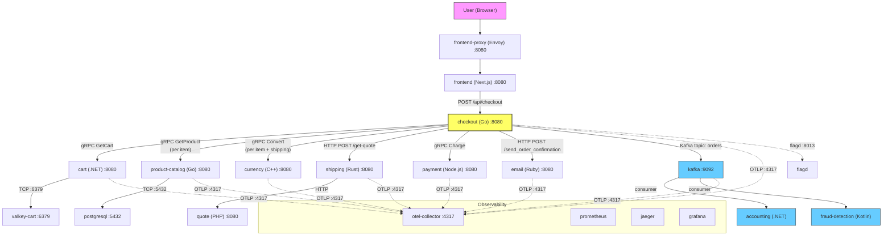

# Checkout Dependency Map

**Task:** CDO08-10 — Map checkout request path và dependencies
**Owner:** Quân
**Pillar:** Reliability
**Priority:** P0
**Date:** 2026-07-08

---

## 1. Checkout Request Flow



---

## 2. PlaceOrder Execution Order (Sequential Path)

The `PlaceOrder` gRPC handler in `checkout/main.go` runs these steps **in order**:

| Step | Function | Downstream Call | Protocol | Sync/Async | Failure Impact |
|---|---|---|---|---|---|
| 1 | `getUserCart` | `cart.GetCart` (gRPC) | gRPC | **Sync** | **Order fails** — cannot proceed without cart items |
| 2 | `prepOrderItems` (per item) | `product-catalog.GetProduct` (gRPC) | gRPC | **Sync** | **Order fails** — cannot get product details |
| 3 | `prepOrderItems` (per item) | `currency.Convert` (gRPC) | gRPC | **Sync** | **Order fails** — cannot convert price to user currency |
| 4 | `quoteShipping` | `shipping` HTTP POST `/get-quote` | HTTP | **Sync** | **Order fails** — no shipping cost → cannot proceed |
| 5 | `quoteShipping` → `shipping` → `quote` | `quote` (via shipping) | HTTP | **Sync** | **Order fails** — shipping needs quote |
| 6 | `convertCurrency` (shipping) | `currency.Convert` (gRPC) | gRPC | **Sync** | **Order fails** — cannot convert shipping cost |
| 7 | `chargeCard` | `payment.Charge` (gRPC) | gRPC | **Sync** | **Order fails** — payment declined/error |
| 8 | `shipOrder` | `shipping` HTTP POST `/ship-order` | HTTP | **Sync** | **Order fails** — cannot get tracking ID |
| 9 | `emptyUserCart` | `cart.EmptyCart` (gRPC) | gRPC | **Sync** | **Non-fatal** — cart not emptied, but order already placed |
| 10 | `sendOrderConfirmation` | `email` HTTP POST `/send_order_confirmation` | HTTP | **Sync** | **Non-fatal** (log warn only) — order placed, email may fail |
| 11 | `sendToPostProcessor` | Kafka topic `orders` | Kafka | **Async** | **Order succeeded** — downstream (accounting, fraud-detection) may miss event |

---

## 3. Dependency Detail Table

| # | Dependency | Protocol | Service Port | Env Var (checkout) | Sync/Async | Failure Mode | Failure Impact | Failure Evidence |
|---|---|---|---|---|---|---|---|---|
| 1 | **cart** | gRPC | `cart:8080` | `CART_ADDR` | Sync | Service down, timeout, wrong data | **Order stops** — cannot get cart items | `cart failure: ...` error |
| 2 | **product-catalog** | gRPC | `product-catalog:8080` | `PRODUCT_CATALOG_ADDR` | Sync | Service down, product not found | **Order stops** — cannot get product price | `failed to get product #...` error |
| 3 | **currency** | gRPC | `currency:8080` | `CURRENCY_ADDR` | Sync | Service down, conversion error | **Order stops** — cannot convert price/shipping | `failed to convert currency` error |
| 4 | **shipping** | HTTP | `http://shipping:8080` | `SHIPPING_ADDR` | Sync | Service down, wrong response | **Order stops** — no shipping quote/tracking | `failed POST to shipping service` error |
| 5 | **quote** (via shipping) | HTTP | `http://quote:8080` | (via shipping) | Sync | Service down | **Order stops** — shipping cannot quote | cascaded from shipping failure |
| 6 | **payment** | gRPC | `payment:8080` | `PAYMENT_ADDR` | Sync | Charge declined, service down, unreachable | **Order stops** — cannot charge card | `could not charge the card` error |
| 7 | **email** | HTTP | `http://email:8080` | `EMAIL_ADDR` | Sync | Service down, HTTP error | **Non-fatal** — order proceeds, warn logged | `failed to send order confirmation` warn |
| 8 | **kafka** | Kafka (TCP) | `kafka:9092` | `KAFKA_ADDR` | Async | Broker down, topic missing | **Order succeeded** — downstream misses event | `failed to publish order event` error |
| 9 | **valkey-cart** | TCP (Redis) | `valkey-cart:6379` | (via cart) | Sync | Connection refused | **Order stops** — cart service cannot function | cart service init container waits |
| 10 | **postgresql** | TCP (PostgreSQL) | `postgresql:5432` | (via product-catalog) | Sync | Connection refused | **Order stops** — product-catalog cannot serve | product-catalog failures |
| 11 | **flagd** | gRPC | `flagd:8013` | `FLAGD_HOST`, `FLAGD_PORT` | Sync | Down, no sync | **Feature flags fail** — `paymentUnreachable`, `kafkaQueueProblems` default to off | flagd provider error |
| 12 | **otel-collector** | gRPC | `otel-collector:4317` | `OTEL_EXPORTER_OTLP_ENDPOINT` | Async | Down | **No tracing/metrics** — checkout still works | telemetry loss |

---

## 4. Sync vs Async Breakdown

### Synchronous (blocking — failure = order fails)
All calls in `PlaceOrder` before `sendOrderConfirmation` are **synchronous and blocking**. If any fails, the entire order is rejected:

- `cart.GetCart` (gRPC)
- `product-catalog.GetProduct` (gRPC) — once per item
- `currency.Convert` (gRPC) — once per item + once for shipping
- `shipping` HTTP `/get-quote` (HTTP)
- `payment.Charge` (gRPC)

### Async (non-blocking — failure does not lose order)
- `sendToPostProcessor` → Kafka topic `orders` → consumed by `accounting` and `fraud-detection`

### Semi-sync (failure logged but order still succeeds)
- `sendOrderConfirmation` → `email` HTTP — failure is warned but **order is already committed**
- `emptyUserCart` → `cart.EmptyCart` — runs after ship, failure logged

---

## 5. Critical Failure Points (Risk Assessment)

| Risk | Affected Step | Impact | Severity | Mitigation Suggestion |
|---|---|---|---|---|
| **Cart service down** | Step 1 | Cannot get cart → order fails | **P0** | Add retry + circuit breaker; consider cart HA |
| **Product catalog down** | Step 2 | Cannot get product details → order fails | **P0** | Add retry; consider local cache for popular products |
| **Currency service down** | Steps 3, 6 | Cannot convert prices → order fails | **P0** | Add retry + timeout guard |
| **Shipping/quote down** | Steps 4, 5, 8 | Cannot get shipping quote → order fails | **P0** | Add retry; consider fallback flat rate |
| **Payment service down** | Step 7 | Cannot charge card → order fails | **P0** | Add retry; payment gateway timeout must be bounded |
| **Email service down** | Step 10 | Order succeeds but customer gets no email | **P1** | Outbox pattern or retry queue |
| **Kafka broker down** | Step 11 | Order succeeds but downstream accounting/fraud miss event | **P1** | Add retry + circuit breaker; consider outbox pattern |
| **flagd down** | All steps | Feature flags default to safe values → system works but no fault injection | **P2** | flagd is a dependency per rules; monitor sync health |
| **No timeout/retry on gRPC calls** | Steps 1-7 | Cascading failure if slow dependency | **P0** | Audit timeout/retry config per service call |

---

## 6. Dependency Chain Summary

```
Frontend (HTTP POST /api/checkout)
  └── checkout (gRPC server :8080)
       ├── [SYNC] cart (gRPC) → valkey-cart (TCP :6379)
       ├── [SYNC] product-catalog (gRPC) → postgresql (TCP :5432)
       ├── [SYNC] currency (gRPC)
       ├── [SYNC] shipping (HTTP) → quote (HTTP)
       ├── [SYNC] payment (gRPC)
       ├── [SYNC] email (HTTP)       ← non-fatal
       └── [ASYNC] kafka (topic: orders)
            ├── accounting (consumer)
            └── fraud-detection (consumer)
```

**Revenue-critical path (order fails if broken):** `cart → product-catalog → currency → shipping/quote → payment`

**Post-order path (order succeeds but downstream impact):** `email → kafka → accounting + fraud-detection`

---

## 7. Feature Flags Impacting Checkout

From `flagd/demo.flagd.json`:

| Flag | Effect on Checkout | When Enabled |
|---|---|---|
| `paymentUnreachable` | Checkout sends payment to `badAddress:50051` → **payment fails → order fails** | Fault injection |
| `paymentFailure` | Payment `Charge` fails at configured rate → **order fails probabilistically** | Fault injection |
| `cartFailure` | Cart service fails → **order fails at step 1** | Fault injection |
| `productCatalogFailure` | Product catalog fails for specific product → **order fails at step 2** | Fault injection |
| `kafkaQueueProblems` | Checkout sends overload messages to Kafka → **Kafka lag, potential timeout** | Fault injection |
| `failedReadinessProbe` | Cart readiness probe fails → **cart not ready → order fails** | Fault injection |

---

## 8. Service Port & Protocol Reference

| Service | Language | Port | Protocol | Notes |
|---|---|---|---|---|
| frontend-proxy | Envoy | 8080 | HTTP/1.1 | Single ingress gateway |
| frontend | TypeScript/Next.js | 8080 | HTTP/1.1 | Server-side rendering |
| checkout | Go | 8080 | gRPC | Orchestrator |
| cart | C# (.NET) | 8080 | gRPC | Backed by valkey |
| product-catalog | Go | 8080 | gRPC | Backed by postgresql |
| currency | C++ | 8080 | gRPC | Stateless |
| shipping | Rust | 8080 | HTTP | Calls quote internally |
| quote | PHP | 8080 | HTTP | Stateless |
| payment | Node.js | 8080 | gRPC | Stateless |
| email | Ruby | 8080 | HTTP | Stateless |
| kafka | Kafka | 9092 | Kafka TCP | Internal listener |
| accounting | C# (.NET) | - | Kafka consumer | Consumes `orders` topic |
| fraud-detection | Kotlin | - | Kafka consumer | Consumes `orders` topic |
| valkey-cart | Valkey | 6379 | Redis TCP | Cart state store |
| postgresql | PostgreSQL | 5432 | PostgreSQL TCP | Main relational DB |
| flagd | flagd | 8013 | gRPC | Feature flag provider |
| otel-collector | OTel Collector | 4317 | gRPC | OTLP telemetry |

---

## 9. Source References

| File | What It Shows |
|---|---|
| `techx-corp-platform/src/checkout/main.go` | Full PlaceOrder flow, all env vars, gRPC/HTTP calls |
| `techx-corp-platform/src/checkout/kafka/producer.go` | Kafka topic `orders`, producer config |
| `techx-corp-chart/values.yaml` (lines 246-285) | Checkout env vars, ports, init containers |
| `techx-corp-chart/values.yaml` (lines 537-562) | Payment env vars |
| `techx-corp-chart/values.yaml` (lines 686-700) | Shipping env vars (calls quote) |
| `techx-corp-platform/pb/demo.proto` | All gRPC service definitions |
| `techx-corp-platform/src/frontend/gateways/Api.gateway.ts` | Frontend calls `POST /api/checkout` |
| `techx-corp-chart/flagd/demo.flagd.json` | Feature flags affecting checkout |
| `docs/requirements/onboarding/ARCHITECTURE.md` | High-level architecture overview |

---

## 10. Findings Summary

| # | Finding | Dependency | Risk | Severity | Affected Service/File | Evidence | Proposed Follow-up |
|---|---|---|---|---|---|---|---|
| F1 | All sync dependencies have **no explicit timeout or retry** in gRPC calls | cart, product-catalog, currency, payment | Slow dependency cascades to checkout failure | **P0** | `checkout/main.go` lines 446-456 (`mustCreateClient` uses default gRPC) | Source code: no `grpc.WithTimeout` or retry interceptor | Task 11: Audit timeout/retry gaps |
| F2 | **payment** has a feature flag `paymentUnreachable` that hard-codes `badAddress:50051` | payment | If flag is on, every order fails | **P0** | `checkout/main.go` lines 541-545 | Source code: `paymentUnreachable` flag redirects to bad address | Document in risk register; monitor flagd |
| F3 | **email** failure is **warn-only** — no retry, no queue | email | Customer gets no confirmation | **P1** | `checkout/main.go` line 381-384 | Source code: `log.Warn` on failure, order still returns success | Add email retry or outbox |
| F4 | **Kafka** producer uses `WaitForAll` + 5 retries + 10s timeout | kafka | At-least-once semantics; downstream must be idempotent | **P1** | `checkout/kafka/producer.go` lines 37-41 | Source code: config shows at-least-once | Verify accounting/fraud-detection idempotency |
| F5 | **cart** init container waits for valkey-cart but cart has **no readiness probe** | cart, valkey-cart | Pod may receive traffic before valkey is ready | **P0** | `values.yaml` lines 240-244 (init container), `checkout/main.go` | Init container waits but no readiness probe for cart | Task 18: Audit probe coverage |
| F6 | **checkout** init container waits for kafka but kafka is **async** | kafka | If kafka never comes up, checkout never starts | **P1** | `values.yaml` lines 283-285 | Init container blocks until kafka:9092 is reachable | Consider making kafka optional at startup |
| F7 | **shipping** calls **quote** via HTTP with no explicit timeout | shipping, quote | Cascading failure if quote is slow | **P0** | `shipping` source (Rust) | Quote is a downstream dependency of shipping | Verify timeout in shipping → quote call |
| F8 | **flagd** is a hard dependency via OpenFeature SDK | flagd | If flagd is down, feature flags default to off | **P2** | `checkout/main.go` lines 189-194 | Source code: `flagd.NewProvider()` panics on error | Monitor flagd sync health |

---

*Reviewed by: [pending Nguyên review]*
*Status: Draft*