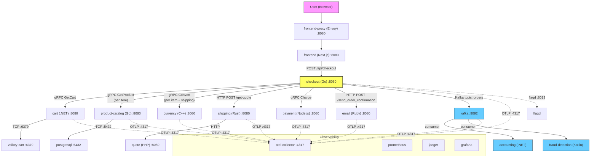

# Checkout Dependency Map

**Task:** CDO08-10 — Map checkout request path và dependencies
**Owner:** Quân
**Pillar:** Reliability
**Priority:** P0
**Ngày:** 2026-07-08

---

## 1. Luồng request checkout



---

## 2. Thứ tự thực thi PlaceOrder (tuần tự)

`PlaceOrder` trong `checkout/main.go` chạy các bước sau **theo thứ tự**:

| Bước | Hàm | Gọi downstream | Giao thức | Sync/Async | Ảnh hưởng khi lỗi |
|---|---|---|---|---|---|
| 1 | `getUserCart` | `cart.GetCart` (gRPC) | gRPC | **Sync** | **Đơn hàng thất bại** — không có giỏ hàng |
| 2 | `prepOrderItems` (mỗi item) | `product-catalog.GetProduct` (gRPC) | gRPC | **Sync** | **Đơn hàng thất bại** — không lấy được thông tin sản phẩm |
| 3 | `prepOrderItems` (mỗi item) | `currency.Convert` (gRPC) | gRPC | **Sync** | **Đơn hàng thất bại** — không đổi được giá |
| 4 | `quoteShipping` | `shipping` HTTP POST `/get-quote` | HTTP | **Sync** | **Đơn hàng thất bại** — không có phí ship |
| 5 | `quoteShipping` → `shipping` → `quote` | `quote` (qua shipping) | HTTP | **Sync** | **Đơn hàng thất bại** — shipping cần quote |
| 6 | `convertCurrency` (shipping) | `currency.Convert` (gRPC) | gRPC | **Sync** | **Đơn hàng thất bại** — không đổi được tiền ship |
| 7 | `chargeCard` | `payment.Charge` (gRPC) | gRPC | **Sync** | **Đơn hàng thất bại** — thanh toán lỗi |
| 8 | `shipOrder` | `shipping` HTTP POST `/ship-order` | HTTP | **Sync** | **Đơn hàng thất bại** — không có mã tracking |
| 9 | `emptyUserCart` | `cart.EmptyCart` (gRPC) | gRPC | **Sync** | **Không gây chết** — giỏ không được xoá nhưng đơn đã đặt |
| 10 | `sendOrderConfirmation` | `email` HTTP POST `/send_order_confirmation` | HTTP | **Sync** | **Không gây chết** (chỉ log warn) — đơn thành công, email có thể lỗi |
| 11 | `sendToPostProcessor` | Kafka topic `orders` | Kafka | **Async** | **Đơn hàng thành công** — downstream (accounting, fraud-detection) có thể miss event |

---

## 3. Bảng dependency chi tiết

| # | Dependency | Giao thức | Port | Env Var (checkout) | Sync/Async | Dạng lỗi | Ảnh hưởng khi lỗi | Bằng chứng lỗi |
|---|---|---|---|---|---|---|---|---|
| 1 | **cart** | gRPC | `cart:8080` | `CART_ADDR` | Sync | Service down, timeout, sai dữ liệu | **Đơn hàng dừng** — không lấy được giỏ | `cart failure: ...` error |
| 2 | **product-catalog** | gRPC | `product-catalog:8080` | `PRODUCT_CATALOG_ADDR` | Sync | Service down, không tìm thấy product | **Đơn hàng dừng** — không có giá sản phẩm | `failed to get product #...` error |
| 3 | **currency** | gRPC | `currency:8080` | `CURRENCY_ADDR` | Sync | Service down, lỗi chuyển đổi | **Đơn hàng dừng** — không đổi được tiền | `failed to convert currency` error |
| 4 | **shipping** | HTTP | `http://shipping:8080` | `SHIPPING_ADDR` | Sync | Service down, sai response | **Đơn hàng dừng** — không có quote/tracking | `failed POST to shipping service` error |
| 5 | **quote** (qua shipping) | HTTP | `http://quote:8080` | (qua shipping) | Sync | Service down | **Đơn hàng dừng** — shipping không quote được | lỗi lan từ shipping |
| 6 | **payment** | gRPC | `payment:8080` | `PAYMENT_ADDR` | Sync | Charge declined, service down, unreachable | **Đơn hàng dừng** — không charge được thẻ | `could not charge the card` error |
| 7 | **email** | HTTP | `http://email:8080` | `EMAIL_ADDR` | Sync | Service down, HTTP error | **Không gây chết** — đơn vẫn xử lý, chỉ warn | `failed to send order confirmation` warn |
| 8 | **kafka** | Kafka (TCP) | `kafka:9092` | `KAFKA_ADDR` | Async | Broker down, thiếu topic | **Đơn hàng thành công** — downstream miss event | `failed to publish order event` error |
| 9 | **valkey-cart** | TCP (Redis) | `valkey-cart:6379` | (qua cart) | Sync | Connection refused | **Đơn hàng dừng** — cart service không hoạt động | cart init container chờ |
| 10 | **postgresql** | TCP (PostgreSQL) | `postgresql:5432` | (qua product-catalog) | Sync | Connection refused | **Đơn hàng dừng** — product-catalog không serve được | product-catalog failures |
| 11 | **flagd** | gRPC | `flagd:8013` | `FLAGD_HOST`, `FLAGD_PORT` | Sync | Down, mất sync | **Feature flags mặc định off** — hệ thống vẫn chạy | flagd provider error |
| 12 | **otel-collector** | gRPC | `otel-collector:4317` | `OTEL_EXPORTER_OTLP_ENDPOINT` | Async | Down | **Mất tracing/metrics** — checkout vẫn chạy | mất telemetry |

---

## 4. Phân loại Sync vs Async

### Đồng bộ (blocking — lỗi = mất đơn hàng)

Tất cả các gọi trong `PlaceOrder` trước `sendOrderConfirmation` đều **đồng bộ và blocking**. Nếu bất kỳ cái nào lỗi, toàn bộ đơn hàng bị từ chối:

- `cart.GetCart` (gRPC)
- `product-catalog.GetProduct` (gRPC) — mỗi item một lần
- `currency.Convert` (gRPC) — mỗi item + một lần cho shipping
- `shipping` HTTP `/get-quote` (HTTP)
- `payment.Charge` (gRPC)

### Bất đồng bộ (non-blocking — lỗi không mất đơn)

- `sendToPostProcessor` → Kafka topic `orders` → `accounting` và `fraud-detection` consume

### Bán đồng bộ (lỗi được log nhưng đơn vẫn thành công)

- `sendOrderConfirmation` → `email` HTTP — lỗi chỉ warn, **đơn đã được commit**
- `emptyUserCart` → `cart.EmptyCart` — chạy sau ship, lỗi được log

---

## 5. Điểm lỗi nguy hiểm nhất (Risk Assessment)

| Rủi ro | Bước ảnh hưởng | Tác động | Mức độ | Đề xuất giảm thiểu |
|---|---|---|---|---|
| **Cart service down** | Bước 1 | Không lấy được giỏ → mất đơn | **P0** | Thêm retry + circuit breaker; cân nhắc cart HA |
| **Product catalog down** | Bước 2 | Không lấy được thông tin SP → mất đơn | **P0** | Thêm retry; cân nhắc cache local cho sản phẩm phổ biến |
| **Currency service down** | Bước 3, 6 | Không đổi được tiền → mất đơn | **P0** | Thêm retry + timeout guard |
| **Shipping/quote down** | Bước 4, 5, 8 | Không có phí ship → mất đơn | **P0** | Thêm retry; cân nhắc fallback flat rate |
| **Payment service down** | Bước 7 | Không charge được thẻ → mất đơn | **P0** | Thêm retry; payment gateway timeout phải có giới hạn |
| **Email service down** | Bước 10 | Đơn thành công nhưng khách không nhận email | **P1** | Outbox pattern hoặc retry queue |
| **Kafka broker down** | Bước 11 | Đơn thành công nhưng accounting/fraud miss event | **P1** | Thêm retry + circuit breaker; cân nhắc outbox pattern |
| **flagd down** | Tất cả | Feature flags mặc định safe → hệ thống chạy nhưng mất fault injection | **P2** | flagd là dependency bắt buộc; monitor sync health |
| **Không có timeout/retry trên gRPC calls** | Bước 1-7 | Cascading failure nếu dependency chậm | **P0** | Audit timeout/retry config cho từng service call |

---

## 6. Chuỗi dependency tóm tắt

```
Frontend (HTTP POST /api/checkout)
  └── checkout (gRPC server :8080)
       ├── [SYNC] cart (gRPC) → valkey-cart (TCP :6379)
       ├── [SYNC] product-catalog (gRPC) → postgresql (TCP :5432)
       ├── [SYNC] currency (gRPC)
       ├── [SYNC] shipping (HTTP) → quote (HTTP)
       ├── [SYNC] payment (gRPC)
       ├── [SYNC] email (HTTP)       ← non-fatal
       └── [ASYNC] kafka (topic: orders)
            ├── accounting (consumer)
            └── fraud-detection (consumer)
```

**Luồng doanh thu quan trọng (lỗi = mất đơn):** `cart → product-catalog → currency → shipping/quote → payment`

**Luồng sau đặt hàng (đơn thành công nhưng ảnh hưởng downstream):** `email → kafka → accounting + fraud-detection`

---

## 7. Feature flags ảnh hưởng checkout

Từ `flagd/demo.flagd.json`:

| Flag | Ảnh hưởng tới checkout | Khi bật |
|---|---|---|
| `paymentUnreachable` | Checkout gửi payment tới `badAddress:50051` → **payment lỗi → mất đơn** | Fault injection |
| `paymentFailure` | Payment `Charge` lỗi theo tỷ lệ → **mất đơn theo xác suất** | Fault injection |
| `cartFailure` | Cart service lỗi → **mất đơn ở bước 1** | Fault injection |
| `productCatalogFailure` | Product catalog lỗi cho product cụ thể → **mất đơn ở bước 2** | Fault injection |
| `kafkaQueueProblems` | Checkout gửi quá tải message vào Kafka → **Kafka lag, có thể timeout** | Fault injection |
| `failedReadinessProbe` | Cart readiness probe lỗi → **cart không ready → mất đơn** | Fault injection |

---

## 8. Tham chiếu service port & protocol

| Service | Ngôn ngữ | Port | Giao thức | Ghi chú |
|---|---|---|---|---|
| frontend-proxy | Envoy | 8080 | HTTP/1.1 | Cổng vào duy nhất |
| frontend | TypeScript/Next.js | 8080 | HTTP/1.1 | Server-side rendering |
| checkout | Go | 8080 | gRPC | Điều phối đơn hàng |
| cart | C# (.NET) | 8080 | gRPC | Dùng valkey làm storage |
| product-catalog | Go | 8080 | gRPC | Dùng postgresql |
| currency | C++ | 8080 | gRPC | Stateless |
| shipping | Rust | 8080 | HTTP | Gọi quote bên trong |
| quote | PHP | 8080 | HTTP | Stateless |
| payment | Node.js | 8080 | gRPC | Stateless |
| email | Ruby | 8080 | HTTP | Stateless |
| kafka | Kafka | 9092 | Kafka TCP | Internal listener |
| accounting | C# (.NET) | - | Kafka consumer | Consume topic `orders` |
| fraud-detection | Kotlin | - | Kafka consumer | Consume topic `orders` |
| valkey-cart | Valkey | 6379 | Redis TCP | Lưu trạng thái giỏ hàng |
| postgresql | PostgreSQL | 5432 | PostgreSQL TCP | DB quan hệ chính |
| flagd | flagd | 8013 | gRPC | Feature flag provider |
| otel-collector | OTel Collector | 4317 | gRPC | OTLP telemetry |

---

## 9. Tham chiếu file nguồn

| File | Nội dung |
|---|---|
| `techx-corp-platform/src/checkout/main.go` | Luồng PlaceOrder đầy đủ, tất cả env var, gRPC/HTTP calls |
| `techx-corp-platform/src/checkout/kafka/producer.go` | Kafka topic `orders`, cấu hình producer |
| `techx-corp-chart/values.yaml` (dòng 246-285) | Env var checkout, port, init containers |
| `techx-corp-chart/values.yaml` (dòng 537-562) | Env var payment |
| `techx-corp-chart/values.yaml` (dòng 686-700) | Env var shipping (gọi quote) |
| `techx-corp-platform/pb/demo.proto` | Tất cả định nghĩa gRPC service |
| `techx-corp-platform/src/frontend/gateways/Api.gateway.ts` | Frontend gọi `POST /api/checkout` |
| `techx-corp-chart/flagd/demo.flagd.json` | Feature flags ảnh hưởng checkout |
| `docs/requirements/onboarding/ARCHITECTURE.md` | Tổng quan kiến trúc |

---

## 10. Tổng hợp findings

| # | Finding | Dependency | Rủi ro | Mức độ | Service/File ảnh hưởng | Bằng chứng | Follow-up đề xuất |
|---|---|---|---|---|---|---|---|
| F1 | Tất cả gRPC calls **không có timeout/retry tường minh** | cart, product-catalog, currency, payment | Dependency chậm làm cascading failure | **P0** | `checkout/main.go` dòng 446-456 (`mustCreateClient` dùng default gRPC) | Source code: không có `grpc.WithTimeout` hoặc retry interceptor | Task 11: Audit timeout/retry gaps |
| F2 | **payment** có feature flag `paymentUnreachable` hard-code `badAddress:50051` | payment | Nếu flag bật, mọi đơn hàng đều lỗi | **P0** | `checkout/main.go` dòng 541-545 | Source code: `paymentUnreachable` flag redirect tới bad address | Ghi vào risk register; monitor flagd |
| F3 | **email** lỗi chỉ **warn** — không retry, không queue | email | Khách không nhận được email xác nhận | **P1** | `checkout/main.go` dòng 381-384 | Source code: `log.Warn` khi lỗi, order vẫn trả về success | Thêm email retry hoặc outbox |
| F4 | Kafka producer dùng `WaitForAll` + 5 retries + 10s timeout | kafka | At-least-once semantics; downstream phải idempotent | **P1** | `checkout/kafka/producer.go` dòng 37-41 | Source code: config thể hiện at-least-once | Verify accounting/fraud-detection idempotency |
| F5 | **cart** init container chờ valkey-cart nhưng **không có readiness probe** | cart, valkey-cart | Pod có thể nhận traffic trước khi valkey sẵn sàng | **P0** | `values.yaml` dòng 240-244 (init container), `checkout/main.go` | Init container chờ nhưng cart không có readiness probe | Task 18: Audit probe coverage |
| F6 | **checkout** init container chờ kafka nhưng kafka là **async** | kafka | Nếu kafka không lên, checkout không bao giờ start | **P1** | `values.yaml` dòng 283-285 | Init container block đến khi kafka:9092 reachable | Cân nhắc làm kafka optional tại startup |
| F7 | **shipping** gọi **quote** qua HTTP không có timeout tường minh | shipping, quote | Cascading failure nếu quote chậm | **P0** | `shipping` source (Rust) | Quote là downstream dependency của shipping | Verify timeout trong shipping → quote call |
| F8 | **flagd** là hard dependency qua OpenFeature SDK | flagd | Nếu flagd down, feature flags mặc định off | **P2** | `checkout/main.go` dòng 189-194 | Source code: `flagd.NewProvider()` panic nếu lỗi | Monitor flagd sync health |

---

*Reviewed by: [chờ Nguyên review]*
*Status: Draft*