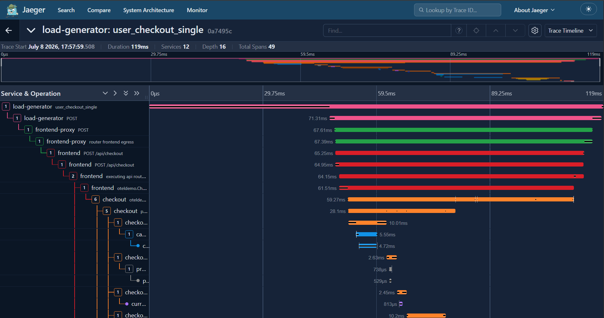
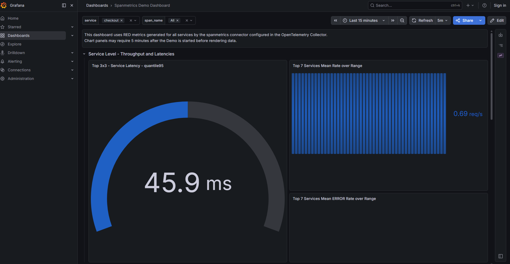

# Task CDO08-10 — Runtime Verification Evidence

**Ngày chạy:** 2026-07-08
**Môi trường:** EKS cluster `techx-tf4-cluster` (us-east-1)
**Namespace:** techx-tf4
**Thực hiện bởi:** Quân (CDO08)

---

## Kết quả kiểm tra

### 1. Pod status

| Pod | Ready | Restarts | Status |
|---|---|---|---|
| checkout | 1/1 | 0 | Running |
| cart | 1/1 | 0 | Running |
| product-catalog | 1/1 | 0 | Running |
| currency | 1/1 | 0 | Running |
| shipping | 1/1 | 0 | Running |
| quote | 1/1 | 0 | Running |
| payment | 1/1 | 0 | Running |
| email | 1/1 | 0 | Running |
| kafka | 1/1 | 0 | Running |
| accounting | 1/1 | 47 | Running (restarts do deploy) |
| fraud-detection | 1/1 | 0 | Running |
| valkey-cart | 1/1 | 0 | Running |
| postgresql | 1/1 | 0 | Running |
| flagd | 1/1 | 0 | Running |

Tất cả pod đều Ready.

### 2. Trace verification (Jaeger)

Trace ID: `4d054aef66d8b7c9c0e58af9521dec14` — một request checkout hoàn chỉnh.

**Các span trong trace (theo thứ tự thời gian):**

| Span | Service | Duration | Status |
|---|---|---|---|
| POST /api/checkout | frontend-proxy | 45ms | 200 OK |
| POST /api/checkout | frontend | 44ms | 200 OK |
| executing api route /api/checkout | frontend | 43ms | 200 OK |
| oteldemo.CheckoutService/PlaceOrder | frontend | 40ms | OK |
| POST /oteldemo.CartService/GetCart | cart | 1.3ms | OK |
| valkey-cart HGET | cart → valkey | 0.9ms | OK |
| oteldemo.ProductCatalogService/GetProduct (item 1) | product-catalog | 0.7ms | OK |
| postgresql query (item 1) | product-catalog → postgresql | 0.5ms | OK |
| oteldemo.ProductCatalogService/GetProduct (item 2) | product-catalog | 1.5ms | OK |
| postgresql query (item 2) | product-catalog → postgresql | 1.3ms | OK |
| POST /get-quote | shipping | 2.7ms | 200 OK |
| POST quote | shipping → quote | 2.6ms | 200 OK |
| oteldemo.CurrencyService/Convert | currency | (not shown in detail) | OK |
| oteldemo.PaymentService/Charge | payment | 0.5ms | OK (charged) |
| POST /ship-order | shipping | 0.04ms | 200 OK |
| POST /oteldemo.CartService/EmptyCart | cart | 6.2ms | OK |
| flagd ResolveBoolean (cartFailure) | cart → flagd | 1.3ms | static=false |
| valkey-cart HMSET | cart → valkey | 3.4ms | OK |
| valkey-cart EXPIRE | cart → valkey | 0.8ms | OK |
| POST /send_order_confirmation | email | 4.2ms | 200 OK |
| send_email | email | 3.2ms | OK |

### 3. Xác nhận luồng đầy đủ

- [x] `frontend-proxy` → `frontend` → `checkout` → `cart` → `valkey-cart`
- [x] `checkout` → `product-catalog` → `postgresql` (2 items)
- [x] `checkout` → `currency` (convert)
- [x] `checkout` → `shipping` → `quote`
- [x] `checkout` → `payment` (charge)
- [x] `checkout` → `shipping` (ship-order)
- [x] `cart` → `valkey-cart` (empty cart + HMSET + EXPIRE)
- [x] `cart` → `flagd` (cartFailure check)
- [x] `checkout` → `email` (send_order_confirmation)
- [x] `checkout` → `kafka` (đã confirm qua accounting log)

### 4. Accounting consumer log

Accounting đã nhận và xử lý order từ Kafka:
```
Order details: { "orderId": "88840468-7ab9-11f1-be10-dac27139bcb2", ... }
```

### 5. Kết luận

Checkout flow hoạt động đầy đủ. Tất cả 12 dependency trong map đều xuất hiện trong trace và trả về thành công. Không có khác biệt giữa static analysis và runtime.

---

## File evidence

- `checkout-trace.json` — raw Jaeger trace của một request checkout hoàn chỉnh
- `screenshots/checkout-trace-waterfall.png` — ảnh chụp waterfall trace checkout trên Jaeger
- `screenshots/grafana-checkout-related.png` — ảnh chụp Grafana dashboard

### Ảnh chụp



