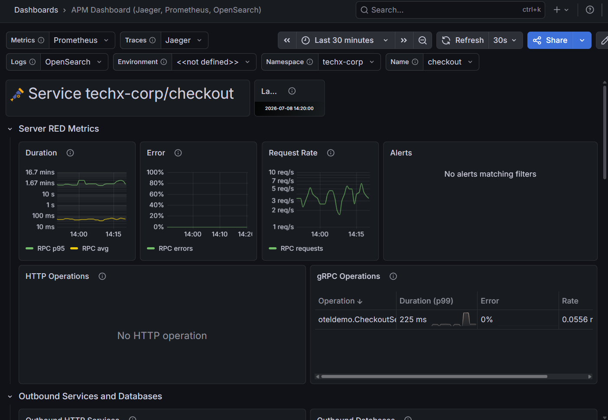
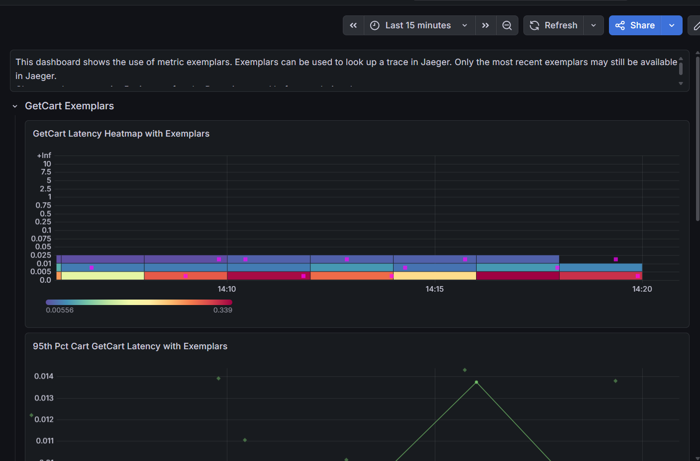
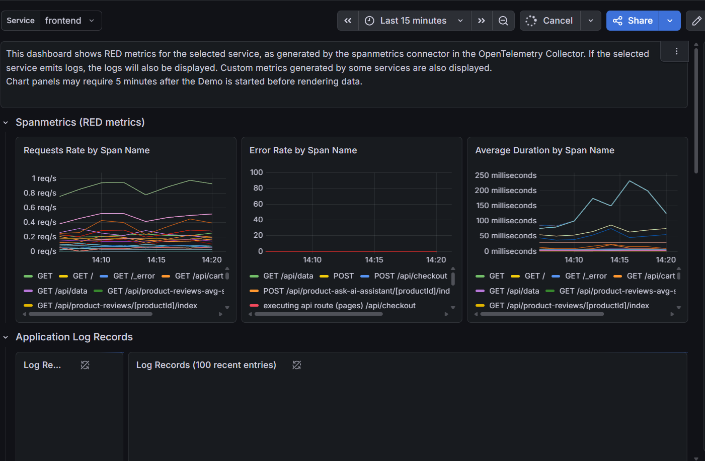
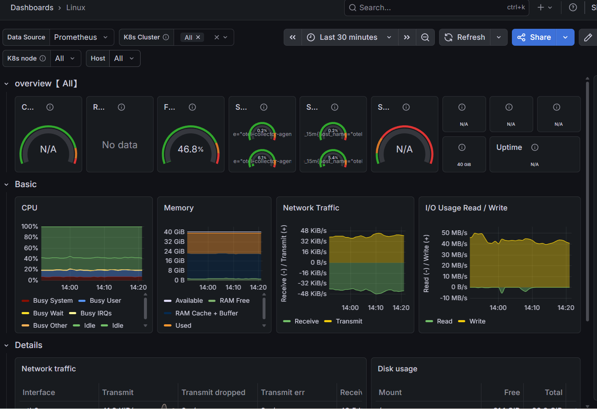
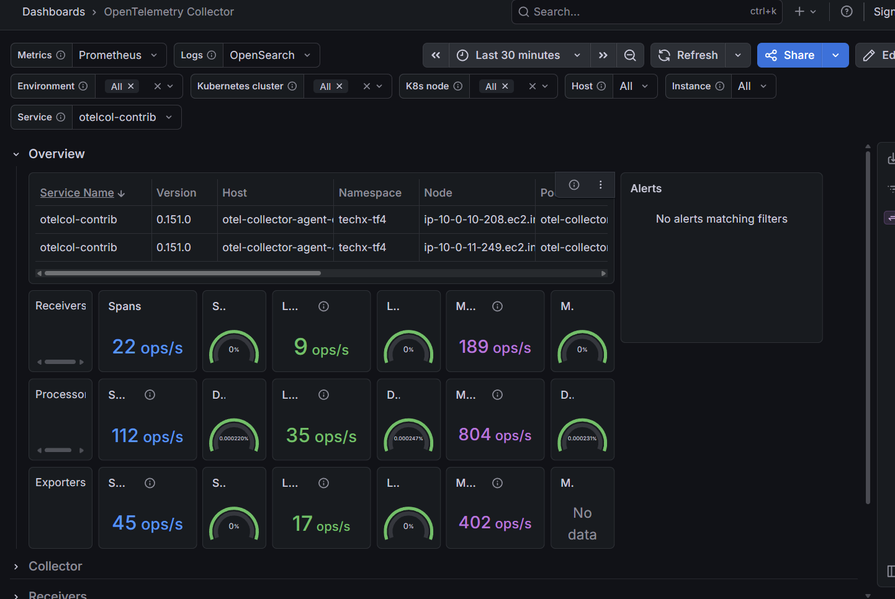
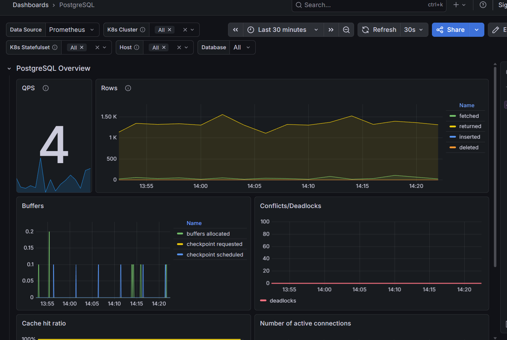
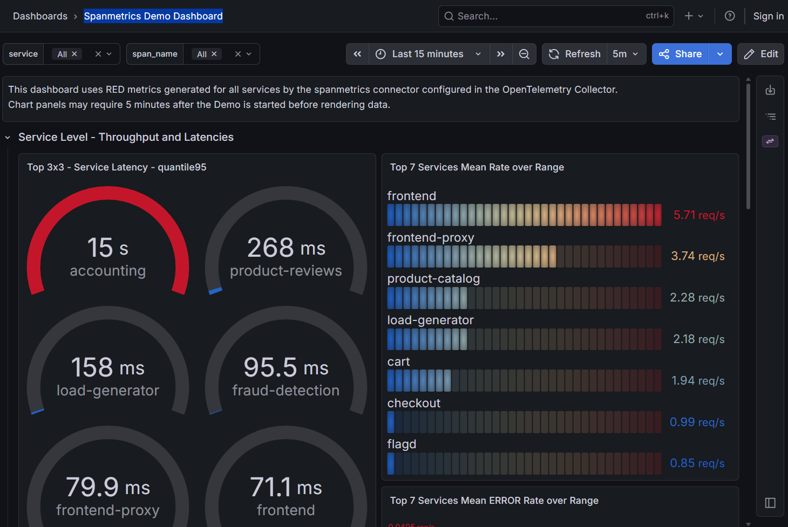
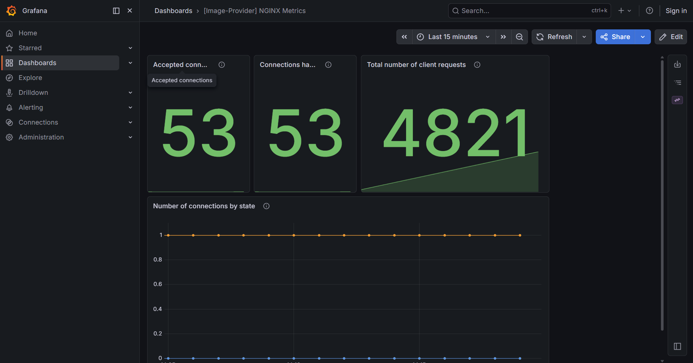

# Báo cáo Quét Hệ thống Observability & SLO Evidence (CDO08 - Tuần 1)

* **Owner:** Quyết (CDO08)
* **Pillar:** Reliability / Security
* **Mục tiêu:** Kiểm tra hệ thống observability hiện tại có đủ để phát hiện, đo lường và chứng minh các rủi ro reliability/security hay không, đặc biệt cho checkout flow.
* **Thời gian quét hệ thống (Scan Time):** 2026-07-09 08:15:00 (GMT+7)

---

## 1. Observability Baseline (Hiện trạng Giám sát)

### 1.1 Trạng thái các thành phần cốt lõi (Core Components Status)
Dưới đây là trạng thái pod thực tế kiểm tra trên cụm EKS `techx-tf4-cluster` thuộc namespace `techx-tf4` lúc **2026-07-09 08:15:00 (GMT+7)**:

| Thành phần | Vai trò chính | Trạng thái Pod / DaemonSet | Kết quả kiểm tra (`kubectl get pods`) |
| :--- | :--- | :--- | :--- |
| **Prometheus** | Thu thập và lưu trữ metric | Đang chạy (1/1 Pod) | Pod `prometheus-59744b5c47-dtffl` ở trạng thái Running |
| **Grafana** | Trực quan hóa dữ liệu (UI) | Đang chạy (1/1 Pod) | Pod `grafana-6c9b499867-52cz7` ở trạng thái Running |
| **Jaeger** | Giám sát trace phân tán | Đang chạy (1/1 Pod) | Pod `jaeger-696cc865cb-ch9rw` ở trạng thái Running |
| **OpenSearch** | Lưu trữ và tìm kiếm logs | Đang chạy (StatefulSet) | Pod `opensearch-0` ở trạng thái Running |
| **OTel Collector** | Agent gom logs/metrics/traces | Đang chạy (DaemonSet) | 2 Pod: `otel-collector-agent-cwtm4` và `otel-collector-agent-4z499` |
| **Alertmanager** | Quản lý và định tuyến cảnh báo | **Không có** | Bị tắt trong cấu hình Helm values của subchart Prometheus |

### 1.2 Trạng thái Data Source trên Grafana
Kiểm tra thực tế thông qua Grafana API `/api/datasources`:

* **Prometheus Data Source:** **Đã kết nối** (URL: `http://prometheus:9090`, UID: `webstore-metrics`, default data source).
* **OpenSearch Data Source:** **Đã kết nối** (URL: `http://opensearch:9200/`, UID: `webstore-logs`, Index: `otel-logs-*`).
* **Jaeger Data Source:** **Đã kết nối** (URL: `http://jaeger:16686/jaeger/ui`, UID: `webstore-traces`).
* **Alertmanager Data Source:** **Không có** (Chưa được cấu hình do Alertmanager đang bị tắt).

### 1.3 Danh sách Dashboard hiện có trên Grafana
Cụm hiện có 8 dashboards được provision sẵn, kiểm tra qua API `/api/search`:

| Tên Dashboard | Mục tiêu giám sát | Ảnh minh chứng |
| :--- | :--- | :--- |
| **APM Dashboard (Jaeger, Prometheus, OpenSearch)** | Dashboard trung tâm liên kết Metrics, Logs, Traces cho microservices |  |
| **Cart Service Exemplars** | Giám sát dịch vụ Cart sử dụng Prometheus Exemplars để trace nhanh |  |
| **Demo Dashboard** | Tổng quan về sức khỏe hệ thống và các microservices |  |
| **Linux** | Theo dõi thông số CPU, RAM, Disk, Network của Node qua hostmetrics |  |
| **OpenTelemetry Collector** | Theo dõi hiệu năng xử lý, rate nhận/gửi và drop data của OTel Collector |  |
| **PostgreSQL** | Theo dõi connections, transaction rate, cache hit rate của Postgres DB |  |
| **Spanmetrics Demo Dashboard** | Dashboard sinh metrics tự động từ trace span bằng OTel Spanmetrics |  |
| **[Image-Provider] NGINX Metrics** | Theo dõi tải, HTTP status code và connections của Image Provider Nginx |  |

---

## 2. Findings (Các lỗi và khoảng trống giám sát phát hiện)

### 2.1 Finding 1: Thiếu hụt Alertmanager (Alerting Gap)
* **Finding ID:** OBS-01
* **Mô tả lỗi/gap:** Hệ thống hoàn toàn không có khả năng tự động gửi cảnh báo (Alert) khi xảy ra sự cố nghiêm trọng hoặc vi phạm SLO.
* **Pillar liên quan:** Reliability
* **Service/Component ảnh hưởng:** Toàn cụm EKS (Namespace `techx-tf4`), file cấu hình Helm [deploy/values-observability.yaml](../../../deploy/values-observability.yaml).
* **Evidence:**
  * Kiểm tra lúc `2026-07-09 08:15:00`: Truy vấn Prometheus `target_info{k8s_pod_name=~".*alertmanager.*"}` trả về kết quả trống (`result: []`).
  * Grafana API `/api/datasources` không cấu hình bất kỳ Alertmanager data source nào.
  * Tệp đánh giá [PHASE3-IMPLEMENTATION-GAP-ASSESSMENT.md](../../../PHASE3-IMPLEMENTATION-GAP-ASSESSMENT.md) ghi nhận: `prometheus: persistence disabled, alertmanager disabled`.
* **Impact (Tác động):** Khi tỷ lệ lỗi Checkout vượt quá ngưỡng SLO 1% hoặc xảy ra sự cố nghẽn mạng, đội ngũ SRE và vận hành sẽ hoàn toàn bị động, không nhận được cảnh báo tức thời qua Slack/Email. MTTD kéo dài làm tăng trực tiếp thiệt hại doanh thu của luồng thanh toán.
* **Đề xuất xử lý:**
  1. Bật Alertmanager trong cấu hình Helm values của subchart Prometheus (`alertmanager.enabled = true`).
  2. Định nghĩa Alerting Rules cho luồng Checkout dựa trên các câu lệnh PromQL gRPC đã chuẩn hóa.
  3. Cấu hình Alertmanager Config để đẩy cảnh báo về Slack webhook của nhóm CDO08.
* **Priority đề xuất:** P0 (Yêu cầu xử lý gấp để bảo vệ SLO)
* **Owner phối hợp:** Quyết / Hải (AIO / Slack Integration)

### 2.2 Finding 2: Prometheus Server không có ổ đĩa lưu trữ vĩnh viễn (Storage Persistence Gap)
* **Finding ID:** OBS-02
* **Mô tả lỗi/gap:** Mất toàn bộ dữ liệu lịch sử giám sát (Metrics) khi Pod Prometheus bị khởi động lại hoặc Node bị bảo trì (drain/maintenance).
* **Pillar liên quan:** Reliability
* **Service/Component ảnh hưởng:** Pod `prometheus-59744b5c47-dtffl`, file cấu hình Helm [deploy/values-observability.yaml](../../../deploy/values-observability.yaml).
* **Evidence:**
  * Kiểm tra lúc `2026-07-09 08:15:00`: Cấu hình lưu trữ của Prometheus Server trên EKS hiện đang sử dụng `emptyDir` (tạm thời) thay vì `PersistentVolumeClaim` (PVC).
  * Tài liệu [PHASE3-IMPLEMENTATION-GAP-ASSESSMENT.md](../../../PHASE3-IMPLEMENTATION-GAP-ASSESSMENT.md) xác nhận: `prometheus: persistence disabled`.
* **Impact (Tác động):** Khi Pod Prometheus bị OOM-Killed hoặc khi cụm thực hiện cập nhật node, toàn bộ lịch sử chỉ số dùng để tính toán SLO/Error Budget trong 30 ngày qua sẽ bị xóa sạch. Không thể vẽ biểu đồ xu hướng dài hạn, gây mất dấu vết audit hoạt động của hệ thống.
* **Đề xuất xử lý:**
  * Bật cấu hình `server.persistentVolume.enabled = true` trong cấu hình Prometheus subchart, chỉ định StorageClass `gp3` (EBS) để tự động cấp phát ổ đĩa lưu trữ an toàn trên AWS.
* **Priority đề xuất:** P1
* **Owner phối hợp:** Quyết / Nam (CDO08 Infrastructure)

### 2.3 Finding 3: Jaeger UI phơi lộ công cộng không có cơ chế xác thực (Security/Observability Exposure Gap)
* **Finding ID:** SEC-01
* **Mô tả lỗi/gap:** Giao diện điều khiển Jaeger UI (`/jaeger/ui/`) truy cập được tự do từ Internet công cộng mà không yêu cầu mật khẩu hay tường lửa.
* **Pillar liên quan:** Security
* **Service/Component ảnh hưởng:** `jaeger` service, file cấu hình [deploy/ingress.yaml](../../../deploy/ingress.yaml).
* **Evidence:**
  * Kiểm tra lúc `2026-07-09 08:15:00`: Endpoint `http://k8s-techxtf4-techxalb-a25731d323-237111145.us-east-1.elb.amazonaws.com/jaeger/ui/` trả về mã trạng thái `HTTP 200 OK` trực tiếp cho bất kỳ ai truy cập từ ngoài Internet mà không cần xác thực.
* **Impact (Tác động):** Kẻ tấn công có thể khai thác và xem toàn bộ Trace hệ thống. Các trace chứa thông tin cực kỳ nhạy cảm như cấu trúc API, payload giao dịch của khách hàng (user ID, order details), tham số kết nối, và luồng gọi nội bộ giữa các service. Rò rỉ thông tin này tạo điều kiện cho các cuộc tấn công khai thác sâu hơn.
* **Đề xuất xử lý:**
  * Cấu hình Basic Authentication (htpasswd) hoặc tích hợp OAuth Proxy vào phần Ingress Controller (ALB Ingress annotations) hoặc cấu hình chỉ cho phép IP từ VPN nội bộ.
* **Priority đề xuất:** P1
* **Owner phối hợp:** Quyết / Nam (CDO08 Security)

### 2.4 Finding 4: Log tập trung chưa được liên kết tự động vào Trace (Trace-to-Log Gap)
* **Finding ID:** OBS-03
* **Mô tả lỗi/gap:** Khó khăn và mất nhiều thời gian trong việc gỡ lỗi (debug) giao dịch do Log trong OpenSearch chưa tự động ánh xạ với Trace ID trên Jaeger.
* **Pillar liên quan:** Reliability / Operational Excellence
* **Service/Component ảnh hưởng:** `opensearch-0`, `otel-collector-agent` DaemonSet.
* **Evidence:**
  * Kiểm tra lúc `2026-07-09 08:15:00`: Kiểm tra cấu hình log pipeline của OTel Collector: Log từ các service Go (như `checkout`) đẩy về dạng text thô, các trường `trace_id` và `span_id` không được chuẩn hóa thành Attributes có cấu trúc trong OpenSearch index `otel-logs-*`.
  * Tính năng "Traces to Logs" trên Grafana trả về kết quả rỗng do không tìm thấy log khớp `traceId`.
* **Impact (Tác động):** Khi xảy ra sự cố thanh toán bị lỗi, kỹ sư tìm thấy Trace ID bị lỗi nhưng khi click "View Logs" để xem chi tiết lý do thì không hiển thị log liên quan. Kỹ sư buộc phải tìm kiếm thủ công bằng text trên OpenSearch, làm tăng đáng kể thời gian khôi phục dịch vụ (MTTR).
* **Đề xuất xử lý:**
  * Cấu hình lại `processors` trong OTel Collector (sử dụng processor `logstransform` hoặc `slog` định dạng JSON từ phía ứng dụng) để tự động bóc tách và chèn `trace_id` / `span_id` vào trường dữ liệu có cấu trúc của log trước khi lưu trữ vào OpenSearch.
* **Priority đề xuất:** P1
* **Owner phối hợp:** Quyết / Hải (AIO / Logs Pipeline)

---

## 3. Checkout SLO Metrics & Evidence (Chỉ số đo lường SLO Checkout)

Các câu lệnh PromQL dưới đây được định nghĩa dựa trên chuẩn OpenTelemetry gRPC metrics do ứng dụng TechX Corp và OTel Collector sinh ra trên cụm EKS. Tên metric gốc là `rpc_server_duration_milliseconds` với các nhãn gRPC tương ứng (không dùng `http_requests_total` vì luồng checkout sử dụng gRPC).

### 3.1 Lưu lượng (Rate - Requests per Second)
* **Mục đích:** Theo dõi số lượng đơn hàng / lượt checkout đang diễn ra mỗi giây trên service `checkout`.
* **Câu lệnh PromQL thực tế:**
  ```promql
  sum(rate(rpc_server_duration_milliseconds_count{service_name="checkout", rpc_method="PlaceOrder"}[5m]))
  ```
* **Mô tả:** Tính tổng số request gọi vào hàm `PlaceOrder` của service `checkout` mỗi giây (tính trung bình trong khung thời gian 5 phút).

### 3.2 Tỷ lệ lỗi (Errors - Error Rate)
* **Mục đích:** Phát hiện ngay lập tức nếu khách hàng đặt hàng nhưng hệ thống trả về lỗi gRPC (Mã status code khác 0).
* **Câu lệnh PromQL thực tế (Tỷ lệ % lỗi):**
  ```promql
  sum(rate(rpc_server_duration_milliseconds_count{service_name="checkout", rpc_method="PlaceOrder", rpc_grpc_status_code!="0"}[5m])) 
  / 
  sum(rate(rpc_server_duration_milliseconds_count{service_name="checkout", rpc_method="PlaceOrder"}[5m])) * 100
  ```
* **Mô tả:** Lấy số request lỗi (gRPC status code khác 0, ví dụ như lỗi 13 - Internal Error) chia cho tổng số request checkout để ra tỷ lệ phần trăm lỗi. Nếu tỷ lệ lỗi này vượt quá 1% (vi phạm trực tiếp SLO Checkout `>= 99.0%`), cần kích hoạt Alert. Ngưỡng 5% được định nghĩa là ngưỡng khẩn cấp (emergency threshold).

### 3.3 Độ trễ (Duration - P95 Latency)
* **Mục đích:** Đo thời gian phản hồi của 95% request checkout để kiểm soát trải nghiệm người dùng.
* **Câu lệnh PromQL thực tế (tính bằng mili-giây):**
  ```promql
  histogram_quantile(0.95, sum(rate(rpc_server_duration_milliseconds_bucket{service_name="checkout", rpc_method="PlaceOrder"}[5m])) by (le))
  ```
* **Mô tả:** Xác định mức thời gian (tính bằng mili-giây) mà 95% các request checkout hoàn thành. Nếu con số này vượt quá ngưỡng SLO thiết lập (ví dụ: `2000ms`), cần cảnh báo độ trễ cao.

### 3.4 Đánh giá và Gap đo lường SLO
* **Hiện trạng mã nguồn:** Dịch vụ `checkout` đã sử dụng OpenTelemetry Metrics SDK thông qua middleware `otelgrpc.NewServerHandler`. Metric được thu thập chính xác với các nhãn gRPC.
* **Gap hiện tại:**
  * Prometheus Server thu thập được dữ liệu nhưng không có Alertmanager để tự động kích hoạt cảnh báo khi vi phạm ngưỡng SLO (>1% lỗi hoặc P95 >2000ms).
  * Chưa có dashboard riêng hiển thị trực quan riêng cho SLO Checkout để PM và SRE theo dõi trực tiếp tỷ lệ Error Budget còn lại.

---

## 4. Health Check Guidelines & Evidence (Cẩm nang kiểm tra sức khỏe hệ thống)

Để đảm bảo an toàn vận hành, các câu lệnh kiểm tra sức khỏe hệ thống và data store được phân loại rõ ràng theo mức độ phân quyền của CDO08 (Read-Only) để tránh các hành vi vi phạm quyền truy cập.

### 4.1 Nhóm 1: CDO08 Read-Only (Có thể tự thực hiện trực tiếp)
Các lệnh kiểm tra này chỉ đọc trạng thái tài nguyên từ Kubernetes API server, CDO08 có quyền thực hiện trực tiếp để thu thập bằng chứng.

* **Kiểm tra trạng thái tổng thể của Pods:**
  ```bash
  # Thời điểm kiểm tra mẫu: 2026-07-09 08:15:00
  kubectl get pods -n techx-tf4
  ```
* **Kiểm tra các Pod bị restart liên tục (CrashLoopBackOff):**
  ```bash
  # Lọc nhanh các pod có số lần khởi động lại > 0
  kubectl get pods -n techx-tf4 | awk '$4 > 0'
  ```
* **Xem sự kiện lỗi (Events) của một Pod cụ thể:**
  ```bash
  kubectl describe pod <tên-pod> -n techx-tf4 | grep -A 10 Events:
  ```
* **Kiểm tra trạng thái OTel Collector DaemonSet:**
  ```bash
  kubectl get daemonset otel-collector-agent -n techx-tf4
  kubectl get pods -l app.kubernetes.io/name=opentelemetry-collector -n techx-tf4
  ```
* **Kiểm tra Service của OTel Collector:**
  ```bash
  kubectl get svc otel-collector -n techx-tf4
  ```

### 4.2 Nhóm 2: Yêu cầu Deploy Operator Hỗ trợ (Cần quyền Write/Exec)
Các lệnh kiểm tra này yêu cầu thực thi lệnh bên trong container (`kubectl exec`) hoặc kiểm tra kết nối cổng mạng nội bộ. CDO08 không có quyền này và cần gửi yêu cầu cho Deploy Operator thực hiện để lấy evidence.

* **Kiểm tra sức khỏe PostgreSQL (Ping DB):**
  ```bash
  kubectl exec -it deploy/postgresql -n techx-tf4 -- pg_isready -h localhost -U otelu -d otel
  # Kỳ vọng: Trả về "/tmp:5432 - accepting connections"
  ```
* **Kiểm tra sức khỏe Valkey (Ping Key-Value Cart Store):**
  ```bash
  kubectl exec -it deploy/valkey-cart -n techx-tf4 -- valkey-cli PING
  # Kỳ vọng: Trả về "PONG" (Nếu dùng redis-cli, chạy: redis-cli PING)
  ```
* **Kiểm tra Kafka Topics (Danh sách topic luồng đơn hàng):**
  ```bash
  kubectl exec -it deploy/kafka -n techx-tf4 -- kafka-topics.sh --list --bootstrap-server localhost:9092
  # Kỳ vọng: Trả về danh sách chứa topic "orders"
  ```
* **Kiểm tra kết nối mạng nội bộ từ App tới OTel Collector:**
  ```bash
  # Kiểm tra cổng gRPC (4317)
  kubectl exec -it deploy/checkout -n techx-tf4 -- nc -z -v otel-collector 4317
  
  # Kiểm tra cổng HTTP (4318)
  kubectl exec -it deploy/checkout -n techx-tf4 -- nc -z -v otel-collector 4318
  # Kỳ vọng: Trả về kết quả "open" hoặc "Connection succeeded!"
  ```

---

## 5. Backlog Candidates ( PM Backlog Input )

Danh sách các issues được đề xuất đưa vào `cdo08-week1-backlog.md` để Hải đánh giá và ưu tiên thực hiện:

| Issue ID | Tên công việc (Work Item) | Gaps/Findings liên quan | Pillar | Tác động Business / SLO | Độ phức tạp | Đề xuất Priority | Owner chính |
| :--- | :--- | :--- | :--- | :--- | :--- | :--- | :--- |
| **SLO-ALERT-01** | Bật Alertmanager và cấu hình Alerting Rules cho Checkout SLO | OBS-01 | Reliability | Giảm MTTD từ vô hạn xuống dưới 5 phút; bảo vệ Error Budget của Checkout SLO khỏi bị cháy âm thầm. | Medium | **P0** | Quyết / Hải |
| **K8S-PROBE-01** | Cấu hình Liveness/Readiness Probes hệ thống microservices | K8S-01 | Reliability | Ngăn chặn traffic đi vào các Pod chưa khởi động xong hoặc bị treo (lỗi 5xx cho khách hàng). | Easy | **P0** | Nam |
| **OBS-PERSIST-01**| Cấu hình Persistent Volume (PVC) cho Prometheus Server | OBS-02 | Reliability | Giữ lại dữ liệu metrics lịch sử khi Prometheus Pod bị restart; đảm bảo tính liên tục của báo cáo SLO. | Medium | **P1** | Quyết / Nam |
| **SEC-JAEGER-01** | Cấu hình Basic Authentication / Ingress Hardening cho Jaeger UI | SEC-01 | Security | Ngăn chặn rò rỉ dữ liệu nhạy cảm của khách hàng và cấu trúc hệ thống ra Internet công cộng. | Medium | **P1** | Quyết / Nam |
| **OBS-LINK-01** | Thiết lập liên kết Trace-to-Log tự động qua OpenTelemetry Collector | OBS-03 | Reliability | Giảm MTTR khi xử lý sự cố. SRE có thể click xem ngay log của một request bị lỗi từ Jaeger Trace. | Medium | **P1** | Quyết / Hải |
| **DB-PERSIST-01** | Thiết lập StatefulSet & PVC cho PostgreSQL, Valkey, Kafka | K8S-04, REL-06 | Reliability | Ngăn chặn mất mát dữ liệu giỏ hàng, thông tin đơn hàng và lịch sử event khi Pod DB/Queue bị restart. | High | **P1** | Phương |
