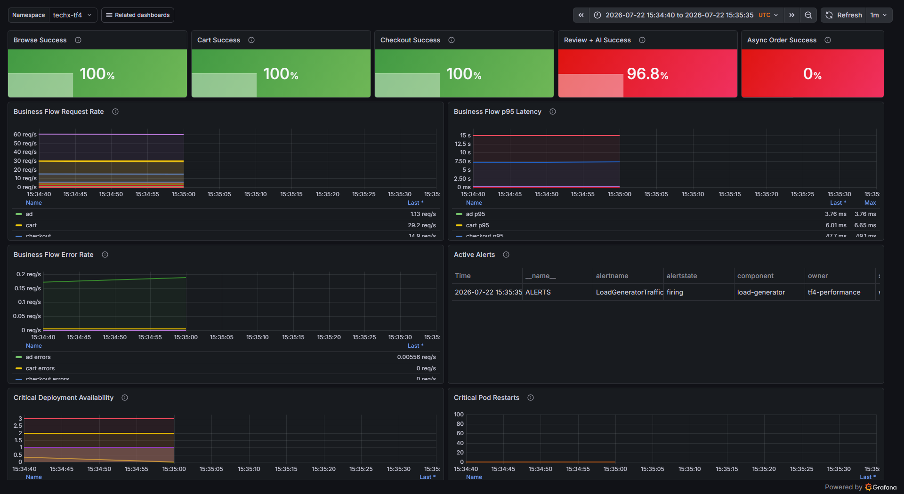
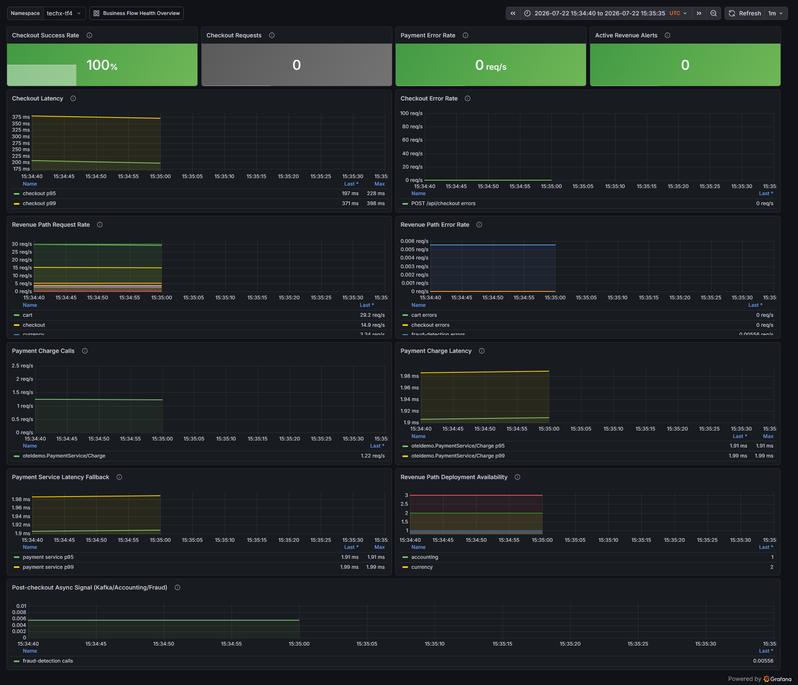

# CDO08-REL-20: Evidence kiểm thử dependency failure

## 1. Kết luận

**Trạng thái: PASS.**

Ngày 2026-07-22, pod `ad` được chủ động xóa trong lúc traffic browse, cart và checkout vẫn chạy qua ALB. Kết quả lần chạy hợp lệ:

- Browse, cart, checkout và `/api/data` đều đạt 100% HTTP success trước, trong và sau sự cố.
- `/api/data` trả HTTP 200 trong failure window, xác nhận fallback `[]` không làm lỗi lan ra khách hàng.
- Frontend ghi log `optional_dependency_fallback` khi `ad` unavailable.
- Prometheus có metric `app_frontend_dependency_fallbacks_total`; counter tăng 32 lần trong cửa sổ 2 phút bao phủ demo.
- Dashboard ghi nhận Browse, Cart và Checkout Success đều 100%.
- Pod `ad` tự phục hồi `1/1` sau khoảng 20,7 giây; frontend duy trì `3/3`, restart count bằng 0.

Lần chạy ban đầu bị BLOCKED vì Deployment còn chạy lẫn ReplicaSet cũ và mới. Sau khi rollout hoàn tất, cả ba frontend pod cùng chạy image `0eb91f9` và demo lại đã pass. Không cần thay đổi thêm code fallback.

## 2. Runbook controlled failure

### Chuẩn bị

1. Thống nhất controlled window theo UTC và có operator theo dõi rollback.
2. Chỉ target dependency optional `ad` trong namespace `techx-tf4`.
3. Xác minh toàn bộ frontend pod chạy cùng image đã chứa REL-20.
4. Ghi lại pod `ad`, replica count và trạng thái pod trước demo.
5. Bắt đầu traffic browse/cart/checkout và thu before window.

```bash
kubectl get deploy ad frontend -n techx-tf4
kubectl get pods -n techx-tf4 -l opentelemetry.io/name=frontend \
  -o custom-columns=NAME:.metadata.name,IMAGE:.spec.containers[0].image
kubectl get pod -n techx-tf4 -l opentelemetry.io/name=ad -o name
```

### Tạo sự cố

Chỉ xóa đúng một pod `ad`; không xóa hoặc scale Deployment.

```bash
kubectl delete pod <AD_POD> -n techx-tf4 --wait=false
kubectl wait --for=condition=Ready pod \
  -l opentelemetry.io/name=ad -n techx-tf4 --timeout=180s
```

Trong lúc pod phục hồi, tiếp tục gọi:

- Browse: `/api/products?currencyCode=USD`
- Ad surface: `/api/data?contextKeys=telescopes`
- Cart read/write: `/api/cart`
- Checkout: `/api/checkout`

### Kiểm tra fallback và rollback

```bash
kubectl logs -n techx-tf4 -l opentelemetry.io/name=frontend \
  --since-time=<FAILURE_START_UTC> --timestamps \
  | grep optional_dependency_fallback

kubectl get deploy ad frontend -n techx-tf4
kubectl get pods -n techx-tf4 \
  -l 'opentelemetry.io/name in (ad,frontend)'
```

Deployment là cơ chế rollback cho single-pod kill. Dừng fault injection, chờ pod `ad` mới Ready, xác minh `ad=1/1`, rồi chạy after window. Nếu pod không Ready sau 180 giây, dừng demo và liên hệ platform owner.

## 3. Thời gian và phạm vi demo

- Cluster: `arn:aws:eks:us-east-1:511825856493:cluster/techx-tf4-cluster`
- Namespace: `techx-tf4`
- Endpoint: public `techx-alb-ingress`
- Frontend image: `0eb91f9-frontend@sha256:93101dc5898b74713e240d44a730de147e76cc03bfc034f066685212c48d0bd2`
- Bắt đầu: `2026-07-22T15:34:43.3867560Z`
- Kill pod: `2026-07-22T15:34:54.7272146Z`
- Pod bị xóa: `ad-5cd9f9f988-gcv9c`
- Pod mới Ready: `2026-07-22T15:35:15.3996298Z`
- Kết thúc: `2026-07-22T15:35:28.1154645Z`
- Thời gian phục hồi: khoảng 20,7 giây

Smoke client chạy 5 request/flow ở before và after, 8 request/flow ở during. Cart và checkout dùng user test `rel20-<uuid>` cùng dữ liệu synthetic của repository.

## 4. Kết quả before / during / after

| Window | Flow | Request | Thành công | Tỷ lệ | p95 | Kết quả |
|---|---|---:|---:|---:|---:|---|
| Before | Browse | 5 | 5 | 100% | 571 ms | Pass |
| During | Browse | 8 | 8 | 100% | 448 ms | Pass |
| After | Browse | 5 | 5 | 100% | 801 ms | Pass |
| Before | Cart read | 5 | 5 | 100% | 276 ms | Pass |
| During | Cart read | 8 | 8 | 100% | 288 ms | Pass |
| After | Cart read | 5 | 5 | 100% | 384 ms | Pass |
| Before | Cart write | 5 | 5 | 100% | 590 ms | Pass |
| During | Cart write | 8 | 8 | 100% | 674 ms | Pass |
| After | Cart write | 5 | 5 | 100% | 892 ms | Pass |
| Before | Checkout | 5 | 5 | 100% | 591 ms | Pass |
| During | Checkout | 8 | 8 | 100% | 685 ms | Pass |
| After | Checkout | 5 | 5 | 100% | 1025 ms | Pass |
| Before | Ad API | 5 | 5 | 100% | 277 ms | Pass |
| During | Ad API | 8 | 8 | 100% | 508 ms | Pass — fallback HTTP 200 |
| After | Ad API | 5 | 5 | 100% | 875 ms | Pass |

Đối chiếu SLO trong failure window:

- Browse: 100%, p95 448 ms — đạt `>=99,5%` và `<1 giây`.
- Cart: 100% — đạt `>=99,5%`.
- Checkout: 100% — đạt `>=99%`.

## 5. Fallback, pod health và rollback

Frontend ghi nhận nhiều event đúng schema:

```json
{"event":"optional_dependency_fallback","dependency":"ad","operation":"GetAds","error":"14 UNAVAILABLE: No connection established..."}
```

Prometheus đã có metric:

```promql
sum(increase(app_frontend_dependency_fallbacks_total{dependency="ad",operation="GetAds"}[2m]))
```

Kết quả tại cuối window: `32` fallback activations, gồm `10` trên pod `frontend-84665977f4-fnvmw` và `22` trên pod `frontend-84665977f4-72hpq`.

Trạng thái sau rollback:

```text
NAME       READY   DESIRED   AVAILABLE
ad         1       1         1
frontend   3       3         3

ad-5cd9f9f988-cpsfx         true   0   Running
frontend-84665977f4-72hpq   true   0   Running
frontend-84665977f4-fnvmw   true   0   Running
frontend-84665977f4-x75dt   true   0   Running
```

## 6. Evidence Grafana

Dashboard dùng UTC window `15:34:40Z–15:35:35Z`.

### Business Flow Health Overview



- Browse Success: `100%`.
- Cart Success: `100%`.
- Checkout Success: `100%`.
- Request rate vẫn liên tục trong failure window.
- Critical Pod Restarts: `0`.
- Review + AI và Async Order là signal ngoài phạm vi dependency `ad`/revenue flow của demo này; không dùng để kết luận REL-20.

### Checkout Revenue Dashboard



- Checkout Success Rate: `100%`.
- Checkout error rate: `0 req/s` ở cuối window.
- Payment Error Rate: `0 req/s`.
- Active Revenue Alerts: `0`.
- Checkout p95 trên dashboard khoảng `197 ms`, p99 khoảng `371 ms` tại điểm cuối series hiển thị.

## 7. Kết luận Acceptance Criteria

- Có runbook kill, quan sát và rollback: **Pass**.
- Có before/during/after evidence: **Pass**.
- Browse/cart/checkout giữ SLO trong failure window: **Pass**.
- Có timeout/fallback log và metric: **Pass**.
- Dependency rollback về healthy: **Pass**.
- Có ảnh dashboard request rate, error rate, p95, availability/restarts: **Pass**.

Task 3 đủ evidence để reviewer/mentor kiểm tra và có thể dùng để đóng Mandate 17.
