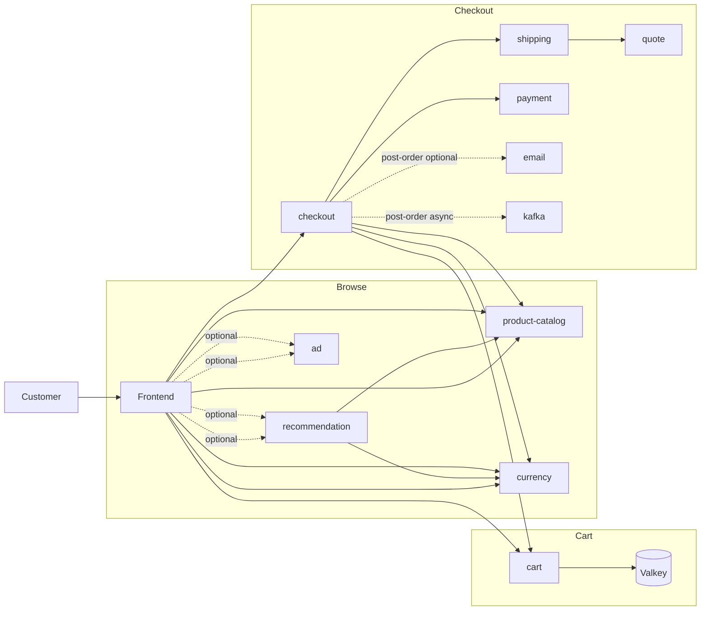

# CDO08-REL-20 - Dependency Failure Resilience Plan

## 1. Scope and SLO guardrails

This plan protects the customer revenue path `browse -> cart -> checkout` when a downstream dependency is unexpectedly unavailable or slow. It inventories the current implementation only; timeout/fallback changes and runtime evidence are completed in the next two subtasks in the same REL-20 PR.

| Flow | SLO |
|---|---|
| Browse/search success (non-5xx) | >= 99.5% |
| Browse storefront p95 latency | < 1 second |
| Cart operation success | >= 99.5% |
| Checkout success | >= 99.0% |

Source: `docs/requirements/onboarding/SLO.md`. The operational views already available are `business-flow-health-overview.json` and `checkout-revenue-dashboard.json`.

## 2. Revenue-path dependency map

Notes:

- Frontend calls product-catalog again after checkout succeeds to enrich the confirmation response.
- Currency is skipped by `ProductCatalogService` when the requested currency is USD; otherwise product listing/detail/cart enrichment depends on it.
- Product reviews and the AI assistant are outside the minimum browse -> cart -> checkout path and are not selected for this task.

## 3. Classification rules

| Classification | Decision rule | Expected failure behavior |
|---|---|---|
| `optional` | The feature does not affect product, cart, price, order or payment correctness. | Time out quickly, omit the feature, return the main response. |
| `degraded-but-continue` | The result is useful but a safe, explicitly approved substitute exists. | Use the substitute and expose a fallback metric/log. Never silently invent price or order data. |
| `customer-blocking` | Continuing can show a wrong price, corrupt cart/order data, charge incorrectly, or claim success without required fulfillment data. | Fail fast with a clear error; do not leave the request hanging. Retry only safe/idempotent operations within a fixed budget. |

## 4. Dependency inventory and failure modes

`None` below means no explicit application-level deadline/retry was found in the referenced caller. Kubernetes probe `timeoutSeconds` is not a request timeout.

| Step | Caller -> downstream | Class | Current timeout / retry / fallback | Current failure behavior | Expected behavior |
|---|---|---|---|---|---|
| Browse | frontend -> product-catalog (`ListProducts`, `GetProduct`) | customer-blocking | No gRPC deadline; no caller retry/fallback | API promise rejects; browse/detail cannot return authoritative products | Add bounded deadline; fail fast. A stale catalog fallback requires separate business approval and is not assumed. |
| Browse/cart | frontend -> currency (`Convert`) | degraded-but-continue for display; customer-blocking once an order total is calculated | USD bypass exists; non-USD calls have no gRPC deadline or explicit fallback | Non-USD product/cart API fails when conversion fails | For browse/cart, time out and fall back to USD with a visible currency indication. Checkout must fail fast rather than guess an exchange rate. |
| Browse/cart | frontend -> recommendation (`ListRecommendations`) -> product-catalog/currency | optional | No gRPC deadline; React Query supplies `[]` only while data is absent, but API errors are not converted into a successful empty response | Recommendation request errors/retries independently; main page can render, but there is no server-side bounded degradation contract | Bound the call and return `[]` with fallback log/metric so browse/cart remain healthy. |
| Browse/cart | frontend -> ad (`GetAds`) | optional | No gRPC deadline; provider defaults data to `[]`, but API errors are not converted into a successful empty response | Ad request errors independently; main content can render, but a slow call has no deadline | Bound the call and return `[]`; record timeout/fallback metric. |
| Cart | frontend -> cart (`GetCart`, `AddItem`, `EmptyCart`) | customer-blocking | No frontend gRPC deadline or explicit retry/fallback | Cart API fails or can wait on a slow dependency | Add bounded deadline. Reads may use a small retry budget; mutations must not be blindly retried. Fail clearly. |
| Cart/checkout response enrichment | frontend -> product-catalog -> currency | customer-blocking for cart; degraded-but-continue after a successfully committed checkout | `Promise.all`; no deadline. One failed item fails the entire API response | Cart fails; after successful `PlaceOrder`, confirmation API can still fail while payment/shipping already succeeded | Cart: fail fast. Post-checkout: return the committed order without optional product enrichment if enrichment fails, avoiding a false checkout failure. |
| Checkout preparation | checkout -> cart (`GetCart`) | customer-blocking | REL-09: 2 s per attempt, one retry after 200 ms; bounded by 20 s overall deadline | Exhaustion fails before charge | Preserve REL-09; fail fast before payment. |
| Checkout preparation | checkout -> product-catalog (`GetProduct`, per item) | customer-blocking | REL-09: 1 s per attempt, one retry after 100 ms; 20 s overall | Exhaustion fails before charge | Preserve REL-09; authoritative product/price is required. |
| Checkout preparation | checkout -> currency (`Convert`, per item plus shipping) | customer-blocking | REL-09: 1 s per attempt, one retry after 100 ms; 20 s overall | Exhaustion fails before charge | Preserve REL-09; never use a guessed/stale exchange rate for charging. |
| Checkout preparation | checkout -> shipping `/get-quote` -> quote | customer-blocking unless a flat-rate fallback is approved | Checkout: 3 s/attempt, one retry after 300 ms. Shipping -> quote: 2 s timeout. No fallback | Exhaustion fails before charge | Preserve bounded retry. Do not introduce flat-rate shipping without business approval. |
| Checkout write | checkout -> payment (`Charge`) | customer-blocking | REL-09: 5 s deadline, no retry; pre-charge check reserves 8 s write budget | Failure returns error; no blind duplicate charge | Preserve exactly: fail fast and do not retry until an idempotency key/contract exists. |
| Checkout write | checkout -> shipping `/ship-order` | customer-blocking | REL-09: 3 s deadline, no retry | Failure is returned after payment may already have succeeded; partial-success risk is documented separately | Preserve no-blind-retry behavior; reconcile partial success under the existing checkout ADR, not via an unsafe fallback. |
| Post-order | checkout -> cart (`EmptyCart`) | optional post-order cleanup | Uses parent 20 s context; no dedicated timeout/retry; error ignored | Order succeeds and cart may remain populated | Use a short dedicated deadline and observe failures; do not turn a committed order into customer-visible failure. |
| Post-order | checkout -> email `/send_order_confirmation` | optional | REL-09: 5 s deadline, no retry; error logged as warning | Order still succeeds without email | Preserve checkout success; future durable async retry is preferable to delaying checkout. |
| Post-order | checkout -> Kafka | optional to synchronous customer response, but required for downstream processing | Uses parent context and select cancellation; configured producer behavior must be verified at runtime | Producer failure is logged and checkout response continues | Keep outside customer-blocking response; alert/reconcile delivery failures. Do not use Kafka as the REL-20 kill target. |
| Cart storage | cart -> Valkey | customer-blocking | Cart store has its own reconnect/error behavior; detailed storage resilience belongs to the existing cart reliability work | Cart operations fail when authoritative state is unavailable | Fail fast and protect data correctness; no fabricated empty-cart fallback. |

## 5. Current gaps to carry into subtask 2

1. Frontend gRPC gateways for ad, recommendation, product-catalog, currency, cart and checkout do not pass explicit deadlines.
2. Browser/server `fetch` wrappers do not use an `AbortSignal` timeout, so a slow frontend API/downstream HTTP call is not bounded at this layer.
3. Optional ad and recommendation failures are visually non-blocking, but their API handlers do not deliberately convert dependency failure into a successful empty response or emit a fallback signal.
4. Product enrichment after `PlaceOrder` can make the frontend report failure after checkout has already charged and shipped the order.
5. REL-09 checkout timeout/retry behavior already exists and must not be widened, duplicated or bypassed.

## 6. Controlled demo dependency

### Selected: `ad`

`ad` is the preferred kill/slow target because:

- it is strictly optional to browse, cart and checkout correctness;
- removing ads does not alter product price, cart state, order data, shipping or payment;
- the UI already supports an empty ad list, making the intended graceful degradation unambiguous;
- it creates no data-loss or external-charge risk;
- mentor can verify that ad calls fail/time out while browse -> add-to-cart -> checkout remains within SLO.

The demo must not kill payment, cart, product-catalog, currency or shipping. Those are customer-blocking and would test fail-fast containment, not the required “revenue path remains healthy” outcome. Recommendation is the secondary safe candidate, but it fans out to product-catalog and currency, adding noise to attribution.

## 7. Planned validation contract

During the later demo subtask, record before/during/after windows and verify:

- browse success >= 99.5% and storefront p95 < 1 s;
- cart success >= 99.5%;
- checkout success >= 99.0%;
- ad errors/timeouts and fallback activation are observable;
- request rate continues and no unexpected pod restarts occur;
- ad is restored to healthy state after the controlled window.

No dependency will be slowed or killed as part of this inventory subtask.

## 8. Rollback boundary

If a later fallback causes incorrect behavior, revert only the REL-20 code/config commit and redeploy the prior image/config. Do not roll back REL-09 checkout deadlines. Any fallback involving price, exchange rate, payment, order state or shipping cost is disabled by default unless the business owner explicitly approves its correctness rules.

## 9. Source evidence reviewed

- `techx-corp-platform/src/frontend/gateways/rpc/*.gateway.ts`
- `techx-corp-platform/src/frontend/gateways/http/Shipping.gateway.ts`
- `techx-corp-platform/src/frontend/pages/api/{cart,checkout,recommendations,data,shipping}.ts`
- `techx-corp-platform/src/frontend/services/ProductCatalog.service.ts`
- `techx-corp-platform/src/frontend/providers/{Ad,Cart}.provider.tsx`
- `techx-corp-platform/src/checkout/main.go`
- `techx-corp-platform/src/shipping/src/shipping_service/quote.rs`
- `docs/cdo08/week1/quan-checkout-reliability-findings.md`
- `docs/requirements/onboarding/SLO.md`

## 10. Subtask 2 implementation

The selected `ad` dependency now has a 750 ms gRPC deadline, configurable through `AD_TIMEOUT_MS`. If `GetAds` fails or exceeds its deadline, `/api/data` returns HTTP 200 with an empty list, allowing the primary product/cart/checkout UI to continue without ads.

Fallback activation is observable through:

- counter `app.frontend.dependency_fallbacks{dependency="ad",operation="GetAds"}`;
- structured warning event `optional_dependency_fallback` containing the dependency, operation and error;
- the existing frontend request/span metrics used by the business-flow dashboard.

The safe fallback behavior has a unit test for both healthy and failed dependency paths (`npm run test:resilience`). No checkout code or REL-09 timeout/retry value is changed. Rollback is the revert of the subtask 2 commit followed by redeploying frontend; no data migration or state rollback is required.
