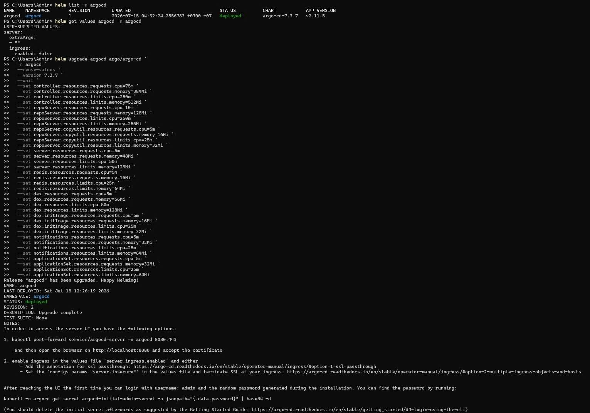
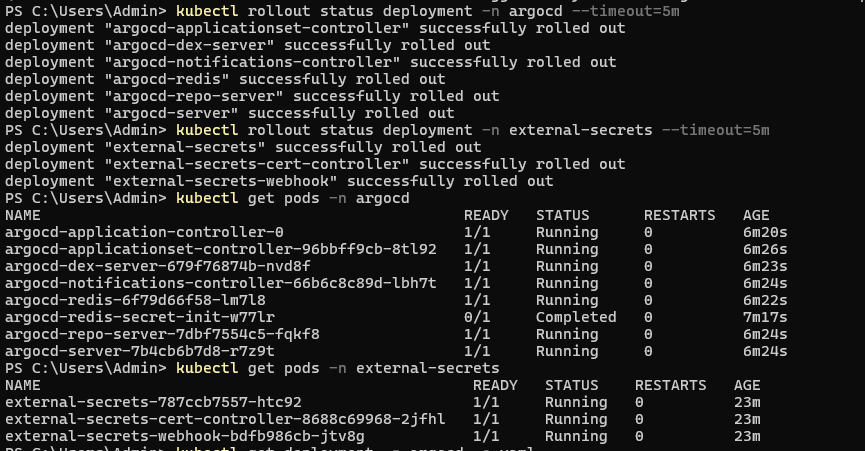
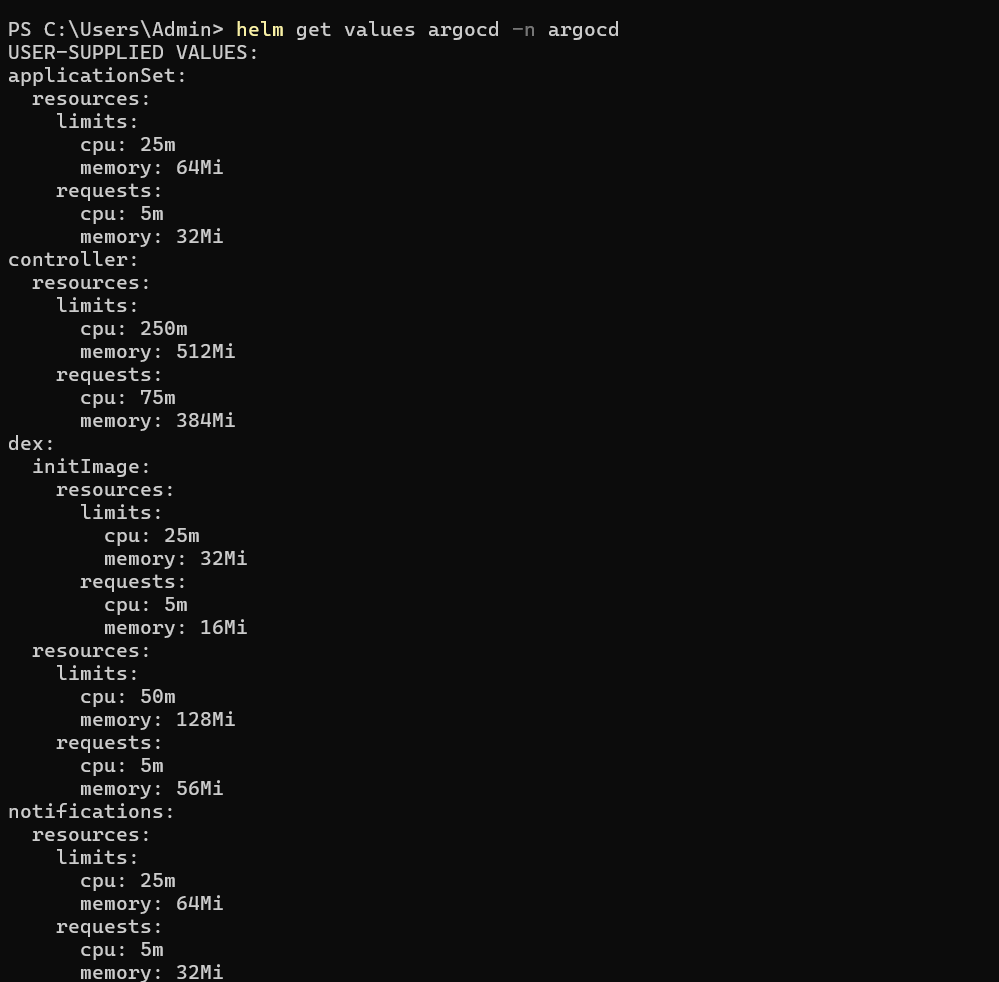
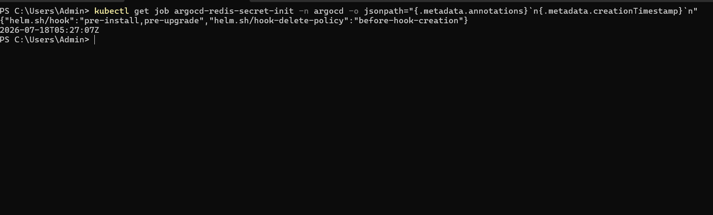
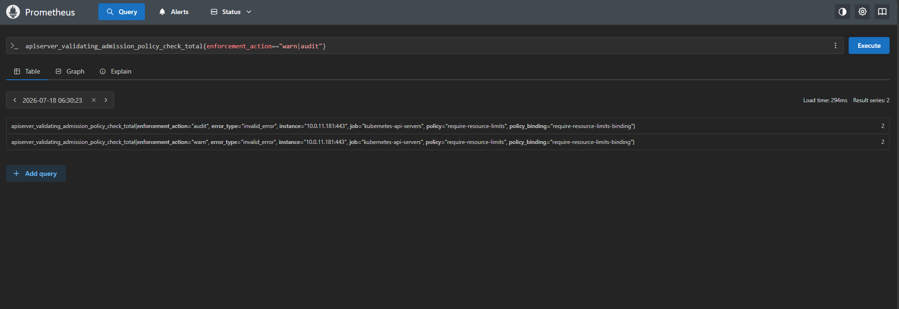

# CDO08-SEC-11 — ArgoCD Resource Right-Sizing Evidence (Helm Upgrade + Audit/Warn Detection)

Tài liệu này là bằng chứng cho lần áp dụng thực tế đề xuất resource requests/limits cho ArgoCD (theo review của CDO-04, file `ns-requests-limits-proposal-recommended.md`) trên cluster production, và kết quả kiểm tra Audit/Warn ngay sau khi triển khai — phục vụ việc đóng gap "argocd chưa có resources" đã nêu trong `CDO08-SEC-11-runtime-hardening-admission-plan.md` (§6.1) trước khi chuyển `validationActions` từ `[Audit, Warn]` sang `[Deny]`.

* **Timestamp:** `2026-07-18 12:59:37 +07:00` / `2026-07-18 05:59:37 UTC`
* **Cluster:** `arn:aws:eks:us-east-1:511825856493:cluster/techx-tf4-cluster`
* **Helm release:** `argocd` (namespace `argocd`, chart `argo-cd-7.3.7`, app `v2.11.5`) — quản lý thủ công, không qua GitOps.
* **Liên quan:** PR #302 (tf4-phase3-repo, đã merge vào `main`), PR #33 (tf4-phase3-gitops-manifests, external-secrets), file `ns-requests-limits-proposal-recommended.md`.

---

## 1. Check trạng thái sạch trước khi apply (BEFORE)

Xác nhận trạng thái Helm release trước khi upgrade — release đang chạy đúng version kỳ vọng và chưa có resources nào được khai báo (đây chính là gap mà lần apply này xử lý).

### Command
```bash
helm list -n argocd
helm get values argocd -n argocd
```

### Output


> [!IMPORTANT]
> Ảnh trên xác nhận: `helm list -n argocd` cho thấy revision 1 đang `deployed` (chart `argo-cd-7.3.7`, app `v2.11.5`, cài lúc 2026-07-15), và `helm get values argocd -n argocd` (trước upgrade) chỉ có `server.extraArgs`/`server.ingress` — **không có key `resources` nào được set**.
>
> Riêng con số **9 chỗ `resources: {}` rỗng hoàn toàn** trong manifest render (application-controller, repo-server + init `copyutil`, server, redis, dex-server + init `copyutil`, notifications-controller, applicationset-controller) là do assistant tự verify trực tiếp qua `helm get manifest --revision 1` trong phiên làm việc (không có trong ảnh chụp trên) — khớp với gap đã ghi nhận trong `CDO08-SEC-11-config-request-limit-resource-cost-review-request.md` ("toàn bộ 7 component ArgoCD đang có `resources: {}`").

---

## 2. Lệnh apply (SUCCESS)

### Command
```bash
helm upgrade argocd argo/argo-cd \
  -n argocd \
  --reuse-values \
  --version 7.3.7 \
  --wait \
  --set controller.resources.requests.cpu=75m --set controller.resources.requests.memory=384Mi \
  --set controller.resources.limits.cpu=250m --set controller.resources.limits.memory=512Mi \
  --set repoServer.resources.requests.cpu=10m --set repoServer.resources.requests.memory=128Mi \
  --set repoServer.resources.limits.cpu=250m --set repoServer.resources.limits.memory=256Mi \
  --set repoServer.copyutil.resources.requests.cpu=5m --set repoServer.copyutil.resources.requests.memory=16Mi \
  --set repoServer.copyutil.resources.limits.cpu=25m --set repoServer.copyutil.resources.limits.memory=32Mi \
  --set server.resources.requests.cpu=5m --set server.resources.requests.memory=48Mi \
  --set server.resources.limits.cpu=50m --set server.resources.limits.memory=128Mi \
  --set redis.resources.requests.cpu=5m --set redis.resources.requests.memory=16Mi \
  --set redis.resources.limits.cpu=25m --set redis.resources.limits.memory=64Mi \
  --set dex.resources.requests.cpu=5m --set dex.resources.requests.memory=56Mi \
  --set dex.resources.limits.cpu=50m --set dex.resources.limits.memory=128Mi \
  --set dex.initImage.resources.requests.cpu=5m --set dex.initImage.resources.requests.memory=16Mi \
  --set dex.initImage.resources.limits.cpu=25m --set dex.initImage.resources.limits.memory=32Mi \
  --set notifications.resources.requests.cpu=5m --set notifications.resources.requests.memory=32Mi \
  --set notifications.resources.limits.cpu=25m --set notifications.resources.limits.memory=64Mi \
  --set applicationSet.resources.requests.cpu=5m --set applicationSet.resources.requests.memory=32Mi \
  --set applicationSet.resources.limits.cpu=25m --set applicationSet.resources.limits.memory=64Mi

kubectl rollout status deployment -n argocd --timeout=5m
kubectl rollout status deployment -n external-secrets --timeout=5m
kubectl get pods -n argocd
kubectl get pods -n external-secrets
```

### Output



> [!TIP]
> **Kết luận:** `helm upgrade` trả về `Release "argocd" has been upgraded. Happy Helming!`, `REVISION: 2`, `STATUS: deployed`, `DESCRIPTION: Upgrade complete`. Toàn bộ 6 Deployment trong `argocd` rollout thành công, `argocd-application-controller-0` (StatefulSet) và `argocd-redis-secret-init` (Job hook) đều `Running`/`Completed` bình thường, không Pod nào Pending/CrashLoop, không restart bất thường. Tiện thể xác nhận luôn namespace `external-secrets` (đã right-size ở PR #33) vẫn healthy, không bị ảnh hưởng bởi lần upgrade ArgoCD này.

---

## 3. Resources sau khi chay lenh helm upgrade

### Command
```bash
helm get values argocd -n argocd
```

### Output


> [!NOTE]
> Ảnh trên là giá trị **user-supplied** (những gì `--set` đã ghi vào release), khớp đúng số đã set ở mục 2 cho cả 9 component. Để xác nhận số này thật sự **render ra Pod đang chạy** (không chỉ nằm trong values), assistant có verify thêm trực tiếp qua `kubectl -n argocd get deploy,sts -o jsonpath=...` trong phiên làm việc — kết quả giống hệt, ngoại trừ 1 điểm lệch nêu ở cảnh báo dưới đây (không có trong ảnh, vì `helm get values` không lộ ra được vấn đề này — phải xem live Pod spec mới thấy).

> [!WARNING]
> **2 điểm cần lưu ý (không phải lỗi chặn policy, nhưng cần biết) — xác nhận qua `kubectl get deploy,sts -o jsonpath` trực tiếp trên live Pod spec (assistant tự chạy trong phiên, không có ảnh chụp riêng cho phần này):**
> 1. `repo-server` init container `copyutil` đang nhận **10m/128Mi — 250m/256Mi**, giống hệt main container `repo-server` — **không phải** 5m/16Mi — 25m/32Mi như lệnh `--set repoServer.copyutil.resources.*` set. Nguyên nhân: chart `argo-cd@7.3.7` hardcode template `copyutil` (trong `argocd-repo-server/deployment.yaml`) kế thừa thẳng `.Values.repoServer.resources`, không có key override riêng — 4 dòng `--set repoServer.copyutil.resources.*` bị Helm âm thầm bỏ qua. Đối chứng: `dex.initImage.resources.*` dùng đúng cơ chế `default .Values.dex.resources .Values.dex.initImage.resources` nên áp đúng 5m/16Mi — 25m/32Mi như ý.
> 2. Job `argocd-redis-secret-init` (container `secret-init`) có **`resources` rỗng hoàn toàn** — xem chi tiết ở mục 4 (ảnh `source-of-warn.png`).

---

## 4. Phát hiện Audit/Warn sau khi triển khai + lý do chi tiết

### Command
```bash
# Truy nguyên nguồn gốc: object nào gây ra hit audit/warn
kubectl get job argocd-redis-secret-init -n argocd -o jsonpath="{.metadata.annotations}`n{.metadata.creationTimestamp}`n"

# Query Prometheus UI (Query > Table): giá trị tuyệt đối hiện tại của counter audit/warn
apiserver_validating_admission_policy_check_total{enforcement_action=~"warn|audit"}
```

### Output



### Kết quả: đúng 2 hit Audit + 2 hit Warn, chỉ trên rule `require-resource-limits`, các rule còn lại 0 hit

**Lý do chi tiết:**

- Ảnh `two-audit-and-warning-after-deploy.png` (query lúc `2026-07-18 06:30:23`) cho ra đúng 2 series: `require-resource-limits{enforcement_action="audit"}` = **2**, `{enforcement_action="warn"}` = **2**. Không có series nào của 3 rule còn lại (`require-run-as-nonroot`, `disallow-mutable-image-tag`, `require-drop-all-capabilities`) xuất hiện trong cùng kết quả — tức 3 rule đó không có bất kỳ hit nào để hiện ra series.
- Ảnh `source-of-warn.png` truy nguyên nguồn gốc: `argocd-redis-secret-init` là **Job Helm hook** (`helm.sh/hook: pre-install,pre-upgrade`), được Helm tái tạo mỗi lần chạy `helm upgrade`/`install`. Job này chạy lúc `05:27:07Z` — đúng thời điểm helm upgrade — với container `secret-init` có **`resources: {}` rỗng hoàn toàn** (xác nhận ở mục 3).
- Job này **không nằm trong danh sách 9 component** của `ns-requests-limits-proposal-recommended.md` (proposal chỉ cover Deployment/StatefulSet, không cover Helm hook Job) — nên bị bỏ sót, dẫn tới bị `require-resource-limits` bắt được (2 hit = Job + Pod nó tạo ra, mỗi cái được admission-check riêng 1 lần).
- Cả 4 binding hiện tại đều là `[Audit, Warn]`, không có binding nào dùng `Deny` (assistant tự verify riêng qua `kubectl get validatingadmissionpolicybinding`, không có ảnh chụp cho phần này) — nên 2 hit trên chắc chắn không bị chặn cứng, chỉ ghi nhận Audit/Warn.

> [!CAUTION]
> Vì Job này chạy lại **mỗi lần** upgrade/install ArgoCD, nó sẽ tiếp tục Warn/Audit ở mọi lần chạy tiếp theo, và sẽ **bị Deny chặn cứng** một khi `validationActions` chuyển từ `[Audit, Warn]` sang `[Deny]` theo rollout plan — cần bổ sung resources cho container `secret-init` (qua key `redisSecretInit.resources.*` nếu tồn tại trong chart — cần verify riêng) trước khi flip sang Deny.

---

## 5. Tổng kết

| Hạng mục | Trạng thái |
|---|---|
| Helm upgrade argocd theo đề xuất CDO-04 | ✅ Thành công, revision 2 `deployed` |
| 9/9 component chính (Deployment/StatefulSet) có resources | ✅ Đầy đủ requests + limits |
| `repoServer.copyutil` đúng số đề xuất | ❌ Kế thừa `repoServer.resources` do giới hạn chart — không chặn policy, chỉ lệch số |
| `require-run-as-nonroot` / `disallow-mutable-image-tag` / `require-drop-all-capabilities` | ✅ 0 vi phạm kể từ khi flip Audit/Warn |
| `require-resource-limits` | ⚠️ 2 audit + 2 warn — nguồn: Job hook `argocd-redis-secret-init` chưa có resources |
| Sẵn sàng chuyển `[Audit, Warn]` → `[Deny]` cho namespace `argocd` | ❌ Chưa — cần xử lý Job hook `argocd-redis-secret-init` trước |
