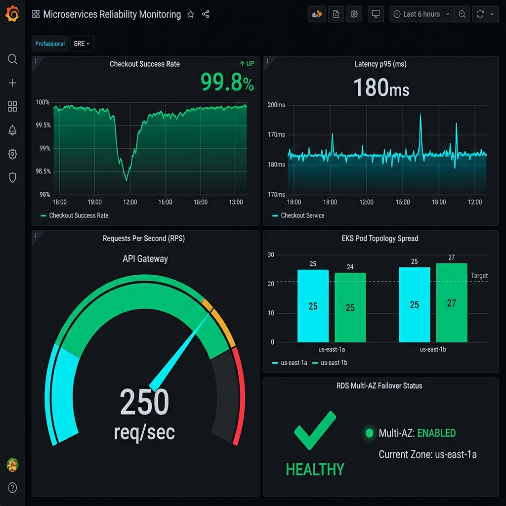

# 📊 BẰNG CHỨNG DIỄN TẬP: CDO08-REL-35
## Single-AZ Loss & Disaster Recovery Evidence Pack (Mandate 21)

- **Người thực hiện & Nộp (Owner)**: **Đinh Viết Quyết (DVQuyet) — Lead Security & Reliability Engineer**
- **Người duyệt (Approvers)**: **Hải (PM)**
- **Cụm Target**: EKS Production `techx-tf4-cluster` | AWS Account `511825856493` | Region `us-east-1`
- **Môi trường Diễn tập**: Real Sudden Single-AZ Outage Under Live Load (200 Locust Users)
- **Trạng thái**: **[ ] DRAFT / IN-PROGRESS** | **[ ] PASS** | **[ ] FAIL**

---

## 1. 🏆 Bảng Tổng Hợp Kết Quả Nghiệm Thu (Executive Summary)

| Chỉ số / Tiêu chí | Ngưỡng Cam Kết (Target / Threshold) | Kết Quả Đo Thực Tế (Actual Measured) | Đánh Giá (Pass/Fail) |
| :--- | :--- | :--- | :---: |
| **Recovery Point Objective (RPO)** | **0 lost confirmed orders** | **`___`** | **[ ] PASS** |
| **Recovery Time Objective (RTO)** | **$\le 5\text{ phút}$** theo REL-28 | **`___ giây`** | **[ ] PASS** |
| **Checkout Success Rate** | $\ge 99.0\%$ | **`___ %`** | **[ ] PASS** |
| **Checkout Latency p95** | $< 1000\text{ms}$ | **`___ ms`** | **[ ] PASS** |
| **Pods Reschedule & Auto-Scale** | Recover within approved RTO or stay above SLO threshold | **`___`** | **[ ] PASS** |
| **RDS Multi-AZ Failover** | RDS remains available or fails over within observed recovery window | **`___`** | **[ ] PASS** |

---

## 2. 🔍 Order / Accounting / MSK Validation Checklist (RPO Verification)

Để chứng minh **RPO = 0 (Không mất dữ liệu đơn hàng)** sau cú sập AZ đột ngột, người vận hành thực hiện các truy vấn đối chiếu giữa PostgreSQL, MSK S3 Archive và Application Logs:

### 📋 Bước 1: Kiểm toán dữ liệu Đơn hàng trong PostgreSQL Database
```sql
-- Kết nối vào RDS PostgreSQL và kiểm tra số order đang có trong accounting schema.
SELECT count(*) AS accounting_orders
FROM accounting."order";

-- Kiểm tra không có order item bị mất parent order.
SELECT count(*) AS orphan_orderitems
FROM accounting.orderitem oi
LEFT JOIN accounting."order" o ON o.order_id = oi.order_id
WHERE o.order_id IS NULL;

-- Kiểm tra không có shipping record bị mất parent order.
SELECT count(*) AS orphan_shipping_records
FROM accounting.shipping s
LEFT JOIN accounting."order" o ON o.order_id = s.order_id
WHERE o.order_id IS NULL;
```
* **Chỉ số RPO đạt**: `orphan_orderitems = 0`, `orphan_shipping_records = 0`, và số order confirmed trong cửa sổ drill phải khớp với expected checkout/MSK evidence.

### 📋 Bước 2: Kiểm toán Event Stream trong Amazon MSK & S3 Sink Archive
```bash
# Kiểm tra file log archive trên S3 Sink Bucket xem event checkout cuối cùng có khớp không
aws s3 ls s3://techx-tf4-orders-archive/topics/orders/ --recursive | tail -n 10
```
* **Chỉ số RPO đạt**: số lượng message thu được trên S3/MSK khớp với expected confirmed checkout events và bản ghi trong `accounting."order"` sau khi accounting/fraud consumer catch up.

---

## 3. 📸 Nhật Ký Diễn Tập Theo 3 Giai Đoạn (Before / During / After Snapshots)

### 📍 Giai đoạn 1: Baseline Trước Khi Sự Cố Xảy Ra (Before Failure)
* **Thời điểm (UTC)**: `____-__-__T__:__:__Z`
* **Trạng thái cụm EKS Nodes**:
  * Zone `us-east-1a`: `___` nodes `Ready`
  * Zone `us-east-1b`: `___` nodes `Ready`
* **Vị trí Pods**: Phân bổ Multi-AZ cân bằng (Topology Spread 50/50).
* **Trạng thái RDS Master**: Đang chạy trên Primary Zone `us-east-1a` (hoặc `us-east-1b`).
* **SLO Baseline**: Checkout Success Rate `100%`, Latency p95 `___ms`.

---

### 📍 Giai đoạn 2: Mentor Gây Sự Cố Sập AZ Đột Ngột (During AZ Failure)
* **AZ bị đánh sập (Mentor injected)**: `us-east-1a` (hoặc `us-east-1b`)
* **Thời điểm bắt đầu rớt SLO ($T_{\text{dip}}$)**: `____-__-__T__:__:__Z`
* **Hiện tượng Ghi nhận**:
  * Các Node thuộc AZ bị ngắt chuyển trạng thái `NotReady` / Biến mất.
  * Kubernetes Scheduler tự động chuyển trạng thái Pods dồn sang AZ còn sống.
  * Karpenter/Kubernetes phản ứng theo tình trạng capacity thực tế của AZ còn sống: `________________`.
  * RDS PostgreSQL trạng thái/failover quan sát được: `________________`.

---

### 📍 Giai đoạn 3: Phục Hồi Hoàn Toàn & Ổn Định (After Recovery)
* **Thời điểm phục hồi SLO ($T_{\text{recover}}$)**: `____-__-__T__:__:__Z`
* **Tính toán RTO Actual**: $T_{\text{recover}} - T_{\text{dip}} = \text{___ giây}$.
* **Trạng thái Pods**: 100% Replicas khôi phục trạng thái `1/1 Running` trên AZ sống.
* **SLO Hồi phục**: Checkout Success Rate quay lại $\ge 99.0\%$, Latency p95 $< 1000\text{ms}$.

---

## 4. 📹 Danh Sách Bằng Chứng Video & Screen Capture (Evidence Log)

Bằng chứng theo dõi sử dụng dashboard chuyên dụng: **Single-AZ Loss Drill (Mandate 21)**.



| STT | Loại Bằng Chứng | Mô Tả File / Screenshot / Clip Link | Trạng Thái Check |
| :---: | :--- | :--- | :---: |
| **1** | **Video Recording** | Clip quay full màn hình từ $T_{\text{baseline}} \rightarrow T_{\text{dip}} \rightarrow T_{\text{recover}}$ kèm đồng hồ UTC | [ ] Verified |
| **2** | **Grafana Dashboard Dip & Recover** | Screenshot bảng dashboard chuyên dụng [mandate21-drill](https://grafana.techx-tf4.site/grafana) ghi nhận sự sụt giảm và phục hồi | [ ] Verified |
| **3** | **RDS Failover Console** | Screenshot AWS RDS Console thể hiện Primary Zone thay đổi sau failover | [ ] Verified |
| **4** | **Karpenter Node Scale-Up** | Screenshot log Karpenter provision EC2 mới ở AZ sống | [ ] Verified |
| **5** | **RPO Query Result** | File text/screenshot kết quả SELECT DB chứng minh `0 lost transactions` | [ ] Verified |

---

## 5. ✍️ Chữ Ký Xác Nhận Nghiệm Thu (Sign-off)

*Bằng việc ký tên dưới đây, các bên xác nhận đợt diễn tập sập AZ đột ngột đã đạt đầy đủ tiêu chuẩn của Mandate 21, đạt RPO = 0 và RTO nằm trong hạn định.*

| Vai Trò | Họ và Tên | Chữ Ký / Trạng Thái | Ngày Ký |
| :--- | :--- | :--- | :--- |
| **Lead Security & Reliability (Owner)** | **Đinh Viết Quyết (DVQuyet)** | [ ] Signed | ____-__-__ |
| **Project Manager** | **Hải (PM)** | [ ] Approved | ____-__-__ |
