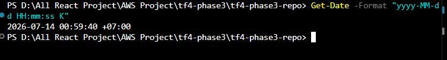
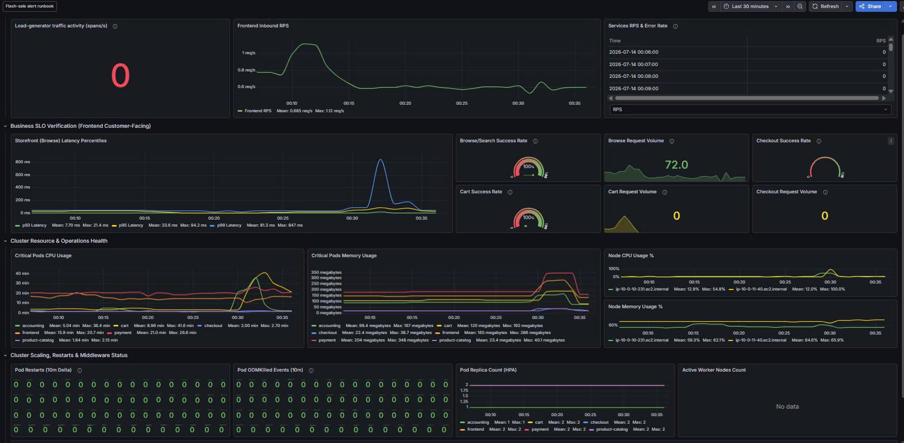
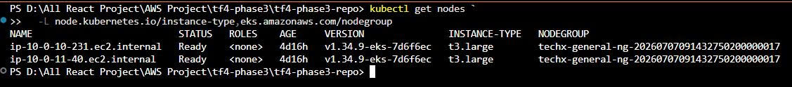
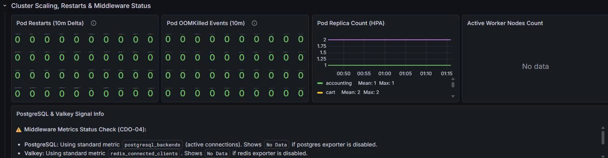
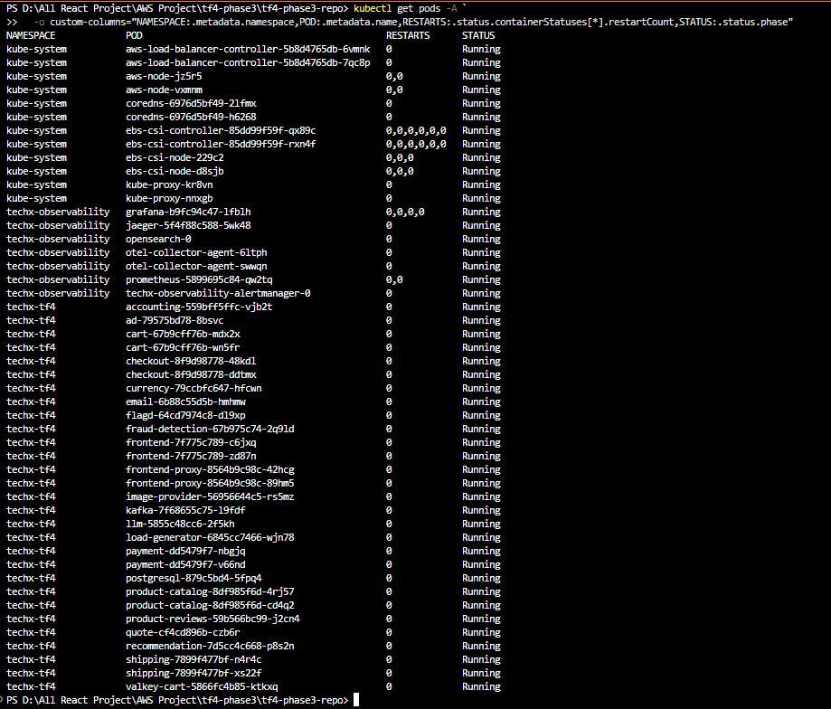
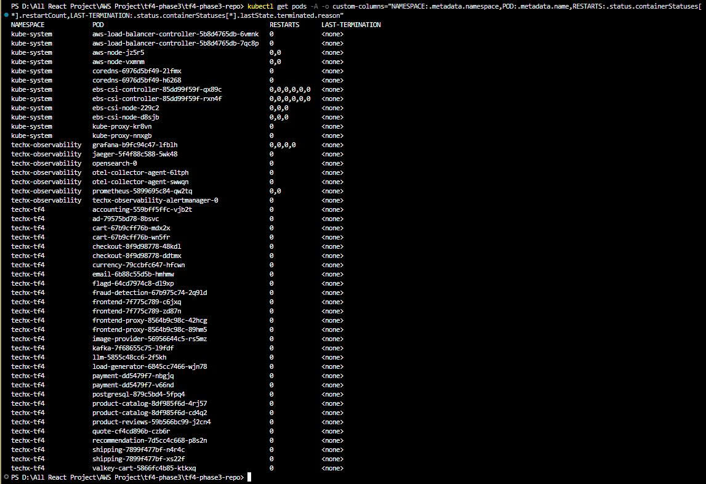
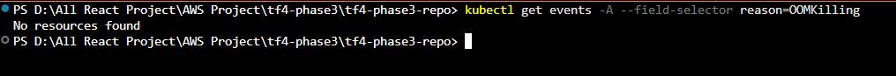

# Task 5 — Baseline Performance và Resource trước Load Test

## 1. Mục tiêu

Tài liệu này ghi nhận baseline ngay trước bài kiểm thử Flash Sale 200 người dùng để làm mốc so sánh trong và sau load test. Baseline bao gồm traffic, latency, success/error rate, tài nguyên Kubernetes, replica, node group, restart/OOMKilled và trạng thái load generator.

## 2. Phạm vi và thời điểm chụp

| Thuộc tính | Giá trị |
|---|---|
| Cluster | `techx-tf4-cluster` |
| AWS Region | `us-east-1` |
| Namespace ứng dụng | `techx-tf4` |
| Namespace observability | `techx-observability` |
| Baseline timestamp | `2026-07-14 00:59:40 +07:00` |
| Dashboard window | Last 30 minutes trước load test |
| Trạng thái bài test chính | Chưa bắt đầu |

> Lưu ý: bộ evidence được thu liên tiếp trước load test. Bảng performance/resource sử dụng cửa sổ Grafana thể hiện trong ảnh; timestamp terminal là mốc thời gian của phiên thu baseline.

## 3. Xác nhận load generator idle

- Panel `Load-generator traffic activity (spans/s)` ghi nhận **0 spans/s**.
- Deployment `load-generator` ở trạng thái `1/1 Ready`; pod đang chạy nhưng không tạo traffic.
- Không có Kubernetes Job đang active.
- CronJob `jaeger-es-index-cleaner` có `ACTIVE=0`; đây không phải workload load test.

**Kết luận:** không phát hiện load test chạy ngầm tại thời điểm baseline.

## 4. Baseline performance và business SLO

### 4.1 Traffic

| Chỉ số | Baseline |
|---|---:|
| Frontend inbound RPS — mean | `0.685 req/s` |
| Frontend inbound RPS — max | `1.12 req/s` |
| Browse request volume | `72` |
| Cart request volume | `0` |
| Checkout request volume | `0` |

### 4.2 Latency

| Percentile | Mean | Max |
|---|---:|---:|
| p50 | `7.70 ms` | `21.4 ms` |
| p95 | `33.6 ms` | `94.2 ms` |
| p99 | `81.3 ms` | `847 ms` |

### 4.3 Success/error baseline

| Chỉ số | Baseline | Diễn giải |
|---|---:|---|
| Browse/Search success rate | `100%` | Có 72 request trong cửa sổ baseline |
| Cart success rate | Không kết luận | Volume bằng 0 |
| Checkout success rate | Không kết luận | Volume bằng 0 |
| Load-generator activity | `0 spans/s` | Idle |

## 5. Cluster resource baseline

Dashboard đã ghi nhận CPU/memory của critical pods và worker nodes trong cửa sổ baseline.

| Chỉ số quan sát được | Baseline |
|---|---:|
| Node CPU — mean (node hiển thị) | `12.9%` |
| Node CPU — max (node hiển thị) | `54.8%` |
| Node memory — mean (node hiển thị) | `59.3%` |
| Node memory — max (node hiển thị) | `62.1%` |
| Payment memory — mean | `204 MB` |
| Payment memory — max | `348 MB` |
| Frontend memory — mean | `165 MB` |
| Frontend memory — max | `286 MB` |

> Panel `Critical Pods CPU Usage` đang hiển thị unit `min`; giá trị thực tế có dấu hiệu là CPU millicore. Đây được ghi nhận là dashboard issue trước test và không được diễn giải là thời lượng phút.

## 6. Node count, instance type và node group

| Thuộc tính | Giá trị |
|---|---|
| Active worker nodes | `2` |
| Node status | Cả hai `Ready` |
| Instance type | `t3.large` |
| Kubernetes version | `v1.34.9-eks-7d6f6ec` |
| Node group | `techx-general-ng-20260707091432750200000017` |

> Panel Grafana `Active Worker Nodes Count` trả `No data`; output `kubectl` ở trên là nguồn xác nhận node count cho baseline.

## 7. Replica configuration

Tất cả Deployment được chụp đều có `READY`, `UP-TO-DATE` và `AVAILABLE` bằng replica mong muốn.

### 7.1 Critical application replicas

| Deployment | Replicas |
|---|---:|
| accounting | 1 |
| cart | 2 |
| checkout | 2 |
| frontend | 2 |
| frontend-proxy | 2 |
| payment | 2 |
| product-catalog | 2 |
| shipping | 2 |
| load-generator | 1 |
| currency | 1 |
| email | 1 |
| flagd | 1 |
| fraud-detection | 1 |
| image-provider | 1 |
| kafka | 1 |
| llm | 1 |
| postgresql | 1 |
| product-reviews | 1 |
| quote | 1 |
| recommendation | 1 |
| valkey-cart | 1 |

### 7.2 Observability replicas

| Deployment | Replicas |
|---|---:|
| Grafana | 1 |
| Jaeger | 1 |
| Prometheus | 1 |

Không có HPA resource xuất hiện trong output `kubectl get deploy,hpa -A`; baseline hiện sử dụng replica tĩnh.

## 8. Restart và OOMKilled baseline

- Tất cả pod hiện tại có `RESTARTS=0`.
- Tất cả container hiện tại có `LAST-TERMINATION=<none>`.
- `kubectl get events -A --field-selector reason=OOMKilling` trả `No resources found`.
- Grafana ghi nhận restart delta bằng 0 và OOMKilled events bằng 0 trong cửa sổ quan sát.

**Kết luận có giới hạn:** không có restart, last termination reason hoặc OOMKilling event trên các pod hiện tại tại timestamp baseline. Kubernetes Event có thời hạn lưu, vì vậy bằng chứng này không khẳng định toàn bộ lịch sử cluster chưa từng xảy ra OOM.

## 9. Existing issues trước load test

1. Grafana `Active Worker Nodes Count` trả `No data`; `kubectl` xác nhận có 2 node Ready.
2. Panel `Critical Pods CPU Usage` hiển thị sai unit `min`; cần chuẩn hóa thành mCPU hoặc core.
3. p99 browse latency đã spike tới `847 ms` trước load test.
4. Cart và checkout volume bằng 0 nên chưa có mẫu để kết luận success rate.
5. Bảng `Services RPS & Error Rate` hiển thị RPS bằng 0 trong khi frontend có khoảng `0.685 req/s`; cần kiểm tra query/aggregation interval.
6. Không có HPA resource; critical services đang chạy replica tĩnh.
7. Grafana public route đã bị chặn theo MANDATE-01; evidence được thu qua private SSM tunnel.

## 10. Đối chiếu Acceptance Criteria

| Acceptance Criteria | Trạng thái | Evidence |
|---|---|---|
| Baseline có timestamp | PASS | Ảnh timestamp `2026-07-14 00:59:40 +07:00` |
| Không có load test chạy ngầm | PASS | Load-generator activity = 0; không có active Job |
| Có screenshot/query output trước test | PASS | Grafana và kubectl screenshots |
| Có node group và replica configuration | PASS | 2 × t3.large; node group và Deployment output |
| Có danh sách issue tồn tại | PASS | Mục 9 |

