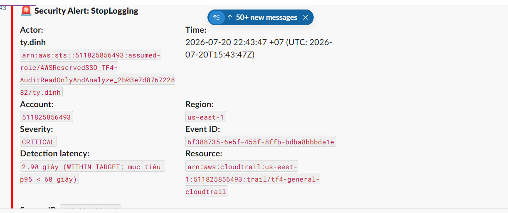

# BÁO CÁO KIỂM THỬ TẤN CÔNG VÀ KIỂM MINH HẠ TẦNG AUDIT (ATTACKER EMULATION REPORT)

| Thuộc tính | Giá trị |
|------------|----------|
| **Dự án** | Task Force 4 — Enterprise Cloud Security & Compliance |
| **Đội thực hiện** | Group CDO-07 (Auditability) |
| **Người chịu trách nhiệm chính (Owner)** | Đinh Văn Ty, Lê Trung Trực |
| **Mã công việc (Ref)** | AUDIT-010 — CloudTrail Anti-Blinding & Integrity Verification |
| **Ngày thực hiện** |  21/07/2026 |
| **Môi trường** | Production |

---

# 🎯 MỤC TIÊU VÀ KỊCH BẢN (OBJECTIVE & SCOPE)

Nhằm đảm bảo tính sẵn sàng, khả năng **chống chối bỏ (Non-repudiation)** và độ tin cậy của hạ tầng kiểm toán trước khi nghiệm thu với Mentors, đội **Auditability** tiến hành mô phỏng vai trò của một **Kẻ tấn công có đặc quyền (Malicious Insider / Compromised Admin)** để kiểm thử khả năng phòng thủ của hệ thống.

Ba kịch bản tấn công được thực hiện gồm:

1. **Đòn 1 – Blinding Attack:** Tắt luồng ghi log của CloudTrail.
2. **Đòn 2 – Data Exfiltration Attack:** Truy xuất dữ liệu nhạy cảm từ S3 Bucket hoặc AWS Secrets Manager.
3. **Đòn 3 – Log Tampering Attack:** Giả lập hành vi chỉnh sửa hoặc xóa log và kiểm tra tính toàn vẹn của dữ liệu kiểm toán.

---

# 🛠️ KẾT QUẢ KIỂM THỬ CHI TIẾT (TEST EXECUTION & PROOF)

## 💥 ĐÒN 1 – LÀM MÙ HỆ THỐNG (BLINDING ATTACK)

### Kịch bản

Sử dụng quyền TF4-AuditReadOnlyAndAnalyze để vô hiệu hóa CloudTrail của dự án.


### 📌 Kết quả ghi nhận

#### Kiểm tra cơ chế Preventative (SCP)

| Nội dung | Kết quả |
|----------|----------|
| Trạng thái | Thành công |
| Ghi chú | SCP không áp dụng đối với Management Account nên lệnh StopLogging được thực thi thành công. |

---

#### Kiểm tra cơ chế Self-Healing (EventBridge + SSM Automation)

| Nội dung | Kết quả |
|----------|----------|
| Thời gian khôi phục (RTO) | ~ Chưa ghi nhận |
| Trạng thái sau 3 giây | `IsLogging = false` |

---
#### Kiểm tra cơ chế Cảnh báo
| Nội dung | Kết quả |
|----------|----------|
| Thời gian ghi nhận (Time to detect) | 2.90 s |

Hình ảnh thực tế


### 📸 Bằng chứng kiểm toán (Proof of Evidence)

#### CloudTrail / CloudWatch Event

```json
{
    "eventVersion": "1.11",
    "userIdentity": {
        "type": "AssumedRole",
        "principalId": "AROAXOKZSY7W74IQD5ZRM:ty.dinh",
        "arn": "arn:aws:sts::511825856493:assumed-role/AWSReservedSSO_TF4-AuditReadOnlyAndAnalyze_2b03e7d876722882/ty.dinh",
        "accountId": "511825856493",
        "accessKeyId": "[REDACTED_TEMPORARY_ACCESS_KEY]",
        "sessionContext": {
            "sessionIssuer": {
                "type": "Role",
                "principalId": "AROAXOKZSY7W74IQD5ZRM",
                "arn": "arn:aws:iam::511825856493:role/aws-reserved/sso.amazonaws.com/AWSReservedSSO_TF4-AuditReadOnlyAndAnalyze_2b03e7d876722882",
                "accountId": "511825856493",
                "userName": "AWSReservedSSO_TF4-AuditReadOnlyAndAnalyze_2b03e7d876722882"
            },
            "attributes": {
                "creationDate": "2026-07-20T15:41:58Z",
                "mfaAuthenticated": "false"
            }
        },
        "onBehalfOf": {
            "userId": "c46824b8-f071-7009-c812-ad564a62b220",
            "identityStoreArn": "arn:aws:identitystore::511825856493:identitystore/d-9066740a19"
        }
    },
    "eventTime": "2026-07-20T15:43:47Z",
    "eventSource": "cloudtrail.amazonaws.com",
    "eventName": "StopLogging",
    "awsRegion": "us-east-1",
    "sourceIPAddress": "[REDACTED_SOURCE_IP]",
    "userAgent": "Mozilla/5.0 (Windows NT 10.0; Win64; x64) AppleWebKit/537.36 (KHTML, like Gecko) Chrome/150.0.0.0 Safari/537.36 Edg/150.0.0.0",
    "requestParameters": {
        "name": "arn:aws:cloudtrail:us-east-1:511825856493:trail/tf4-general-cloudtrail"
    },
    "responseElements": null,
    "requestID": "100fd00f-99e9-4973-b820-2f187b31cc96",
    "eventID": "6f388735-6e5f-455f-8ffb-bdba8bbbda1e",
    "readOnly": false,
    "eventType": "AwsApiCall",
    "managementEvent": true,
    "recipientAccountId": "511825856493",
    "eventCategory": "Management",
    "tlsDetails": {
        "tlsVersion": "TLSv1.3",
        "cipherSuite": "TLS_AES_128_GCM_SHA256",
        "clientProvidedHostHeader": "cloudtrail.us-east-1.amazonaws.com"
    },
    "sessionCredentialFromConsole": "true"
}
```

---

#### Alert Pipeline

> 📷 **Hình minh họa:** Screenshot thông báo Alert trên Slack / Email.

---

# 💥 ĐÒN 2 – LÀM HỤT DỮ LIỆU (DATA EXFILTRATION ATTACK)

## Kịch bản

Giả lập Hacker hoặc Insider đọc dữ liệu nhạy cảm từ:

- S3 Audit Bucket
- AWS Secrets Manager

### Lệnh kiểm thử

```bash
# Đọc CloudTrail object nhạy cảm nhưng không lưu nội dung xuống máy
aws s3api get-object \
  --bucket tf4-cloudtrail-logs-bucket-511825856493 \
  --key AWSLogs/511825856493/CloudTrail/us-east-1/2026/07/21/511825856493_CloudTrail_us-east-1_20260721T0000Z_LevFxwnpSaV3V4Vv.json.gz \
  /dev/null \
  --profile TF4-AuditReadOnlyAndAnalyze \
  --region us-east-1
```

> Profile audit bị từ chối `secretsmanager:ListSecrets`, vì vậy dry run chọn S3 object thuộc prefix nhạy cảm đã được phê duyệt thay vì đoán tên Secret hoặc nới quyền. Nội dung object được bỏ trực tiếp vào `/dev/null` và không nằm trong evidence pack.

---

### 📌 Kết quả ghi nhận

| Hành vi | Kết quả |
|----------|----------|
| S3 Data Event | **PASS** — tìm đúng `GetObject`, `eventCategory=Data` |
| Actor attribution | **PASS** — SSO session `truc.le` |
| Resource attribution | **PASS** — đúng bucket và object key đã đọc |
| Event ID | `1a7cc2b6-5d32-4d5f-9a0f-17b3e08d5893` |
| Delivery latency quan sát được | Khoảng **5 phút 14 giây** |
| Secrets Manager live test | Không chạy do profile không được phép enumerate Secret; không phải điều kiện cần khi S3 scenario đã PASS |

---

### 📸 Bằng chứng kiểm toán

#### Truy vấn CloudWatch Logs Insights / Athena

```sql
fields @timestamp, eventTime, eventName, eventSource, eventCategory, readOnly,
       userIdentity.arn as actorArn,
       requestParameters.bucketName as bucket,
       requestParameters.key as objectKey,
       eventID
| filter eventSource = "s3.amazonaws.com"
    and eventName = "GetObject"
    and requestParameters.bucketName = "tf4-cloudtrail-logs-bucket-511825856493"
    and requestParameters.key = "AWSLogs/511825856493/CloudTrail/us-east-1/2026/07/21/511825856493_CloudTrail_us-east-1_20260721T0000Z_LevFxwnpSaV3V4Vv.json.gz"
| sort @timestamp desc
| limit 20
```

---

#### Kết quả truy vấn

```json
{
  "@timestamp": "2026-07-21 10:25:01.065",
  "eventTime": "2026-07-21T10:19:47Z",
  "eventName": "GetObject",
  "eventSource": "s3.amazonaws.com",
  "eventCategory": "Data",
  "readOnly": "1",
  "actorArn": "arn:aws:sts::511825856493:assumed-role/AWSReservedSSO_TF4-AuditReadOnlyAndAnalyze_2b03e7d876722882/truc.le",
  "bucket": "tf4-cloudtrail-logs-bucket-511825856493",
  "objectKey": "AWSLogs/511825856493/CloudTrail/us-east-1/2026/07/21/511825856493_CloudTrail_us-east-1_20260721T0000Z_LevFxwnpSaV3V4Vv.json.gz",
  "eventID": "1a7cc2b6-5d32-4d5f-9a0f-17b3e08d5893"
}
```


**Kết luận Đòn 2:** **PASS**. Hành động đọc object nhạy cảm để lại đủ actor, API, resource, timestamp và event ID.

---

# 💥 ĐÒN 3 – LÀM MỎNG / SỬA LOG (LOG TAMPERING ATTACK)

## Kịch bản

Giả lập tình huống:

- File log trên S3 bị chỉnh sửa.
- Xóa một phần dữ liệu log.
- Có sự can thiệp của bên thứ ba.

Sau đó sử dụng **CloudTrail Digest Validation** để kiểm tra tính toàn vẹn của log.

### Lệnh kiểm thử

```bash
aws cloudtrail validate-logs \
  --trail-arn arn:aws:cloudtrail:us-east-1:511825856493:trail/tf4-general-cloudtrail \
  --start-time 2026-07-21T08:00:00Z \
  --end-time 2026-07-21T09:00:00Z \
  --verbose \
  --profile TF4-AuditReadOnlyAndAnalyze \
  --region us-east-1 \
  --no-cli-pager
```

---

### 📌 Kết quả ghi nhận

| Nội dung | Kết quả |
|----------|----------|
| Digest Validation | **PASS** — `2/2 digest files valid` |
| Log File Validation | **PASS** — `102/102 log files valid` |
| CLI exit code | `0` |
| Storage Protection | S3 Object Lock **COMPLIANCE** |
| Retention Period | **90 ngày** |

---

### 📸 Bằng chứng kiểm toán

#### Output lệnh validate-logs

```text
Results requested for 2026-07-21T08:00:00Z to 2026-07-21T09:00:00Z
Results found for 2026-07-21T08:00:00Z to 2026-07-21T09:00:00Z:

2/2 digest files valid
102/102 log files valid
```


**Kết luận Đòn 3:** **PASS**. Không phát hiện digest hoặc log file bị thêm, xóa hay sửa trong cửa sổ kiểm tra.

---


# 📌 KẾT LUẬN

## Tóm tắt Mandate 12 — Đinh Văn Ty

| Hạng mục | Đánh giá | Kết luận |
|----------|----------|----------|
| Chống làm mù | **PARTIAL — 70%** | SCP không áp dụng được vì hệ thống đang triển khai trên AWS Organizations management account. Hiện đã có cơ chế cảnh báo khi `StopLogging`, nhưng self-healing để tự bật lại CloudTrail chưa triển khai thành công. |
| Data-event coverage | **PASS** | Hoạt động đọc dữ liệu nhạy cảm trên S3, đọc Secret và các thay đổi cấu hình quan trọng đã có vết để truy. Dry run đã chứng minh runtime đối với S3 `GetObject`. |
| Toàn vẹn mật mã | **PASS** | CloudTrail Log File Validation hoạt động; lần kiểm thử trả `2/2 digest files valid` và `102/102 log files valid`. |
| Retention | **PASS** | Log được cấu hình retention **90 ngày** với S3 Object Lock COMPLIANCE. |

**Kết luận tổng thể:** Mandate 12 đã PASS ba trong bốn nhóm yêu cầu. Hạng mục chống làm mù đạt khoảng **70%** do mới có detection/alerting, chưa có preventative SCP hoặc self-healing hoạt động. Đây là gap còn lại cần trình bày minh bạch với Mentor.

## Checklist yêu cầu của MANDATE-12
- [ ] **Không có cửa sổ mù (No Blind Window) — PARTIAL 70%**
  - [x] `StopLogging` để lại dấu vết và kích hoạt cảnh báo.
  - [ ] SCP không áp dụng được vì workload nằm trên management account.
  - [ ] Self-healing tự bật lại CloudTrail chưa triển khai thành công.
  - [x] Chứng minh sự kiện `StopLogging` luôn được ghi nhận và kích hoạt cảnh báo (Alert).

- [x] **Log đúng đối tượng cần theo dõi (Close Coverage Gap)**
  - [x] Ghi nhận đầy đủ các **Management Events**, gồm read-only events.
  - [x] Ghi nhận targeted **Data Events** đối với Amazon S3 (`GetObject`, `DeleteObject`; Terraform state thêm `PutObject`).
  - [x] `GetSecretValue` được CloudTrail ghi dưới dạng **Management Event**, không phải Secrets Manager Data Event.
  - [x] Chứng minh runtime có thể truy vết khi kẻ tấn công tải dữ liệu từ S3 Bucket.

- [x] **Đảm bảo tính toàn vẹn của log (Integrity Verification)**
  - [x] Bật **CloudTrail Log File Integrity Validation**.
  - [x] Chứng minh chuỗi Digest và cơ chế xác minh chữ ký số hoạt động (`2/2 valid`).
  - [x] Chứng minh log files trong cửa sổ kiểm tra không bị thêm, xóa hoặc chỉnh sửa (`102/102 valid`).
  - [x] Chuỗi digest trong cửa sổ `08:00Z–09:00Z` được xác minh liên tục; không có missing digest được báo cáo.

- [x] **Đảm bảo thời gian lưu trữ (Retention Policy)**
  - [x] Retention được cấu hình rõ là **90 ngày**.
  - [x] 90 ngày bao phủ tấn công kéo dài nhiều ngày và cho phép điều tra sau phát hiện muộn.
  - [x] S3 Object Lock **COMPLIANCE** bảo vệ bất biến trong toàn bộ thời gian retention.

---

## Tài liệu đính kèm

| Tài liệu | Đường dẫn |
|----------|-----------|
| Terraform CloudTrail | `infra/terraform/cloudtrail.tf` |
| Terraform Self-Healing | `infra/terraform/cloudtrail-auto-remediation.tf` |
| Báo cáo runtime đầy đủ Đòn 2 + Đòn 3 | `docs/evidence/mandate-12-anti-defeat/MANDATE-12-HACKER-ACCEPTANCE-REPORT.md` |
| Evidence images | `docs/evidence/mandate-12-anti-defeat/images/` |

---

# XÁC NHẬN BỞI OWNER

**Đinh Văn Ty**<br>
**Group CDO-07 – Auditability**
