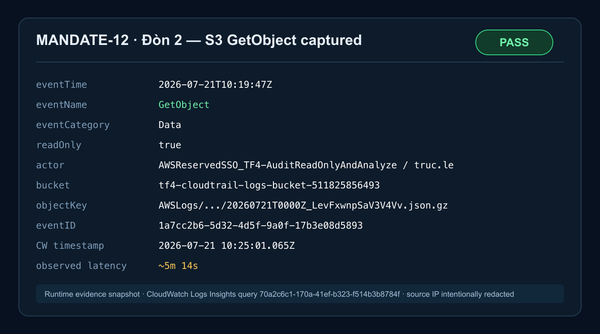
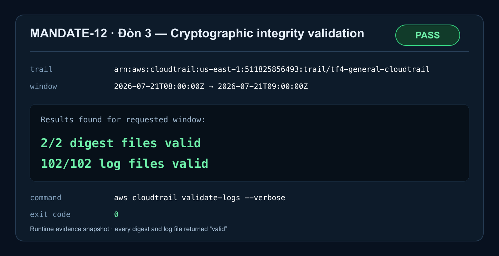
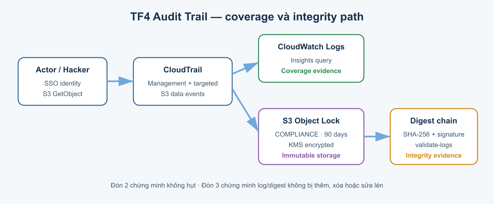

# MANDATE-12 — Hacker Acceptance Report

**Ngày kiểm thử:** 2026-07-21<br>
**Tài khoản / Region:** `511825856493` / `us-east-1`<br>
**Trail:** `tf4-general-cloudtrail`<br>
**Log group:** `/aws/cloudtrail/tf4-general-cloudtrail`<br>
**Identity kiểm thử:** `AWSReservedSSO_TF4-AuditReadOnlyAndAnalyze/truc.le`<br>
**Phạm vi:** Đòn 2 (Làm hụt) và Đòn 3 (Làm mỏng/Sửa)

## Đánh giá tổng thể của Owner — Đinh Văn Ty

| Nhóm yêu cầu | Trạng thái | Tóm tắt |
|---|---|---|
| Chống làm mù | **PARTIAL — 70%** | SCP không áp dụng được trên management account. `StopLogging` đã có alert và audit trace, nhưng self-healing chưa triển khai thành công. |
| Data-event coverage | **PASS** | Đọc dữ liệu nhạy cảm và thay đổi cấu hình quan trọng có vết để truy; báo cáo này chứng minh runtime với S3 `GetObject`. |
| Toàn vẹn mật mã | **PASS** | CloudTrail Log File Validation xác minh thành công digest chain và log files. |
| Retention | **PASS** | Retention 90 ngày, S3 Object Lock COMPLIANCE. |

Mandate 12 hiện PASS ba nhóm yêu cầu; phần chống làm mù mới đạt khoảng 70%. Không tuyên bố self-healing hoặc SCP đã hoàn tất.

## 1. Kết luận nghiệm thu

| Đòn kiểm thử | Kết quả | Bằng chứng quyết định |
|---|---|---|
| Đòn 2 — đọc object S3 nhạy cảm | **PASS** | CloudWatch Logs Insights tìm đúng một `GetObject` data event, đúng actor, bucket, key và thời gian; event ID `1a7cc2b6-5d32-4d5f-9a0f-17b3e08d5893` |
| Đòn 3 — xác minh integrity | **PASS** | `aws cloudtrail validate-logs`: `2/2 digest files valid`, `102/102 log files valid`, exit code `0` |

Không có nội dung object hoặc secret nào được lưu trong evidence pack. Object được tải trực tiếp vào `/dev/null`; báo cáo chỉ giữ metadata cần thiết để chứng minh audit coverage.





## 2. Thiết kế kiểm toán liên quan



Thiết kế runtime được xác minh gồm:

1. CloudTrail multi-region đang ở trạng thái `IsLogging=true`.
2. Management selector ghi toàn bộ management events, không lọc bỏ read-only events.
3. S3 data-event selector ghi `GetObject` và `DeleteObject` trên các prefix audit nhạy cảm, gồm `tf4-cloudtrail-logs-bucket-511825856493/AWSLogs/`.
4. CloudTrail giao sự kiện vào CloudWatch Logs để truy vấn forensic.
5. `enable_log_file_validation=true` tạo digest chain có chữ ký để phát hiện log/digest bị sửa hoặc xóa.
6. Log gốc nằm trong S3 Object Lock COMPLIANCE, retention 90 ngày và mã hóa KMS.

Nguồn cấu hình: `infra/terraform/cloudtrail.tf`.

## 3. Baseline trước kiểm thử

### 3.1 Identity

```json
{
  "Account": "511825856493",
  "Arn": "arn:aws:sts::511825856493:assumed-role/AWSReservedSSO_TF4-AuditReadOnlyAndAnalyze_2b03e7d876722882/truc.le"
}
```

### 3.2 Trail status

Khi kiểm tra runtime, trail trả về:

```text
IsLogging: true
LatestDeliveryTime: 2026-07-21T10:18:59.829Z
LatestCloudWatchLogsDeliveryTime: 2026-07-21T10:18:09.045Z
LatestDigestDeliveryTime: 2026-07-21T09:43:51.053Z
```

Lưu ý: status cũng ghi nhận trail từng dừng từ `05:35:05Z` đến `05:38:52Z` ngày 2026-07-21. Khoảng dừng này xảy ra trước bài test hiện tại và cần được đối chiếu riêng với Đòn 1/SCP evidence; hai bài test trong báo cáo này không tạo hoặc kéo dài khoảng dừng đó.

### 3.3 Selector quyết định coverage

```text
Name: S3 read/delete data events for TF4 audit evidence prefixes
eventCategory = Data
eventName = GetObject, DeleteObject
resources.type = AWS::S3::Object
resources.ARN startsWith:
  arn:aws:s3:::tf4-cloudtrail-logs-bucket-511825856493/AWSLogs/
```

## 4. Đòn 2 — Làm hụt bằng cách đọc S3 object

### 4.1 Mục tiêu

Mô phỏng kẻ tấn công kéo một CloudTrail log object nhạy cảm và chứng minh hành động đọc object-level không bị bỏ sót.

Profile audit bị từ chối `secretsmanager:ListSecrets`, nên không thể tự chọn một Secret đã được phê duyệt mà không đoán tên hoặc mở rộng quyền. Vì vậy bài test chọn S3 data event. Đây là lựa chọn hợp lệ theo Mandate-12 và không yêu cầu nới quyền chỉ để diễn tập.

### 4.2 Lệnh tấn công an toàn

```bash
aws s3api get-object \
  --bucket tf4-cloudtrail-logs-bucket-511825856493 \
  --key AWSLogs/511825856493/CloudTrail/us-east-1/2026/07/21/511825856493_CloudTrail_us-east-1_20260721T0000Z_LevFxwnpSaV3V4Vv.json.gz \
  /dev/null \
  --profile TF4-AuditReadOnlyAndAnalyze \
  --region us-east-1 \
  --query '{ContentLength:ContentLength,ContentType:ContentType,ServerSideEncryption:ServerSideEncryption,SSEKMSKeyId:SSEKMSKeyId,VersionId:VersionId}' \
  --output json
```

Kết quả client:

```json
{
  "ContentLength": 904,
  "ContentType": "application/json",
  "ServerSideEncryption": "aws:kms",
  "SSEKMSKeyId": "arn:aws:kms:us-east-1:511825856493:key/4f20f498-949c-4970-9a79-7f34f1497d98",
  "VersionId": "dmKPayxikbclBwVJ1JZTvQQh.MJgquBP"
}
```

Thời gian thực hiện: `2026-07-21T10:19:45Z`–`10:19:47Z`.

### 4.3 CloudWatch Logs Insights query

```sql
fields @timestamp, eventTime, eventName, eventSource, eventCategory, readOnly,
       userIdentity.arn as actorArn,
       userIdentity.sessionContext.sessionIssuer.arn as issuerArn,
       requestParameters.bucketName as bucket,
       requestParameters.key as objectKey,
       userAgent, errorCode, eventID
| filter eventSource = "s3.amazonaws.com"
    and eventName = "GetObject"
    and requestParameters.bucketName = "tf4-cloudtrail-logs-bucket-511825856493"
    and requestParameters.key = "AWSLogs/511825856493/CloudTrail/us-east-1/2026/07/21/511825856493_CloudTrail_us-east-1_20260721T0000Z_LevFxwnpSaV3V4Vv.json.gz"
| sort @timestamp desc
| limit 20
```

CLI chạy query:

```bash
QUERY_ID=$(aws logs start-query \
  --log-group-name /aws/cloudtrail/tf4-general-cloudtrail \
  --start-time 1784628885 \
  --end-time 1784632785 \
  --query-string '<QUERY_PHÍA_TRÊN>' \
  --profile TF4-AuditReadOnlyAndAnalyze \
  --region us-east-1 \
  --query queryId --output text)

aws logs get-query-results \
  --query-id "$QUERY_ID" \
  --profile TF4-AuditReadOnlyAndAnalyze \
  --region us-east-1 \
  --output json
```

### 4.4 Event tìm được

```json
{
  "@timestamp": "2026-07-21 10:25:01.065",
  "eventTime": "2026-07-21T10:19:47Z",
  "eventName": "GetObject",
  "eventSource": "s3.amazonaws.com",
  "eventCategory": "Data",
  "readOnly": "1",
  "actorArn": "arn:aws:sts::511825856493:assumed-role/AWSReservedSSO_TF4-AuditReadOnlyAndAnalyze_2b03e7d876722882/truc.le",
  "bucket": "tf4-cloudtrail-logs-bucket-511825856493",
  "objectKey": "AWSLogs/511825856493/CloudTrail/us-east-1/2026/07/21/511825856493_CloudTrail_us-east-1_20260721T0000Z_LevFxwnpSaV3V4Vv.json.gz",
  "eventID": "1a7cc2b6-5d32-4d5f-9a0f-17b3e08d5893"
}
```

CloudWatch query ID của lần nghiệm thu: `70a2c6c1-170a-41ef-b323-f514b3b8784f`.

Sự kiện phát sinh lúc `10:19:47Z`, xuất hiện trong log group với timestamp `10:25:01.065Z`; delivery latency quan sát được khoảng **5 phút 14 giây**. Các truy vấn sớm hơn trả về 0 record trong khi pipeline chưa giao event; truy vấn sau chu kỳ delivery tìm đúng một record.

**Kết luận Đòn 2:** PASS. Hành động đọc S3 object nhạy cảm có vết đầy đủ về actor, API, resource, thời gian và event ID.

## 5. Đòn 3 — Làm mỏng/Sửa

### 5.1 Preconditions

- `enable_log_file_validation = true`.
- Trail có digest mới nhất tại thời điểm baseline: `2026-07-21T09:43:51.053Z`.
- Identity có quyền đọc bucket/digest và gọi các API hỗ trợ validation.
- Chọn cửa sổ đã khép kín `08:00:00Z`–`09:00:00Z`, tránh xác minh giờ đang được giao log.

### 5.2 Lệnh demo

```bash
aws cloudtrail validate-logs \
  --trail-arn arn:aws:cloudtrail:us-east-1:511825856493:trail/tf4-general-cloudtrail \
  --start-time 2026-07-21T08:00:00Z \
  --end-time 2026-07-21T09:00:00Z \
  --verbose \
  --profile TF4-AuditReadOnlyAndAnalyze \
  --region us-east-1 \
  --no-cli-pager
```

Nên chạy bằng terminal có TTY khi demo để thấy từng dòng `Digest file ... valid` và `Log file ... valid` ngay trong lúc CLI xử lý.

### 5.3 Kết quả runtime

```text
Validating log files for trail
arn:aws:cloudtrail:us-east-1:511825856493:trail/tf4-general-cloudtrail
between 2026-07-21T08:00:00Z and 2026-07-21T09:00:00Z

Results requested for 2026-07-21T08:00:00Z to 2026-07-21T09:00:00Z
Results found for 2026-07-21T08:00:00Z to 2026-07-21T09:00:00Z:

2/2 digest files valid
102/102 log files valid
```

Exit code: `0`.

**Kết luận Đòn 3:** PASS. Tất cả digest và log file trong cửa sổ kiểm tra đều hợp lệ; không phát hiện thêm, xóa hoặc sửa lén trong chuỗi được kiểm chứng.

## 6. Kịch bản demo trước Mentor

1. Xác nhận `IsLogging=true` và selector S3 `GetObject` vẫn tồn tại.
2. Ghi UTC start time và chạy `get-object ... /dev/null` trên object đã chọn.
3. Chờ chu kỳ CloudTrail delivery; chạy Logs Insights với bucket + key chính xác.
4. Chỉ ra `eventTime`, actor SSO, `eventCategory=Data`, bucket, key và `eventID`.
5. Chọn một cửa sổ kết thúc trước `LatestDigestDeliveryTime` ít nhất 30–60 phút.
6. Chạy `validate-logs --verbose` trong terminal có TTY.
7. Chỉ vào hai dòng tổng kết `digest files valid` và `log files valid`; xác nhận exit code `0`.

## 7. Tiêu chí thất bại và troubleshooting

| Hiện tượng | Ý nghĩa / xử lý |
|---|---|
| `GetObject` thành công nhưng query không thấy ngay | Chờ CloudTrail delivery 5–15 phút, giữ nguyên query window và resource filter |
| Query vẫn không thấy sau thời gian delivery | Kiểm tra `get-event-selectors`, `LatestCloudWatchLogsDeliveryTime`, đúng region/log group và prefix có match selector |
| `validate-logs` không in tiến độ trong non-TTY | Chạy trong terminal tương tác/TTY và thêm `--verbose` |
| `0 digest files` hoặc không có kết quả | Chọn cửa sổ cũ hơn, đã kết thúc trước digest mới nhất |
| Digest/log file `invalid` hoặc missing | Dừng demo PASS, bảo toàn evidence và mở incident vì có dấu hiệu tampering/gap |
| `AccessDenied` | Không mở rộng quyền tùy tiện; dùng đúng audit role và ticket quyền đã phê duyệt |

## 8. Phạm vi và hạn chế

- Báo cáo này hoàn tất Đòn 2 và Đòn 3 theo yêu cầu hiện tại; không thay thế evidence Đòn 1/SCP.
- Bài test chứng minh coverage thực tế cho một S3 prefix nhạy cảm đã chọn. Các prefix khác được bảo đảm bằng selector configuration và nên được spot-check định kỳ.
- `validate-logs` chứng minh integrity cho cửa sổ cụ thể được chọn. Runbook cần được chạy lại cho cửa sổ mới khi demo hoặc điều tra.
- Source IP có trong CloudTrail event gốc nhưng được chủ động loại khỏi báo cáo chia sẻ để giảm lộ dữ liệu cá nhân.

## 9. Tệp trong evidence pack

```text
docs/evidence/mandate-12-anti-defeat/
├── MANDATE-12-HACKER-ACCEPTANCE-REPORT.md
└── images/
    ├── attack-2-getobject-evidence.svg
    ├── attack-2-getobject-evidence.png
    ├── attack-3-integrity-evidence.svg
    ├── attack-3-integrity-evidence.png
    ├── audit-flow.svg
    └── audit-flow.png
```
