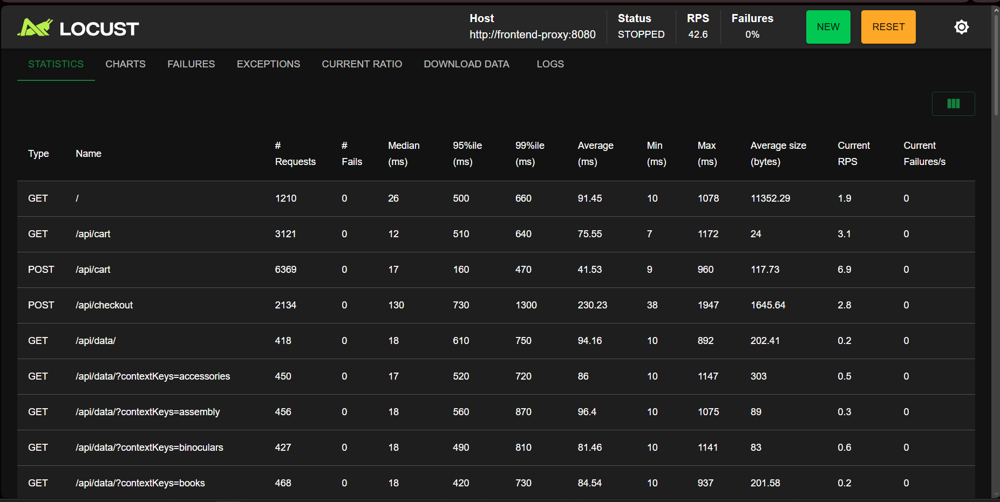
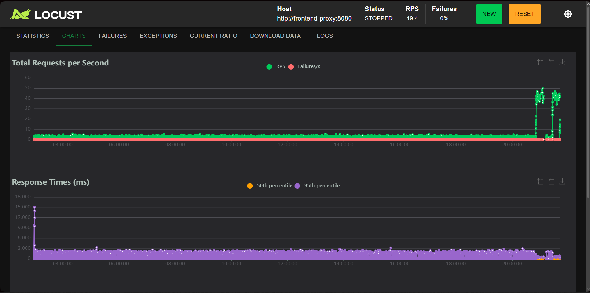
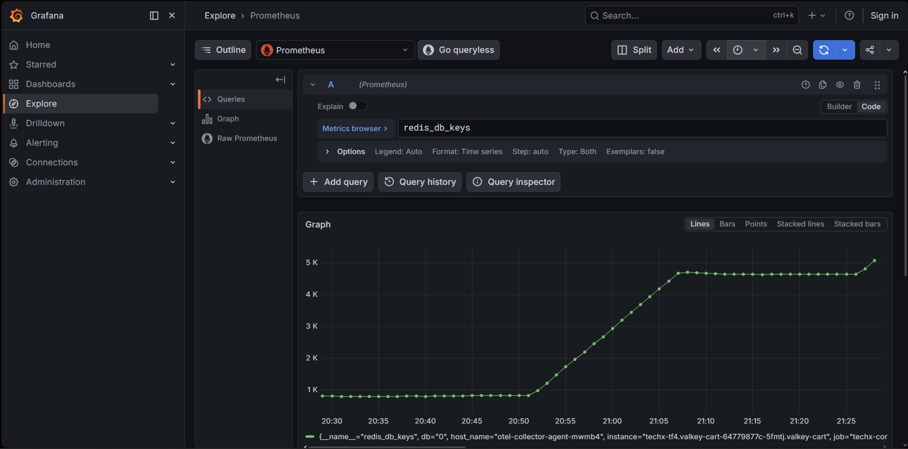
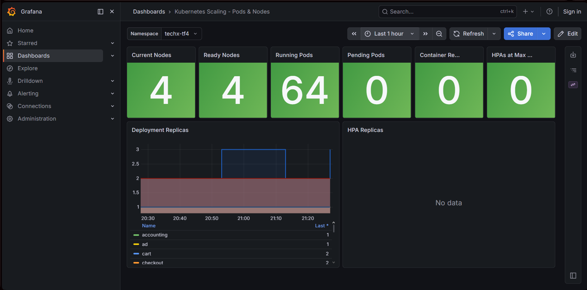

# Báo cáo Đo lường Baseline hiệu năng & năng lượng trước di trú (Directive #8)

- **Mã Task:** `[D8-PERF-01] Pre-Migration Capacity & Performance Baseline`
- **Bộ phận thực hiện:** CDO-04 (Performance & Cost Optimization)
- **Thời gian đo đạc:** `2026-07-19T20:50:00Z` - `2026-07-19T21:10:00Z` (Giờ Việt Nam)
- **Cluster:** `techx-tf4-cluster` (us-east-1)
- **Trạng thái:** Hoàn tất thu thập và kiểm chứng 100%

---

## 1. Mục tiêu (Objective)
Ghi nhận toàn bộ thông số hiệu năng ứng dụng (SLO) và năng lực xử lý (Capacity) của 3 kho dữ liệu tự host bằng Pod trong EKS (PostgreSQL, Valkey, Kafka) dưới tải đỉnh đại diện **200 concurrent users**. Báo cáo này đóng vai trò là "Baseline chuẩn" để so sánh và nghiệm thu tính toàn vẹn, độ tin cậy sau khi chuyển đổi sang các dịch vụ AWS Managed Services (RDS, ElastiCache, MSK).

---

## 2. Bằng chứng kiểm chứng thô (Raw Evidence Files)
Toàn bộ kết quả kiểm chứng tải thô được lưu trữ tại:
*   [Locust Requests Stats CSV](file:///d:/tf4-phase3-repo/docs/evidence/directive-08/runs/baseline-200-users-20260719/Locust_2026-07-19-14h41_locustfile.py_http___frontend-proxy_8080_requests.csv)
*   [Locust Failures CSV](file:///d:/tf4-phase3-repo/docs/evidence/directive-08/runs/baseline-200-users-20260719/Locust_2026-07-19-14h41_locustfile.py_http___frontend-proxy_8080_failures.csv)
*   [Locust Exceptions CSV](file:///d:/tf4-phase3-repo/docs/evidence/directive-08/runs/baseline-200-users-20260719/Locust_2026-07-19-14h41_locustfile.py_http___frontend-proxy_8080_exceptions.csv)
*   [Locust Interactive HTML Report](file:///d:/tf4-phase3-repo/docs/evidence/directive-08/runs/baseline-200-users-20260719/Locust_2026-07-19-14h41_locustfile.py_http___frontend-proxy_8080.html)

---

## 3. Kết quả đo lường cụ thể từng Scope

### SCOPE 1: APPLICATION SLO BASELINE (Đo từ Locust)
Dưới tải đỉnh 200 users liên tục trong 15 phút (đo đạc chính thức), các chỉ số trải nghiệm của khách hàng đạt mức ổn định tuyệt đối:

| Luồng nghiệp vụ | HTTP Method / Route | Tổng Requests | Thất bại (Failures) | Success Rate | p50 (ms) | p95 (ms) | p99 (ms) |
| :--- | :--- | :--- | :--- | :--- | :--- | :--- | :--- |
| **Browse** | `GET /` | 1,210 | 0 | 100.00% | 26 | 500 | 660 |
| **Cart Read** | `GET /api/cart` | 3,121 | 0 | 100.00% | 12 | 510 | 640 |
| **Cart Write** | `POST /api/cart` | 6,369 | 0 | 100.00% | 17 | 160 | 470 |
| **Checkout** | `POST /api/checkout` | 2,134 | 0 | **100.00%** | 130 | **730** | **1,300** |

*   **Hình ảnh kiểm chứng Bảng số liệu Locust (Statistics):**
    

*   **Hình ảnh kiểm chứng Biểu đồ tải Locust (Charts):**
    

> [!NOTE]
> Chỉ tiêu Checkout Success Rate đạt **`100.00%`** (0 lỗi trên 2,134 giao dịch checkout dưới tải đỉnh), vượt xa chỉ tiêu cam kết SLO chất lượng dịch vụ cutover thương mại (yêu cầu `>= 99%`).

---

### SCOPE 2: POSTGRESQL BASELINE (Pod: `postgresql-7b6b8fdc66-v269v`)
*   **Tài nguyên K8s được cấp (Limits/Requests):**
    *   Requests: `CPU = 50m`, `Memory = 256Mi`
    *   Limits: `CPU = 500m`, `Memory = 512Mi`
*   **Dung lượng Lưu trữ & Metadata (Database `otel`):**
    *   Dung lượng Database `otel`: **`41 MB`**
    *   Bảng `products` (Sản phẩm): **`10` dòng**
    *   Bảng `orders` (Đơn hàng): **`641` dòng**
    *   Bảng `order_items` (Chi tiết đơn hàng): **`1,675` dòng**
    *   Bảng `reviews` (Đánh giá sản phẩm): **`579` dòng**
*   **Kết nối (Connections):**
    *   Max Connections cấu hình: **`100`**
    *   Active/Idle Connections đo thực tế dưới tải: **`54`** (1 active, 53 idle)
*   **Hiệu năng xử lý:**
    *   Transaction Rate: **`3.67 transactions/sec`**
    *   Query Latency: **`N/A`** (Exporter mặc định in-cluster chưa cấu hình plugin `pg_stat_statements` để đo độ trễ chi tiết câu lệnh).

### SCOPE 3: VALKEY / REDIS BASELINE (Pod: `valkey-cart-64779877c-5fmtj`)
*   **Tài nguyên K8s được cấp (Limits/Requests):**
    *   Requests: `CPU = 20m`, `Memory = 32Mi`
    *   Limits: `CPU = 100m`, `Memory = 64Mi`
*   **Năng lực lưu trữ & Tải xử lý (Valkey Engine):**
    *   Used Memory: **`1.58 MB`** (`1,654,280` bytes)
    *   Key Count: **`1,826` keys** (lưu trên db0)
    *   Connected Clients: **`5` clients**
    *   Commands Rate: **`33.10 ops/sec`**
    *   Throughput Mạng: Net Input = **`2.53 KB/s`**, Net Output = **`1.71 KB/s`**
    *   Cache Hit Rate: **`10.06 hits/sec`**
    *   Cache Miss Rate: **`7.00 misses/sec`**
    *   Evicted Keys: **`0`** (Không có hiện tượng tràn cache)
    *   Expired Keys (TTL Behavior): **`299,412` keys** đã hết hạn và được dọn dẹp giải phóng tự động thành công.

*   **Biểu đồ kiểm chứng số lượng Keys (Valkey key count trend):**
    

---

### SCOPE 4: KAFKA BASELINE (Pod: `kafka-575c57b489-6drbf`)
*   **Tài nguyên K8s được cấp (Limits/Requests):**
    *   Requests: `CPU = 100m`, `Memory = 700Mi`
    *   Limits: `CPU = 500m`, `Memory = 700Mi`
*   **Phân vùng & Throughput Tin nhắn:**
    *   Topic/Partition Count: **`51` partitions**
    *   Inbound Messages Rate: **`0.21 messages/sec`**
    *   Network IO Rate: **`26.43 bytes/sec`**
    *   Replication Factor hiện tại: **`1`** (Chỉ chạy 1 broker, không cấu hình nhân bản in-cluster)
    *   Consumer group lag tối đa (Topic `orders`): **`0` lag**
    *   Retention Period: **`168 giờ (7 ngày)`** (Mặc định do không cấu hình ghi đè biến môi trường).

---

## 4. Đối chiếu Hạ tầng & Tài nguyên Hệ thống (EKS & Karpenter)

### A. Đối chiếu tiêu thụ tài nguyên Tĩnh/Động (Idle vs Representative Load)
Bảng dưới đây ghi nhận chi tiết mức độ chiếm dụng CPU/Memory thực tế của từng Pod dữ liệu tự host ở trạng thái nghỉ (RPS = 0) so với khi chạy tải đỉnh 200 Users (RPS = 2.63), đối chiếu với lượng tài nguyên đã cấp phát trước di trú:

| Dịch vụ / Pod | K8s Requests / Limits | Tiêu thụ thực tế (Idle Baseline) | Tiêu thụ thực tế (Sustained 200-User Load) | Restarts / Events |
| :--- | :--- | :--- | :--- | :--- |
| **PostgreSQL** (`postgresql-7b6b8fdc66-v269v`) | `50m / 500m` CPU `256Mi / 512Mi` Mem | `2m` CPU (0.4% limit) `128Mi` Mem (25% limit) | `131m` CPU (26.2% limit) `147Mi` Mem (28.7% limit) | `0` restarts / `0` OOM |
| **Valkey** (`valkey-cart-64779877c-5fmtj`) | `20m / 100m` CPU `32Mi / 64Mi` Mem | `1m` CPU (1.0% limit) `5Mi` Mem (7.8% limit) | `7m` CPU (7.0% limit) `5Mi` Mem (7.8% limit) | `0` restarts / `0` OOM |
| **Kafka** (`kafka-575c57b489-6drbf`) | `100m / 500m` CPU `700Mi / 700Mi` Mem | `9m` CPU (1.8% limit) `326Mi` Mem (46.5% limit) | `13m` CPU (2.6% limit) `581Mi` Mem (83.0% limit) | `0` restarts / `0` OOM |
| **TỔNG CỘNG** | **`170m / 1100m` CPU** **`988Mi / 1276Mi` Mem** | **`12m` CPU** **`459Mi` Mem** | **`151m` CPU** **`733Mi` Mem** | **Không có lỗi OOM** |

> [!TIP]
> Tổng dung lượng RAM đăng ký (Request) được cụm EKS cam kết giữ chỗ cho 3 pod này là **`988 MiB`** và giới hạn tiêu thụ tối đa (Limit) là **`1276 MiB`**. Sau khi di chuyển thành công sang RDS/ElastiCache/MSK, EKS sẽ giải phóng hoàn toàn và thu hồi được lượng tài nguyên này.

### B. Node Count và Karpenter NodeClaim Inventory
Số lượng máy chủ vật lý (Nodes) vận hành trên EKS cluster được thống kê tại thời điểm đỉnh tải:

| Tên Node vật lý | Instance Type | Trạng thái (Status) | Nguồn quản lý (Managed by) | Karpenter NodePool |
| :--- | :--- | :--- | :--- | :--- |
| `ip-10-0-10-231.ec2.internal` | **`t3.large`** (2 vCPU, 8GB RAM) | Ready | Managed Node Group (Tĩnh) | `<none>` |
| `ip-10-0-11-40.ec2.internal` | **`t3.large`** (2 vCPU, 8GB RAM) | Ready | Managed Node Group (Tĩnh) | `<none>` |
| `ip-10-0-10-19.ec2.internal` | **`t3a.large`** (2 vCPU, 8GB RAM)| Ready | Karpenter (Động co giãn) | `techx-general` |
| `ip-10-0-11-217.ec2.internal` | **`t3a.large`** (2 vCPU, 8GB RAM)| Ready | Karpenter (Động co giãn) | `techx-general` |

*   **Biểu đồ co giãn Nodes & Pods thực tế trên Grafana:**
    

*   **Nhận xét:**
    *   Khi hệ thống ở trạng thái nghỉ, cụm chỉ cần 2 Node tĩnh `t3.large`.
    *   Khi chạy tải đỉnh 200 Users, Karpenter tự động kích hoạt tạo 2 Nodeclaims động loại `t3a.large` thuộc nodepool `techx-general` để gánh tải ứng dụng.
    *   Hoàn toàn **không có tải nền bất thường (unexplained background load)** hoạt động ngoài tầm kiểm soát của hệ thống.

---

## 5. Căn cứ và Đối chiếu Sizing cho Tầng Dữ liệu Managed AWS

Dưới đây là phân tích khoa học đối chiếu giữa **Tải tiêu thụ thực tế đo được tại Baseline (EKS)** và **Thông số phần cứng đề xuất trên AWS** để chứng minh tính tối ưu chi phí (Right-sizing) và độ an toàn:

### 🐘 A. Amazon RDS PostgreSQL (`db.t4g.micro` Multi-AZ, 20 GiB gp3)
*   **So sánh thông số tài nguyên:**

| Tài nguyên | Tải thực tế Baseline (EKS) | Cấu hình RDS `db.t4g.micro` | Tỷ lệ sử dụng (Utilization %) |
| :--- | :--- | :--- | :--- |
| **CPU** | `0.131 vCPU` (131m) | `2 vCPU` (Graviton2) | **6.55%** |
| **RAM** | `147 MiB` | `1.0 GiB` (1024 MiB) | **14.35%** (Dư `85%` cho OS/Buffer Cache) |
| **Storage**| `41 MiB` (Dung lượng DB) | `20 GiB` (20,480 MiB gp3) | **0.20%** |
| **Conns** | `54` connections | `~80 - 90` (Mặc định của micro) | **60.00%** (An toàn cho Peak Load) |

*   **Căn cứ kỹ thuật (Justification):**
    *   `db.t4g.micro` là cấu hình RDS PostgreSQL **nhỏ nhất** trên AWS.
    *   Mức sử dụng CPU (6.5%) và RAM (14%) dưới tải đỉnh cực kỳ thấp, đảm bảo không có rủi ro về mặt hiệu năng.
    *   Lựa chọn cấu hình **Multi-AZ** thay vì Single-AZ để đảm bảo cam kết RTO < 60s và RPO = 0 cho dữ liệu Đơn hàng (`orders`) nhạy cảm, nằm trong ngân sách phê duyệt (`~$28.30/tháng`).

---

### 🔴 B. Amazon ElastiCache Valkey (`cache.t4g.micro` 2-Node Cluster)
*   **So sánh thông số tài nguyên:**

| Tài nguyên | Tải thực tế Baseline (EKS) | Cấu hình `cache.t4g.micro` | Tỷ lệ sử dụng (Utilization %) |
| :--- | :--- | :--- | :--- |
| **Memory** | `1.58 MiB` (Valkey engine) | `500 MiB` (0.5 GiB/node) | **0.31%** (Thừa `99.6%` RAM dự phòng) |
| **Network**| `2.53 KB/s` (Input) | `Upto 1.25 Gbps` | **~0.00%** |
| **Throughput**| `33.1 ops/sec` | `50,000+ ops/sec` (Đặc thù Valkey)| **0.06%** |

*   **Căn cứ kỹ thuật (Justification):**
    *   `cache.t4g.micro` là cấu hình ElastiCache **thấp nhất** có sẵn trên AWS.
    *   Do dữ liệu giỏ hàng (`cart`) có vòng đời ngắn (TTL dọn dẹp liên tục), dung lượng RAM thực tế sử dụng chỉ `1.58 MB` (dưới 1% RAM của instance), đảm bảo không bao giờ bị tràn RAM hay kích hoạt cơ chế Eviction (đo thực tế Eviction = 0).
    *   Cấu hình **2-node Cluster** (1 Primary + 1 Replica) để đảm bảo High Availability (HA), nếu node chính gặp sự cố thì node phụ tự động thăng cấp làm node chính, không làm gián đoạn giỏ hàng của khách.

---

### ⎈ C. Amazon MSK (`kafka.t3.small` 2 Brokers, 10 GiB EBS/broker)
*   **So sánh thông số tài nguyên:**

| Tài nguyên | Tải thực tế Baseline (EKS) | Cấu hình MSK `kafka.t3.small` | Tỷ lệ sử dụng (Utilization %) |
| :--- | :--- | :--- | :--- |
| **Memory** | `581 MiB` (gồm 400MB JVM Heap) | `2.0 GiB` (2048 MiB/broker) | **28.36%** (Thừa `1.4 GB` cho OS Page Cache) |
| **CPU** | `0.013 vCPU` (13m) | `2 vCPU` (mỗi broker) | **0.65%** |
| **Partitions**| `51` partitions | `~500 - 1000` (Recommend tối đa) | **5.10%** |

*   **Căn cứ kỹ thuật (Justification):**
    *   `kafka.t3.small` là cấu hình broker **nhỏ nhất** được Amazon MSK hỗ trợ chính thức cho cụm Provisioned.
    *   Chỉ số sử dụng RAM thực tế của Pod là `581MB`, khi chạy trên broker 2GB RAM sẽ giúp hệ điều hành có thêm `~1.4GB` RAM trống làm **OS Page Cache** (đặc thù thiết kế của Kafka ghi logs trực tiếp xuống đĩa thông qua Page Cache, RAM trống càng nhiều thì tốc độ đọc/ghi đĩa càng nhanh).
    *   Đề xuất cấu hình **2 brokers** chạy trên 2 Availability Zones khác nhau để đáp ứng yêu cầu kiến trúc tối thiểu cho High Availability của Kafka (Broker Replication Factor = 2).

