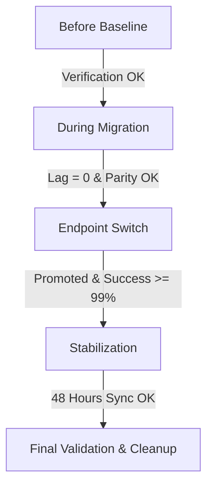

# D8-PERF-03 — Zero-Downtime Managed Data Cutover Contract

**Chỉ thị (Directive):** #8 — Zero-Downtime Managed Services Migration  
**Trạng thái (Status):** Draft — Awaiting Approval  
**Tài liệu tham chiếu liên quan (Implementation & Playbooks):**
- [Kế hoạch di trú PostgreSQL](file:///d:/XBRAIN/tf4-phase3-repo/docs/cdo08/week2/mandate8/implementation/drafts/POSTGRESQL-MIGRATION-PLAN.md)
- [Kế hoạch di trú Valkey/Redis](file:///d:/XBRAIN/tf4-phase3-repo/docs/cdo08/week2/mandate8/implementation/drafts/VALKEY-MIGRATION-PLAN.md)
- [Kế hoạch di trú Kafka/MSK](file:///d:/XBRAIN/tf4-phase3-repo/docs/cdo08/week2/mandate8/implementation/drafts/KAFKA-MIGRATION-PLAN.md)

---

## 1. Mục tiêu (Objectives)

Hợp đồng này thiết lập các tiêu chuẩn kỹ thuật nghiêm ngặt về hiệu năng (Performance), độ tin cậy (Reliability), và các điều kiện kiểm soát dừng/tiếp tục (Stop/Go Gates) áp dụng cho quá trình cắt chuyển dữ liệu (production cutover) từ các kho lưu trữ tự vận hành (self-hosted) trên cụm EKS sang các dịch vụ quản lý (Managed Services) trên AWS bao gồm:
1. **PostgreSQL** sang **Amazon RDS PostgreSQL** (Multi-AZ)
2. **Valkey (Redis)** sang **Amazon ElastiCache for Valkey** (2-node Multi-AZ)
3. **Apache Kafka** sang **Amazon MSK Provisioned** (Multi-AZ)

Hợp đồng này tập trung vào việc định nghĩa các **điều kiện biên chất lượng, ngưỡng lỗi, quyền sở hữu (ownership), nguồn dữ liệu (metric source), và cách thức xác minh bằng chứng (evidence)**. Chi tiết cách thức thực hiện (implementation) và câu lệnh cụ thể sẽ được tham chiếu trực tiếp tới các tài liệu di trú thành phần.

---

## 2. Thông tin Yêu cầu về Change Ticket & Phân quyền (Required Change Fields)

Trước khi thực hiện bất kỳ hoạt động cắt chuyển nào, Operator phải điền đầy đủ và chính xác các thông tin dưới đây vào Change Ticket của hệ thống và bảng cấu hình này. Mọi trường thông tin trống hoặc không hợp lệ sẽ dẫn đến việc từ chối kích hoạt cutover window.

| Tham số cấu hình | Giá trị cấu hình | Mô tả |
| :--- | :--- | :--- |
| **CHANGE_TICKET** | `CHG-REPLACE-ME` | Mã ticket thay đổi trên hệ thống ITSM/Jira (Ví dụ: `CHG-008234`) |
| **WINDOW_START_UTC** | `YYYY-MM-DDTHH:MM:SSZ` | Thời điểm bắt đầu chính thức của Cutover Window (UTC) |
| **WINDOW_END_UTC** | `YYYY-MM-DDTHH:MM:SSZ` | Thời điểm kết thúc chính thức của Cutover Window (UTC) |
| **REVIEWED_GIT_SHA** | `GIT_SHA_REPLACE_ME` | Git Commit SHA của mã nguồn/manifests đã được phê duyệt cho đợt triển khai này |
| **MIGRATION_OPERATOR** | `OPERATOR_NAME_REPLACE_ME` | Kỹ sư chính chịu trách nhiệm thực thi các bước di trú dữ liệu |
| **PLATFORM_SYNC_OWNER** | `SYNC_OWNER_NAME_REPLACE_ME` | Kỹ sư chịu trách nhiệm giám sát đồng bộ dữ liệu và đối soát |
| **ROLLBACK_OWNER** | `ROLLBACK_OWNER_NAME_REPLACE_ME` | Kỹ sư chịu trách nhiệm thực thi rollback và undo rollout khi có sự cố |
| **INCIDENT_CHANNEL** | `#incident-cdo08-migration` | Kênh Slack/Teams chính thức để trao đổi và xử lý sự cố trong quá trình cutover |
| **OBSERVATION_PERIOD** | `48 Hours` | Khoảng thời gian theo dõi bắt buộc sau cutover trước khi dọn dẹp hạ tầng cũ |

---

## 3. Khung thời gian Cắt chuyển & Các giai đoạn (Required Windows & Phases)

Quá trình cutover được phân chia rõ rệt thành 5 giai đoạn liên tục nhằm kiểm soát rủi ro ở từng mốc.



* **Phase 1 — Before Baseline (Trước Cắt chuyển - Thiết lập Baseline):** Xác minh toàn bộ cụm Kubernetes, pods, HPA, nodes ở trạng thái khỏe mạnh. Thu thập metrics hiệu năng storefront (p95/p99 latency và success rate) trên self-hosted làm baseline đối chiếu.
* **Phase 2 — During Migration (Trong khi Đồng bộ Dữ liệu):** Khởi chạy các kênh đồng bộ dữ liệu (Replication Links / CDC / MirrorMaker). Giám sát lag đồng bộ và ảnh hưởng tài nguyên hạ tầng, đảm bảo không ảnh hưởng đến luồng checkout hiện tại.
* **Phase 3 — Endpoint Switch (Cắt chuyển Endpoint - Cutover Phase):** Khóa ghi source, thực hiện đối soát dữ liệu (Pre-Cutover Parity Check), thăng cấp (promote) managed services, và cập nhật Argo Rollouts chuyển traffic ứng dụng sang cụm mới (Green ReplicaSet). Bật reverse synchronization để dự phòng rollback.
* **Phase 4 — Stabilization (Ổn định hóa - Sau Cắt chuyển):** Giám sát liên tục các chỉ số của Primary Gate và Additional Gates trên hệ thống mới trong vòng 24 - 48 giờ. Verify dữ liệu ghi mới được đồng bộ ngược về EKS an toàn.
* **Phase 5 — Final Validation (Nghiệm thu Cuối cùng & Dọn dẹp):** Thực hiện đối soát dữ liệu sau cùng (Post-Cutover Parity Check), sao lưu dữ liệu cũ lên AWS S3 (theo chính sách PG-04), tắt các reverse replication tasks, và giải phóng hạ tầng self-hosted cũ.

---

## 4. Các Cổng Chất lượng Hiệu năng & Độ Tin cậy (Performance & Reliability Gates)

Hệ thống chỉ được phép chuyển sang trạng thái nghiệm thu thành công hoặc duy trì trạng thái cutover nếu tất cả các cổng chất lượng sau được thỏa mãn.

### 4.1. Primary Gate (Cổng Chất lượng Cốt lõi)
* **Checkout Success Rate:** Phải duy trì **$\ge 99\%$** trong toàn bộ khung thời gian cutover window đã phê duyệt (bao gồm cả pha chuyển đổi endpoint).
* **Công thức tính:** 
  $$\text{Checkout Success Rate} = \frac{\text{Tổng số giao dịch Checkout thành công (HTTP 200/201)}}{\text{Tổng số yêu cầu Checkout nhận được}} \times 100$$
* **Khoảng thời gian đo lường:** Cửa sổ trượt 1 phút (1-minute sliding window).

### 4.2. Bảng Tổng hợp Gates, Nguồn dữ liệu, Bằng chứng & Trách nhiệm (Gates Reference Matrix)

| Thành phần / Gate | Chỉ số chất lượng (Success Criteria) | Nguồn Metric (Metric Source) | Bằng chứng xác minh (Evidence) | Đội ngũ phụ trách (Gate Owner) |
| :--- | :--- | :--- | :--- | :--- |
| **Checkout Success (Primary)** | $\ge 99\%$ trong window | Prometheus (ServiceMonitor: `techx-tf4/storefront`) | Grafana Storefront Dashboard (Checkout Panel) | SRE Team / Release Owner |
| **Browse / Cart Success** | $\ge 99.5\%$ (Không suy giảm so với baseline) | Prometheus (ServiceMonitor: `techx-tf4/storefront`) | Grafana Storefront Dashboard (Browse/Cart Panel) | SRE Team |
| **Checkout Latency** | p95 Latency không vượt baseline quá 15% hoặc 150ms | Prometheus (`checkout_latency_seconds_bucket`) | Grafana Storefront Dashboard (Latency Panel) | SRE Team |
| **Database Connections** | Lỗi kết nối = 0; Connection Pool Usage $< 85\%$ | Prometheus (OTel metrics) & AWS CloudWatch | AWS RDS CloudWatch Dashboard, Grafana DB Pool Panel | Database Team (DBA) |
| **Valkey/Redis Cache** | Timeout/Error = 0; Eviction rate = 0 | CloudWatch (ElastiCache) & App client metrics | CloudWatch ElastiCache Console, Cache Dashboard | Platform Cache Team |
| **Kafka Message Queue** | MM2 & Consumer lag $< 1,000$ tin nhắn | CloudWatch MSK & Prometheus Kafka Exporter | Grafana Kafka Dashboard, Kafka Consumer Group CLI | Messaging/Platform Team |
| **Event Reliability** | Duplicate/Missing events = 0 (trên orders/payments) | Application logs & Kafka Offset audits | Grafana LogQL (Loki) / Elasticsearch event logs | Platform Sync Team |
| **Pod Resource** | Pod OOMKilled delta = 0 | Kubernetes Events API | `kubectl get events -n techx-tf4`, Grafana Node Exporter | Platform Infra Team |
| **Cluster Scheduling** | Pending/FailedScheduling delta = 0 | Kubernetes API | `kubectl get pods -n techx-tf4`, K8s Event Log | Platform Infra Team |
| **Observability Service** | Trạng thái Ready (Prometheus/Grafana/Jaeger) | Kubernetes Endpoint & Liveness probes | `kubectl get endpoints -n monitoring`, Grafana self-health | Monitoring & SRE Team |
| **Data Parity** | PASS tuyệt đối (Pre & Post-cutover mismatch = 0) | Data Parity jobs output | Logs của Pre/Post-Cutover Parity check jobs | Platform Sync Owner & DBA |

---

## 5. Cổng Sức khỏe Hạ tầng & Cơ sở Thiết lập Ngưỡng (Database Health Gates & Threshold Rationale)

Để đảm bảo các ngưỡng (thresholds) thiết lập không mang tính cảm tính, dưới đây là bảng cơ sở lý luận (rationale) đằng sau mỗi chỉ số sức khỏe hạ tầng được áp dụng.

### 5.1. Bảng Cơ sở Thiết lập Ngưỡng (Threshold Rationale Matrix)

| Chỉ số sức khỏe (Metric) | Ngưỡng (Threshold) | Cơ sở thực tế / Lý do thiết lập (Rationale) |
| :--- | :--- | :--- |
| **RDS CPU Utilization** | $< 70\%$ | Duy trì CPU headroom dự phòng tối thiểu 30% để hấp thụ các tải tăng đột biến (traffic spikes) hoặc khi xảy ra failover giữa các AZ trong cụm RDS Multi-AZ. |
| **RDS Freeable Memory** | $\ge 15\%$ | Đảm bảo hệ điều hành của RDS có đủ RAM dự phòng cho buffer cache, tối ưu hóa tốc độ I/O đĩa và giảm thiểu rủi ro swap memory gây suy sụt hiệu năng. |
| **RDS Connection Count** | $< 80\%$ | Dành 20% dung lượng kết nối của DB instance cho các phiên kết nối nội bộ, bảo trì và tránh hiện tượng bão hòa kết nối (connection starvation). |
| **DMS / MM2 Sync Lag** | $< 1$s hoặc $\approx 0$ | Đảm bảo dữ liệu ghi mới từ EKS source đã đồng bộ hoàn toàn sang managed services trước khi chuyển kết nối, đảm bảo RPO = 0. |
| **Valkey Memory Usage** | $< 80\%$ | Ngăn ngừa rủi ro OOM của Valkey/Redis instance khi có spike dữ liệu giỏ hàng hoặc trong lúc fork tiến trình ghi file snapshot (RDB/AOF background save). |
| **Valkey Cache Evictions** | $= 0$ | Tránh việc Valkey tự động giải phóng (evict) các key giỏ hàng chưa hết hạn TTL do thiếu RAM, đảm bảo tính toàn vẹn phiên mua sắm của khách hàng. |
| **Kafka Broker CPU** | $< 60\%$ | Giữ mức an toàn tối đa cho Kafka cluster khi có sự cố Broker chết và Broker còn lại phải gánh tải gấp đôi trong cụm 2 Brokers. |
| **Under Replicated Partitions** | $= 0$ | Đảm bảo mọi topic partition đều được replicate đầy đủ qua các Broker, tránh nguy cơ mất mát tin nhắn khi Broker xảy ra sự cố phần cứng. |

### 5.2. Tóm tắt Cổng Sức khỏe Hạ tầng (Health Gates Summary)
* **PostgreSQL Health Gate:** CPU Utilization $< 70\%$ (during sync) / $< 50\%$ (post-cutover); Freeable Memory $\ge 15\%$; Connection Count $< 80\%$ của `max_connections`; DMS CDC Lag $< 1$s.
* **Valkey Health Gate:** Engine CPU Utilization $< 60\%$; Database Memory Usage $< 80\%$ (0.5 GiB limit); Cache Evictions $= 0$; Replication Lag $< 1$s.
* **Kafka Health Gate:** Broker CPU $< 60\%$; Active Controller Count $= 1$; Under Replicated Partitions $= 0$; MirrorMaker 2 Task status = `RUNNING` với lag $\approx 0$.

---

## 6. Điều kiện Dừng Khẩn cấp & Kịch bản Rollback (Stop Conditions & Rollback Triggers)

### 6.1. Danh sách Điều kiện Dừng (Stop Conditions)
Operator và Rollback Owner phải ngay lập tức **Dừng hoạt động di trú, abort Argo Rollouts, và kích hoạt kịch bản rollback** nếu bất kỳ điều kiện nào sau đây xảy ra:
1. **Checkout Success Rate Breach:** Checkout success rate $< 99\%$ trong 2 cửa sổ trượt 1 phút liên tiếp, hoặc $< 95\%$ trong bất kỳ cửa sổ 1 phút nào.
2. **Sustained Latency Breach:** p95 latency của luồng Checkout vượt quá **1,000ms** kéo dài quá 2 phút, hoặc vượt quá **2,000ms** trong bất kỳ phút nào.
3. **RDS Connection Exhaustion:** RDS trả về lỗi `Too many connections` hoặc CPU RDS chạm ngưỡng $90\%$ kéo dài quá 1 phút.
4. **Valkey Timeout / Eviction:** Lỗi kết nối/timeout đến ElastiCache Valkey liên tục quá 30 giây, hoặc phát sinh eviction đối với key giỏ hàng còn hạn.
5. **Kafka Sync Lag Alert:** MirrorMaker 2 lag vượt ngưỡng **5,000** tin nhắn liên tục trong 3 phút, hoặc consumer lag của các service backend vượt **10,000** tin nhắn.
6. **Data Parity Mismatch:** Bất kỳ sai lệch dữ liệu nào phát hiện trong quá trình đối soát trước cutover.
7. **Secret/TLS/Client Connection Failure:** Lỗi xác thực SASL/SCRAM, bắt tay TLS (verify-full) thất bại, hoặc client bị từ chối kết nối do cấu hình client/secret sai lệch.
8. **Observability Down:** Mất kết nối tới Prometheus/Grafana hoặc Jaeger khiến Operator không thể giám sát sức khỏe hệ thống quá 60 giây.
9. **GitOps Desired State Drift:** ArgoCD tự động rollback hoặc GitOps desired state bị revert ngoài dự kiến của Operator.

### 6.2. Kịch bản Rollback tham chiếu (Rollback Playbook Pointers)

Khi kích hoạt dừng khẩn cấp, mục tiêu cốt lõi là trả toàn bộ traffic của người dùng về EKS self-hosted stores cũ mà không làm mất mát dữ liệu giao dịch phát sinh sau thời điểm cutover (RPO = 0).

* **Phục hồi PostgreSQL (EKS Postgres):** 
  - Khóa ghi RDS (chuyển sang read-only), chờ DMS reverse sync hoàn tất dữ liệu ghi mới về EKS, reset sequences và abort Argo Rollout của các service liên quan (`product-catalog`, `product-reviews`, `accounting`) để đưa traffic về EKS Postgres.
  - *Chi tiết mã lệnh và quy trình chạy:* Xem tại [POSTGRESQL-MIGRATION-PLAN — Section 4 (Rollback Playbook)](file:///d:/XBRAIN/tf4-phase3-repo/docs/cdo08/week2/mandate8/implementation/drafts/POSTGRESQL-MIGRATION-PLAN.md#4-kịch-bản-ứng-phó-sự-cố--rollback-rollback-playbook).
* **Phục hồi Valkey (EKS Valkey):**
  - Thực hiện abort rollout của component `cart`. Trong trường hợp đã phát sinh dữ liệu giỏ hàng mới trên ElastiCache, thực hiện chạy job backfill dữ liệu ngược về EKS Valkey trước khi mở khóa ghi trên EKS.
  - *Chi tiết mã lệnh và quy trình chạy:* Xem tại [VALKEY-MIGRATION-PLAN — Section 4 (Rollback Playbook)](file:///d:/XBRAIN/tf4-phase3-repo/docs/cdo08/week2/mandate8/implementation/drafts/VALKEY-MIGRATION-PLAN.md#4-kịch-bản-ứng-phó-sự-cố--rollback-rollback-playbook).
* **Phục hồi Kafka (EKS Kafka):**
  - Khóa ghi MSK, kích hoạt Reverse MirrorMaker 2 để đồng bộ ngược tin nhắn từ MSK về EKS Kafka, abort rollout của `checkout` và các consumers (`accounting`, `fraud-detection`), sau đó thực hiện offset reset trên EKS Kafka.
  - *Chi tiết mã lệnh và quy trình chạy:* Xem tại [KAFKA-MIGRATION-PLAN — Section 4 (Rollback Playbook)](file:///d:/XBRAIN/tf4-phase3-repo/docs/cdo08/week2/mandate8/implementation/drafts/KAFKA-MIGRATION-PLAN.md#4-kịch-bản-ứng-phó-sự-cố--rollback-rollback-playbook).

---

## 7. Quy trình Đối soát Dữ liệu (Data Parity Gates)

Data Parity Gate bắt buộc phải trả về kết quả **PASS** ở cả 2 mốc đối soát để đảm bảo tính toàn vẹn dữ liệu.

### 7.1. Đối soát Trước Cắt chuyển (Pre-Cutover Parity Check)
Thực hiện ngay sau khi EKS source đã khóa ghi và replication lag về 0.
- **PostgreSQL:** Đối chiếu số lượng bảng, số lượng index, số dòng (Row Count) và giá trị `MAX(id)` giữa EKS và RDS. Sai lệch cho phép = `0`.
- **Valkey:** Kiểm tra tổng số keys qua lệnh `DBSIZE` trên cả 2 bên. Sai lệch cho phép $\le 0.1\%$ (do TTL keys tự động xóa).
- **Kafka:** So sánh offset tin nhắn (`LogEndOffset`) của từng partition trên các topic giao dịch và verify lag của MirrorMaker 2 group = `0`.

### 7.2. Đối soát Sau Cắt chuyển (Post-Cutover Parity Check)
Thực hiện sau khi đã chuyển traffic ứng dụng thành công sang managed services.
- **PostgreSQL:** Xác nhận ghi mới thành công trên RDS; verify dữ liệu ghi mới được sync ngược về EKS Postgres cũ qua `reverse_task` dưới 5 giây.
- **Valkey:** Verify tính năng ghi giỏ hàng mới trên ElastiCache và kiểm tra TTL (60 phút).
- **Kafka:** Xác nhận dòng chảy tin nhắn đơn hàng hoạt động tốt từ checkout sang MSK và các consumers tiêu thụ bình thường; verify reverse sync về lại EKS.

---

## 8. Hướng dẫn Giám sát & Chạy lại cho Mentor (Mentor Witness & Verification Runbook)

### 8.1. Bảng Bản đồ Xác minh cho Mentor (Verification Mapping Matrix)

| Cổng chất lượng / Gate | Cách thức xác minh (Method) | Lệnh CLI / Nguồn dữ liệu (Commands & Sources) |
| :--- | :--- | :--- |
| **Checkout Success Rate & Latency** | Query API của Prometheus | Sử dụng PromQL để tính toán tỉ lệ thành công và latency. |
| **PostgreSQL Migration Health** | DMS Task & RDS CLI | `aws dms describe-replication-tasks` & check status. |
| **Valkey Cache Health & Keys** | ElastiCache CLI & DBSIZE | `aws elasticache describe-replication-groups` & `DBSIZE`. |
| **Kafka Lag & MirrorMaker** | MirrorMaker Resource & Kafka CLI | `kubectl get KafkaMirrorMaker2` & describe consumer groups. |
| **OOMKilled Check** | Kubernetes Events API | `kubectl get events -n techx-tf4 --field-selector reason=OOMKilled` |
| **Pending Pods Check** | Kubernetes Pod Status | `kubectl get pods -n techx-tf4 --field-selector status.phase=Pending` |
| **Observability Status** | Kubernetes Endpoint Check | `kubectl get endpoints -n monitoring` & service statuses. |

### 8.2. Các câu lệnh CLI thực tế phục vụ Rerun Verification

Mentor chạy các lệnh sau từ repository root sau khi xác thực profile AWS để audit trực tiếp:

```powershell
# 1. Audit thông tin Revision và Contract
Get-Date -AsUTC -Format 'yyyy-MM-ddTHH:mm:ssZ'
git rev-parse --short HEAD
git branch --show-current
Get-Content docs/evidence/directive-08/performance/D8-PERF-03-cutover-contract.md -TotalCount 25

# 2. Kiểm tra tài nguyên EKS Pods & HPA
kubectl get pods -n techx-tf4 -o wide
kubectl get hpa -n techx-tf4 -o wide

# 3. Kiểm tra trạng thái Argo Rollouts di trú
kubectl get rollouts -n techx-tf4

# 4. Kiểm tra trạng thái đồng bộ DMS cho Database
aws dms describe-replication-tasks --profile 511825856493_TF4-CostPerfReadOnlyAlerting --region us-east-1 --query "ReplicationTasks[*].[ReplicationTaskIdentifier,Status,ReplicationTaskStats.PercentComplete]"

# 5. Kiểm tra trạng thái Valkey Online Migration
aws elasticache describe-replication-groups --profile 511825856493_TF4-CostPerfReadOnlyAlerting --region us-east-1 --query "ReplicationGroups[*].[ReplicationGroupId,Status]"

# 6. Kiểm tra MirrorMaker 2 trên Kubernetes
kubectl get KafkaMirrorMaker2 -n techx-tf4 -o wide

# 7. Kiểm tra OOMKilled và các lỗi Scheduling mới phát sinh
kubectl get events -n techx-tf4 --field-selector reason=OOMKilled --sort-by=.metadata.creationTimestamp
kubectl get pods -n techx-tf4 | Select-String -Pattern 'Pending|Failed'
```

---

## 9. Mẫu Biên bản Đánh giá Kết quả Cutover (Final Cutover Verdict Template)

Sau khi hoàn thành cutover, Operator phải điền biên bản đánh giá này và lưu tại thư mục chạy tương ứng: `docs/evidence/directive-08/performance/runs/<RUN_ID>/verdict.md`.

```text
RUN_ID:
CHANGE_TICKET:
APPROVED_UTC_WINDOW:
ACTUAL_TEST_T0:
ACTUAL_SWITCH_TS:
SWITCH_COMPLETED_TS:
ACTUAL_TEST_END:

CHECKOUT_SUCCESS_RATE (PRIMARY): [PASS/FAIL] (Giá trị thực tế: ___%)
BROWSE_SUCCESS_RATE / P95:
CART_SUCCESS_RATE / P95:
CHECKOUT_LATENCY_P95: (Baseline: ___ms, Actual: ___ms)

POSTGRESQL_MIGRATION_STATUS: [PASS/FAIL] (DMS Lag: ___s)
VALKEY_MIGRATION_STATUS: [PASS/FAIL] (Keyspace Diff: ___%)
KAFKA_MIGRATION_STATUS: [PASS/FAIL] (MM2 Lag: ___)

OOM_KILLED_COUNT: (Trước: ___, Sau: ___, Delta: ___)
PENDING_PODS_COUNT: (Trước: ___, Sau: ___, Delta: ___)
ROLLBACK_TRIGGERED: [YES/NO] (Nếu có, lý do: _______________________)

VERDICT: PASS | FAIL | STOPPED | INVALID | NOT RUN
MIGRATION_OPERATOR SIGN-OFF:
PLATFORM_SYNC_OWNER SIGN-OFF:
ROLLBACK_OWNER SIGN-OFF:
```
