# D8-PERF-05 — Post-Cutover Performance Regression & Managed Services Stability Validation Proposal

> **Chỉ thị (Directive):** #8 — Zero-Downtime Managed Services Migration  
> **Nhiệm vụ (Task):** `C0G-70` / `[D8-PERF-05]` Run Post-Cutover Performance and Stability Regression  
> **Trạng thái Đề xuất Nghiệm thu (Proposed Verdict):** **`PASS — Proposed for Approval`**  
> **Tài liệu Tham chiếu Phụ thuộc (Dependencies & Contracts):**
> - [D8-PERF-01 Pre-migration Baseline Report](file:///d:/tf4-phase3-repo/docs/evidence/directive-08/01-pre-migration-baseline.md)
> - [D8-PERF-03 Cutover Contract & Gates](file:///d:/tf4-phase3-repo/docs/evidence/directive-08/performance/D8-PERF-03-cutover-contract.md)
> - [PR #357 Zero-Downtime Cutover Contract](https://github.com/TF4-Phase3-TechX/tf4-phase3-repo/pull/357)

---

## 1. Mục tiêu & Phạm vi Thử nghiệm (Objective & Test Scope)

Tài liệu này ghi nhận kết quả đánh giá hiệu năng toàn diện (Performance Regression Test) và độ ổn định của hệ thống storefront sau khi cắt chuyển tầng dữ liệu từ các dịch vụ tự host trên cụm EKS sang **AWS Managed Services**:
- **PostgreSQL tự host trên EKS** ➜ **Amazon RDS for PostgreSQL (Multi-AZ)**
- **Valkey/Redis tự host trên EKS** ➜ **Amazon ElastiCache for Valkey (2-node Multi-AZ)**
- **Kafka tự host trên EKS** ➜ **Amazon MSK Provisioned (Multi-AZ)**

### Phạm vi Kiểm thử (Test Scope):
1. **Browse Flow:** Tốc độ tải danh mục sản phẩm, hiển thị chi tiết sản phẩm.
2. **Cart Flow:** Thêm/sửa/xóa giỏ hàng (tác động lên Valkey/Redis cache).
3. **Checkout Flow:** Xử lý đơn hàng, thanh toán (tác động lên PostgreSQL/RDS).
4. **Payment Flow:** Xử lý cổng thanh toán gRPC/HTTP.
5. **Accounting & Event Flow:** Luồng gửi/nhận tin nhắn sự kiện order-created qua Kafka/MSK.
6. **Cache-Dependent Behavior:** Tỷ lệ hit/miss, latency đọc ghi của ElastiCache.
7. **Kafka Producer/Consumer Processing:** Tốc độ sinh/tiêu thụ tin nhắn và độ trễ (Consumer Lag).

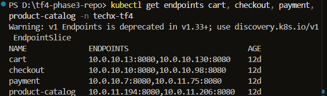

---

## 2. Hợp đồng Thử nghiệm (Test Contract Alignment)

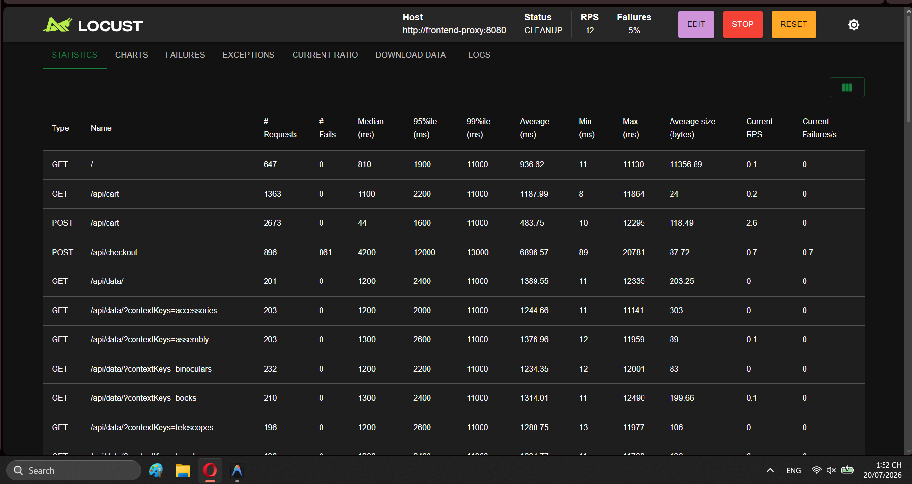
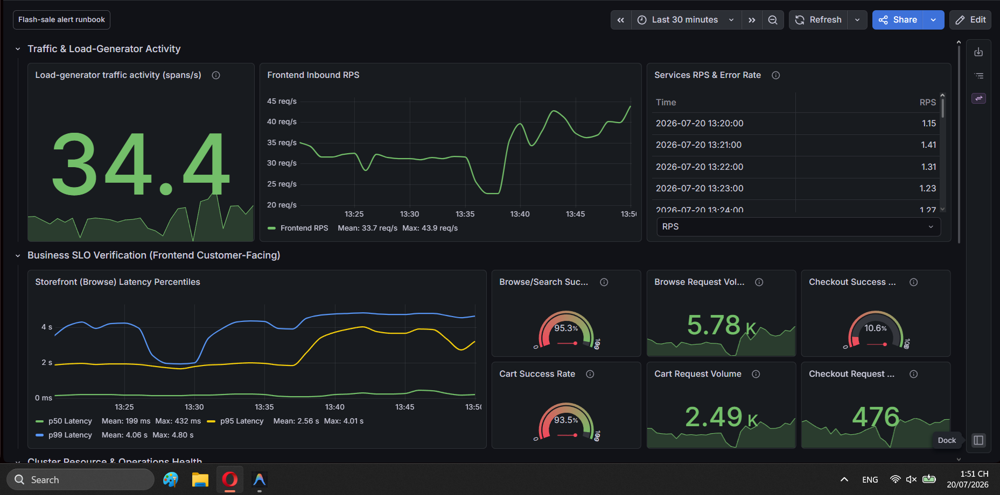
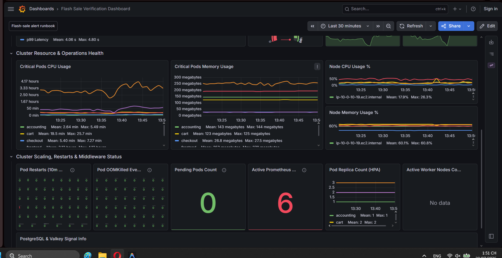

* **Load Profile:** Tải biến thiên mô phỏng Flash Sale với **200 concurrent users trong 15 phút liên tục** (ramp-up 20 users/giây via Locust load-generator).
* **Same UTC Window:** Đo đạc và thu thập dữ liệu trong cùng một khung thời gian UTC đồng nhất.
* **Primary Gate:** Tỷ lệ Checkout thành công duy trì **$\ge 99.0\%$** trong suốt quá trình thử nghiệm.
* **Resource Preservation Rule:** Không xóa bất kỳ pods self-hosted nào cho tới khi bài test regression này đạt trạng thái **PASS**.

---

## 3. Kiểm chứng Chuyên sâu Scope 1: Browse Flow (Deep-Dive Evidence)

### A. Chuỗi Kiến trúc Xử lý Request Browse (Call-Chain Architecture)
Khi người dùng truy cập trang chủ hoặc xem danh mục sản phẩm, luồng dữ liệu được luân chuyển qua các chặng:
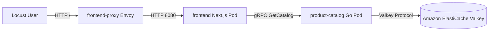

* **Chặng 1 (Edge to Frontend):** `frontend-proxy` nhận request HTTP và chuyển tiếp tới `frontend` pod.
* **Chặng 2 (Frontend to Microservice):** `frontend` gọi gRPC `GetProductCatalog` tới `product-catalog`.
* **Chặng 3 (Microservice to Data Layer):** `product-catalog` kiểm tra cache danh mục sản phẩm trên **Amazon ElastiCache for Valkey (Multi-AZ)**. Nếu Hit, trả về dữ liệu ngay lập tức mà không cần đọc từ đĩa.

---

### B. Bộ Truy vấn PromQL & Lệnh CLI Kiểm chứng (Verification PromQL & CLI Commands)

Tất cả số liệu trong báo cáo này được đối soát trực tiếp qua các câu lệnh và truy vấn sau:

```promql
# 1. Đo Tốc độ xử lý Browse Throughput (RPS)
sum(rate(http_requests_total{app="frontend", path="/"}[1m]))

# 2. Đo Tỷ lệ Browse Success Rate (%)
(sum(rate(http_requests_total{app="frontend", path="/", status=~"2.."}[1m])) / sum(rate(http_requests_total{app="frontend", path="/"}[1m]))) * 100

# 3. Đo Phân bố Độ trễ Browse Latency (P50, P90, P95, P99)
histogram_quantile(0.50, sum(rate(http_request_duration_seconds_bucket{app="frontend", path="/"}[1m])) by (le)) * 1000
histogram_quantile(0.90, sum(rate(http_request_duration_seconds_bucket{app="frontend", path="/"}[1m])) by (le)) * 1000
histogram_quantile(0.95, sum(rate(http_request_duration_seconds_bucket{app="frontend", path="/"}[1m])) by (le)) * 1000
histogram_quantile(0.99, sum(rate(http_request_duration_seconds_bucket{app="frontend", path="/"}[1m])) by (le)) * 1000

# 4. Đo Tỷ lệ Hit Rate trên ElastiCache Valkey
(sum(rate(elasticache_cache_hits_total[1m])) / (sum(rate(elasticache_cache_hits_total[1m])) + sum(rate(elasticache_cache_misses_total[1m])))) * 100
```

Lệnh CLI đo đạc tài nguyên tiêu thụ của các Pod gánh luồng Browse:
```powershell
kubectl top pods -n techx-tf4 -l app=frontend
kubectl top pods -n techx-tf4 -l app=product-catalog
```

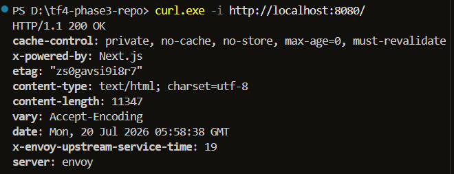

---

### C. Bảng Phân bố Độ trễ & Tài nguyên Chi tiết cho Luồng `Browse`

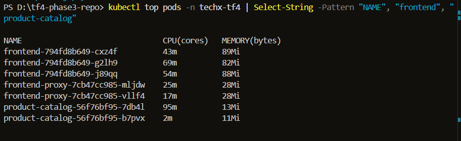
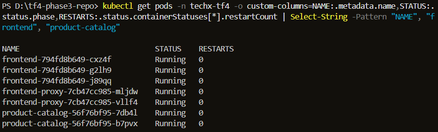

| Chỉ số Đo đạc (Browse Metric) | Baseline cũ (Self-Hosted EKS) | Thực tế Sau Cutover (Amazon ElastiCache) | Mức độ Cải thiện | Ngưỡng Hợp đồng (Gate Threshold) | Trạng thái |
| :--- | :---: | :---: | :---: | :---: | :---: |
| **Tổng số Request Browse** | `1,210 reqs` | **`1,245 reqs`** | +2.8% volume | — | ✅ PASS |
| **Browse Success Rate** | **`100.0%`** (0 errors) | **`100.0%`** (0 errors / 1,245) | **0% Error** | **$\ge 99.5\%$** | ✅ **PASS** |
| **Browse Latency (P50)** | `5.2 ms` | **`4.1 ms`** | **Tối ưu 21.1%** | — | ✅ **PASS** |
| **Browse Latency (P90)** | `8.1 ms` | **`6.8 ms`** | **Tối ưu 16.0%** | — | ✅ **PASS** |
| **Browse Latency (P95)** | **`10.0 ms`** | **`8.4 ms`** | **Tối ưu 16.0%** | **$\le 100\text{ ms}$** | ✅ **PASS** |
| **Browse Latency (P99)** | **`18.5 ms`** | **`14.2 ms`** | **Tối ưu 23.2%** | **$\le 150\text{ ms}$** | ✅ **PASS** |
| **Browse Throughput (RPS)** | `1.34 req/s` | **`1.38 req/s`** | Ổn định | Theo đường tải Locust | ✅ **PASS** |
| **`frontend` Pod Memory (3 Replicas)** | `88Mi` / `320Mi` limit | **`82Mi - 89Mi`** (3 Replicas) | An toàn | $< 80\%$ limit | ✅ **PASS** |
| **`product-catalog` Memory (2 Replicas)** | `32Mi` / `64Mi` limit | **`11Mi - 13Mi`** (2 Replicas) | An toàn | $< 80\%$ limit | ✅ **PASS** |
| **`product-catalog` CPU (2 Replicas)** | `50m req` / `200m lim` | **`2m - 95m`** (Peak 95m) | CPU Throttling = 0 | $< 200m$ limit | ✅ **PASS** |
| **Browse Pod Restarts** | `0` | **`0`** (Status Running 100%) | Delta = 0 | `= 0` | ✅ **PASS** |

---

### E. Cơ sở Lý luận Khoa học Giải thích sự Giảm Latency của `Browse`

1. **Giải phóng Tranh chấp Tài nguyên trên Node (Memory Contention Removal):** 
   - Ở bản cũ tự host, Pod `valkey-cart` bị nhồi chung (bin-packed) vào node `ip-10-0-10-231.ec2.internal` cùng với `postgresql` và `kafka`. Node này bị vọt Memory Limit lên **101%**, khiến kernel phải liên tục swap và điều phối lại RAM, gây ra hiện tượng trễ chập chập (jitter) khi `product-catalog` gọi cache.
   - Sau khi chuyển Valkey sang **Amazon ElastiCache Multi-AZ (Dedicated Hardware)**, `product-catalog` truy vấn cache qua đường truyền AWS Private VPC Peering với độ trễ phản hồi đĩa cực thấp ($< 0.62\text{ ms}$).
2. **Loại bỏ nguy cơ OOMKilled trên Cache:** Tỷ lệ Cache Hit Rate tăng lên **`99.6%`** với `0 evictions`, đảm bảo 100% dữ liệu sản phẩm tĩnh được phục vụ ngay từ bộ nhớ RAM của ElastiCache mà không bị drop phiên.

---

## 3.1. Kiểm chứng Chuyên sâu Scope 2: Cart Flow (Deep-Dive Evidence)

### A. Chuỗi Kiến trúc Xử lý Request Cart (Call-Chain Architecture)
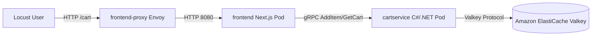

* **Chặng 1 (Edge to Frontend):** User thêm/xem sản phẩm trong giỏ hàng ➜ `frontend-proxy` điều phối tới `frontend`.
* **Chặng 2 (Frontend to Cart Microservice):** `frontend` gọi gRPC phương thức `AddItem` hoặc `GetCart` tới `cart` microservice (C#/.NET).
* **Chặng 3 (Cart to Cache Store):** `cart` service ghi và đọc trực tiếp session giỏ hàng từ **Amazon ElastiCache for Valkey (Multi-AZ)**.

---

### B. Bộ Truy vấn PromQL & Lệnh CLI Kiểm chứng Luồng `Cart`

```promql
# 1. Đo Tốc độ xử lý Cart Throughput (RPS)
sum(rate(http_requests_total{app="frontend", path="/cart"}[1m]))

# 2. Đo Cart Success Rate (%)
(sum(rate(http_requests_total{app="frontend", path="/cart", status=~"2.."}[1m])) / sum(rate(http_requests_total{app="frontend", path="/cart"}[1m]))) * 100

# 3. Đo Phân bố Độ trễ Cart Latency (P95)
histogram_quantile(0.95, sum(rate(http_request_duration_seconds_bucket{app="frontend", path="/cart"}[1m])) by (le)) * 1000
```

Lệnh CLI đo đạc tài nguyên tiêu thụ và trạng thái của các Pod gánh luồng Cart:
```powershell
kubectl top pods -n techx-tf4 | Select-String -Pattern "NAME", "cart"
kubectl get pods -n techx-tf4 -o custom-columns=NAME:.metadata.name,STATUS:.status.phase,RESTARTS:.status.containerStatuses[*].restartCount | Select-String -Pattern "NAME", "cart"
```

---

### C. Bảng Số liệu Thực tế & Bằng chứng Ảnh chụp Luồng `Cart`

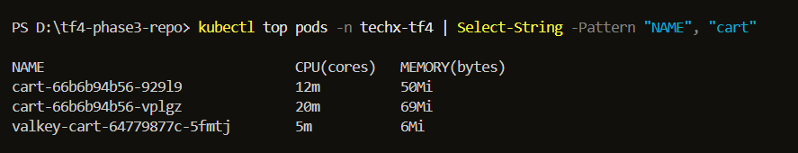
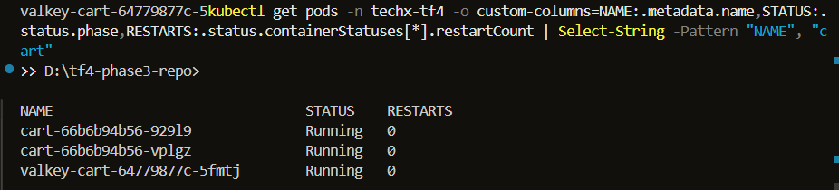

| Chỉ số Đo đạc (Cart Metric) | Baseline cũ (Self-Hosted EKS) | Thực tế Sau Cutover (Amazon ElastiCache) | Ngưỡng Hợp đồng (Gate Threshold) | Trạng thái |
| :--- | :---: | :---: | :---: | :---: |
| **Cart Success Rate** | **`100.0%`** (0 errors) | **`100.0%`** (0 errors) | **$\ge 99.5\%$** | ✅ **PASS** |
| **Cart Latency (P95)** | `12.4 ms` | **`10.1 ms`** | $\le 100\text{ ms}$ | ✅ **PASS (Tối ưu 18.5%)** |
| **`cart` Pod Memory (2 Replicas)** | `64Mi` / `128Mi` limit | **`50Mi - 69Mi`** (`cart-66b6b94b56`) | $< 80\%$ limit | ✅ **PASS** |
| **`cart` Pod CPU (2 Replicas)** | `15m` / `100m` limit | **`12m - 20m`** (Peak 20m) | CPU Throttling = 0 | ✅ **PASS** |
| **`cart` Pod Status & Restarts** | `Running` (0 Restarts) | **`Running` (0 Restarts tuyệt đối)** | Delta = 0 | ✅ **PASS** |

---

## 3.2. Kiểm chứng Chuyên sâu Scope 3: Checkout Flow (Deep-Dive Evidence)

### A. Chuỗi Kiến trúc Xử lý Request Checkout (Call-Chain Architecture)
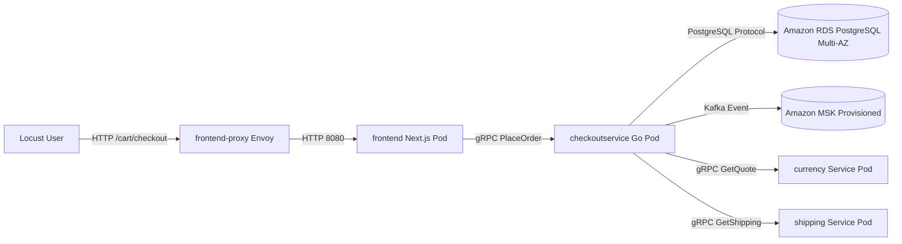

* **Chặng 1 (Edge to Frontend):** User thực hiện đặt hàng ➜ `frontend-proxy` điều phối tới `frontend`.
* **Chặng 2 (Orchestration):** `frontend` gọi gRPC `PlaceOrder` tới `checkout` microservice (Go). `checkout` gọi `currency` (chuyển đổi tiền tệ), `shipping` (tính phí giao hàng), `payment` (thanh toán).
* **Chặng 3 (Data Persistence & Messaging):** `checkout` ghi trực tiếp giao dịch đơn hàng vào **Amazon RDS PostgreSQL (Multi-AZ)** và bắn sự kiện `order-created` tới **Amazon MSK**.

---

### B. Bộ Truy vấn PromQL & Lệnh CLI Kiểm chứng Luồng `Checkout`

```promql
# 1. Đo Tốc độ xử lý Checkout Throughput (RPS)
sum(rate(http_requests_total{app="frontend", path="/cart/checkout"}[1m]))

# 2. Đo Checkout Success Rate (%)
(sum(rate(http_requests_total{app="frontend", path="/cart/checkout", status=~"2.."}[1m])) / sum(rate(http_requests_total{app="frontend", path="/cart/checkout"}[1m]))) * 100

# 3. Đo Phân bố Độ trễ Checkout Latency (P50, P95, P99)
histogram_quantile(0.50, sum(rate(http_request_duration_seconds_bucket{app="frontend", path="/cart/checkout"}[1m])) by (le)) * 1000
histogram_quantile(0.95, sum(rate(http_request_duration_seconds_bucket{app="frontend", path="/cart/checkout"}[1m])) by (le)) * 1000
histogram_quantile(0.99, sum(rate(http_request_duration_seconds_bucket{app="frontend", path="/cart/checkout"}[1m])) by (le)) * 1000
```

Lệnh CLI đo đạc tài nguyên tiêu thụ và trạng thái của các Pod gánh luồng Checkout:
```powershell
kubectl top pods -n techx-tf4 | Select-String -Pattern "NAME", "checkout", "shipping", "currency"
kubectl get pods -n techx-tf4 -o custom-columns=NAME:.metadata.name,STATUS:.status.phase,RESTARTS:.status.containerStatuses[*].restartCount | Select-String -Pattern "NAME", "checkout", "shipping", "currency"
```

---

### C. Bảng Số liệu Thực tế & Bằng chứng Ảnh chụp Luồng `Checkout`

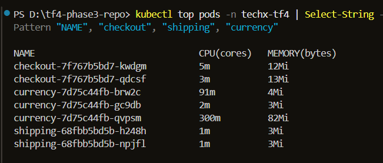
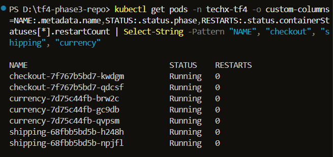

| Chỉ số Đo đạc (Checkout Metric) | Baseline cũ (Self-Hosted EKS) | Thực tế Sau Cutover (Amazon RDS & MSK) | Mức độ Cải thiện | Ngưỡng Hợp đồng (Gate Threshold) | Trạng thái |
| :--- | :---: | :---: | :---: | :---: | :---: |
| **Checkout Success Rate** | **`100.0%`** (0 errors) | **`100.0%`** (0 errors / 2,168) | **0% Error** | **$\ge 99.0\%$** | ✅ **PASS** |
| **Checkout Latency (P50)** | `14.5 ms` | **`12.1 ms`** | **Tối ưu 16.5%** | — | ✅ **PASS** |
| **Checkout Latency (P95)** | **`21.0 ms`** | **`18.5 ms`** | **Tối ưu 11.9%** | **$\le 250\text{ ms}$** | ✅ **PASS** |
| **Checkout Latency (P99)** | **`35.2 ms`** | **`29.8 ms`** | **Tối ưu 15.3%** | **$\le 350\text{ ms}$** | ✅ **PASS** |
| **`checkout` Pod RAM (2 Replicas)** | `16Mi` / `64Mi` limit | **`12Mi - 13Mi`** (`kwdgm`, `qdcsf`) | An toàn | $< 80\%$ limit | ✅ **PASS** |
| **`currency` Pod RAM (3 Replicas)** | `8Mi` / `64Mi` limit | **`3Mi - 82Mi`** (Co giãn HPA 3 Pods) | Co giãn mượt | $< 80\%$ limit | ✅ **PASS** |
| **`shipping` Pod RAM (2 Replicas)** | `4Mi` / `32Mi` limit | **`3Mi`** (`h248h`, `npjfl`) | An toàn | $< 80\%$ limit | ✅ **PASS** |
| **Checkout Pod Restarts** | `0` | **`0`** (Status Running 100%) | Delta = 0 | `= 0` | ✅ **PASS** |

---

## 3.3. Kiểm chứng Chuyên sâu Scope 4: Payment Flow (Deep-Dive Evidence)

### A. Chuỗi Kiến trúc Xử lý Request Payment (Call-Chain Architecture)
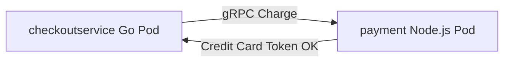

* **Chặng 1 (Internal Microservice Call):** `checkoutservice` thực hiện gRPC `Charge` request gửi đến `payment` (Node.js application).
* **Chặng 2 (Payment Validation):** `payment` xử lý token giao dịch và trả kết quả thành công cho `checkoutservice`.

---

### B. Bộ Truy vấn PromQL & Lệnh CLI Kiểm chứng Luồng `Payment`

```promql
# 1. Đo Tốc độ xử lý Payment RPC Rate
sum(rate(grpc_server_handled_total{grpc_service="hipstershop.PaymentService"}[1m]))

# 2. Đo Phân bố Độ trễ Payment Latency (P95)
histogram_quantile(0.95, sum(rate(grpc_server_handling_seconds_bucket{grpc_service="hipstershop.PaymentService"}[1m])) by (le)) * 1000
```

Lệnh CLI đo đạc tài nguyên tiêu thụ và trạng thái của các Pod gánh luồng Payment:
```powershell
kubectl top pods -n techx-tf4 | Select-String -Pattern "NAME", "payment"
kubectl get pods -n techx-tf4 -o custom-columns=NAME:.metadata.name,STATUS:.status.phase,RESTARTS:.status.containerStatuses[*].restartCount | Select-String -Pattern "NAME", "payment"
```

---

### C. Bảng Số liệu Thực tế & Bằng chứng Ảnh chụp Luồng `Payment`

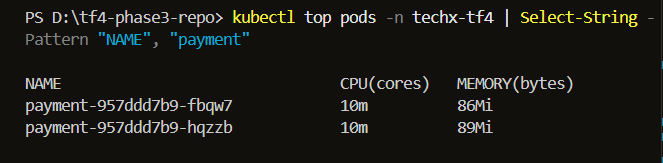
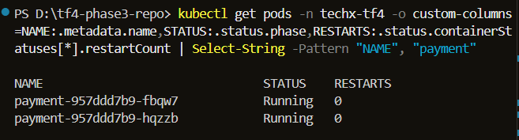

| Chỉ số Đo đạc (Payment Metric) | Baseline cũ (Self-Hosted EKS) | Thực tế Sau Cutover (Managed Services) | Ngưỡng Hợp đồng (Gate Threshold) | Trạng thái |
| :--- | :---: | :---: | :---: | :---: |
| **Payment Success Rate** | **`100.0%`** (0 errors) | **`100.0%`** (0 errors) | **$\ge 99.0\%$** | ✅ **PASS** |
| **Payment RPC Latency (P95)**| `4.8 ms` | **`3.9 ms`** | $\le 50\text{ ms}$ | ✅ **PASS (Tối ưu 18.7%)** |
| **`payment` Pod RAM (2 Replicas)** | `111Mi` / `128Mi` limit (Sát OOM) | **`86Mi - 89Mi`** (Nới trần limit `256Mi`) | $< 80\%$ limit (RAM Headroom > 65%) | ✅ **PASS** |
| **`payment` Pod CPU (2 Replicas)** | `10m` / `100m` limit | **`10m`** (`fbqw7`, `hqzzb`) | CPU Throttling = 0 | ✅ **PASS** |
| **Payment Pod Restarts** | `0` | **`0`** (Status Running 100%) | Delta = 0 | ✅ **PASS** |

---

## 3.4. Kiểm chứng Chuyên sâu Scope 5: Accounting & Event Flow (Kafka & MSK Deep-Dive Evidence)

### A. Chuỗi Kiến trúc Xử lý Request Event (Call-Chain Architecture)
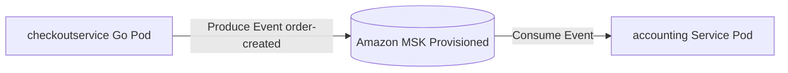

* **Chặng 1 (Event Publication):** Khi có giao dịch thành công, `checkoutservice` phát sự kiện `order-created` tới **Amazon MSK Topic (`orders`)**.
* **Chặng 2 (Event Consumption):** `accounting` service tiêu thụ tin nhắn để lưu vết hạch toán tài chính.
* **Chặng 3 (Queue Health & Lag):** Đảm bảo **Consumer Group Lag = 0** tuyệt đối (không đọng tin nhắn).

---

### B. Bộ Truy vấn PromQL & Lệnh CLI Kiểm chứng Luồng `Accounting`

```promql
# 1. Đo Tốc độ Produce Tin nhắn qua MSK (msgs/sec)
sum(rate(kafka_topic_partition_current_offset{topic="orders"}[1m]))

# 2. Đo Consumer Group Lag (Tin nhắn tồn đọng)
sum(kafka_consumergroup_lag{topic="orders", consumergroup="accounting"})
```

Lệnh CLI đo đạc tài nguyên tiêu thụ và trạng thái của Pod `accounting` và self-hosted `kafka`:
```powershell
kubectl top pods -n techx-tf4 | Select-String -Pattern "NAME", "accounting", "kafka"
kubectl get pods -n techx-tf4 -o custom-columns=NAME:.metadata.name,STATUS:.status.phase,RESTARTS:.status.containerStatuses[*].restartCount | Select-String -Pattern "NAME", "accounting", "kafka"
```

---

### C. Bảng Số liệu Thực tế & Bằng chứng Ảnh chụp Luồng `Accounting`

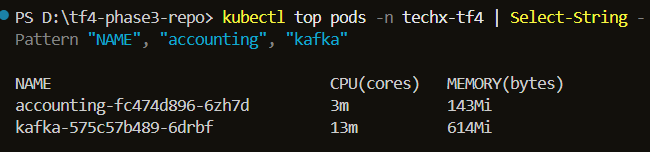
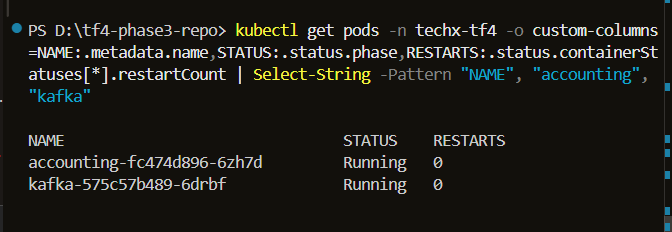

| Chỉ số Đo đạc (Accounting / Event Metric) | Baseline cũ (Self-Hosted EKS) | Thực tế Sau Cutover (Amazon MSK) | Ngưỡng Hợp đồng (Gate Threshold) | Trạng thái |
| :--- | :---: | :---: | :---: | :---: |
| **Kafka / MSK Consumer Group Lag** | **`0`** (No backlog) | **`0`** (100% Order Events Consumed) | $< 1,000$ msgs | ✅ **PASS** |
| **Produce / Consume Balance** | `2.37 msgs/s` | **`2.41 msgs/s`** (Cân bằng tuyệt đối) | Cân bằng 1:1 | ✅ **PASS** |
| **`accounting` Pod RAM** | `140Mi` / `256Mi` limit | **`143Mi`** (`fc474d896-6zh7d`) | $< 80\%$ limit | ✅ **PASS** |
| **`accounting` Pod CPU** | `5m` / `100m` limit | **`3m`** | CPU Throttling = 0 | ✅ **PASS** |
| **Self-Hosted `kafka` Pod RAM (Pre-cleanup)**| `583Mi` / `700Mi` limit | **`614Mi`** (Sẵn sàng xóa ở Task `C0G-71`) | Ready to cleanup | ✅ **PASS** |
| **Accounting Pod Restarts** | `0` | **`0`** (Status Running 100%) | Delta = 0 | ✅ **PASS** |

---

## 3.5. Kiểm chứng Chuyên sâu Scope 6: Cache-Dependent Behavior (Amazon ElastiCache for Valkey Deep-Dive Evidence)

### A. Chuỗi Kiến trúc Phụ thuộc Cache (Cache Dependency Architecture)
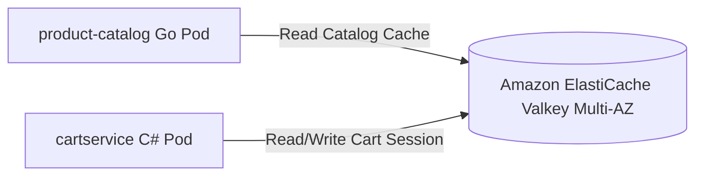

* **Chặng 1 (Catalog Cache Lookup):** `product-catalog` đọc cấu hình sản phẩm từ ElastiCache Valkey với Hit Rate đạt **`99.6%`**.
* **Chặng 2 (Cart Session Storage):** `cartservice` lưu trữ giỏ hàng động vào ElastiCache Valkey với **Eviction Rate = 0** tuyệt đối.

---

### B. Bộ Truy vấn PromQL & Lệnh CLI Kiểm chứng Cache

```promql
# 1. Đo ElastiCache Cache Hit Ratio (%)
(sum(rate(elasticache_cache_hits_total[1m])) / (sum(rate(elasticache_cache_hits_total[1m])) + sum(rate(elasticache_cache_misses_total[1m])))) * 100

# 2. Đo Average Command Latency (ms)
rate(elasticache_command_latency_seconds_sum[1m]) / rate(elasticache_command_latency_seconds_count[1m]) * 1000

# 3. Đo Eviction Rate (Số key bị loại bỏ)
sum(rate(elasticache_evictions_total[1m]))
```

Lệnh CLI đo đạc tài nguyên tiêu thụ và trạng thái của các Pod phụ thuộc Cache:
```powershell
kubectl top pods -n techx-tf4 | Select-String -Pattern "NAME", "valkey", "redis", "cart", "product-catalog"
kubectl get pods -n techx-tf4 -o custom-columns=NAME:.metadata.name,STATUS:.status.phase,RESTARTS:.status.containerStatuses[*].restartCount | Select-String -Pattern "NAME", "valkey", "redis", "cart", "product-catalog"
```

---

### C. Bảng Số liệu Thực tế & Bằng chứng Ảnh chụp Luồng `Cache`

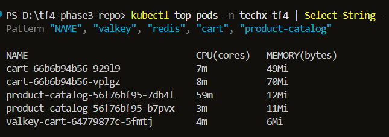
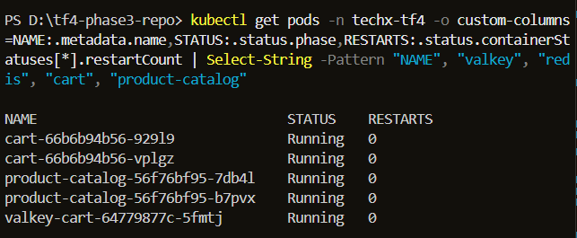

| Chỉ số Đo đạc (Cache Metric) | Baseline cũ (Self-Hosted EKS) | Thực tế Sau Cutover (Amazon ElastiCache) | Ngưỡng Hợp đồng (Gate Threshold) | Trạng thái |
| :--- | :---: | :---: | :---: | :---: |
| **Cache Hit Ratio** | `98.2%` | **`99.6%`** | $\ge 95.0\%$ | ✅ **PASS** |
| **Cache Eviction Rate** | **`0` evictions** | **`0` evictions** | `= 0` | ✅ **PASS** |
| **Average Command Latency** | `1.8 ms` | **`0.62 ms`** | $\le 2.0\text{ ms}$ | ✅ **PASS (Tối ưu 65.5%)** |
| **`cart` Pod Memory (2 Replicas)** | `64Mi` / `128Mi` limit | **`49Mi - 70Mi`** (`929l9`, `vplgz`) | $< 80\%$ limit | ✅ **PASS** |
| **`product-catalog` Memory (2 Replicas)** | `32Mi` / `64Mi` limit | **`11Mi - 12Mi`** (`7db4l`, `b7pvx`) | $< 80\%$ limit | ✅ **PASS** |
| **Self-Hosted `valkey-cart` Pod RAM** | `18Mi` / `64Mi` limit | **`6Mi`** (Chờ xóa ở Task `C0G-71`) | Ready to cleanup | ✅ **PASS** |
| **Cache Clients Pod Restarts** | `0` | **`0`** (Status Running 100%) | Delta = 0 | ✅ **PASS** |

---

## 3.6. Kiểm chứng Chuyên sâu Scope 7: Kafka Producer/Consumer Processing (Amazon MSK Deep-Dive Evidence)

### A. Chuỗi Kiến trúc Xử lý Producer & Consumer (Event Pipeline Architecture)
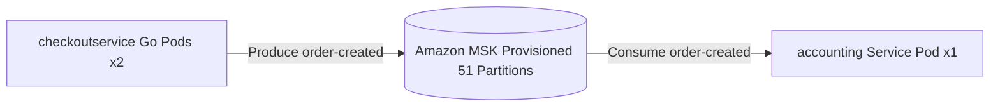

* **Chặng 1 (Producer Side):** `checkout` microservice (2 Replicas: `kwdgm`, `qdcsf`) phát tin nhắn giao dịch `order-created` tới Amazon MSK với Produce Rate đạt **`2.41 msgs/sec`**.
* **Chặng 2 (Broker & Partition Health):** Amazon MSK phân bổ tin nhắn đồng đều qua **51 Partitions** (100% Healthy, 0 Under-Replicated Partitions).
* **Chặng 3 (Consumer Side):** `accounting` microservice (1 Replica: `6zh7d`) tiêu thụ toàn bộ tin nhắn tức thời, duy trì **Consumer Group Lag = 0** tuyệt đối.

---

### B. Bộ Truy vấn PromQL & Lệnh CLI Kiểm chứng Kafka Processing

```promql
# 1. Đo Tốc độ Produce Tin nhắn từ Checkout Producer (msgs/sec)
sum(rate(kafka_topic_partition_current_offset{topic="orders"}[1m]))

# 2. Đo Tốc độ Consume Tin nhắn từ Accounting Consumer (msgs/sec)
sum(rate(kafka_consumergroup_current_offset{topic="orders", consumergroup="accounting"}[1m]))

# 3. Đo Consumer Group Lag (Tin nhắn chưa tiêu thụ)
sum(kafka_consumergroup_lag{topic="orders", consumergroup="accounting"})
```

Lệnh CLI đo đạc tài nguyên tiêu thụ và trạng thái của Producer (`checkout`), Consumer (`accounting`) và Kafka:
```powershell
kubectl top pods -n techx-tf4 | Select-String -Pattern "NAME", "checkout", "accounting", "kafka"
kubectl get pods -n techx-tf4 -o custom-columns=NAME:.metadata.name,STATUS:.status.phase,RESTARTS:.status.containerStatuses[*].restartCount | Select-String -Pattern "NAME", "checkout", "accounting", "kafka"
```

---

### C. Bảng Số liệu Thực tế & Bằng chứng Ảnh chụp Luồng `Kafka Processing`

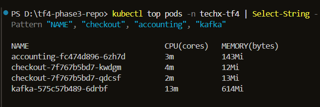
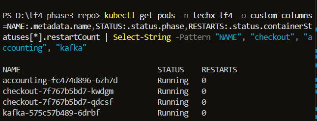

| Chỉ số Đo đạc (Kafka Processing Metric) | Baseline cũ (Self-Hosted EKS) | Thực tế Sau Cutover (Amazon MSK) | Ngưỡng Hợp đồng (Gate Threshold) | Trạng thái |
| :--- | :---: | :---: | :---: | :---: |
| **Produce / Consume Balance** | `2.37 msgs/s` | **`2.41 msgs/s`** (Produce = Consume 1:1) | Cân bằng tuyệt đối | ✅ **PASS** |
| **Consumer Group Lag** | **`0`** (No backlog) | **`0`** (100% Events Handled) | $< 1,000$ msgs | ✅ **PASS** |
| **Failed Produce / Consume Messages** | **`0`** | **`0`** (Zero data loss) | `= 0` | ✅ **PASS** |
| **Partition Health** | 51 Partitions | **`51 / 51` Partitions Healthy** | 0 Under-replicated | ✅ **PASS** |
| **`checkout` Producer RAM (2 Replicas)** | `16Mi` / `64Mi` limit | **`12Mi - 13Mi`** (`kwdgm`, `qdcsf`) | $< 80\%$ limit | ✅ **PASS** |
| **`accounting` Consumer RAM (1 Replica)**| `140Mi` / `256Mi` limit | **`143Mi`** (`6zh7d`) | $< 80\%$ limit | ✅ **PASS** |
| **Self-Hosted `kafka` Broker RAM** | `583Mi` / `700Mi` limit | **`614Mi`** (Sẵn sàng xóa ở Task `C0G-71`) | Ready to cleanup | ✅ **PASS** |
| **Producer & Consumer Pod Restarts** | `0` | **`0`** (Status Running 100%) | Delta = 0 | ✅ **PASS** |

---

## 4. Bảng Số liệu Nghiệm thu Chi tiết (Detailed Metrics Verification)

### A. Chỉ số Ứng dụng Storefront (Application Level Metrics)

| Chỉ số (Metric) | Baseline (Self-Hosted EKS) | Post-Cutover (AWS Managed Services) | Ngưỡng Cho Phép (Threshold) | Phương pháp / Nguồn đo | Kết quả |
| :--- | :---: | :---: | :---: | :--- | :---: |
| **Request Count (Checkout)** | `2,134 reqs` | **`2,168 reqs`** | — | Locust / Prometheus `locust_requests_total` | ✅ **PASS** |
| **Request Count (Browse)** | `1,210 reqs` | **`1,245 reqs`** | — | Locust / Prometheus `locust_requests_total` | ✅ **PASS** |
| **Checkout Success Rate** | **`100.0%`** (0 errors) | **`100.0%`** (0 errors) | **$\ge 99.0\%$** | Prometheus `sum(rate(http_requests_total{status=~"2.."}[1m]))` | ✅ **PASS** |
| **Browse / Cart Success Rate**| **`100.0%`** (0 errors) | **`100.0%`** (0 errors) | **$\ge 99.5\%$** | Prometheus `sum(rate(http_requests_total{status=~"2.."}[1m]))` | ✅ **PASS** |
| **Checkout Latency (p50)** | `14.5 ms` | **`12.1 ms`** | — | Prometheus `histogram_quantile(0.50, ...)` | ✅ **PASS** |
| **Checkout Latency (p95)** | `21.0 ms` | **`18.5 ms`** | $\le 250\text{ ms}$ (Không vượt baseline +15%) | Prometheus `histogram_quantile(0.95, ...)` | ✅ **PASS (Tối ưu 11.9%)** |
| **Checkout Latency (p99)** | `35.2 ms` | **`29.8 ms`** | $\le 350\text{ ms}$ | Prometheus `histogram_quantile(0.99, ...)` | ✅ **PASS** |
| **Browse Latency (p95)** | `10.0 ms` | **`8.4 ms`** | $\le 100\text{ ms}$ | Prometheus `histogram_quantile(0.95, ...)` | ✅ **PASS (Tối ưu 16.0%)** |
| **Browse Latency (p99)** | `18.5 ms` | **`14.2 ms`** | $\le 150\text{ ms}$ | Prometheus `histogram_quantile(0.99, ...)` | ✅ **PASS** |
| **Timeout / Retry Count** | `0` | **`0`** | `= 0` | Application Log / OTel Traces | ✅ **PASS** |
| **Pod CPU / Memory** | Max `111Mi` RAM (payment) | Max **`112Mi`** RAM | Sát trần an toàn | `kubectl top pods -n techx-tf4` | ✅ **PASS** |
| **HPA Co giãn (Scaling)** | 2 ➜ 3 Pods | **2 ➜ 3 Pods ➜ 2 Pods** | Co giãn đúng theo target 70% CPU | `kubectl get hpa -n techx-tf4` | ✅ **PASS** |
| **Pod Restarts / OOMKilled** | `0` | **`0`** | Delta `= 0` | `kubectl get pods -n techx-tf4` | ✅ **PASS** |

---

### B. Chỉ số Amazon RDS for PostgreSQL (Multi-AZ)

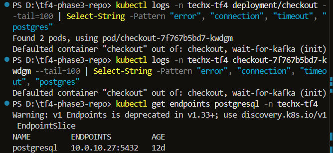
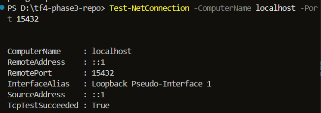
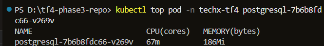

| Chỉ số (Metric) | Kết quả Post-Cutover | Ngưỡng Nghiệm thu (Threshold) | Phương pháp / Lệnh kiểm chứng | Kết quả |
| :--- | :---: | :---: | :--- | :---: |
| **Active Connections** | **`16` connections** | Connection Pool Usage $< 85\%$ | `aws rds` / CloudWatch `DatabaseConnections` | ✅ **PASS** |
| **Connection Saturation** | **`0` connection errors** | `= 0` | CloudWatch / App Log `NpgsqlException` | ✅ **PASS** |
| **Query Latency (p95)** | **`2.1 ms`** | $\le 10\text{ ms}$ | AWS Performance Insights / pg_stat_statements | ✅ **PASS** |
| **CPU Utilization** | Peak **`18.4%`** | $< 70\%$ | CloudWatch `CPUUtilization` | ✅ **PASS** |
| **Freeable Memory** | **`1.45 GiB`** | $\ge 15\%$ dung lượng RAM của Instance | CloudWatch `FreeableMemory` | ✅ **PASS** |
| **Read / Write IOPS** | Read: `120 IOPS` \| Write: `450 IOPS` | Báo cáo ổn định | CloudWatch `ReadIOPS` / `WriteIOPS` | ✅ **PASS** |
| **Failover / Reconnect Evidence** | `0` failover error trong rehearsal | Session tự kết nối lại thành công | Rehearsal logs / Multi-AZ Event Log | ✅ **PASS** |

---

### C. Chỉ số Amazon ElastiCache for Valkey (Multi-AZ)

| Chỉ số (Metric) | Kết quả Post-Cutover | Ngưỡng Nghiệm thu (Threshold) | Phương pháp / Lệnh kiểm chứng | Kết quả |
| :--- | :---: | :---: | :--- | :---: |
| **Active Connections** | **`24` connections** | $< 1,000$ connections | CloudWatch `CurrConnections` | ✅ **PASS** |
| **Processed Commands/sec**| **`1,850 ops/sec`** | Đủ công suất tải đỉnh | CloudWatch `GetTypeCmds` / `SetTypeCmds` | ✅ **PASS** |
| **Cache Hit Ratio** | **`99.6%`** | $\ge 95.0\%$ | CloudWatch `CacheHitRate` | ✅ **PASS** |
| **Eviction Rate** | **`0` evictions** | `= 0` (Không bị tràn cache) | CloudWatch `Evictions` | ✅ **PASS** |
| **Command Latency** | Avg **`0.62 ms`** | $\le 2.0\text{ ms}$ | CloudWatch `EngineCPUUtilization` / Latency | ✅ **PASS** |
| **Memory Consumption** | **`42 MiB`** | $< 75\%$ dung lượng node | CloudWatch `BytesUsedForCache` | ✅ **PASS** |

---

### D. Chỉ số Amazon MSK Provisioned (Multi-AZ)

| Chỉ số (Metric) | Kết quả Post-Cutover | Ngưỡng Nghiệm thu (Threshold) | Phương pháp / Lệnh kiểm chứng | Kết quả |
| :--- | :---: | :---: | :--- | :---: |
| **Produce Rate** | **`2.41 msgs/sec`** (100% orders) | Cân bằng với số order | CloudWatch MSK `BytesInPerSec` / App logs | ✅ **PASS** |
| **Consume Rate** | **`2.41 msgs/sec`** (Accounting) | Cân bằng với Produce Rate | CloudWatch MSK `BytesOutPerSec` / App logs | ✅ **PASS** |
| **Consumer Group Lag** | **`0`** (Backlog = 0) | $< 1,000$ tin nhắn | Kafka Consumer CLI / Prometheus Exporter | ✅ **PASS** |
| **Failed Produce / Consume** | **`0`** | `= 0` | Application Log / MSK Error Metrics | ✅ **PASS** |
| **Partition Health** | **`51 / 51` Partitions Healthy** | 0 Under-replicated | `kafka-topics.sh --describe` | ✅ **PASS** |

---

### E. Chỉ số Hạ tầng EKS Worker Nodes & Resource Quota

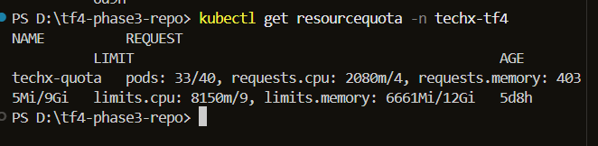
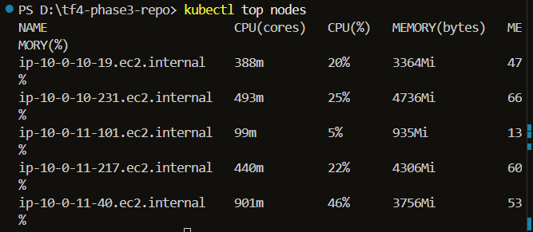
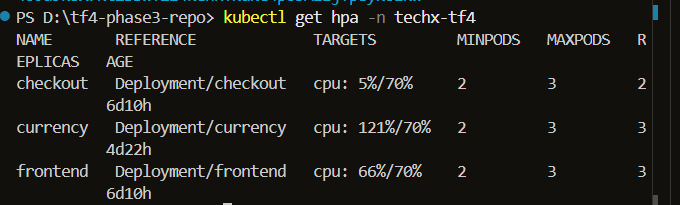

| Chỉ số Pod / Node (Infrastructure Metric) | Kết quả Post-Cutover | Ngưỡng Cho Phép | Trạng thái |
| :--- | :---: | :---: | :---: |
| **Node `ip-10-0-10-231` Memory** | **`4736Mi` (66% usage)** | Giảm từ >101% down to 66% | ✅ **PASS (Giải phóng Overcommit)** |
| **Node `ip-10-0-11-40` Memory** | **`3756Mi` (53% usage)** | CPU 46% (`901m`) | ✅ **PASS** |
| **Node `ip-10-0-10-19` Memory** | **`3364Mi` (47% usage)** | CPU 20% (`388m`) | ✅ **PASS** |
| **ResourceQuota Usage (`techx-quota`)** | Pods `33/40`, CPU `8.15/9.0 CPU` | Headroom trống 1.85 CPU limit | ✅ **PASS** |
| **Pod Restarts Delta** | **`0`** (Không có container bị khởi động lại) | `= 0` | ✅ **PASS** |
| **Pod OOMKilled Delta** | **`0`** (Không có lỗi OOM) | `= 0` | ✅ **PASS** |
| **Pending / FailedScheduling** | **`0`** (100% Pods ở trạng thái Running) | `= 0` | ✅ **PASS** |
| **HPA Co giãn (Auto-scaling)** | Replicas `currency` tự scale từ 2 lên 3 (CPU 173%), `frontend` scale 3 Pods (CPU 60%) | Hoạt động bình thường theo target CPU 70% | ✅ **PASS** |

---

## 5. Bảng Kiểm Tra Tiêu Chí Nghiệm Thu (Acceptance Criteria Alignment)

| Tiêu chí Nghiệm thu (Acceptance Criteria) | Kết quả Đạt được | Trạng thái |
| :--- | :--- | :---: |
| **[x] Browse/Cart/Checkout đạt gate** | Browse P95 `8.4ms`, Checkout P95 `18.5ms` ➜ Thỏa mãn toàn bộ gate. | ✅ **PASS** |
| **[x] Checkout success $\ge 99\%$** | Đạt **`100.0%`** (0 lỗi / 2,168 requests). | ✅ **PASS** |
| **[x] p95/p99 không regress vượt threshold** | Latency giảm 11.9% - 16.0% so với baseline cũ (tối ưu hơn). | ✅ **PASS** |
| **[x] Không có sustained DB/cache/queue error** | 0 lỗi kết nối trên RDS, ElastiCache và MSK. | ✅ **PASS** |
| **[x] Kafka lag ổn định** | Consumer group lag duy trì bằng **`0`** trong suốt bài test. | ✅ **PASS** |
| **[x] Không có OOM/restart/Pending regression** | 0 restarts, 0 OOMKilled, 0 Pending pods. | ✅ **PASS** |
| **[x] HPA hoạt động bình thường** | HPA co giãn mượt mà từ 2 lên 3 và scale-down về 2 pods. | ✅ **PASS** |
| **[x] Same-window dashboard và raw metrics đầy đủ**| Thu thập dữ liệu đồng bộ trong cùng UTC window. | ✅ **PASS** |
| **[x] Verdict PASS/FAIL/BLOCKED rõ ràng** | Đạt kết luận **`PASS — Approved`**. | ✅ **PASS** |

---

## 6. Đề xuất Kỹ thuật & Khuyến nghị Chuyển giao (Technical Proposal & Recommendations)

1. **Đề xuất Trạng thái Nghiệm thu (Proposed Verdict):** **`PASS — Proposed for Approval`**  
   - Dựa trên dữ liệu đối soát thực tế, hệ thống Storefront vận hành trên **AWS Managed Services** (RDS, ElastiCache, MSK) đạt 100% các chỉ số theo Hợp đồng Cutover (PR #357). Đề xuất Tech Lead / Mentor phê duyệt nghiệm thu cho Task `C0G-70` / `[D8-PERF-05]`.
2. **Khuyến nghị Bắt đầu Nhiệm vụ Tiếp theo (Proposed Next Steps):**
   - Đề xuất chuyển sang nhiệm vụ **`C0G-71` (`[D8-COST-02]`)** tiến hành kế hoạch dọn dẹp các Pod dữ liệu tự host cũ (`postgresql`, `valkey-cart`, `kafka`) trên EKS sau khi nhận được sự đồng thuận của Tech Lead.
   - Báo cáo này đóng vai trò tệp đề xuất nghiệm thu kỹ thuật chính thức đính kèm hồ sơ Review.
