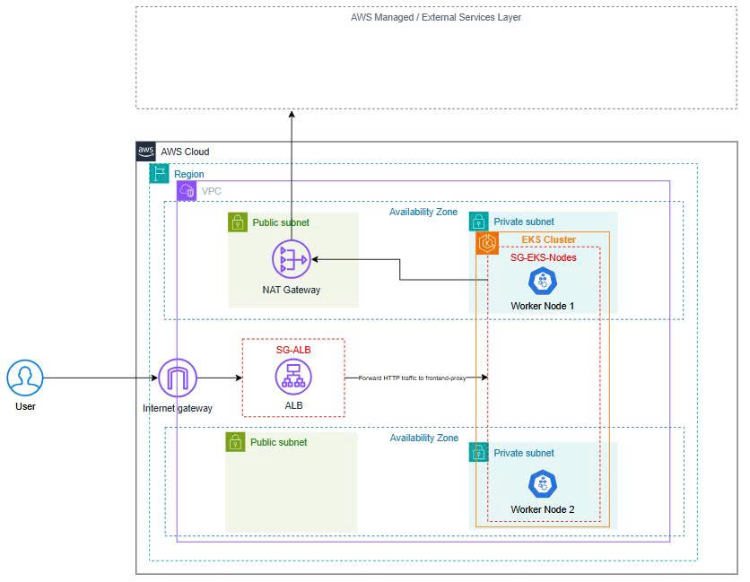

# Evidence: AWS High-Level Architecture

## Mục tiêu

Sơ đồ này mô tả kiến trúc AWS high-level baseline của TF4.

## Nội dung đã thể hiện

Sơ đồ bao gồm:

- AWS Cloud
- Region
- VPC
- 2 Availability Zones
- Public subnets
- Private subnets
- Internet Gateway
- ALB
- SG-ALB
- NAT Gateway
- EKS Cluster
- SG-EKS-Nodes
- Worker Node 1
- Worker Node 2
- AWS Managed / External Services Layer

## Luồng chính

### Inbound traffic

User traffic đi theo luồng:

User → Internet Gateway → ALB → EKS Cluster / Worker Nodes

ALB forward HTTP traffic vào `frontend-proxy` bên trong EKS namespace.

### Outbound traffic

EKS Worker Nodes đi outbound qua NAT Gateway để truy cập AWS Managed / External Services Layer.

Luồng chính:

EKS Worker Nodes → NAT Gateway → ECR

Mục đích chính là pull container images từ ECR.

## Multi-AZ Scope

Sơ đồ thể hiện 2 worker nodes được đặt trên 2 Availability Zones.

Lưu ý quan trọng:

Multi-AZ trong Week 1 chỉ áp dụng cho EKS compute layer. Team chưa claim full application HA hoặc stateful workload HA cho PostgreSQL, Kafka, Valkey, OpenSearch hoặc Prometheus.

## Cost Trade-off

Week 1 dùng Single NAT Gateway để kiểm soát chi phí.

Đây là cost-control trade-off. NAT Gateway per AZ là future hardening option nếu cần network HA cao hơn.

## Evidence 

