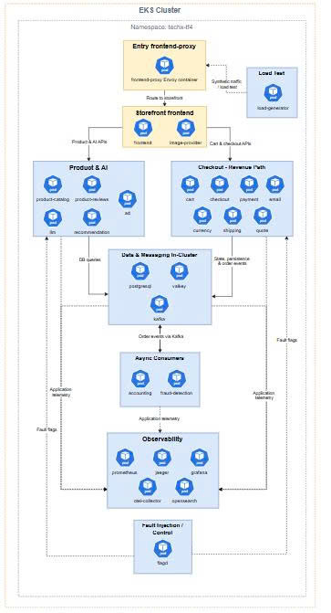

# Evidence: EKS Namespace Application Architecture

## Mục tiêu

Sơ đồ này mô tả kiến trúc ứng dụng bên trong EKS namespace `techx-tf4`.

## Nội dung đã thể hiện

Sơ đồ bao gồm các layer chính:

- Entry: `frontend-proxy`
- Storefront: `frontend`, `image-provider`
- Product & AI
- Checkout - Revenue Path
- Data & Messaging In-Cluster
- Async Consumers
- Observability
- Fault Injection / Control
- Load Test

## Luồng application chính

Traffic từ ALB đi vào `frontend-proxy`.

Sau đó:

frontend-proxy → frontend

Từ `frontend`, request tách ra hai hướng:

1. Product & AI APIs
2. Cart & Checkout APIs

## Product & AI Layer

Bao gồm:

- product-catalog
- product-reviews
- llm
- recommendation
- ad

Layer này phục vụ product browsing, product reviews, AI summary/assistant, recommendation và ads.

## Checkout - Revenue Path

Bao gồm:

- cart
- checkout
- payment
- email
- currency
- shipping
- quote

Đây là revenue-critical path, cần ưu tiên monitoring, reliability và performance baseline.

## Data & Messaging In-Cluster

Bao gồm:

- PostgreSQL
- Valkey
- Kafka

Lưu ý:

Đây là in-cluster stateful baseline. Stateful HA chưa được claim trong Week 1. PVC, replication, backup và failover cần được runtime validation sau deploy.

## Async Consumers

Bao gồm:

- accounting
- fraud-detection

Kafka publish order events cho accounting và fraud-detection xử lý bất đồng bộ.

## Observability

Bao gồm:

- prometheus
- jaeger
- grafana
- otel-collector
- opensearch

Các workload phát metrics/logs/traces về observability layer.

## Fault Injection / Control

Bao gồm:

- flagd

`flagd` nhận read-only flag sync từ Central Flag Configuration và cung cấp fault flags cho các service liên quan.

## Load Test

`load-generator` tạo synthetic traffic vào `frontend-proxy` để phục vụ performance baseline/load test.

## Evidence

