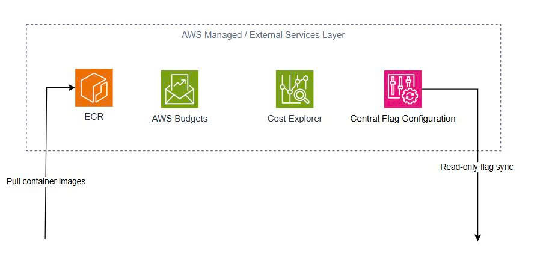

# Evidence: External Services, Cost & Control Layer

## Mục tiêu

Sơ đồ này mô tả các service bên ngoài EKS nhưng có liên quan trực tiếp tới baseline architecture, cost visibility và incident/fault flag control.

## Thành phần trong layer

### Amazon ECR

Vai trò:

Lưu container images cho các workload chạy trong EKS.

Luồng:

EKS Worker Nodes → NAT Gateway → ECR

Label trên diagram:

Pull container images via NAT

### AWS Budgets

Vai trò:

Thiết lập cost guardrail cho TF4. Dùng để cảnh báo khi chi phí gần chạm ngưỡng budget.

Ví dụ:

- 70% budget
- 90% budget
- 100% budget

### Cost Explorer

Vai trò:

Theo dõi cost visibility, giúp team biết service nào đang tạo chi phí chính.

Các cost driver cần theo dõi:

- EC2/EKS worker nodes
- NAT Gateway
- ALB
- EBS/PVC
- Observability logs/metrics/traces

### Central Flag Configuration

Vai trò:

Nguồn cấu hình flag tập trung bên ngoài EKS.

Nó không nằm trong user request path. Đây là control/config path.

Luồng:

Central Flag Configuration → flagd

Label trên diagram:

Read-only flag sync to flagd

`flagd` trong EKS sẽ nhận các flag này để phục vụ fault injection hoặc incident simulation.

## Runtime Path vs Control Path

ECR nằm trong outbound runtime dependency vì EKS cần pull images.

AWS Budgets và Cost Explorer không nằm trong runtime traffic path. Hai thành phần này được đưa vào diagram để thể hiện cost control và FinOps visibility.

Central Flag Configuration nằm trong control path, không phải user traffic path.

## Evidence 

