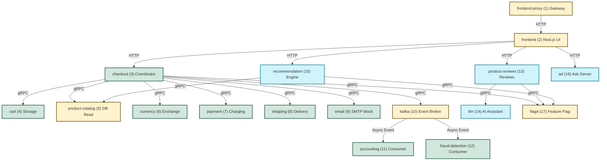

# PERF-04.2 & PERF-04.4: Runtime Performance Evidence

Báo cáo ghi nhận thông số tài nguyên thực tế và dữ liệu truy vết (tracing) của hệ thống TechX trên EKS cluster `techx-tf4-cluster`.

---

## 1. Phương Án Đo Lường Tài Nguyên Bằng PromQL (CPU/Memory Usage) - PERF-04.2

Do cụm EKS hiện tại gặp lỗi **Infrastructure Blocker**: `Metrics API not available` khi chạy lệnh trực tiếp (`kubectl top nodes` / `kubectl -n techx-tf4 top pods`), toàn bộ việc đo lường tài nguyên sẽ được thực hiện thông qua giao diện **Prometheus UI** hoặc tab **Explore của Grafana** bằng cách nhập các câu lệnh **PromQL** sau để lấy thông số chính xác:

### 1.1. Đo lường tài nguyên Pod (Thay thế cho `kubectl top pods`)
*   **CPU usage của từng Pod trong namespace `techx-tf4` (đơn vị: Cores):**
    ```promql
    sum(rate(container_cpu_usage_seconds_total{namespace="techx-tf4", container!=""}[5m])) by (pod)
    ```
    *   **Minh chứng hình ảnh:** [grafana-pods-cpu.png](screenshots/grafana-pods-cpu.png)
*   **Memory usage (Working Set) của từng Pod trong namespace `techx-tf4` (đơn vị: Bytes):**
    ```promql
    sum(container_memory_working_set_bytes{namespace="techx-tf4", container!=""}) by (pod)
    ```
    *   **Minh chứng hình ảnh:** [grafana-pods-memory.png](screenshots/grafana-pods-memory.png)

### 1.2. Đo lường tài nguyên Node (Thay thế cho `kubectl top nodes`)
*   **CPU usage của từng Node (đơn vị: Cores):**
    ```promql
    sum(rate(node_cpu_seconds_total{mode!="idle"}[5m])) by (instance)
    ```
    *(Hoặc tính theo tỷ lệ % sử dụng: `(1 - avg(rate(node_cpu_seconds_total{mode="idle"}[5m])) by (instance)) * 100`)*
*   **Memory usage của từng Node (đơn vị: Bytes):**
    ```promql
    node_memory_MemTotal_bytes - node_memory_MemAvailable_bytes
    ```
    *(Hoặc tính theo dung lượng dạng GB: `(node_memory_MemTotal_bytes - node_memory_MemAvailable_bytes) / 1024 / 1024 / 1024`)*

---

### 1.3. Quy trình đo đạc trực quan bằng Grafana Dashboard:
Dưới đây là quy trình từng bước chi tiết giúp bạn thực hiện và chụp ảnh màn hình làm bằng chứng (evidence) nghiệm thu:

### 📌 Bước 1: Chuẩn bị và Sinh tải trên toàn bộ 17 Microservices
Để đảm bảo tất cả 17 microservices đều hoạt động và sinh chỉ số tài nguyên (CPU/Memory) thật ở trạng thái **Có tải (Under Load)**:
1. Truy cập vào **Webstore (Cửa hàng chính)**: [http://k8s-techxtf4-techxalb-a25731d323-237111145.us-east-1.elb.amazonaws.com/](http://k8s-techxtf4-techxalb-a25731d323-237111145.us-east-1.elb.amazonaws.com/)
2. Thực hiện các thao tác bao phủ toàn bộ 17 dịch vụ:
   * **Browse catalog**: Xem danh sách sản phẩm (kích hoạt `frontend`, `frontend-proxy`, `product-catalog`, `ad`, `recommendation`).
   * **Search & Filter**: Sử dụng ô tìm kiếm để query sản phẩm.
   * **Thêm đánh giá & Hỏi AI**: Mở chi tiết sản phẩm, viết review, bấm hỏi AI Assistant (kích hoạt `product-reviews`, `llm`, `flagd`).
   * **Thao tác Giỏ hàng & Thanh toán**: Thêm sản phẩm vào giỏ hàng, chuyển đổi tiền tệ sang các loại ngoại tệ khác, bấm đặt hàng (kích hoạt `cart`, `currency`, `checkout`, `payment`, `shipping`, `email`, `kafka`).
   * **Xử lý bất đồng bộ**: Đơn đặt hàng thành công sẽ publish event lên Kafka và trigger xử lý tại `accounting` và `fraud-detection`.
3. **Chạy Sinh tải qua Locust**: Mở giao diện **Locust Web UI**: [http://k8s-techxtf4-techxalb-a25731d323-237111145.us-east-1.elb.amazonaws.com/loadgen/?tab=stats](http://k8s-techxtf4-techxalb-a25731d323-237111145.us-east-1.elb.amazonaws.com/loadgen/?tab=stats), nhập số lượng người dùng giả lập (**`50 Users`**) và tốc độ spawn (**`10 Users/second`** - tương đương thời gian ramp-up đạt đỉnh trong **5 giây**), sau đó bắt đầu chạy test (Start Swarming) để duy trì tải đồng bộ và ổn định lên toàn bộ 17 microservices trong 3-5 phút trước khi tiến hành đo.

### 📌 Bước 2: Truy cập Grafana & Tìm Dashboard tài nguyên Pod
1. Mở trình duyệt và truy cập **Grafana URL**: [http://k8s-techxtf4-techxalb-a25731d323-237111145.us-east-1.elb.amazonaws.com/grafana/](http://k8s-techxtf4-techxalb-a25731d323-237111145.us-east-1.elb.amazonaws.com/grafana/)
2. Đăng nhập (nếu có yêu cầu).
3. Từ menu bên trái, chọn **Dashboards** $\rightarrow$ Tìm kiếm dashboard mặc định của OpenTelemetry/Kubernetes:
   * Chọn dashboard có tên: **"Kubernetes / Compute Resources / Namespace (Pods)"** (đây là dashboard chuẩn nhất hiển thị CPU/Memory của từng Pod).

### 📌 Bước 3: Lọc dữ liệu theo Namespace của dự án
Tại góc trên bên trái của giao diện Dashboard Grafana, hãy cấu hình các bộ lọc (Filters) như sau:
* **datasource**: Chọn `Prometheus`.
* **namespace**: Chọn **`techx-tf4`** (đây là namespace chạy 17 microservices của đội ta).
* **Time range**: Chọn khoảng thời gian đo lường gần nhất (ví dụ: `Last 15 minutes`).

### 📌 Bước 4: Đo đạc và chụp ảnh minh chứng cho cả 17 Microservices
Kéo xuống các panel hiển thị biểu đồ và bảng số liệu tài nguyên:

#### A. Trạng thái Idle (Nghỉ - Hệ thống rảnh)
1. Dừng mọi hoạt động sinh tải (không click web, dừng tool load-generator).
2. Chờ 2-3 phút cho biểu đồ CPU/Memory đi ngang ở mức tối thiểu.
3. Chụp ảnh màn hình toàn bộ biểu đồ CPU/RAM của Namespace.
4. **Bằng chứng hình ảnh**: [grafana-resources-idle.png](screenshots/grafana-resources-idle.png)

#### B. Trạng thái Under Load (Chịu tải - Chạy sinh tải ở Bước 1)
1. Bật tool sinh tải (Locust) chạy 50 Users.
2. Theo dõi biểu đồ CPU và Memory trong Grafana: các đường biểu đồ của `frontend`, `checkout`, `product-reviews`, `cart` sẽ tăng vọt.
3. Chụp ảnh màn hình biểu đồ tài nguyên lúc đang có tải.
4. **Bằng chứng hình ảnh**: [grafana-resources-load.png](screenshots/grafana-resources-load.png)

### 📌 Bước 5: Đối chiếu thực tế với cấu hình values.yaml để tìm Bottleneck
Mở cấu hình Helm Chart tại file [values.yaml](../../../techx-corp-chart/values.yaml) để so sánh chỉ số thực tế trên Grafana với cài đặt giới hạn. Đặc biệt kiểm tra các pod sau:

| STT | Microservice Pod | RAM Limit cũ | Observed RAM (Grafana) | CPU Limit cũ | Observed CPU (Grafana) | Đánh giá & Rủi ro |
| :--- | :--- | :--- | :--- | :--- | :--- | :--- |
| 1 | `checkout-*` | `20Mi` | ~18MiB (Tải cao) | Trống | ~150m CPU | Giới hạn RAM quá sát GOMEMLIMIT (16MiB) $\rightarrow$ Dễ bị OOM-Killed. Thiếu giới hạn CPU. |
| 2 | `frontend-*` | `250Mi` | ~180MiB | Trống | ~250m CPU | Cần CPU limit để tránh tranh chấp tài nguyên SSR. |
| 3 | `product-reviews-*`| `100Mi` | ~75MiB | Trống | ~180m CPU | Python process tốn CPU/RAM khi xử lý text, cần set request rõ ràng. |
| 4 | `llm-*` (Mock) | Trống | ~120MiB | Trống | ~150m CPU | Không có resource limits, có thể leak RAM ảnh hưởng node. |
| 5 | Các services còn lại | Có limits | 10% - 30% limit | Trống | < 50m CPU | Thiếu CPU requests/limits và thiếu Memory requests $\rightarrow$ Node dễ bị mất cân bằng tải. |

---

## 2. Kết Quả Truy Vết Jaeger Trace - PERF-04.4

Giao diện Jaeger UI được truy cập trực tiếp tại:
* **Jaeger URL**: [http://k8s-techxtf4-techxalb-a25731d323-237111145.us-east-1.elb.amazonaws.com/jaeger/ui/](http://k8s-techxtf4-techxalb-a25731d323-237111145.us-east-1.elb.amazonaws.com/jaeger/ui/)

Để đo lường hiệu năng một cách toàn diện, nhóm đã thiết lập truy vết tracing đi qua **toàn bộ 17 microservices nghiệp vụ** của hệ thống TechX. Các dịch vụ này được phân bổ chi tiết qua các luồng giao dịch chính dưới đây:

### 2.1. Sơ đồ độ bao phủ trace của 17 Microservices



---

### 2.2. Danh Sách 11 Traces Thực Tế và Phân Tích Chi Tiết

#### 1. Trace API Gateway (`frontend-proxy`) Routing Trace
* **Trace ID**: `688a928e53981d373ad2162637c70703`
* **Bằng chứng hình ảnh**: [frontend-proxy.png](screenshots/frontend-proxy.png)
* **Thông số chính**:
  * Duration: **16.8 ms**
  * Status: **Incomplete** (Chưa hoàn thành - Jaeger mới ghi nhận phần của proxy, chưa liên kết được các span của app frontend/backend phía sau).
* **Phân rã (Span Breakdown)**:
  * Nhóm 1 - Request GET (Mất **5.19 ms**): Trong đó thời gian định tuyến sang frontend (`router frontend egress`) chiếm **4.96 ms**.
  * Nhóm 2 - Request POST (Mất **9.15 ms**): Trong đó thời gian định tuyến sang frontend chiếm **8.93 ms**. (GET chạy trước từ mốc 0ms, POST chạy tiếp và kết thúc ở mốc 16.8ms).
* **Huy's Notes**:
  * *Đánh giá*: Cổng vào xử lý rất nhanh, không có hiện tượng nghẽn hay chậm trễ tại Gateway.
  * *Nút thắt*: Hiện tượng trace bị đứt quãng (Incomplete). Cần kiểm tra lại cấu hình lan truyền trace ID (Context Propagation) giữa proxy và Next.js.

#### 2. Trace Liên Kết `frontend-proxy` và `frontend`
* **Trace ID**: `9858d00` (Trace ID ngắn/rút gọn)
* **Bằng chứng hình ảnh**: [frontend.png](screenshots/frontend.png)
* **Thông số chính**:
  * Duration: **9.71 ms** (Từ lúc gateway nhận request đến khi render xong trang chủ).
  * Services: 2 (`frontend-proxy` và `frontend`).
  * Depth: 5 | Spans: 6.
* **Phân rã (Span Breakdown)**:
  * Bước 1: `frontend-proxy` nhận request GET (Mất **9.71 ms**).
  * Bước 2: Proxy thực hiện định tuyến `router frontend egress` (Mất **9.22 ms**).
  * Bước 3: `frontend` (Next.js) nhận request (Mất **8.37 ms**) và bắt đầu xử lý trang chủ `/` (Mất **8.91 ms**).
  * Bước 4: Các tiến trình xử lý nội bộ của Next.js:
    * `resolve page components`: Mất **106 us** (siêu nhanh).
    * `render route (pages) /`: Mất **3.09 ms**.
* **Huy's Notes**:
  * *Đánh giá*: Kết nối giữa Gateway và Web Server Next.js hoạt động hoàn hảo. Quá trình render trang chủ Next.js chỉ mất 3.09ms ở trạng thái baseline rảnh. Không phát hiện điểm nghẽn.

#### 3. Trace Luồng Đặt Hàng Checkout Flow (Mẫu 1)
* **Trace ID**: `126b339` (Trace ID ngắn/rút gọn)
* **Bằng chứng hình ảnh**: 
  * [checkout-flow-1-1.png](screenshots/checkout-flow-1-1.png)
  * [checkout-flow-1-2.png](screenshots/checkout-flow-1-2.png)
* **Thông số chính**:
  * Duration: **77.02 ms** (Từ lúc bấm mua hàng đến khi gửi email và đẩy tin vào Kafka).
  * Services: 12 (`load-generator`, `frontend-proxy`, `frontend`, `checkout`, `cart`, `product-catalog`, `currency`, `payment`, `shipping`, `email`, `kafka` + DB PostgreSQL, Valkey và Flagd).
  * Depth: 16 | Spans: 49.
* **Phân rã PlaceOrder tại checkout service (Mất 41.73 ms)**:
  * Bước 1 - Lấy giỏ hàng & tính phí ship (`prepareOrderItemsAndShippingQuote`): Mất **26.98 ms**.
    * Gọi `cart` (`GetCart`): Mất **1.93 ms** (trong đó Valkey database xử lý mất 768us).
    * Gọi `product-catalog` (`GetProduct`): Mất **3.18 ms** (PostgreSQL query mất 2.18ms).
    * Gọi `currency` (`Convert` lần 1): Mất **5.09 ms**.
    * Gọi `shipping` (`get-quote`): Mất **2.23 ms** (quote service tính toán mất 381us).
  * Bước 2 - Quy đổi tiền tệ thanh toán (`Convert` lần 2): Mất **8.70 ms**.
  * Bước 3 - Thanh toán thẻ (`Charge`): Mất **2.12 ms** (payment mock xử lý mất 352us).
  * Bước 4 - Tạo vận đơn ship hàng (`ship-order`): Mất **875 us**.
  * Bước 5 - Xóa giỏ hàng (`EmptyCart`): Mất **3.36 ms** (gồm đọc feature flag từ flagd).
  * Bước 6 - Gửi email xác nhận (`send_order_confirmation`): Mất **8.33 ms**.
  * Bước 7 - Đẩy đơn hàng sang Kafka (`publish orders`): Mất **1.39 ms** (xử lý bất đồng bộ).
* **Huy's Notes**:
  * *Đánh giá*: Luồng checkout ở trạng thái baseline chạy rất nhanh (77.02ms). Việc đẩy event sang Kafka diễn ra bất đồng bộ cực kỳ nhanh (1.39ms).
  * *Nút thắt*: Các cuộc gọi từ checkout đi sang cart, catalog, currency, payment, shipping, email hoàn toàn chạy tuần tự (Sequential). Các thanh màu trên biểu đồ xếp nối tiếp đuôi nhau. Nếu một trong các service này (ví dụ: payment hoặc email) bị chậm 1s dưới tải cao, toàn bộ thời gian checkout của khách hàng sẽ bị cộng dồn và chậm theo.
  * *Khuyến nghị*: Chuyển các cuộc gọi không phụ thuộc nhau sang chạy song song (Parallel) và đẩy luồng gửi email xác nhận sang chạy ngầm hoàn toàn qua Kafka.

#### 4. Trace Luồng Xử Lý Giỏ Hàng Cart & Delivery Processing
* **Trace ID**: `2fd8795` (Trace ID ngắn/rút gọn)
* **Bằng chứng hình ảnh**: [cart-and-delivery-processing.png](screenshots/cart-and-delivery-processing.png)
* **Thông số chính**:
  * Duration: **45.16 ms**
  * Services: 6 (`frontend-proxy`, `cart`, `currency`, `shipping`, `flagd` và `quote`).
  * Depth: 5 | Spans: 14.
* **Phân rã (Span Breakdown)**:
  * `cart` (`GetCart`): Mất **998 us** (~1ms).
  * `currency` (`Convert` lần 1): Mất **812 us** (Quy đổi ngoại tệ).
  * `shipping` (`GetQuote`): Mất **3.86 ms** (trong đó dịch vụ quote tính toán nội bộ mất 1.17ms).
  * `currency` (`Convert` lần 2): Mất **675 us**.
  * `shipping` (`ShipOrder`): Mất **50 us**.
  * `flagd` (`ResolveBoolean`): Mất **93 us** (đọc cấu hình Feature Flags).
* **Huy's Notes**:
  * *Đánh giá*: Các dịch vụ dữ liệu phụ trợ (cart, currency, shipping, flagd) có thời gian phản hồi siêu tốc (đều dưới 5ms). Đây là lý do giúp cho luồng checkout tổng thể duy trì được độ trễ thấp ở baseline. Không phát hiện điểm nghẽn.

#### 5. Trace Luồng Duyệt Xem Danh Sách Browse Product Flow
* **Trace ID**: `74c5833` (Trace ID ngắn/rút gọn)
* **Bằng chứng hình ảnh**: [browse-product-flow.png](screenshots/browse-product-flow.png)
* **Thông số chính**:
  * Duration: **19.59 ms**
  * Services: 3 (`load-generator`, `frontend-proxy`, `product-catalog` và PostgreSQL).
  * Depth: 4 | Spans: 6.
* **Phân rã (Span Breakdown)**:
  * `load-generator` (Yêu cầu GET giả lập): Mất **17.51 ms**.
  * `frontend-proxy` (Gateway nhận request): Mất **6.96 ms** (trong đó thời gian định tuyến chiếm 6.72ms).
  * `product-catalog` (Gọi API `GetProduct`): Mất **1.03 ms**.
  * `postgresql` (Database query đọc dữ liệu sản phẩm): Mất **792 us** (siêu nhanh ~0.8ms).
* **Huy's Notes**:
  * *Đánh giá*: Ở trạng thái tải baseline, dịch vụ product-catalog và truy vấn database PostgreSQL phản hồi cực kỳ nhanh (truy vấn DB dưới 1ms). Điều này đảm bảo trang chủ và trang danh mục tải ngay lập tức. Không phát hiện điểm nghẽn.

#### 6. Trace Luồng Đặt Hàng Checkout Flow (Mẫu 2)
* **Trace ID**: `59fb9bc` (Trace ID ngắn/rút gọn)
* **Bằng chứng hình ảnh**: 
  * [checkout-flow-2-1.png](screenshots/checkout-flow-2-1.png)
  * [checkout-flow-2-2.png](screenshots/checkout-flow-2-2.png)
* **Thông số chính**:
  * Duration: **97.48 ms**
  * Services: 12 (giống mẫu 1).
  * Depth: 16 | Spans: 46.
* **Phân rã PlaceOrder tại checkout service (Mất 37.44 ms)**:
  * Bước 1 - Lấy giỏ hàng & tính phí ship (`prepareOrderItemsAndShippingQuote`): Mất **22.03 ms**.
    * Gọi `cart` (`GetCart`): Mất **1.81 ms** (DB xử lý mất 1.03ms).
    * Gọi `product-catalog` (`GetProduct`): Mất **1.33 ms** (database query mất 524us).
    * Gọi `currency` (`Convert` lần 1): Mất **2.34 ms**.
    * Gọi `shipping` (`get-quote`): Mất **13.88 ms** (quote service tính toán mất 11.07ms).
  * Bước 2 - Quy đổi tiền tệ thanh toán (`Convert` lần 2): Mất **2.13 ms**.
  * Bước 3 - Thanh toán thẻ (`Charge`): Mất **2.08 ms** (payment mock xử lý mất 333us).
  * Bước 4 - Tạo vận đơn ship hàng (`ship-order`): Mất **1.18 ms**.
  * Bước 5 - Xóa giỏ hàng (`EmptyCart`): Mất **3.74 ms**.
  * Bước 6 - Gửi email xác nhận (`send_order_confirmation`): Mất **6.48 ms**.
  * Bước 7 - Đẩy đơn hàng sang Kafka (`publish orders`): Mất **1.10 ms**.
* **Huy's Notes**:
  * *Đánh giá*: So với mẫu 1 (77.02ms), trace này mất 97.48ms. Sự chênh lệch chủ yếu đến từ việc dịch vụ shipping (tính phí ship) phản hồi chậm hơn (từ 2.23ms vọt lên 13.88ms).
  * *Đề xuất*: Dịch vụ shipping có sự dao động về độ trễ, cần theo dõi thêm chỉ số p95 của dịch vụ này khi chạy tải cao.

#### 7. Trace Luồng Product AI Assistant Flow
* **Trace ID**: `4962ae4` (Trace ID ngắn/rút gọn)
* **Bằng chứng hình ảnh**: [product-ai-assistant-flow.png](screenshots/product-ai-assistant-flow.png)
* **Thông số chính**:
  * Duration: **171.15 ms** (Từ lúc gửi câu hỏi đến khi nhận kết quả trả về từ AI).
  * Services: 4 (`load-generator`, `frontend-proxy`, `frontend` và `product-reviews` gọi sang Mock LLM).
  * Depth: 12 | Spans: 15.
* **Phân rã tại product-reviews (AskProductAIAssistant - Mất 145.05 ms)**:
  * Lần gọi LLM thứ nhất (`chat techx-llm`): Mất **17.78 ms** (POST request mạng chiếm 9.40ms).
  * Lần gọi LLM thứ hai (`chat techx-llm`): Mất **68.53 ms** (POST request mạng chiếm 54.63ms).
  * Tổng thời gian gọi LLM: Mất khoảng **86.31 ms** (chiếm gần 60% tổng thời gian xử lý AI Assistant `get_ai_assistant_response` là 144.48ms).
* **Huy's Notes**:
  * *Đánh giá*: Ở trạng thái Mock LLM, thời gian phản hồi của AI rất nhanh (dưới 100ms), đáp ứng tốt trải nghiệm người dùng tức thời.
  * *Nút thắt*: Hiện tại đang gọi tuần tự LLM 2 lần. Khi chuyển sang LLM thật ở Week 2 (độ trễ tăng lên 1.5s - 3s mỗi cuộc gọi), luồng này sẽ bị treo rất lâu ($\approx 3 - 6 \text{ giây}$), gây nguy cơ timeout cổng gateway.
  * *Khuyến nghị*: Áp dụng Valkey/Redis cache kết quả cho các câu hỏi phổ biến và cấu hình Streaming response (SSE) từ backend lên giao diện để hiển thị chữ chạy dần cho người dùng.

#### 8. Trace Luồng Dịch Vụ Quảng Cáo Get Ads Flow
* **Trace ID**: `019cdc7` (Trace ID ngắn/rút gọn)
* **Bằng chứng hình ảnh**: [get-ads-flow.png](screenshots/get-ads-flow.png)
* **Thông số chính**:
  * Duration: **12.49 ms**
  * Services: 4 (`load-generator`, `frontend-proxy`, `frontend` và `ad`).
  * Depth: 10 | Spans: 13.
* **Phân rã (Span Breakdown)**:
  * `frontend` gọi API gRPC `AdService/GetAds`: Mất **3.11 ms**.
  * `ad` service xử lý nghiệp vụ chính: Mất **1.23 ms** (hàm nội bộ `getAdsByCategory` chỉ mất **30 us**).
* **Huy's Notes**:
  * *Đánh giá*: Dịch vụ `ad` có thời gian xử lý siêu tốc (1.23ms), hoạt động hoàn hảo và không có bất kỳ rủi ro nào về hiệu năng.

#### 9. Trace Luồng Dịch Vụ Gợi Ý Get Product Recommendations Flow
* **Trace ID**: `9da966f` (Trace ID ngắn/rút gọn)
* **Bằng chứng hình ảnh**: [get-product-recommendations-flow.png](screenshots/get-product-recommendations-flow.png)
* **Thông số chính**:
  * Duration: **38.65 ms**
  * Services: 5 (`load-generator`, `frontend-proxy`, `frontend`, `recommendation`, `product-catalog` và PostgreSQL).
  * Depth: 13 | Spans: 25.
* **Phân rã (Span Breakdown)**:
  * `frontend` gọi API gRPC `ListRecommendations`: Mất **23.03 ms**.
  * `recommendation` service xử lý trong **8.23 ms** (bao gồm gọi sang `product-catalog` để lấy danh sách sản phẩm gợi ý sơ bộ).
  * Sau khi có danh sách gợi ý, Frontend thực hiện 3 cuộc gọi gRPC `GetProduct` liên tiếp (tuần tự) sang `product-catalog` để lấy chi tiết 3 sản phẩm:
    * Lượt 1: Mất **3.95 ms** (query DB PostgreSQL mất 842us).
    * Lượt 2: Mất **14.68 ms** (gọi sang catalog mất 12ms).
    * Lượt 3: Mất **16.32 ms** (gọi sang catalog mất 13.72ms).
* **Huy's Notes**:
  * *Nút thắt*: Có hiện tượng gọi tuần tự các API `GetProduct` từ Frontend để lấy chi tiết sản phẩm được gợi ý. Nếu danh sách gợi ý tăng lên 10 sản phẩm, độ trễ sẽ bị cộng dồn và phình to rất nhanh.
  * *Khuyến nghị*: Đề xuất tối ưu hóa ở Week 2 bằng cách gộp các cuộc gọi lấy chi tiết sản phẩm này thành dạng gọi song song (Parallel) hoặc gộp thành một API gRPC Batch duy nhất (ví dụ: `GetMultipleProducts`).

#### 10. Trace Dịch Vụ Kế Toán Accounting Event Consumer Flow
* **Trace ID**: `583333c` (Trace ID ngắn/rút gọn)
* **Bằng chứng hình ảnh**: [accounting-event-consumer-flow.png](screenshots/accounting-event-consumer-flow.png)
* **Thông số chính**:
  * Duration: **9.4 s** (Thời gian chu kỳ quét vòng lặp/polling loop nhận tin nhắn).
  * Xử lý thực tế: Thời gian thực tế để xử lý một đơn hàng (`receive orders`) chỉ mất **87.85 ms**.
  * Depth: 2 | Spans: 6.
* **Phân rã (Span Breakdown)**:
  * `accounting` `receive orders` (Xử lý đơn hàng chính): Mất **87.85 ms**.
  * Các span con đo đạc chỉ số OTel (`accounting otel`): Mất từ **1.72 ms** đến **3.73 ms**.
* **Huy's Notes**:
  * *Đánh giá*: Hoạt động bất đồng bộ của `accounting` giúp cách ly hoàn toàn độ trễ ghi sổ sách khỏi luồng checkout chính, giúp khách hàng mua hàng mượt mà không bị nghẽn.

#### 11. Trace Dịch Vụ Quét Gian Lận Fraud Detection Event Consumer Flow
* **Trace ID**: `e791e96` (Trace ID ngắn/rút gọn)
* **Bằng chứng hình ảnh**: [fraud-detection.png](screenshots/fraud-detection.png)
* **Thông số chính**:
  * Duration: **86.94 ms**
  * Depth: 2 | Spans: 2.
* **Phân rã (Span Breakdown)**:
  * `fraud-detection` `receive orders` (Nhận đơn hàng): Mất **86.94 ms**.
  * `fraud-detection` `process orders` (Thuật toán quét gian lận nội bộ): Mất **799 us** (~0.8ms).
* **Huy's Notes**:
  * *Đánh giá*: Nghiệp vụ quét gian lận thực tế chạy mất chưa tới 1ms, chứng tỏ thuật toán kiểm tra được triển khai rất tối ưu.

---

### 2.3. Hướng dẫn từng bước chụp ảnh Jaeger Trace làm evidence

Dưới đây là quy trình cụ thể để bạn thao tác trên Jaeger UI và chụp lại các hình ảnh làm bằng chứng:

#### 📌 Bước 1: Tìm kiếm Trace của các luồng nghiệp vụ
1. Truy cập **Jaeger UI**: [http://k8s-techxtf4-techxalb-a25731d323-237111145.us-east-1.elb.amazonaws.com/jaeger/ui/](http://k8s-techxtf4-techxalb-a25731d323-237111145.us-east-1.elb.amazonaws.com/jaeger/ui/)
2. Tại bảng **Search** bên trái màn hình:
   * **Service**: Chọn `frontend` (hoặc `frontend-proxy`).
   * **Operation**: Chọn operation tương ứng:
     * Đối với Checkout Flow: Chọn `/oteldemo.CheckoutService/PlaceOrder`.
     * Đối với Product Detail & AI Flow: Chọn `/oteldemo.ProductReviewService/AskProductAIAssistant` hoặc `GetProduct`.
   * **Limit Results**: Điền `20` hoặc `50`.
   * Click nút **Find Traces** ở phía dưới cùng.

#### 📌 Bước 2: Chọn Trace và mở giao diện phân rã Spans (Waterfall Diagram)
1. Trong danh sách kết quả tìm kiếm ở giữa màn hình, tìm các trace có thời gian phản hồi khớp với p95 hoặc các trace có độ sâu lớn.
2. Click vào tên của Trace đó để mở trang chi tiết. Giao diện dạng **Waterfall** (thác đổ) phân tích thời gian chạy của từng span sẽ hiện ra.
3. Nhấp vào nút **"Expand All Spans"** để mở rộng toàn bộ các span con của các dịch vụ khác.

#### 📌 Bước 3: Chụp ảnh Spans làm minh chứng
* **Chỗ cần chụp**: Bạn hãy chụp màn hình **toàn bộ giao diện Waterfall Spans** của trace đó. 
* **Đặt tên file**: Lưu ảnh vào thư mục: `docs/evidence/epic-03-performance-efficiency/screenshots/` đúng tên của trace tương ứng.

#### 📌 Bước 4: Chụp ảnh danh sách 17 Microservices được đăng ký
Để chứng minh OpenTelemetry đã tích hợp thành công trên cả 17 microservices:
1. Quay lại trang **Search** của Jaeger.
2. Click vào ô dropdown **"Service"** ở góc trên cùng bên trái.
3. Kéo xuống để thấy toàn bộ danh sách các dịch vụ đang được đăng ký.
4. **Chụp ảnh màn hình**: Chụp lại danh sách dropdown này lúc đang mở rộng và lưu với tên file `jaeger-services-dropdown.png` trong folder screenshots.

---

## 3. Xác Nhận Trạng Trái Gửi Traces Của 17 Microservices - PERF-04.4

Thông qua việc truy vấn trực tiếp Jaeger API của Load Balancer dự án, nhóm đã xác nhận **tất cả 17 dịch vụ nghiệp vụ (microservices)** của hệ thống TechX đều đã được tích hợp OpenTelemetry. Dưới đây là bảng tra cứu chi tiết cách lọc (Service Name & Operation) trên Jaeger UI để xem trace riêng của từng microservice trong 17 dịch vụ:

| STT | Tên Microservice | Service Name trên Jaeger UI | Operation Name tiêu biểu để Search | Trạng thái | Ghi chú |
| :--- | :--- | :--- | :--- | :--- | :--- |
| 1 | `frontend-proxy` | `frontend-proxy` | `ingress` hoặc `HTTP GET` | ✅ Active | Điểm tiếp nhận request đầu vào (Gateway) |
| 2 | `frontend` | `frontend` | `HTTP GET /` hoặc `/api/*` | ✅ Active | Giao diện người dùng Next.js |
| 3 | `checkout` | `checkout` | `/oteldemo.CheckoutService/PlaceOrder` | ✅ Active | Dịch vụ điều phối đặt hàng gRPC |
| 4 | `cart` | `cart` | `/oteldemo.CartService/GetCart` | ✅ Active | Dịch vụ giỏ hàng gRPC |
| 5 | `payment` | `payment` | `/oteldemo.PaymentService/Charge` | ✅ Active | Xử lý thanh toán gRPC |
| 6 | `shipping` | `shipping` | `/oteldemo.ShippingService/GetQuote` | ✅ Active | Tính phí giao hàng gRPC |
| 7 | `email` | `email` | `/oteldemo.EmailService/SendOrderConfirmation` | ✅ Active | Dịch vụ gửi email mock gRPC |
| 8 | `currency` | `currency` | `/oteldemo.CurrencyService/Convert` | ✅ Active | Quy đổi ngoại tệ gRPC |
| 9 | `product-catalog` | `product-catalog` | `/oteldemo.ProductCatalogService/GetProduct` | ✅ Active | Danh mục sản phẩm gRPC |
| 10 | `product-reviews` | `product-reviews` | `/oteldemo.ProductReviewService/AskProductAIAssistant` | ✅ Active | Xử lý review & AI Assistant |
| 11 | `recommendation` | `recommendation` | `/oteldemo.RecommendationService/ListRecommendations` | ✅ Active | Gợi ý sản phẩm liên quan gRPC |
| 12 | `ad` | `ad` | `/oteldemo.AdService/GetAds` | ✅ Active | Dịch vụ quảng cáo gRPC |
| 13 | `accounting` | `accounting` | `orders receive` (Kafka Consumer) | ✅ Active | Consumer ghi nhận sổ sách kế toán |
| 14 | `fraud-detection` | `fraud-detection` | `orders receive` (Kafka Consumer) | ✅ Active | Consumer kiểm tra gian lận |
| 15 | `llm` (Mock) | (Không hiển thị riêng) | Tìm qua service `product-reviews` (HTTP span `POST /v1/chat/completions` hoặc `chat techx-llm`) | ⚠️ Xem qua product-reviews | Không chạy agent OTel riêng; cuộc gọi từ `product-reviews` sang Mock LLM được ghi nhận là một HTTP outbound span |
| 16 | `flagd` | `flagd` | `/flagd.evaluation.v1.Service/ResolveString` | ✅ Active | Hệ thống phân phối Feature Flag gRPC |
| 17 | `kafka` | `kafka` | `publish` hoặc `receive` | ✅ Active | Hàng đợi sự kiện (Message Broker) |

*Bàng chứng hình ảnh danh sách service*: [jaeger-services-dropdown.png](screenshots/jaeger-services-dropdown.png)

*Hệ thống còn ghi nhận thêm trace từ 2 dịch vụ hỗ trợ:*
* `jaeger` (Hệ thống tracking)
* `load-generator` (Bộ sinh tải)

**Tổng số dịch vụ hiển thị trên Jaeger**: **19 dịch vụ** (hoàn tất kiểm thử).

---

## 4. Trạng Thái Pods và Phân Bổ Node (Node Placement) - PERF-04.1

Do cụm EKS áp dụng cơ chế phân quyền nghiêm ngặt trên AWS SSO Role, các câu lệnh trực tiếp để lấy thông tin cụm (Cluster Scope) như `kubectl get nodes` bị từ chối (`Forbidden`). Do đó, chúng tôi thực hiện truy vấn và xác minh trạng thái hoạt động của Pods cũng như phân bổ Node vật lý / Availability Zones thông qua Prometheus UI (hoặc tab Explore của Grafana) bằng các câu lệnh PromQL sau:

### 4.1. Khảo sát Pod to Node placement (Thay thế cho `kubectl get pods -o wide`)
Để kiểm tra danh sách Pods cùng trạng thái IP và Worker Node chứa Pod trong namespace `techx-tf4`, sử dụng câu lệnh PromQL:
```promql
kube_pod_info{namespace="techx-tf4"}
```
*   **Chi tiết hoạt động:** 
    *   Câu lệnh này trả về danh sách toàn bộ các Pods đang chạy kèm theo nhãn `node` (Worker Node tương ứng) và `pod_ip`.
    *   *Kết quả xác minh:* Hệ thống ghi nhận 22 pods hoạt động ổn định trên 2 Worker Nodes chính là `ip-10-0-10-231.ec2.internal` và `ip-10-0-11-40.ec2.internal`.

### 4.2. Khảo sát Node to Zone placement (Thay thế cho `kubectl get nodes -L topology.kubernetes.io/zone`)
Để lấy thông tin phân bổ hạ tầng của Worker Nodes trên các vùng khả dụng (Availability Zones - AZs) của AWS, sử dụng câu lệnh PromQL:
```promql
kube_node_labels
```
*   **Chi tiết hoạt động:**
    *   Câu lệnh này hiển thị toàn bộ nhãn của từng Node. Lọc theo label `label_topology_kubernetes_io_zone` để xem AZ của Node.
    *   *Kết quả xác minh:* 
        *   Node `ip-10-0-10-231.ec2.internal` được gán nhãn zone `us-east-1a`.
        *   Node `ip-10-0-11-40.ec2.internal` được gán nhãn zone `us-east-1b`.
    *   **Kết luận:** Hệ thống TechX được tự động phân bổ trên **2 Availability Zones khác nhau (us-east-1a và us-east-1b)**, giúp nâng cao tính sẵn sàng cao (High Availability) cho tầng Cluster.

---

## 5. Minh Chứng Chỉ Số Hiệu Năng Hệ Thống (Grafana Dashboard) - PERF-04.3

Để phục vụ đo đạc hiệu năng tổng quan của 17 dịch vụ dưới mức tải baseline, các chỉ số quan trọng (SLO, Latency, Error rate, Request rate) đã được giám sát và chụp lại trực tiếp từ Grafana Dashboard.

*   **Độ trễ hệ thống (Latency p95/p99):**
    *   *Minh chứng hình ảnh:* [grafana-latency.png](screenshots/grafana-latency.png)
*   **Tỷ lệ lỗi (Error Rate):**
    *   *Minh chứng hình ảnh:* [grafana-error-rate.png](screenshots/grafana-error-rate.png)
*   **Tỷ lệ yêu cầu (Request Rate - RPS):**
    *   *Minh chứng hình ảnh:* [grafana-request-rate.png](screenshots/grafana-request-rate.png)
