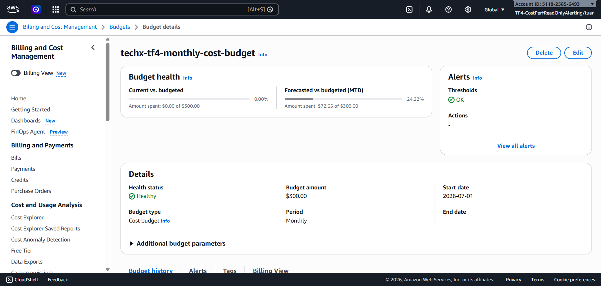
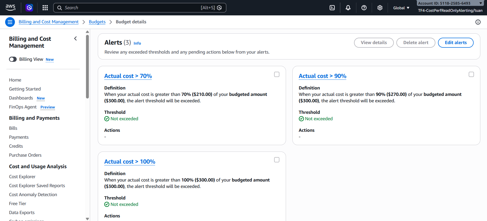
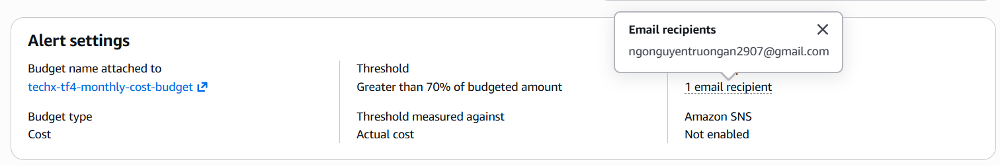

# COST-03: AWS Budget Cost Guardrail

## 1. Mục tiêu task

Task này dùng để ghi nhận evidence cho implementation **AWS Budget cost guardrail** trong Terraform infra.

Mục tiêu chính:

- Tạo AWS Budget ở tầng Infrastructure as Code.
- Thiết lập monthly cost guardrail cho account/project TF4.
- Cho phép cấu hình email nhận cảnh báo budget qua Terraform variable / GitHub Secret.
- Tạo các ngưỡng cảnh báo cost theo phần trăm budget.
- Đưa budget vào CI/terraform apply workflow để kiểm tra và deploy cùng hạ tầng.
- Chuẩn bị evidence để gắn Jira cho EPIC-04: Cost Optimization.

---

## 2. Commit reference

| Item | Value |
|---|---|
| Commit | `16be00f8e4d57db17eff75617c1b7be5bf0b2eb2` |
| Short commit | `16be00f` |
| Commit message | `feat(infra, cost, cdo04): add AWS Budget cost guardrails to Terraform infra (#28)` |
| Author | `Nguyen Thanh Vinh <128946325+pho-veteran@users.noreply.github.com>` |
| Date | `2026-07-09 08:52:37 +0700` |
| Epic | EPIC-04 Cost Optimization |
| Evidence file | `docs/evidence/epic-04-cost-optimization/03-aws-budget-cost-guardrail.md` |

Changed files trong commit:

| File | Evidence purpose |
|---|---|
| `infra/terraform/budgets.tf` | Thêm Terraform resource `aws_budgets_budget.monthly_cost` |
| `infra/terraform/variables.tf` | Thêm biến cấu hình budget limit và notification emails |
| `infra/terraform/outputs.tf` | Xuất output budget name và monthly limit |
| `.github/workflows/ci.yaml` | Truyền budget notification emails vào `terraform plan` |
| `.github/workflows/terraform-apply.yaml` | Truyền budget notification emails vào `terraform apply` |

---

## 3. Phạm vi task

Task này tập trung vào **cost guardrail implementation**, chưa phải actual billing report từ Cost Explorer.

Phạm vi đã cover:

- Terraform AWS Budget resource.
- Monthly cost budget limit.
- Email notification subscriber list.
- Budget threshold notifications ở các mức 70%, 90%, 100%.
- Terraform variable validation cho budget limit.
- Terraform variable validation cho email format.
- Terraform outputs để reviewer/operator kiểm tra resource sau apply.
- GitHub Actions integration cho plan/apply.

Ngoài phạm vi của task này:

- Cost Explorer actual cost analysis.
- Budget action tự động stop/scale resource.
- CloudWatch alarm riêng cho cost anomaly.
- Xác nhận email subscription delivery trong inbox (đã có screenshot cấu hình, chưa xác nhận delivery).

---

## 4. Implementation Summary

Terraform đã bổ sung resource:

```hcl
resource "aws_budgets_budget" "monthly_cost" {
  name         = "techx-tf4-monthly-cost-budget"
  budget_type  = "COST"
  limit_amount = var.budget_monthly_limit
  limit_unit   = "USD"
  time_unit    = "MONTHLY"

  dynamic "notification" {
    for_each = length(var.budget_notification_emails) > 0 ? toset([70, 90, 100]) : []

    content {
      comparison_operator        = "GREATER_THAN"
      notification_type          = "ACTUAL"
      subscriber_email_addresses = var.budget_notification_emails
      threshold                  = notification.value
      threshold_type             = "PERCENTAGE"
    }
  }

  tags = var.tags
}
```

Ý nghĩa implementation:

1. Budget type là `COST`, dùng để guardrail theo chi phí AWS.
2. Budget chạy theo chu kỳ `MONTHLY`.
3. Limit amount lấy từ `var.budget_monthly_limit` để không hard-code trong resource logic.
4. Notification chỉ được tạo khi `budget_notification_emails` có ít nhất một email.
5. Threshold cảnh báo được tạo động ở 3 mức: `70`, `90`, `100` phần trăm.
6. Notification type là `ACTUAL`, nghĩa là cảnh báo dựa trên actual spend, không phải forecast.
7. Resource dùng common `tags` để giữ ownership metadata của project.

---

## 5. Guardrail Configuration

| Guardrail item | Current implementation | Evidence |
|---|---|---|
| Budget resource | `aws_budgets_budget.monthly_cost` | `infra/terraform/budgets.tf` |
| Budget name | `techx-tf4-monthly-cost-budget` | `name` field trong budget resource |
| Budget type | `COST` | `budget_type = "COST"` |
| Budget period | Monthly | `time_unit = "MONTHLY"` |
| Currency | USD | `limit_unit = "USD"` |
| Budget limit source | Terraform variable | `limit_amount = var.budget_monthly_limit` |
| Default limit | `300` | `variables.tf` default |
| Notification thresholds | 70%, 90%, 100% | Dynamic notification loop |
| Notification basis | Actual cost | `notification_type = "ACTUAL"` |
| Notification condition | Actual cost greater than threshold | `comparison_operator = "GREATER_THAN"` |
| Subscriber source | Terraform variable / GitHub Secret | `budget_notification_emails` / `TF_VAR_budget_notification_emails` |

---

## 6. Terraform Variables

### 6.1. `budget_monthly_limit`

```hcl
variable "budget_monthly_limit" {
  description = "Monthly AWS cost budget limit in USD"
  type        = string
  default     = "300"

  validation {
    condition     = try(tonumber(var.budget_monthly_limit), 0) > 0
    error_message = "budget_monthly_limit must be a positive number represented as a string."
  }
}
```

Evidence:

- Budget limit được expose thành variable.
- Default hiện tại là `300` USD / tháng.
- Validation bắt buộc giá trị phải chuyển được sang số và lớn hơn 0.

### 6.2. `budget_notification_emails`

```hcl
variable "budget_notification_emails" {
  description = "Email addresses that receive AWS Budget threshold notifications"
  type        = list(string)
  default     = []

  validation {
    condition     = alltrue([for email in var.budget_notification_emails : can(regex("^[^@\\s]+@[^@\\s]+[.][^@\\s]+$", email))])
    error_message = "Each budget_notification_emails entry must be a valid email address."
  }
}
```

Evidence:

- Notification emails được cấu hình bằng list string.
- Default là empty list để tránh hard-code email cá nhân trong repo.
- Regex validation giúp tránh apply nhầm email không hợp lệ.
- Khi list rỗng, Terraform không tạo notification block.

---

## 7. Terraform Outputs

Terraform đã bổ sung output để operator/reviewer dễ kiểm tra budget sau apply:

```hcl
output "budget_name" {
  description = "Name of the AWS Budget for monthly cost guardrails"
  value       = aws_budgets_budget.monthly_cost.name
}

output "budget_monthly_limit" {
  description = "Monthly AWS Budget limit in USD"
  value       = var.budget_monthly_limit
}
```

| Output | Purpose |
|---|---|
| `budget_name` | Xác nhận tên AWS Budget được tạo từ Terraform |
| `budget_monthly_limit` | Xác nhận limit đang được deploy |

---

## 8. GitHub Actions Integration

### 8.1. CI Terraform plan

Trong `.github/workflows/ci.yaml`, job `terraform-infra-plan` truyền biến email từ GitHub Secret:

```yaml
- name: Terraform plan
  env:
    TF_VAR_budget_notification_emails: ${{ secrets.TF_BUDGET_NOTIFICATION_EMAILS }}
  run: terraform plan -lock=false -input=false -no-color -out=tfplan
```

Ý nghĩa:

- Pull request có thay đổi trong `infra/terraform/**` sẽ chạy Terraform plan.
- Notification email không được hard-code vào source code.
- Secret `TF_BUDGET_NOTIFICATION_EMAILS` được map sang Terraform variable `budget_notification_emails`.

### 8.2. Main branch Terraform apply

Trong `.github/workflows/terraform-apply.yaml`, job `infra-apply` cũng truyền cùng biến email khi apply:

```yaml
- name: Terraform apply
  env:
    TF_VAR_budget_notification_emails: ${{ secrets.TF_BUDGET_NOTIFICATION_EMAILS }}
  run: terraform apply -input=false -auto-approve
```

Ý nghĩa:

- Khi commit Terraform được merge/push vào `main`, workflow apply có thể deploy AWS Budget cùng hạ tầng.
- Cấu hình email notification vẫn đến từ GitHub Secret.
- Sau apply, workflow chạy `terraform output` để in ra output, gồm budget name và monthly limit.

---

## 9. Evidence Mapping theo Jira Acceptance Criteria

| Acceptance Criteria | Status | Evidence |
|---|---|---|
| Có cost guardrail ở IaC | Done | `aws_budgets_budget.monthly_cost` trong `infra/terraform/budgets.tf` |
| Budget limit có thể cấu hình | Done | `var.budget_monthly_limit` trong `variables.tf` |
| Có validation cho budget limit | Done | `try(tonumber(...), 0) > 0` |
| Có cảnh báo khi cost tăng | Done | Notification thresholds `70`, `90`, `100` |
| Có thể gửi cảnh báo tới email | Done | `budget_notification_emails` |
| Không hard-code email cá nhân trong repo | Done | Email lấy từ GitHub Secret `TF_BUDGET_NOTIFICATION_EMAILS` |
| CI plan kiểm tra Terraform change | Done | `.github/workflows/ci.yaml` chạy `terraform plan` |
| Main apply deploy budget | Done | `.github/workflows/terraform-apply.yaml` chạy `terraform apply` |
| Có output để verify sau apply | Done | `budget_name`, `budget_monthly_limit` |

---

## 10. Cost Guardrail Behavior

Khi `budget_notification_emails` được cấu hình, AWS Budget sẽ gửi cảnh báo theo logic sau:

| Threshold | Trigger condition | Meaning |
|---:|---|---|
| 70% | Actual monthly cost > 70% budget limit | Early warning để team kiểm tra burn rate |
| 90% | Actual monthly cost > 90% budget limit | Warning gần chạm budget |
| 100% | Actual monthly cost > 100% budget limit | Budget exceeded / cần action ngay |

Với default `budget_monthly_limit = "300"`, threshold tương ứng là:

| Threshold | USD amount |
|---:|---:|
| 70% | `$210` |
| 90% | `$270` |
| 100% | `$300` |

Lưu ý: Budget hiện tại là **monthly budget**. Nếu Jira/business target đang dùng `$300/week`, cần quyết định rõ một trong hai cách:

1. Giữ monthly budget `$300/month` như guardrail chặt hơn baseline estimate.
2. Hoặc đổi `budget_monthly_limit` theo monthly equivalent của weekly target.

---

## 11. Security & Governance Notes

| Topic | Implementation | Assessment |
|---|---|---|
| Secret handling | Email recipients lấy từ GitHub Secret | Tốt, không hard-code PII/email trong repo |
| IaC control | Budget nằm trong Terraform | Tốt, có review qua PR và apply pipeline |
| Validation | Validate budget limit và email format | Giảm lỗi cấu hình trước apply |
| Tagging | `tags = var.tags` | Giữ owner/team/project metadata |
| Notification scope | Chỉ tạo notification nếu email list không rỗng | Tránh resource config lỗi khi chưa có email |
| Automation | Chưa có Budget Action tự động | Phù hợp giai đoạn guardrail/cảnh báo, chưa tự động dừng tài nguyên |

---

## 12. Runtime Validation Commands

Sau khi Terraform apply thành công, có thể validate bằng các lệnh sau.

### 12.1. Kiểm tra Terraform output

```bash
cd infra/terraform
terraform output budget_name
terraform output budget_monthly_limit
```

Expected:

```txt
budget_name = techx-tf4-monthly-cost-budget
budget_monthly_limit = 300
```

### 12.2. Kiểm tra AWS Budget qua AWS CLI

```bash
aws budgets describe-budget \
  --account-id <aws-account-id> \
  --budget-name techx-tf4-monthly-cost-budget \
  --query "Budget.[BudgetName,BudgetType,TimeUnit,BudgetLimit.Amount,BudgetLimit.Unit]" \
  --output table
```

Expected:

```txt
techx-tf4-monthly-cost-budget | COST | MONTHLY | 300 | USD
```

### 12.3. Kiểm tra budget notifications

```bash
aws budgets describe-notifications-for-budget \
  --account-id <aws-account-id> \
  --budget-name techx-tf4-monthly-cost-budget \
  --query "Notifications[*].[NotificationType,ComparisonOperator,Threshold,ThresholdType]" \
  --output table
```

Expected:

```txt
ACTUAL | GREATER_THAN | 70  | PERCENTAGE
ACTUAL | GREATER_THAN | 90  | PERCENTAGE
ACTUAL | GREATER_THAN | 100 | PERCENTAGE
```

### 12.4. Kiểm tra subscribers

```bash
aws budgets describe-subscribers-for-notification \
  --account-id <aws-account-id> \
  --budget-name techx-tf4-monthly-cost-budget \
  --notification NotificationType=ACTUAL,ComparisonOperator=GREATER_THAN,Threshold=70,ThresholdType=PERCENTAGE \
  --output table
```

Expected:

```txt
SubscriberType = EMAIL
Address        = <configured notification email>
```

---

## 13. Runtime Screenshots (AWS Console)

Screenshot được chụp từ AWS Billing and Cost Management console sau khi budget được deploy thành công qua Terraform.

### 13.1. Budget amount



Screenshot xác nhận budget `techx-tf4-monthly-cost-budget` với:
- Budget type: COST
- Time unit: MONTHLY
- Limit amount: 300 USD

### 13.2. Budget alert thresholds



Screenshot xác nhận 3 ngưỡng cảnh báo đã được cấu hình:
- 70% — Actual cost > $210
- 90% — Actual cost > $270
- 100% — Actual cost > $300

### 13.3. Budget email recipients



Screenshot xác nhận notification subscribers đã được gắn:
- Subscriber type: EMAIL
- Các email nhận alert được cấu hình từ `TF_BUDGET_NOTIFICATION_EMAILS` GitHub Secret

---

## 14. Validation Status

| Validation item | Status | Notes |
|---|---|---|
| Repo-level implementation review | Done | Resource, variables, outputs, workflow integration đã có trong commit `16be00f` |
| Terraform format/validate in CI | Covered by workflow | `terraform fmt -check -recursive` và `terraform validate` có trong CI/apply workflow |
| Terraform plan | Covered by workflow | PR infra change chạy `terraform plan` |
| Terraform apply | Covered by workflow | Push vào `main` chạy `terraform apply` nếu có Terraform changes |
| AWS Budget console screenshot | Done | Screenshot budget amount, thresholds, và email recipients (xem section 13) |
| AWS CLI runtime check | Pending / manual | Cần chạy sau khi apply trên AWS account |
| Email delivery confirmation | Pending / manual | Cần xác nhận notification email đã nhận được trong inbox (screenshot cấu hình đã có ở section 13.3) |

---

## 15. Risks and Follow-up Actions

| Risk ID | Risk | Impact | Mitigation / Follow-up |
|---|---|---|---|
| COST-GUARD-01 | `budget_notification_emails` để rỗng thì không có notification | Budget vẫn tồn tại nhưng không gửi alert | Set GitHub Secret `TF_BUDGET_NOTIFICATION_EMAILS` trước khi apply |
| COST-GUARD-02 | Default budget là `$300/month`, khác với một số tài liệu baseline `$300/week` | Có thể gây hiểu nhầm khi report Jira | Ghi rõ monthly budget; nếu cần weekly-equivalent thì update variable value |
| COST-GUARD-03 | Notification type là `ACTUAL`, không cảnh báo forecast trước khi spend xảy ra | Alert có thể đến sau khi cost đã tăng | Cân nhắc thêm `FORECASTED` notification ở iteration sau |
| COST-GUARD-04 | Chưa có Budget Action tự động | Guardrail hiện tại chỉ cảnh báo, không tự động chặn cost | Phù hợp giai đoạn Phase 3; cân nhắc automated action khi policy rõ ràng |
| COST-GUARD-05 | Email delivery chưa được validate trong evidence này | Có thể chưa nhận được alert nếu subscriber/email config sai | Chạy AWS CLI validation và chụp screenshot AWS Budget console sau apply |

---

## 16. Definition of Done

| DoD item | Status | Evidence |
|---|---|---|
| AWS Budget được định nghĩa bằng Terraform | Done | `infra/terraform/budgets.tf` |
| Monthly budget limit được parameterize | Done | `var.budget_monthly_limit` |
| Email notifications được parameterize | Done | `var.budget_notification_emails` |
| Có threshold 70/90/100 | Done | Dynamic notification block |
| Terraform plan/apply nhận secret email | Done | CI và terraform-apply workflows |
| Có outputs để verify | Done | `budget_name`, `budget_monthly_limit` |
| Evidence markdown cho Jira | Done | File này |
| Runtime screenshots (AWS Console) | Done | Section 13: budget amount, thresholds, email recipients |

---

## 17. Jira Evidence Comment

Có thể dùng comment sau để paste vào Jira:

```txt
Implemented AWS Budget cost guardrail in Terraform for EPIC-04 Cost Optimization.

Evidence:
- Commit: 16be00f8e4d57db17eff75617c1b7be5bf0b2eb2
- Terraform resource: infra/terraform/budgets.tf
- Budget name: techx-tf4-monthly-cost-budget
- Budget type: COST
- Time unit: MONTHLY
- Default limit: 300 USD/month via var.budget_monthly_limit
- Notifications: ACTUAL cost thresholds at 70%, 90%, 100%
- Notification subscribers: configurable via var.budget_notification_emails
- Secret integration: GitHub Actions passes TF_VAR_budget_notification_emails from secrets.TF_BUDGET_NOTIFICATION_EMAILS during terraform plan/apply
- Outputs added: budget_name and budget_monthly_limit

This provides an IaC-managed cost guardrail and alerting baseline. Runtime AWS CLI / console validation should be attached after terraform apply confirms the budget exists in the AWS account.
```

---

## 18. Evidence Location

Evidence của task này được lưu tại:

```txt
docs/evidence/epic-04-cost-optimization/03-aws-budget-cost-guardrail.md
```

Related evidence:

```txt
docs/evidence/epic-04-cost-optimization/01-baseline-cost-estimate.md
docs/evidence/epic-04-cost-optimization/02-single-nat-tradeoff.md
docs/evidence/epic-04-cost-optimization/03-aws-budget-cost-guardrail.md
```

Runtime screenshots:

```txt
docs/evidence/epic-04-cost-optimization/runtime/screenshots/budget-amount.png
docs/evidence/epic-04-cost-optimization/runtime/screenshots/budget-threshold.png
docs/evidence/epic-04-cost-optimization/runtime/screenshots/budget-email-recipients.png
```
