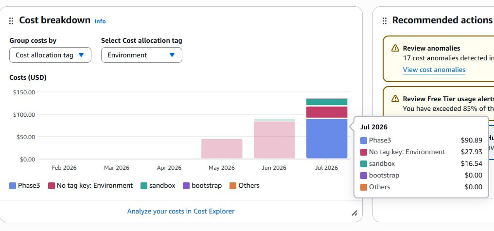
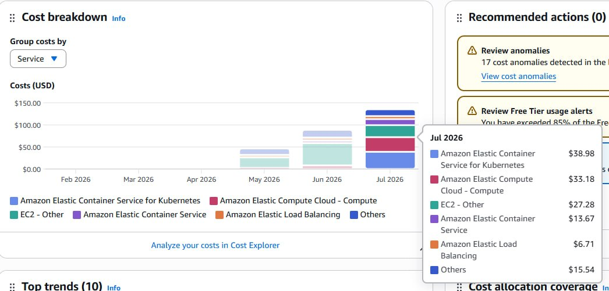

# COST-04: Cost Explorer Baseline sau khi Deploy

Ngày capture: 2026-07-15

## 1. Mục tiêu task

Ghi nhận Cost Explorer baseline sau khi deploy để:

- Capture cost breakdown theo allocation tag và AWS service.
- Tính daily burn rate từ dữ liệu July 2026 month-to-date (MTD) đang có.
- So sánh có điều kiện với baseline estimate của COST-01.
- Xác định các cost item cần Cost Explorer chi tiết hoặc full-month settled bill để đối soát tiếp.

---

## 2. Phạm vi và nguồn dữ liệu

| Hạng mục | Giá trị |
|---|---|
| Nguồn | AWS Billing and Cost Management - Cost breakdown |
| Ngày capture | 2026-07-15 |
| Kỳ dữ liệu hiển thị | July 2026 MTD |
| Cách grouping 1 | Cost allocation tag: `Environment` |
| Cách grouping 2 | AWS service |
| Tài liệu baseline estimate | `01-baseline-cost-estimate.md` |
| Tài liệu budget guardrail | `03-aws-budget-cost-guardrail.md` |

Đây là snapshot MTD từ Cost Explorer, không phải full-month settled bill. Screenshot không hiển thị date range chi tiết, usage type, charge type hoặc daily time series nên chưa thể phân bổ đầy đủ chi phí của từng resource hoặc usage-based charge.

---

## 3. Cost Explorer Breakdown

### 3.1. Cost theo allocation tag

| `Environment` allocation tag | Chi phí (USD) |
|---|---:|
| `Phase3` | `$90.89` |
| No tag key: `Environment` | `$27.93` |
| `sandbox` | `$16.54` |
| `bootstrap` | `$0.00` |
| Others | `$0.00` |
| **Tổng hiển thị** | **`$135.36`** |



Nhận định:

- `Phase3` là nhóm chi phí lớn nhất trong view theo `Environment` tag.
- `$27.93` chưa có `Environment` tag, do đó chưa thể gán cho `Phase3` hoặc `sandbox` từ evidence hiện có.
- `sandbox` được hiển thị riêng, nên không tự động gộp vào EKS/`Phase3` baseline.

### 3.2. Cost theo AWS service

| AWS service | Chi phí (USD) |
|---|---:|
| Amazon Elastic Container Service for Kubernetes | `$38.98` |
| Amazon Elastic Compute Cloud - Compute | `$33.18` |
| EC2 - Other | `$27.28` |
| Amazon Elastic Container Service | `$13.67` |
| Amazon Elastic Load Balancing | `$6.71` |
| Others | `$15.54` |
| **Tổng hiển thị** | **`$135.35`** |



Tổng `$135.35` chênh `$0.01` so với view theo allocation tag do display rounding trên các screenshot được cung cấp.

---

## 4. Daily Burn Rate

Do screenshot được capture ngày 2026-07-15 và chỉ hiển thị MTD total, daily burn rate được tính như sau:

```txt
$135.36 / 15 calendar days = $9.02/day
```

Đây là **MTD daily average để tham khảo**, không phải daily-cost screenshot và cũng không phải measured burn rate riêng cho một tuần pilot.

Ước tính 30 ngày để tham chiếu:

```txt
$9.02/day x 30 days = $270.72/month
```

Ước tính này chỉ quy đổi snapshot MTD theo 30 ngày; không phải AWS forecast và không thay thế actual full-month billing data.

---

## 5. So sánh Estimate và Actual Cost

COST-01 ghi nhận fixed baseline estimate là `$246.95/month` cho EKS control plane, 2 EC2 worker nodes, EBS root volumes, NAT Gateway hourly và ALB hourly. Terraform guardrail trong COST-03 là `$300/month`.

| Hạng mục so sánh | Giá trị | Đánh giá |
|---|---:|---|
| COST-01 fixed baseline estimate | `$246.95/month` | Estimate, chưa gồm usage-based charges như NAT data processing, ALB LCU, log ingestion và data transfer |
| Cost Explorer visible July MTD total | `$135.36` | Actual snapshot của toàn bộ allocation-tag category hiển thị |
| July MTD daily average | `$9.02/day` | `$135.36 / 15` calendar days |
| Ước tính 30 ngày để tham chiếu | `$270.72/month` | MTD average x 30; không phải AWS forecast |
| Terraform monthly budget | `$300.00/month` | Guardrail hiện tại từ `budget_monthly_limit = "300"` |
| Indicative budget headroom | `$29.28/month` | `$300.00 - $270.72`; cần full-month confirmation |

### 5.1. Giới hạn khi so sánh theo từng thành phần

| COST-01 cost item | Cost Explorer evidence hiện có | Trạng thái |
|---|---|---|
| EKS control plane | Amazon Elastic Container Service for Kubernetes: `$38.98` MTD | Hiển thị dưới dạng service aggregate; cần full-month reconciliation |
| EC2 worker nodes | EC2 - Compute: `$33.18` MTD | Hiển thị dưới dạng service aggregate; chưa thể chứng minh chỉ gồm worker nodes |
| EBS root volumes | Không hiển thị riêng | Cần Cost Explorer grouping/filter chi tiết |
| NAT Gateway hourly/data processing | Không hiển thị riêng | Cần Cost Explorer grouping/filter chi tiết |
| ALB hourly/LCU | Elastic Load Balancing: `$6.71` MTD | Hiển thị dưới dạng service aggregate; chưa tách được base hourly và LCU |
| CloudWatch, ECR, data transfer | Có thể nằm trong `Others` hoặc aggregate khác | Cần Cost Explorer grouping/filter chi tiết |

---

## 6. Ghi chú đối soát và giới hạn dữ liệu

1. View theo allocation tag và view theo service là hai grouping dimension khác nhau. Chỉ có thể so sánh ở tổng chi phí hiển thị; không được map trực tiếp từng tag với từng service.
2. `$27.93` không có `Environment` tag cần được review tag hygiene trước khi gán ownership.
3. Chi phí `sandbox` `$16.54` đang được hiển thị riêng; cần giữ tách khỏi `Phase3` baseline cho đến khi xác nhận ownership/scope.
4. `EC2 - Other` là aggregate service category trong screenshot. Evidence này không thể chứng minh nhóm đó có gồm EBS, NAT Gateway, networking hay EC2-related charge nào khác.
5. Service view được cung cấp không có dòng NAT Gateway riêng, vì vậy chưa thể validate NAT Gateway estimate của COST-01 từ evidence này.
6. Screenshot không hiển thị ALB LCU, NAT data processing, CloudWatch ingestion, ECR storage hoặc data-transfer usage. Các mục này cần detailed filter, Cost and Usage Report hoặc full-month Cost Explorer export.
7. MTD projection đang thấp hơn `$300/month` guardrail, nhưng cần settled full-month report trước khi kết luận tháng đó nằm trong budget.

---

## 7. Jira Subtask Evidence Checklist

| Jira subtask | Trạng thái | Evidence |
|---|---|---|
| COST-04.1 - Capture Cost Explorer service breakdown | Hoàn thành | Mục 3.2 và `runtime/screenshots/cost-breakdown-by-services.jpg` |
| COST-04.2 - Capture daily burn rate | Hoàn thành một phần | Mục 4 tính July MTD average; vẫn cần daily time-series screenshot |
| COST-04.3 - Compare actual cost with estimate | Hoàn thành có điều kiện | Mục 5; component-level reconciliation vẫn đang chờ dữ liệu chi tiết |
| COST-04.4 - Summarize Cost Explorer baseline | Hoàn thành | Tài liệu này |

---

## 8. Follow-up

1. Capture Cost Explorer daily-cost time series để thay thế MTD-average proxy.
2. Capture full July 2026 settled billing report sau khi kỳ billing kết thúc.
3. Filter/group Cost Explorer để isolate NAT Gateway, EBS, ALB LCU, CloudWatch, ECR và data transfer.
4. Review resource không có `Environment` allocation tag và bổ sung tag khi phù hợp.
5. Reconcile chi phí riêng cho `Phase3` sau khi xác nhận cost scope của `sandbox` và resource chưa có tag.

---

## 9. Jira Evidence Comment

```txt
EVIDENCE UPDATE - C0G-13 / COST-04

Đã capture Cost Explorer baseline sau deploy (ngày capture: 2026-07-15):

- Cost theo Environment allocation tag:
  - Phase3: $90.89
  - No tag key: Environment: $27.93
  - sandbox: $16.54
  - Tổng hiển thị: $135.36

- Cost theo AWS service:
  - Amazon Elastic Container Service for Kubernetes: $38.98
  - EC2 - Compute: $33.18
  - EC2 - Other: $27.28
  - Amazon Elastic Container Service: $13.67
  - Elastic Load Balancing: $6.71
  - Others: $15.54
  - Tổng hiển thị: $135.35 (chênh $0.01 do display rounding trên screenshot)

Daily burn rate tạm tính từ July MTD: $135.36 / 15 calendar days = $9.02/day.
Ước tính 30 ngày để tham chiếu: $270.72/month.

So sánh có điều kiện:
- COST-01 fixed baseline estimate: $246.95/month.
- Terraform AWS Budget guardrail: $300/month.
- Snapshot MTD hiện thấp hơn guardrail theo projection, nhưng chưa thể kết luận full-month actual vì đây chưa phải settled bill.

Giới hạn và follow-up:
- Chưa có daily time-series screenshot; daily burn rate hiện là MTD average.
- Chưa isolate được NAT Gateway, EBS, ALB LCU, CloudWatch, ECR và data transfer từ aggregate service view.
- $27.93 chưa có Environment tag; sandbox $16.54 được giữ tách khỏi Phase3 baseline.
- Cần capture full July settled report và detailed Cost Explorer filter để đối soát component-level.

Evidence:
- docs/evidence/epic-04-cost-optimization/04-cost-explorer-baseline.md
- docs/evidence/epic-04-cost-optimization/runtime/screenshots/cost-breakdown-by-allocation-tags.jpg
- docs/evidence/epic-04-cost-optimization/runtime/screenshots/cost-breakdown-by-services.jpg
```

---

## 10. Evidence Location

- `docs/evidence/epic-04-cost-optimization/04-cost-explorer-baseline.md`
- `docs/evidence/epic-04-cost-optimization/runtime/screenshots/cost-breakdown-by-allocation-tags.jpg`
- `docs/evidence/epic-04-cost-optimization/runtime/screenshots/cost-breakdown-by-services.jpg`
- `docs/evidence/epic-04-cost-optimization/01-baseline-cost-estimate.md`
- `docs/evidence/epic-04-cost-optimization/03-aws-budget-cost-guardrail.md`
