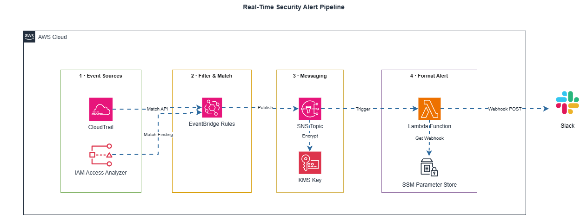

# Alert Flow Diagram

Dưới đây là sơ đồ kiến trúc thể hiện đường đi của dữ liệu từ khi sự kiện nguy hiểm xảy ra cho đến khi hệ thống phát cảnh báo tới người vận hành.

## Các thành phần chính
1. **CloudTrail:** Bắt mọi API calls (bao gồm Management Events và Data Events cho Secrets Manager).
2. **EventBridge (Rule: `security-alerts-cloudtrail`):** Hoạt động như một bộ lọc siêu tốc, chỉ chặn lại những events có trong danh sách đen (Event Catalog).
3. **SNS (`audit-security-alerts`):** Đóng vai trò làm router trung gian, giúp dễ dàng mở rộng thêm kênh cảnh báo (VD: Email, PagerDuty) về sau.
4. **Lambda (`audit-security-slack-alerts`):** Xử lý logic nghiệp vụ (tính time-to-detect, giảm nhiễu) và trang trí tin nhắn cho dễ đọc.
5. **Slack Webhook:** Kênh nhận tin nhắn trực tiếp của đội bảo mật.
