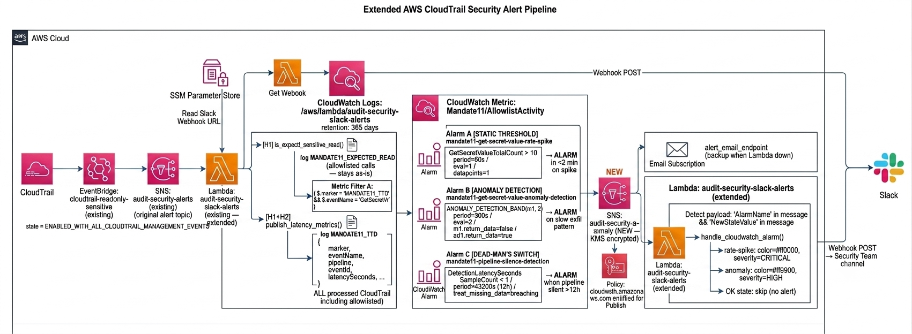

# H2 Anomaly Detection — Giám sát Tần suất Bất thường (Rate Limiting)

| | |
|---|---|
| **Ngày lập** | 2026-07-23 |
| **Người lập** | CDO07 — Hoàng Kim Hùng |
| **Trạng thái** | Implemented — chờ deploy và evidence runtime sau `terraform apply` |
| **Branch** | `cdo07/fix/anomaly-detection` |
| **Commits** | `93da98b` · `ef4bb03` · `69aa440` |
| **Account AWS** | `511825856493` |
| **Region** | `us-east-1` |

---


## 1. Bối cảnh và Lỗ hổng cần vá (Why)

### Vấn đề với Static Allowlist (H1)

Hệ thống H1 đã implement Static Allowlist lọc các Identity hợp lệ:

| Role được allowlist | API được phép | Resource |
|---|---|---|
| `external-secrets-techx-tf4-cluster` | `GetSecretValue` | prefix `techx/tf4/*` |
| `techx-tf4-postgresql-dms-secrets-access` (session: `dms-session-for-replication-engine`) | `GetSecretValue` | `techx/tf4/dms-postgres-source*`, `techx/tf4/rds-postgres*` |
| `kafka.amazonaws.com` (MSK service) | `GetSecretValue` | `AmazonMSK_*` |
| `karpenter-controller-techx-tf4-cluster` | `GetParameter` | prefix `/aws/service/eks/optimized-ami/*` |
| `SecuritySlackAlertsLambdaRole` | `GetParameter` | chỉ `/security-alerts/slack-webhook-url` |
| `tf4-github-actions-terraform-apply/plan` | `GetParameter` | chỉ `/security-alerts/slack-webhook-url` |

**Lỗ hổng:** Nếu kẻ tấn công đánh cắp credential của `external-secrets-techx-tf4-cluster` và dùng nó để gọi `GetSecretValue` ồ ạt bên ngoài cluster, **H1 sẽ im lặng hoàn toàn** vì role và resource đều khớp allowlist.

```
Hacker lấy token ESO
      ↓
Gọi GetSecretValue 100 lần/phút với token đó
      ↓
EventBridge bắt → Lambda xử lý → is_expected_sensitive_read() → TRUE
      ↓
Log MANDATE11_EXPECTED_READ → DROP → Không có Slack alert ← LỖ HỔNG
```

### Giải pháp H2

Giám sát **tần suất** thay vì chỉ giám sát **identity**. ESO hợp lệ chỉ đọc secret theo chu kỳ đều đặn (~5 phút/lần). Hacker sẽ quét hàng chục secret liên tục trong vài giây.

> **Nguyên tắc:** Allowlist vẫn giữ nguyên để tránh nhiễu. H2 đặt thêm một lớp giám sát song song — nếu tần suất vượt ngưỡng dù từ role hợp lệ, cũng phải alert.

---

## 2. Kiến trúc Pipeline H2



### Lý do thiết kế

**Tại sao dùng Lambda log (`MANDATE11_TTD`) làm source, không phải CloudTrail trực tiếp?**

EventBridge đã filter và push GetSecretValue events vào Lambda rồi. Log group `/aws/lambda/audit-security-slack-alerts` tồn tại sẵn với 365 ngày retention. `MANDATE11_TTD` được ghi cho **mọi** event được xử lý (kể cả allowlisted) — không cần thêm rule hay log group mới, tận dụng 100% infra hiện có.

**Tại sao tách SNS topic `anomaly_alerts` riêng?**

CloudWatch Alarm cần principal `cloudwatch.amazonaws.com` được phép Publish. Topic cũ `audit-security-alerts` chỉ cho phép `events.amazonaws.com`. Tách topic tránh sửa policy cũ và tránh loop: Lambda nhận alarm → Lambda gửi Slack → không loop vì Lambda không publish lại vào SNS.

**Tại sao cần cả Alarm A (static) lẫn Alarm B (anomaly)?**

| | Alarm A Static Threshold | Alarm B Anomaly Detection |
|---|---|---|
| Phát hiện | Spike ồ ạt (>10 calls/60s) | Pattern bất thường tinh vi (slow exfil) |
| Thời gian alert | <2 phút (pass DoD test) | 10 phút+ (cần 2 evaluation periods) |
| False positive | Thấp — threshold rõ ràng | Cao trong 14 ngày đầu học baseline |
| Bắt attacker | Brute-force exfil | Stealthy exfil trải dài nhiều phút |

---

## 3. Chi tiết Implementation

### 3.1. Metric Filter A — GetSecretValueTotalCount

```hcl
resource "aws_cloudwatch_log_metric_filter" "get_secret_value_total" {
  name           = "mandate11-get-secret-value-total"
  log_group_name = aws_cloudwatch_log_group.lambda_log_group.name
  pattern        = "{ $.marker = \"MANDATE11_TTD\" && $.eventName = \"GetSecretValue\" }"

  metric_transformation {
    namespace     = "Mandate11/AllowlistActivity"
    name          = "GetSecretValueTotalCount"
    value         = "1"
    default_value = "0"
    unit          = "Count"
  }
}
```

**Tại sao `MANDATE11_TTD` và không phải marker khác?**
`MANDATE11_TTD` được log sau khi `PutMetricData` thành công — tức là Lambda đã nhận và xử lý event thật. Nó có field `eventName` nên có thể filter chính xác `GetSecretValue`. Log JSON format:

```json
{
  "marker": "MANDATE11_TTD",
  "namespace": "Mandate11/DetectionLatency",
  "metricName": "DetectionLatencySeconds",
  "pipeline": "CloudTrailToSlack",
  "eventId": "abc-123",
  "eventName": "GetSecretValue",
  "eventTime": "2026-07-23T10:00:00Z",
  "observedAt": "2026-07-23T10:00:02.500Z",
  "latencySeconds": 2.5
}
```

### 3.2. Metric Filter B — ExpectedReadCount

```hcl
resource "aws_cloudwatch_log_metric_filter" "expected_read_count" {
  name           = "mandate11-expected-read-activity"
  log_group_name = aws_cloudwatch_log_group.lambda_log_group.name
  pattern        = "{ $.marker = \"MANDATE11_EXPECTED_READ\" }"

  metric_transformation {
    namespace     = "Mandate11/AllowlistActivity"
    name          = "ExpectedReadCount"
    value         = "1"
    default_value = "0"
    unit          = "Count"
  }
}
```

Metric này dùng làm **noise baseline** — nếu muốn tính `SuspiciousReadCount = GetSecretValueTotalCount - ExpectedReadCount` trong tương lai. Hiện tại chưa có Alarm trên metric này.

### 3.3. Alarm A — Static Threshold (>10 calls/60s)

```hcl
resource "aws_cloudwatch_metric_alarm" "get_secret_value_spike" {
  alarm_name          = "mandate11-get-secret-value-rate-spike"
  comparison_operator = "GreaterThanThreshold"
  evaluation_periods  = 1
  datapoints_to_alarm = 1
  metric_name         = "GetSecretValueTotalCount"
  namespace           = "Mandate11/AllowlistActivity"
  period              = 60
  statistic           = "Sum"
  threshold           = 10
  treat_missing_data  = "notBreaching"
  alarm_actions       = [aws_sns_topic.anomaly_alerts.arn]
  ok_actions          = [aws_sns_topic.anomaly_alerts.arn]
}
```

**Timeline khi chạy test DoD (15 secrets/1 phút):**

```
T+0s   Bash script bắt đầu gọi GetSecretValue liên tục với EKS role
T+0s   EventBridge bắt → SNS → Lambda → log MANDATE11_TTD x15
T+0s   Metric Filter A đếm GetSecretValueTotalCount += 1 mỗi call
T+60s  CloudWatch đóng evaluation window: thấy Sum=15 > threshold=10
T+62s  Alarm A state: OK → ALARM → Publish anomaly_alerts SNS
T+63s  Lambda invoke từ anomaly_to_lambda subscription
T+63s  handle_cloudwatch_alarm() detect AlarmName → gửi Slack
T+68s  Slack hiển thị alert đỏ 🚨 CRITICAL   ← < 2 phút ✅
```

### 3.4. Alarm B — Anomaly Detection (ML Band)

```hcl
resource "aws_cloudwatch_metric_alarm" "get_secret_value_anomaly" {
  alarm_name          = "mandate11-get-secret-value-anomaly-detection"
  comparison_operator = "GreaterThanUpperThreshold"
  evaluation_periods  = 2
  threshold_metric_id = "ad1"
  treat_missing_data  = "notBreaching"

  metric_query {
    id          = "m1"
    return_data = false  # raw metric — input only

    metric {
      metric_name = "GetSecretValueTotalCount"
      namespace   = "Mandate11/AllowlistActivity"
      period      = 300
      stat        = "Sum"
    }
  }

  metric_query {
    id          = "ad1"
    expression  = "ANOMALY_DETECTION_BAND(m1, 2)"
    label       = "GetSecretValueTotalCount (predicted band)"
    return_data = true  # exactly ONE query must be true
  }
}
```

> **Lưu ý quan trọng về `return_data`:** AWS CloudWatch API yêu cầu đúng 1 `metric_query` có `return_data = true` trong Anomaly Detection alarm. Query đó phải là band expression (`ad1`). Nếu set `m1.return_data = true`, AWS trả về `ValidationError` khi apply. Bug này đã được phát hiện và fix trong commit `ef4bb03`/`69aa440`.

**Tham số band:**
- `ANOMALY_DETECTION_BAND(m1, 2)` — 2 standard deviations
- Model học baseline từ 14 ngày data trở đi
- Trong 14 ngày đầu sau deploy: `treat_missing_data = "notBreaching"` để tránh false positive
- Sau 14 ngày: review alarm history, nếu nhiễu nhiều thì tăng lên `ANOMALY_DETECTION_BAND(m1, 3)`

### 3.5. Alarm C — Dead-man's Switch (Pipeline Silence)

```hcl
resource "aws_cloudwatch_metric_alarm" "pipeline_silence" {
  alarm_name          = "mandate11-pipeline-silence-detection"
  comparison_operator = "LessThanThreshold"
  evaluation_periods  = 1
  metric_name         = "DetectionLatencySeconds"
  namespace           = var.detection_metric_namespace  # Mandate11/DetectionLatency
  period              = 43200  # 12 giờ
  statistic           = "SampleCount"
  threshold           = 1
  treat_missing_data  = "breaching"
}
```

**Scenarios bị bắt:**

| Scenario | Tại sao alarm kêu |
|---|---|
| EventBridge rules bị disable | Không có event nào qua Lambda → không có MANDATE11_TTD → SampleCount = 0 |
| Lambda bị throttle/crash loop | Lambda không chạy được → không publish metric |
| CloudTrail bị StopLogging | Không có event CloudTrail → không qua EventBridge → không qua Lambda |
| Network isolation | Lambda không gọi được CloudWatch PutMetricData |

`treat_missing_data = "breaching"` là cố ý — im lặng = vấn đề.

### 3.6. Lambda Handler Extension — `handle_cloudwatch_alarm()`

Function mới trong `handler.py` để xử lý CloudWatch Alarm SNS payload:

```python
def handle_cloudwatch_alarm(message, context):
    alarm_name = message.get('AlarmName', 'UnknownAlarm')
    new_state  = message.get('NewStateValue', 'UNKNOWN')

    # Chỉ alert khi chuyển sang ALARM, bỏ qua OK / INSUFFICIENT_DATA
    if new_state != 'ALARM':
        return

    # Phân loại severity theo tên alarm
    is_spike_alarm = 'rate-spike' in alarm_name
    color          = "#ff0000" if is_spike_alarm else "#ff9900"   # đỏ vs cam
    severity_label = "CRITICAL" if is_spike_alarm else "HIGH"

    # Build Slack Block Kit message và gửi webhook
    ...
```

**Routing trong `lambda_handler()`:**

```python
# Detect CloudWatch Alarm payload (khác hoàn toàn với CloudTrail event)
if 'AlarmName' in message and 'NewStateValue' in message:
    handle_cloudwatch_alarm(message, context)
    continue
# Else: xử lý như CloudTrail/AccessAnalyzer event bình thường (H1 flow)
```

Slack message format cho H2 alarm:

| Field | Nội dung |
|---|---|
| Header | `🚨 MANDATE-11 H2 Anomaly Alarm: {alarm_name}` |
| Severity | `CRITICAL` (spike) hoặc `HIGH` (anomaly) |
| State | `ALARM` |
| Time | Timestamp +07 |
| Account / Region | AWS account + region |
| Alarm name | Tên alarm đầy đủ |
| Description | Mô tả từ `alarm_description` |
| Reason | `NewStateReason` từ CloudWatch |
| Action | Link CloudTrail + link Runbook |

---

## 4. IAM — Quyền bổ sung cho Plan Role

File `security-alerting-plan-role-supplement.tf` bổ sung permissions để `terraform plan` không bị AccessDenied khi refresh state H2 resources:

```hcl
statement {
  sid = "ReadSecurityAlertingCloudWatchState"
  actions = [
    "cloudwatch:DescribeAlarms",
    "cloudwatch:DescribeAlarmsForMetric",
    "cloudwatch:DescribeAnomalyDetectors",
    "cloudwatch:GetMetricStatistics",
    "cloudwatch:ListTagsForResource",
    "logs:DescribeMetricFilters",
  ]
  resources = ["*"]
}
```

SNS `audit-security-alerts-anomaly` cũng được thêm vào `ReadSecurityAlertingSnsState` statement.

---

## 5. Terraform Resources Summary

| Resource (Terraform) | Tên AWS | Loại |
|---|---|---|
| `aws_cloudwatch_log_metric_filter.get_secret_value_total` | `mandate11-get-secret-value-total` | Metric Filter |
| `aws_cloudwatch_log_metric_filter.expected_read_count` | `mandate11-expected-read-activity` | Metric Filter |
| `aws_sns_topic.anomaly_alerts` | `audit-security-alerts-anomaly` | SNS Topic |
| `aws_sns_topic_policy.anomaly_alerts_policy` | — | SNS Policy |
| `aws_sns_topic_subscription.anomaly_email` | — | SNS Subscription (email) |
| `aws_sns_topic_subscription.anomaly_to_lambda` | — | SNS Subscription (lambda) |
| `aws_lambda_permission.anomaly_sns_invoke` | `AllowAnomalySNSInvoke` | Lambda Permission |
| `aws_cloudwatch_metric_alarm.get_secret_value_spike` | `mandate11-get-secret-value-rate-spike` | CW Alarm (Static) |
| `aws_cloudwatch_metric_alarm.get_secret_value_anomaly` | `mandate11-get-secret-value-anomaly-detection` | CW Alarm (ML) |
| `aws_cloudwatch_metric_alarm.pipeline_silence` | `mandate11-pipeline-silence-detection` | CW Alarm (Dead-man's) |

**Namespace mới:** `Mandate11/AllowlistActivity`
**Metric mới:** `GetSecretValueTotalCount`, `ExpectedReadCount`

---

## 6. Test Coverage

19/19 tests pass (4 tests mới cho H2):

| Test | Scenario | Kết quả |
|---|---|---|
| `test_cloudwatch_alarm_in_alarm_state_sends_red_slack_alert` | Spike alarm ALARM state → Slack đỏ `#ff0000`, severity=CRITICAL | ✅ PASS |
| `test_cloudwatch_alarm_ok_state_does_not_alert` | Alarm về OK state → không gửi Slack | ✅ PASS |
| `test_cloudwatch_anomaly_alarm_sends_orange_slack_alert` | Anomaly alarm ALARM state → Slack cam `#ff9900`, severity=HIGH | ✅ PASS |
| `test_cloudwatch_alarm_does_not_interfere_with_cloudtrail_events` | Batch hỗn hợp (alarm + CloudTrail) → cả 2 được xử lý độc lập, 2 Slack calls | ✅ PASS |

---

## 7. Definition of Done — Checklist

| # | Tiêu chí | Trạng thái |
|---|---|---|
| 1 | `aws_cloudwatch_log_metric_filter` đếm `GetSecretValue` đã implement | ✅ Done |
| 2 | `aws_cloudwatch_metric_alarm` Anomaly Detection (ML band) đã implement | ✅ Done |
| 3 | `aws_cloudwatch_metric_alarm` Static Threshold (>10/60s) đã implement | ✅ Done |
| 4 | Alarm kết nối SNS → Lambda → Slack | ✅ Done |
| 5 | Lambda handle được CloudWatch Alarm payload | ✅ Done |
| 6 | 19/19 unit tests pass | ✅ Done |
| 7 | `terraform fmt -check` pass | ✅ Done |
| 8 | Code merge vào branch `cdo07/fix/anomaly-detection` | ✅ Done |
| 9 | **Test runtime:** bash script 15 GetSecretValue/1 phút → Slack alert trong <2 phút | ⏳ Pending deploy |
| 10 | **Evidence:** Ảnh Slack alarm đỏ từ test thực tế | ⏳ Pending deploy |
| 11 | **Anomaly baseline:** Model học đủ 14 ngày, alarm sensitivity review | ⏳ Pending 14 ngày |

---

## 8. Hướng dẫn Vận hành sau Deploy

### Verify sau `terraform apply`

```bash
# 1. Xác nhận MANDATE11_TTD log đang xuất hiện
aws logs filter-log-events \
  --log-group-name /aws/lambda/audit-security-slack-alerts \
  --filter-pattern "{ $.marker = \"MANDATE11_TTD\" && $.eventName = \"GetSecretValue\" }" \
  --region us-east-1 \
  --profile TF4-AuditReadOnlyAndAnalyze-511825856493

# 2. Xác nhận Metric Filter đang tạo data points
aws cloudwatch get-metric-statistics \
  --namespace Mandate11/AllowlistActivity \
  --metric-name GetSecretValueTotalCount \
  --start-time $(date -u -d '1 hour ago' +%Y-%m-%dT%H:%M:%SZ) \
  --end-time $(date -u +%Y-%m-%dT%H:%M:%SZ) \
  --period 300 \
  --statistics Sum \
  --region us-east-1
```

### Test DoD (chạy bởi Security Engineer)

```bash
# Chạy 15 GetSecretValue calls liên tiếp trong vòng 1 phút
for i in $(seq 1 15); do
  aws secretsmanager get-secret-value \
    --secret-id techx/tf4/test-secret-does-not-exist \
    --region us-east-1 \
    --profile <EKS-role-profile> 2>/dev/null || true
  sleep 2
done
# Kỳ vọng: Slack nhận alert đỏ "MANDATE-11 H2 Anomaly Alarm" trong <2 phút
```

### Tuning Anomaly Band (sau 14 ngày)

Nếu Alarm B false positive quá nhiều, tăng band từ 2 → 3:

```hcl
# cloudwatch-alarms.tf
expression = "ANOMALY_DETECTION_BAND(m1, 3)"  # tăng từ 2 lên 3
```

---

## 9. Chi phí ước tính

| Resource | Chi phí AWS |
|---|---|
| 2 × CloudWatch Metric Filter | $0 (included với log ingestion) |
| 2 × Custom Metrics (`GetSecretValueTotalCount`, `ExpectedReadCount`) | $0.30/tháng |
| 3 × CloudWatch Alarms (Static + Anomaly + Dead-man's) | $0.10/alarm/tháng = $0.30/tháng |
| 1 × SNS Topic + subscriptions | ~$0.01/tháng |
| **Tổng** | **~$0.61/tháng** |

---

## 10. Liên kết

| Tài liệu | Link |
|---|---|
| Terraform module | `infra/terraform/modules/security-slack-alerts/cloudwatch-alarms.tf` |
| Lambda handler | `infra/terraform/modules/security-slack-alerts/lambda_src/handler.py` |
| Unit tests | `infra/terraform/modules/security-slack-alerts/tests/test_handler.py` |
| Acceptance report (H1) | [`acceptance-report.md`](./acceptance-report.md) |
| Alert flow diagram (H1) | [`alert-flow-diagram.md`](./alert-flow-diagram.md) |
| Incident runbook | `docs/audit/runbooks/mandate-11-incident-response.md` |
| ADR-018 (H1 architecture decision) | `docs/audit/adr/018-realtime-security-alerting-eventbridge-lambda.md` |
