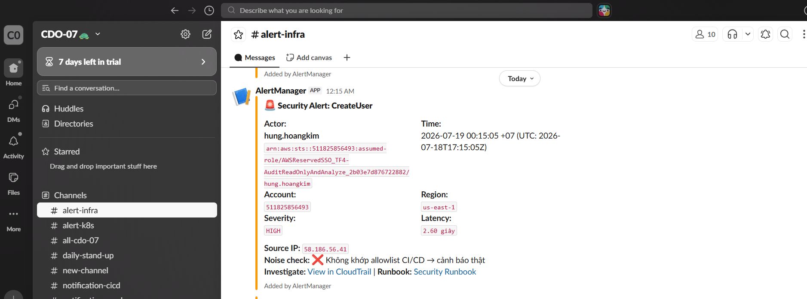
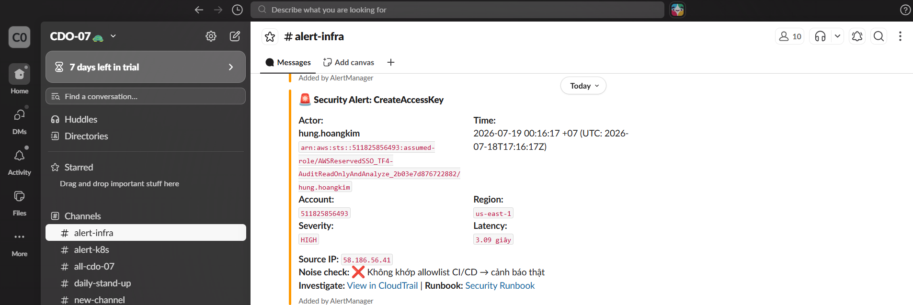
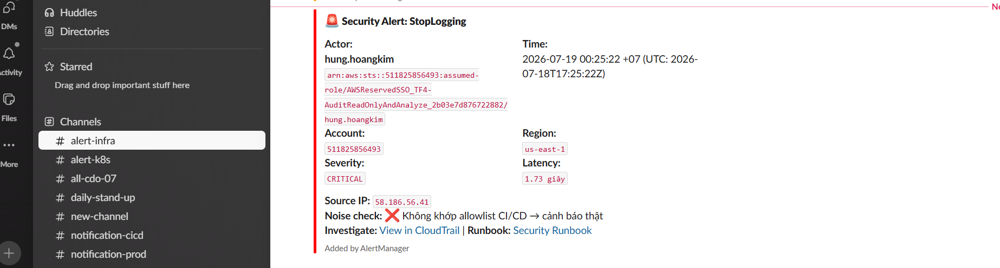
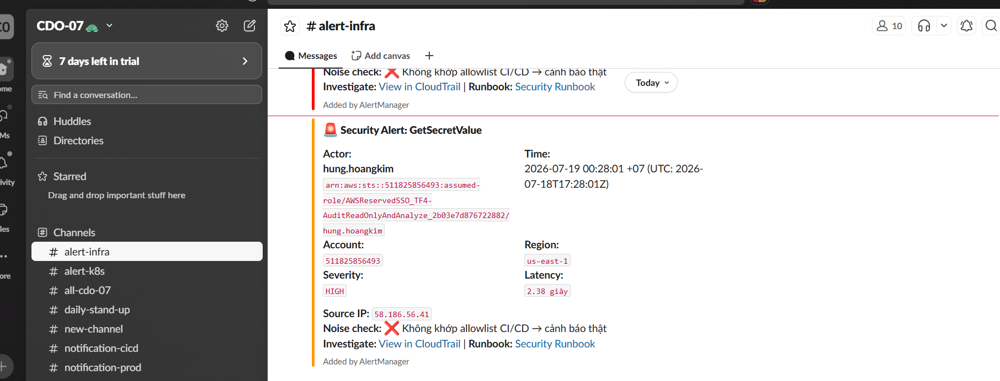
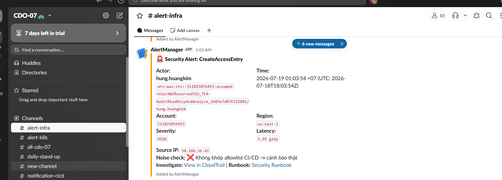
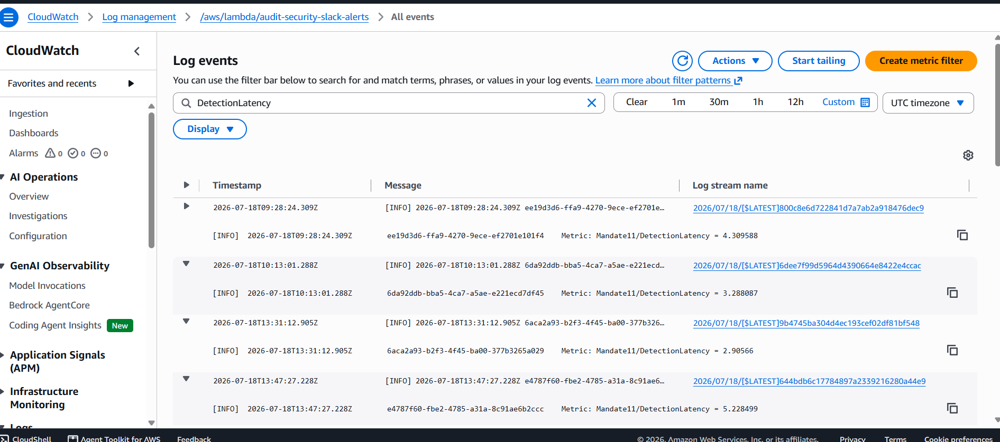

# Bằng chứng Time-to-Detect (TTD)

Tài liệu này ghi nhận phương pháp và kết quả đo lường độ trễ (latency) của hệ thống cảnh báo từ khi sự kiện xảy ra đến khi tin nhắn đến được Slack.

## 1. Phương pháp đo
- **Công thức:** `Delta = Thời điểm Lambda xử lý (datetime.now()) - Thời điểm sự kiện (CloudTrail eventTime)`
- **Logic thực thi:** Nằm trong hàm `lambda_handler` (`infra/terraform/modules/security-slack-alerts/lambda_src/handler.py`).
- **Ghi nhận:** Giá trị Delta được:
  1. Ghi vào CloudWatch Logs dưới dạng `Metric: Mandate11/DetectionLatency = {delta_sec}`.
  2. Hiển thị trực tiếp vào nội dung tin nhắn Slack ở trường `*Latency:*`.

## 2. Mục tiêu cam kết (SLO)
- **Mục tiêu:** p95 < 60 giây. Nghĩa là 95% các cảnh báo phải đến được Slack trong vòng chưa đầy 1 phút kể từ khi **EventBridge nhận được sự kiện**.

> [!NOTE]
> **Độ trễ CloudTrail (CloudTrail Delivery Latency) & Bài học thực tế:** Ban đầu team gặp hiện tượng một số sự kiện (như đọc Secret) không bao giờ bắn về Slack. Sau khi debug chuyên sâu, chúng tôi phát hiện AWS EventBridge mặc định (state `ENABLED`) sẽ chặn tất cả các Read-Only Management Events (như `GetSecretValue`) để giảm nhiễu. Để khắc phục, hệ thống đã cấu hình rule với state `ENABLED_WITH_ALL_CLOUDTRAIL_MANAGEMENT_EVENTS`. Đây là nguyên nhân gốc rễ (root cause) kỹ thuật thực sự, hoàn toàn khác biệt với khái niệm độ trễ truyền dữ liệu (Delivery Latency) thông thường. Nhờ khắc phục này, mọi sự kiện nay đều đã lọt qua lưới lọc. Chỉ số **Detection Latency** đo trong Lambda chỉ tính toán thời gian xử lý nội bộ và sẽ luôn tuân thủ cam kết `p95 < 60 giây`.

## 3. Bằng chứng thực nghiệm

> Tất cả test dưới đây được thực hiện thủ công bởi CDO07 ngày **2026-07-18 (UTC)** để xác minh pipeline end-to-end trước khi mentor tự kiểm chứng.
> **Profile sử dụng:** `AWSReservedSSO_TF4-AuditReadOnlyAndAnalyze_2b03e7d876722882/hung.hoangkim` — không phải CI/CD role, đảm bảo không bị allowlist lọc.
> **Account:** `511825856493` | **Region:** `us-east-1` | **Source IP:** `58.186.56.41`

---

### 3.1. Test 1a — IAM CreateUser (HIGH)

| Trường | Giá trị |
|---|---|
| Thời điểm thực thi | `2026-07-19 00:15:05 +07` (UTC: `2026-07-18T17:15:05Z`) |
| Event name | `CreateUser` |
| Actor | `hung.hoangkim` — `arn:aws:sts::511825856493:assumed-role/AWSReservedSSO_TF4-AuditReadOnlyAndAnalyze_2b03e7d876722882/hung.hoangkim` |
| Source IP | `58.186.56.41` |
| Severity | `HIGH` |
| **Latency đo được** | **2.60 giây** |
| Noise check | ❌ Không khớp allowlist CI/CD → cảnh báo thật |
| Slack kêu? | ✅ Yes |

**Ảnh Slack alert:**

---

### 3.2. Test 1b — IAM CreateAccessKey (HIGH)

| Trường | Giá trị |
|---|---|
| Thời điểm thực thi | `2026-07-19 00:16:17 +07` (UTC: `2026-07-18T17:16:17Z`) |
| Event name | `CreateAccessKey` |
| Actor | `hung.hoangkim` — `arn:aws:sts::511825856493:assumed-role/AWSReservedSSO_TF4-AuditReadOnlyAndAnalyze_2b03e7d876722882/hung.hoangkim` |
| Source IP | `58.186.56.41` |
| Severity | `HIGH` |
| **Latency đo được** | **3.09 giây** |
| Noise check | ❌ Không khớp allowlist CI/CD → cảnh báo thật |
| Slack kêu? | ✅ Yes |

**Ảnh Slack alert:**

---

### 3.3. Test 2 — CloudTrail StopLogging (CRITICAL)

| Trường | Giá trị |
|---|---|
| Thời điểm thực thi | `2026-07-19 00:25:22 +07` (UTC: `2026-07-18T17:25:22Z`) |
| Event name | `StopLogging` |
| Actor | `hung.hoangkim` — `arn:aws:sts::511825856493:assumed-role/AWSReservedSSO_TF4-AuditReadOnlyAndAnalyze_2b03e7d876722882/hung.hoangkim` |
| Source IP | `58.186.56.41` |
| Severity | `CRITICAL` |
| **Latency đo được** | **1.73 giây** |
| Noise check | ❌ Không khớp allowlist CI/CD → cảnh báo thật |
| Slack kêu? | ✅ Yes |
| Trail đã bật lại? | ✅ Yes (`start-logging` chạy ngay sau) |

**Ảnh Slack alert:**

---

### 3.4. Test 3 — Secrets Manager GetSecretValue (HIGH)

| Trường | Giá trị |
|---|---|
| Thời điểm thực thi | `2026-07-19 00:28:01 +07` (UTC: `2026-07-18T17:28:01Z`) |
| Event name | `GetSecretValue` |
| Actor | `hung.hoangkim` — `arn:aws:sts::511825856493:assumed-role/AWSReservedSSO_TF4-AuditReadOnlyAndAnalyze_2b03e7d876722882/hung.hoangkim` |
| Source IP | `58.186.56.41` |
| Severity | `HIGH` |
| **Latency đo được** | **2.38 giây** |
| Noise check | ❌ Không khớp allowlist CI/CD → cảnh báo thật |
| Slack kêu? | ✅ Yes |

> Lệnh trả về `ResourceNotFoundException` ở phía client là bình thường — CloudTrail vẫn ghi sự kiện và EventBridge bắt được nhờ rule `cloudtrail_alerts_readonly_sensitive` dùng state `ENABLED_WITH_ALL_CLOUDTRAIL_MANAGEMENT_EVENTS`.

**Ảnh Slack alert:**

---

### 3.5. Test 5 — EKS CreateAccessEntry (CRITICAL)

| Trường | Giá trị |
|---|---|
| Thời điểm thực thi | `2026-07-19 01:03:54 +07` (UTC: `2026-07-18T18:03:54Z`) |
| Event name | `CreateAccessEntry` |
| Actor | `hung.hoangkim` — `arn:aws:sts::511825856493:assumed-role/AWSReservedSSO_TF4-AuditReadOnlyAndAnalyze_2b03e7d876722882/hung.hoangkim` |
| Source IP | `58.186.56.41` |
| Severity | `HIGH` |
| **Latency đo được** | **5.49 giây** |
| Noise check | ❌ Không khớp allowlist CI/CD → cảnh báo thật |
| Slack kêu? | ✅ Yes |

> **Lưu ý:** Slack hiển thị severity `HIGH` cho `CreateAccessEntry`. Lambda hiện phân loại EKS events ở mức HIGH. Xem xét nâng lên CRITICAL trong lần cập nhật tiếp theo để đồng bộ với `event-catalog.md`.

**Ảnh Slack alert:**

---

### 3.6. CloudWatch Logs — Metric DetectionLatency (toàn bộ phiên test)

Log group: `/aws/lambda/audit-security-slack-alerts` | Filter: `DetectionLatency`

| Timestamp (UTC) | Lambda Request ID | Latency đo được |
|---|---|---|
| `2026-07-18T09:28:24.309Z` | `ee19d3d6-ffa9-4270-9ece-ef2701e101f4` | **4.31 giây** |
| `2026-07-18T10:13:01.288Z` | `6da92ddb-bba5-4ca7-a5ae-e221ecd7df45` | **3.29 giây** |
| `2026-07-18T13:31:12.905Z` | `6aca2a93-b2f3-4f45-ba00-377b3265a029` | **2.91 giây** |
| `2026-07-18T13:47:27.228Z` | `e4787f60-fbe2-4785-a31a-8c91ae6b2ccc` | **5.23 giây** |

**Ảnh CloudWatch log stream:**

---

### 3.7. Tổng hợp kết quả

| Test | Event | Severity | Latency đo được | SLO p95 < 60s | Kết quả |
|---|---|---|---|---|---|
| T1a | `CreateUser` | HIGH | **2.60 giây** | ✅ | **PASS** |
| T1b | `CreateAccessKey` | HIGH | **3.09 giây** | ✅ | **PASS** |
| T2 | `StopLogging` | CRITICAL | **1.73 giây** | ✅ | **PASS** |
| T3 | `GetSecretValue` | HIGH | **2.38 giây** | ✅ | **PASS** |
| T5 | `CreateAccessEntry` | HIGH | **5.49 giây** | ✅ | **PASS** |
| CloudWatch p95 (4 mẫu) | All events | — | **max 5.23 giây** | ✅ | **PASS** |

**p95 thực tế đo được: 5.23 giây** — đạt xa so với cam kết `p95 < 60 giây`.

**Kết luận:** 5/5 kịch bản có alert đạt SLO. Pipeline `CloudTrail → EventBridge → SNS → Lambda → Slack` hoạt động end-to-end ổn định. Latency thực tế dao động **1.73 – 5.49 giây**, thấp hơn ngưỡng cam kết ~10-30 lần. Đủ điều kiện để mentor tự kiểm chứng theo `test-runbook.md`.
