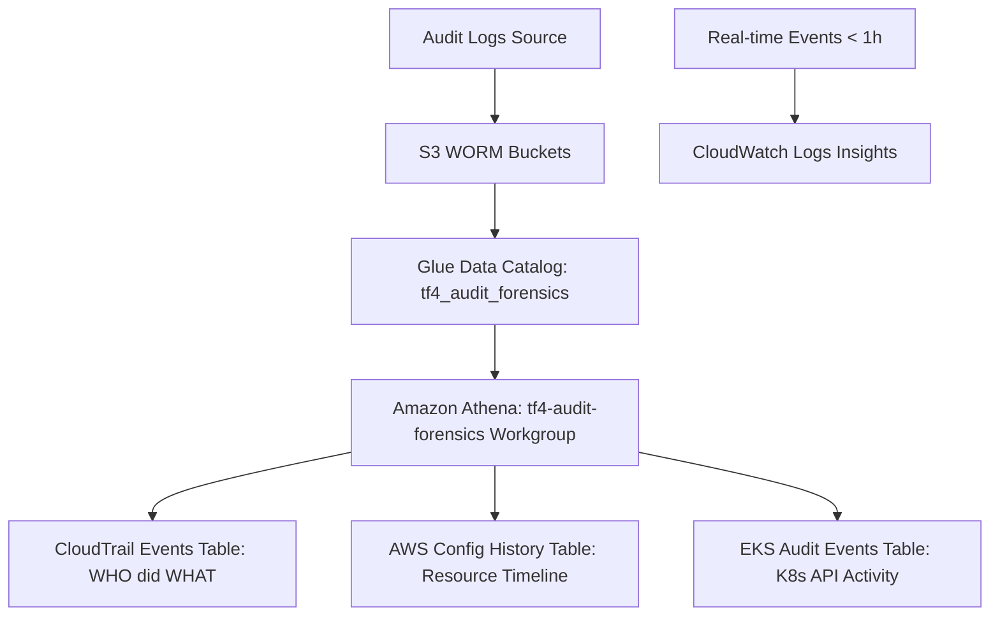

# BÁO CÁO TRIỂN KHAI VÀ CHI PHÍ ATHENA FORENSIC SECURITY ANALYTICS (MANDATE-04)

> **Mã công việc:** Ref: AUDIT-015 / MANDATE-04  
> **Chủ sở hữu:** Nhóm CDO07 (Audit)  
> **File cấu hình hạ tầng:** [infra/terraform/athena-forensics.tf](file:///d:/AWS/Ethena/tf4-phase3-repo/infra/terraform/athena-forensics.tf)  
> **File outputs:** [infra/terraform/outputs.tf](file:///d:/AWS/Ethena/tf4-phase3-repo/infra/terraform/outputs.tf)  
> **Ticket phân quyền:** [docs/audit/tickets/AUDIT-017-request-athena-forensic-permissions.md](file:///d:/AWS/Ethena/tf4-phase3-repo/docs/audit/tickets/AUDIT-017-request-athena-forensic-permissions.md)  

---

## 1. Danh mục các tài nguyên được triển khai (What is Deployed)

Hệ thống Athena Forensic Security Analytics được định nghĩa hoàn toàn bằng IaC trong file `infra/terraform/athena-forensics.tf`, bao gồm các thành phần:

### 1.1 Glue Data Catalog Database
- **`aws_glue_catalog_database.audit_forensics`**: Tên database `tf4_audit_forensics`. Quản lý toàn bộ thông tin metadata (schema, partition structure) của 3 nguồn audit logs.

### 1.2 S3 Bucket Lưu trữ Kết quả Truy vấn (Query Output)
- **`aws_s3_bucket.athena_results`**: Tên bucket `tf4-athena-query-results-${account_id}`.
- **Bảo mật**: Khóa mã hóa Server-Side Encryption (AES256), bật toàn bộ `aws_s3_bucket_public_access_block` (chặn truy cập public).
- **Tối ưu bộ nhớ**: Cấu hình `aws_s3_bucket_lifecycle_configuration` tự động xóa (expire) kết quả query sau **7 ngày**.

### 1.3 Athena Workgroup
- **`aws_athena_workgroup.audit_forensics`**: Workgroup tên `tf4-audit-forensics`.
- **Cấu hình bắt buộc (Enforced)**: Ép buộc tất cả query xuất kết quả về `s3://${athena_results}/results/` có bật mã hóa SSE_S3.
- **Chống vọt chi phí**: Cài đặt `bytes_scanned_cutoff_per_query = 10737418240` (10 GB/query), đảm bảo đủ hạn mức truy vấn EKS logs mà không bị hủy câu lệnh SQL (Canceled).

### 1.4 Glue Catalog Tables (3 Nguồn Logs chính)
1. **`cloudtrail_events`**: 
   - Đọc dữ liệu từ S3 WORM `aws_s3_bucket.cloudtrail_logs`.
   - Cấu hình Partition Projection tự động theo `year/month/day`.
   - Sử dụng `CloudTrailInputFormat` và `JsonSerDe`.
2. **`aws_config_history`**:
   - Đọc dữ liệu lịch sử biến động tài nguyên AWS từ S3 `aws_s3_bucket.config_staging`.
   - Partition Projection tự động theo `year/month/day`.
   - Sử dụng `JsonSerDe` đọc file nén GZIP.
3. **`eks_audit_events`**:
   - Đọc dữ liệu K8s API Server audit logs từ `aws_s3_bucket.eks_audit_logs`.
   - Partition Projection 4 cấp `year/month/day/hour` tương thích 100% với định dạng xuất mặc định của Kinesis Data Firehose (`YYYY/MM/DD/HH`).

### 1.5 IAM Policies (Phân quyền Least Privilege)
1. **`aws_iam_policy.athena_audit_analyst`**: Cấp quyền chạy truy vấn Athena, điều hướng Console UI (Workgroup & Catalog listing), đọc Glue Catalog (`glue:GetDatabases`, `glue:GetTables`...), đọc dữ liệu nguồn tại 3 S3 WORM log buckets và ghi kết quả truy vấn tại S3 results bucket.
2. **`aws_iam_policy.cloudwatch_insights_forensics`**: Cấp quyền hiển thị danh sách Log Groups trên Console và chạy truy vấn CloudWatch Logs Insights real-time.

---

## 2. Mục đích sử dụng (What It Is Used For)

Hệ thống phục vụ **MANDATE-04 / AUDIT-015: Forensic Security Analytics & Incident Reconstruction**, giải quyết 3 bài toán phân tích dấu vết an ninh:

### 2.1 Các kịch bản sử dụng thực tế (Use Cases)
1. **Điều tra vết CloudTrail (`cloudtrail_events`)**:
   - Xác định "AI đã thực hiện thao tác GÌ, KHI NÀO, từ IP NÀO".
   - Ví dụ: Tìm danh tính IAM User/Role đã truy cập lấy `GetSecretValue` từ Secrets Manager hoặc xóa Security Group.
2. **Theo dõi biến động hạ tầng (`aws_config_history`)**:
   - Dựng lại mốc thời gian thay đổi cấu hình tài nguyên (Infrastructure State Evolution).
   - Ví dụ: Xác định chính xác thời điểm một S3 Bucket bị bỏ công cụ mã hóa hoặc Security Group bị mở port `0.0.0.0/0`.
3. **Điều tra sự cố trên Kubernetes Cluster (`eks_audit_events`)**:
   - Phân tích hoạt động K8s API server: kiểm tra các lệnh `exec` vào Pod, thay đổi RBAC Role/RoleBinding, truy cập ServiceAccount token.
4. **Mô hình Forensic Hybrid (CW Insights + Athena)**:
   - **CloudWatch Logs Insights**: Dùng khi cần phản ứng nhanh với sự cố vừa xảy ra (< 1 giờ).
   - **Amazon Athena + S3 WORM**: Dùng để truy vấn chuyên sâu, tổng hợp dữ liệu lịch sử lâu dài bằng SQL tiêu chuẩn với chi phí serverless.

---

## 3. Tính toán và Tối ưu Chi phí (Cost Estimation)

### 3.1 Mô hình tính giá dịch vụ AWS Athena
Amazon Athena áp dụng mô hình chi phí **Pay-Per-Query (Serverless)**:
- **Định phí cố định (Base Fee)**: $0.00 / tháng (không tốn chi phí duy trì cluster hay server).
- **Chi phí truy vấn**: **$5.00 trên mỗi 1 TB (Terabyte)** dữ liệu được Athena quét (scanned).

### 3.2 Các cơ chế tối ưu chi phí đã tích hợp trong Terraform
1. **Partition Projection (Phân vùng thông minh)**:
   - Khi chạy truy vấn SQL chỉ định mốc thời gian (ví dụ: `WHERE year='2026' AND month='07' AND day='22'`), Athena chỉ quét dữ liệu đúng thư mục ngày đó trên S3 thay vì quét toàn bộ bucket.
   - Giúp giảm dung lượng quét từ 90% - 99% (Ví dụ: Một truy vấn chỉ quét 20 MB thay vì 50 GB log).
2. **Workgroup Bytes Scanned Cutoff**:
   - Cài đặt `bytes_scanned_cutoff_per_query = 10GB` tự động chặn các câu lệnh SQL thiếu điều kiện `WHERE` quét toàn bộ bucket. Chi phí tối đa cho 1 query không bao giờ vượt quá **$0.05 USD** (~1.200 VNĐ).
3. **Tự động xóa Query Results sau 7 ngày**:
   - Kết quả SQL lưu trên S3 được tự động dọn dẹp bằng Lifecycle Policy, giữ chi phí lưu trữ kết quả xấp xỉ $0.
4. **Glue Data Catalog**:
   - Miễn phí cho 1.000.000 objects đầu tiên (3 tables của dự án nằm trong hạn mức miễn phí).

### 3.3 Bảng tính toán chi phí hàng tháng ước tính (Monthly Cost Breakdown)

Giả định tần suất sử dụng thực tế của nhóm Audit & Security trong 1 tháng:
- Tần suất điều tra/kiểm tra: **100 queries / tháng**.
- Dung lượng dữ liệu quét trung bình nhờ Partition Projection: **20 MB / query**.

$$\text{Tổng dữ liệu quét/tháng} = 100 \text{ queries} \times 20 \text{ MB} = 2.000 \text{ MB} = 2 \text{ GB} = 0.00195 \text{ TB}$$

| Thành phần tài nguyên | Khối lượng sử dụng | Đơn giá AWS | Chi phí hàng tháng (USD) |
|---|---|---|---|
| **Athena Query Execution** | ~2 GB scanned / tháng | $5.00 / TB scanned | **~$0.01 USD** |
| **S3 Query Output Storage** | ~50 MB kết quả (xoay vòng 7 ngày) | $0.023 / GB | **~$0.001 USD** |
| **Glue Data Catalog** | 3 Tables, ~100 requests/tháng | Miễn phí (Hạn mức 1M) | **$0.00 USD** |
| **Dự phòng (Buffer)** | 10 queries lớn (max 1GB/query) | $5.00 / TB scanned | **~$0.05 USD** |
| **TỔNG CHI PHÍ ƯỚC TÍNH** | | | **~$0.13 USD / tháng** |

---

## 4. Kết luận
Hệ thống Athena Forensic Security Analytics mang lại khả năng điều tra an ninh chuyên sâu trên toàn bộ 3 nguồn log chính với hạ tầng Serverless hoàn toàn tự động, tuân thủ nguyên tắc Least Privilege và duy trì mức chi phí tối ưu trung bình chỉ **~$0.13 USD/tháng**.
