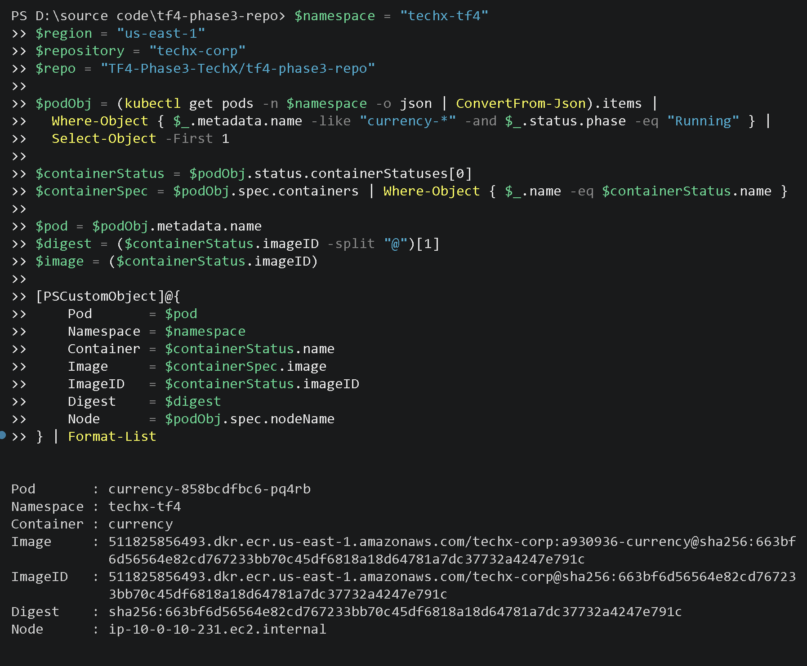
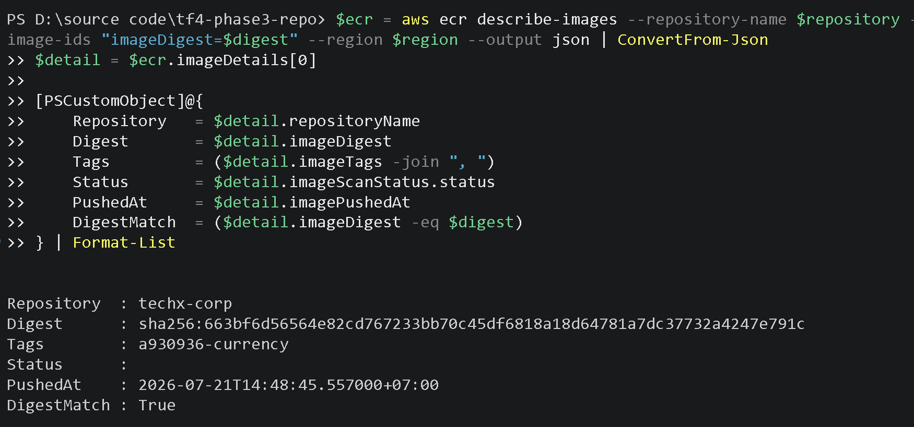
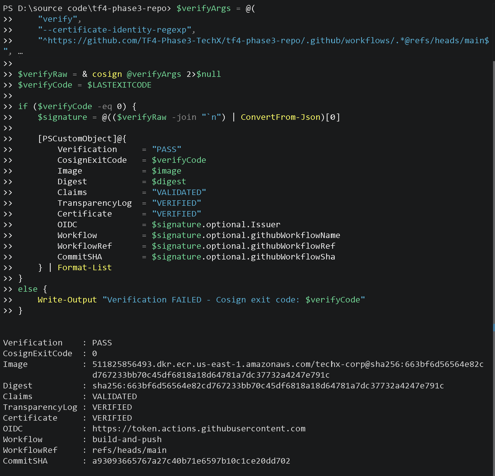
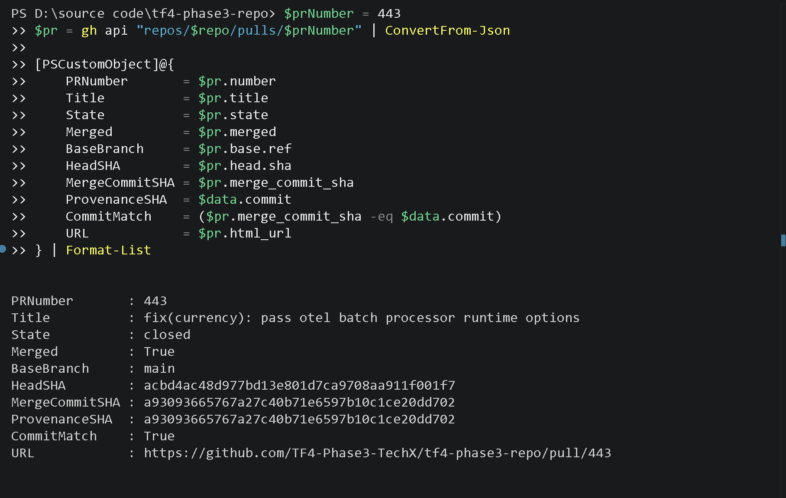
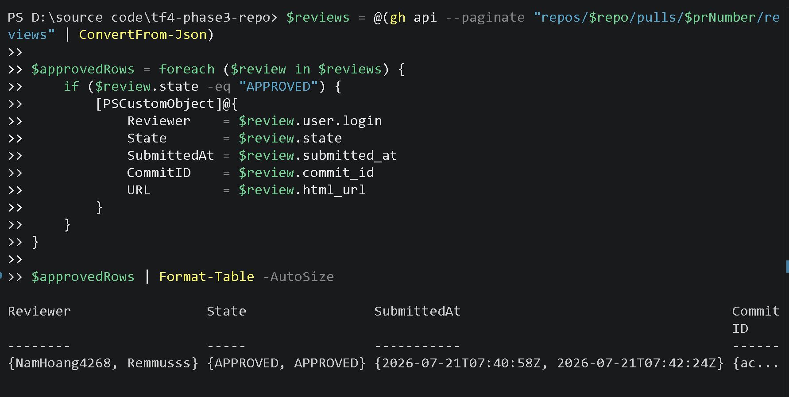
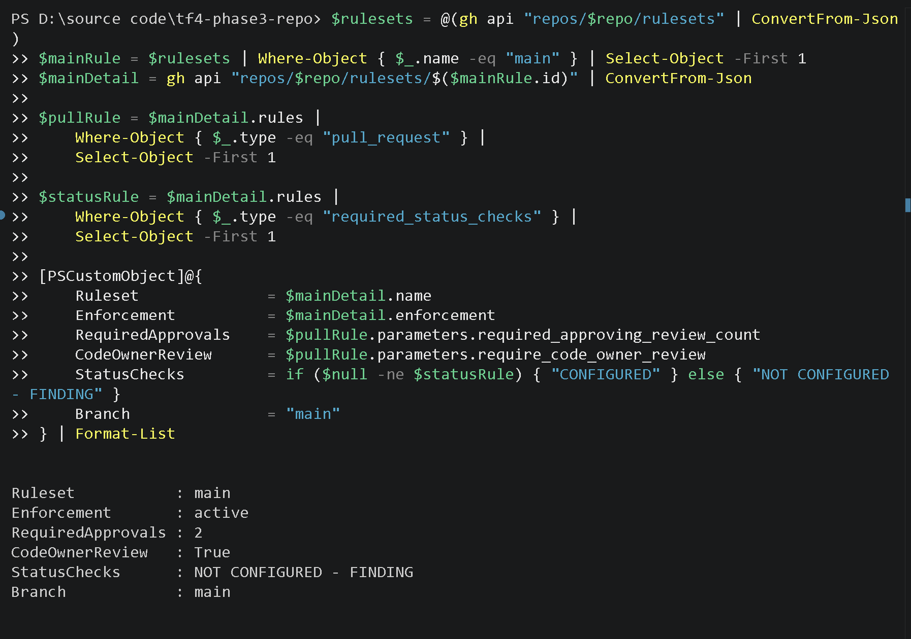

# MANDATE-10 — Báo cáo kiểm toán hợp nhất

**Người phụ trách:** Nguyễn Phú Triệu (CDO-07 Auditability)
**Phạm vi:** Provenance Chain và Human Approval Evidence
**Thời điểm thu thập bằng chứng:** 2026-07-21
**Nhánh nguồn của workload:** `main`

## 1. Phạm vi và phương pháp

Audit thực hiện kiểm tra độc lập, chỉ đọc trên EKS, ECR, Cosign và GitHub API.
Bằng chứng được trình bày theo một chuỗi thống nhất:

```text
Pod
  -> Runtime Image Digest
  -> ECR metadata
  -> Signature / Attestation / SBOM
  -> Workflow / Run / Commit
  -> Pull Request / Approval
  -> Branch protection
```

PR này chỉ bổ sung tài liệu và ảnh bằng chứng. Không thay đổi GitHub Actions,
ECR, Kubernetes, Terraform, workload production hoặc branch protection.

## 2. Kết quả Provenance Chain

| Liên kết | Giá trị quan sát được | Kết quả |
|---|---|---|
| Cluster | `techx-tf4-cluster`, ACTIVE, Kubernetes 1.34 | PASS |
| Pod | `techx-tf4/currency-858bcdfbc6-pq4rb` | PASS |
| Runtime image | `techx-corp:a930936-currency` | PASS |
| Runtime digest | `sha256:663bf6d56564e82cd767233bb70c45df6818a18d64781a7dc37732a4247e791c` | PASS |
| ECR digest | Bằng runtime digest của Pod | PASS |
| Cosign | Exit code `0`, certificate và transparency log hợp lệ | PASS |
| OIDC issuer | `https://token.actions.githubusercontent.com` | PASS |
| Workflow | `build-and-push`, `refs/heads/main` | PASS |
| GitHub Actions run | `29811592226`, conclusion `success` | PASS |
| Provenance commit | `a93093665767a27c40b71e6597b10c1ce20dd702` | PASS |
| SBOM | CycloneDX (`cyclonedx-sbom`) | PASS |
| Vulnerability summary | `0` trong attestation live đã xác minh | PASS |

### Chuỗi Provenance quan sát được

```text
Pod currency
  -> sha256:663bf6d56564e82cd767233bb70c45df6818a18d64781a7dc37732a4247e791c
  -> build-and-push / run 29811592226
  -> commit a93093665767a27c40b71e6597b10c1ce20dd702
  -> signed provenance + CycloneDX SBOM
```







## 3. Kết quả Human Approval Evidence

### 3.1 Đối chiếu commit với Pull Request

| Trường | Giá trị | Kết quả |
|---|---|---|
| Pull Request | `#443` — `fix(currency): pass otel batch processor runtime options` | PASS |
| Trạng thái | `closed`, `merged: true` | PASS |
| Nhánh đích | `main` | PASS |
| Head SHA | `acbd4ac48d977bd13e801d7ca9708aa911f001f7` | INFO |
| Merge commit SHA | `a93093665767a27c40b71e6597b10c1ce20dd702` | PASS |
| Provenance SHA | `a93093665767a27c40b71e6597b10c1ce20dd702` | PASS |
| So khớp commit | `True` | PASS |
| Người merge | `NamHoang4268` | INFO |
| Thời điểm merge | `2026-07-21T07:44:41Z` | INFO |
| PR URL | `https://github.com/TF4-Phase3-TechX/tf4-phase3-repo/pull/443` | PASS |



### 3.2 Người phê duyệt trước khi merge

| Reviewer | Trạng thái | Thời điểm | Commit được review |
|---|---|---|---|
| `NamHoang4268` | `APPROVED` | `2026-07-21T07:40:58Z` | `acbd4ac48d977bd13e801d7ca9708aa911f001f7` |
| `Remmusss` | `APPROVED` | `2026-07-21T07:42:24Z` | `acbd4ac48d977bd13e801d7ca9708aa911f001f7` |

Hai approval đều xảy ra trước thời điểm merge `2026-07-21T07:44:41Z`.



### 3.3 Kiểm tra branch protection của main

| Kiểm tra | Kết quả | Đánh giá |
|---|---|---|
| Ruleset `main` | `active` | PASS |
| Required PR approvals | `2` | PASS |
| Require code-owner review | `True` | PASS |
| Required status checks | `NOT CONFIGURED` | FINDING |



Finding về status checks được chuyển cho Security/DevOps. Audit chỉ ghi nhận,
không cấu hình hoặc thay đổi ruleset.

## 4. Phát hiện và giới hạn

1. Chuỗi digest → ECR → Cosign → attestation → workflow → commit được chứng
   minh bằng dữ liệu runtime và chữ ký.
2. Commit Provenance được đối chiếu với PR #443 đã merge vào `main`.
3. Hai reviewer đã `APPROVED` trước khi merge.
4. Ruleset `main` yêu cầu 2 approvals và code-owner review.
5. Required status checks chưa cấu hình; đây là finding cần team phụ trách xử lý.
6. Attestation hiện không có trường `pull_request_number` trực tiếp. PR ID được
   đối chiếu qua GitHub API từ commit/merge commit.
7. P1-05 cần được chụp lại bằng thuộc tính SBOM đúng trước sign-off cuối cùng.

## 5. Kết luận

Bộ bằng chứng hợp nhất đáp ứng việc trình bày hai chiều của MANDATE-10: từ
workload đang chạy truy ngược về source/pipeline, và từ commit truy ngược đến
PR, reviewer approval và branch protection. Finding duy nhất được ghi nhận là
required status checks chưa cấu hình trên `main`; finding này không được che
giấu hoặc tự sửa trong phạm vi Audit.
