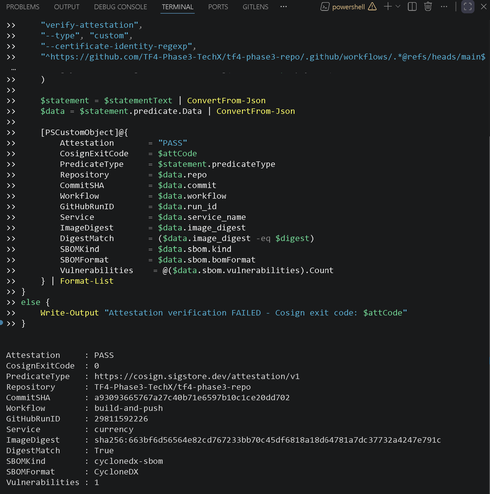

# MANDATE-10 — Bộ bằng chứng kiểm toán hợp nhất

**Người phụ trách:** Nguyễn Phú Triệu (CDO-07 Auditability)
**Phạm vi:** Provenance Chain và Human Approval Evidence
**Thời điểm thu thập bằng chứng:** 2026-07-21
**Nhánh nguồn của workload:** `main`

## Mục tiêu

Bộ tài liệu này hợp nhất hai sub-task của MANDATE-10 thành một luồng kiểm toán
duy nhất:

```text
Pod đang chạy
  -> Image Digest bất biến
  -> ECR image metadata
  -> Cosign signature và in-toto attestation
  -> GitHub Actions workflow, run và commit
  -> Pull Request tương ứng
  -> Reviewer APPROVED trước khi merge
  -> Branch protection của main
```

## Kết luận nhanh

| Phần kiểm tra | Kết quả |
|---|---|
| Pod đến image digest | PASS |
| Image digest khớp ECR | PASS |
| Chữ ký Cosign và attestation | PASS |
| Provenance commit và GitHub Actions run | PASS |
| Commit đến PR đã merge | PASS |
| Reviewer approval trước merge | PASS |
| Required PR approvals trên `main` | PASS — yêu cầu 2 approvals |
| Required status checks trên `main` | FINDING — chưa cấu hình |

Finding về status checks được ghi nhận để Security/DevOps xử lý. Team Audit
không tự thay đổi branch protection.

## Evidence trực quan

### Phần 1 — Provenance Chain

#### P1-01 — Ngữ cảnh cluster


#### P1-02 — Image và digest đang chạy trên Pod


#### P1-03 — Đối chiếu digest với ECR


#### P1-04 — Xác minh chữ ký Cosign


#### P1-05 — Attestation và SBOM



P1-05 được giữ lại để minh bạch nhưng phải chụp lại trước khi sign-off cuối
cùng: ảnh hiện tại hiển thị `Vulnerabilities : 1` do dùng nhầm thuộc tính
PowerShell, trong khi bản ghi live đúng là `0`.

### Phần 2 — Human Approval Evidence

#### H2-01 — Từ commit đến Pull Request


#### H2-02 — Reviewer đã APPROVED


#### H2-03 — Branch protection của main


## Tài liệu chi tiết

- [Báo cáo kiểm toán hợp nhất](MANDATE-10-AUDIT-REPORT.md)
- [Runbook tái kiểm tra trực tiếp](RUNBOOK.md)
- [Bản ghi JSON có cấu trúc](MANDATE-10-AUDIT-RECORD.json)

Tất cả ảnh đã được đặt trong cùng thư mục `images/` và được nhúng trực tiếp
trong tài liệu này để người review có thể xem một lần, không phải truy cập
đường dẫn evidence bên ngoài repository.
